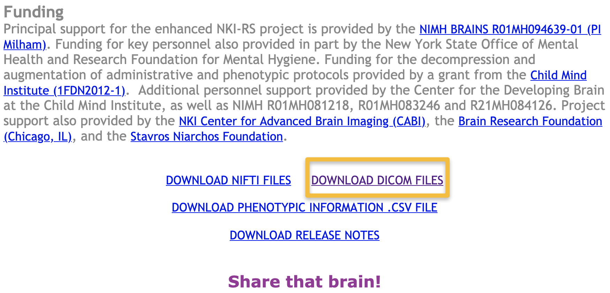
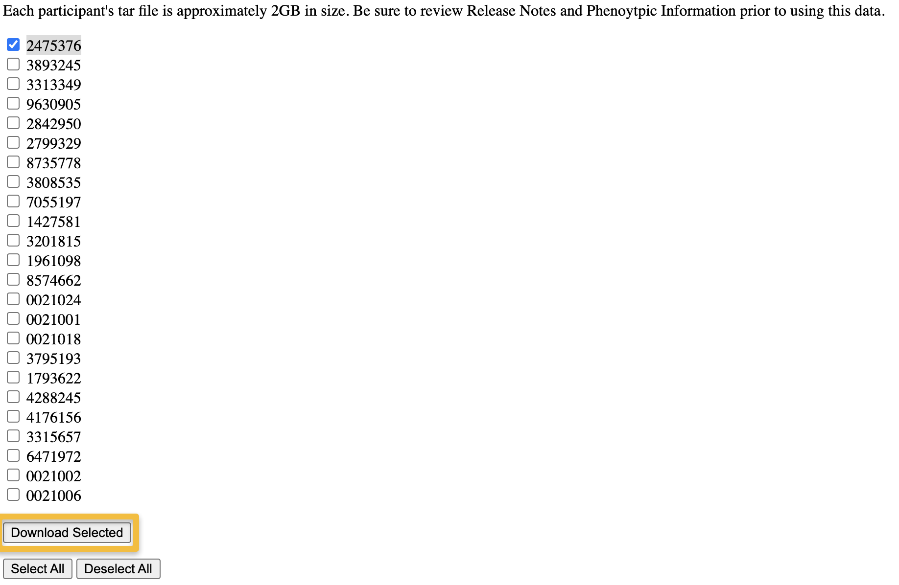
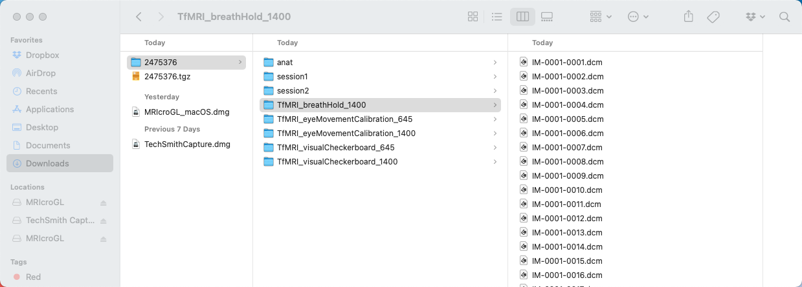
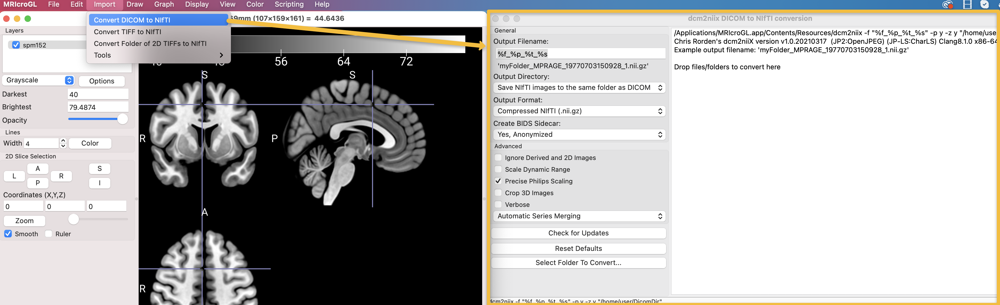
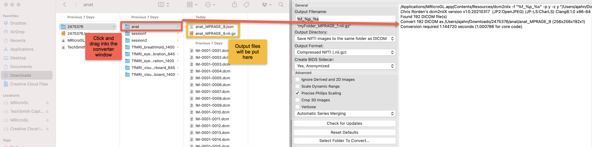
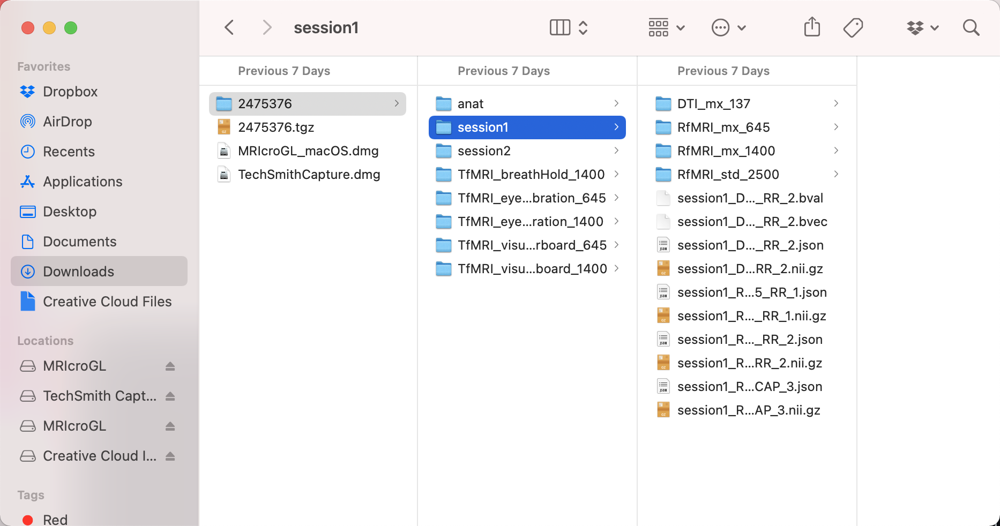

.. _MRIcroGL_2_dcm2nii:

===============================================
MRIcroGL Tutorial #2: Converting DICOM to NIFTI
===============================================

Overview
--------

In recent years, NIFTI has become a standard format for neuroimaging data - the major fMRI software packages of FSL, SPM, and AFNI can all load it and generate output in NIFTI format, and it can be read by other widely-used program as well, such as FreeSurfer.

However, the raw data collected by the scanner isn't in NIFTI format. Each of the major scanner models - Siemens, Philips, and General Electric - has its own raw data format, which usually stores the data as individual slices. The raw data from a Siemens scanner, for example, is in Digital Imaging and Communications in Medicine (DICOM) format, with a ``.dcm`` extension. These slices contain header information indicating which volume they belong to, and which scanning sequence they belong to, such as an anatomical, functional, or diffusion scan. When converting to NIFTI format, the slices are stacked together into individual volumes, and the volumes are concatenated together into their corresponding scan sequence. This makes the data much more compact and easier to manipulate.

Downloading a Sample Dataset
----------------------------

To demonstrate how to use MRIcroGL's DICOM to NIFTI converter, we will download a sample dataset from the Nathan Kline Institute (NKI) Rockland Sample. Click on `this link <https://fcon_1000.projects.nitrc.org/indi/pro/eNKI_RS_TRT/FrontPage.html>`__, scroll to the bottom of the page, and click on the link that says ``Download DICOM Files``. 

This will take you to a new page, listing the subject IDs for every participant in the study. Check the box next to subject 2475376, and then click ``Download Selected``.

This will take you to the NITRC page - the same website that hosts the MRIcroGL software package - and you will be required to sign up for an account and log in, if you haven't already. Once you do that, the download will begin; the dataset is about two gigabytes, and will take a few minutes, depending on the speed of your Internet connection.

The DICOM to NIFTI Converter
----------------------------

When the dataset has been downloaded, click on it to unzip it. Once it is uncompressed, you should see something like this in your Finder:

This subject has several different runs of imaging data: An anatomical scan, a scan during which the subject held their breath, data collected when a visual checkerboard was shown, and so on. There are also two folders marked ``session1`` and ``session2``, which contain diffusion and resting state scans.

For now, let's focus on the folders ``anat`` and ``session1``. MRIcroGL's graphical user interface makes it easy to convert all of the data in these folders by simply clicking and dragging them onto the GUI. From the MRIcroGL menu at the top of your window, click on ``Import -> Convert DICOM to NIFTI``. You will see another window opened up that looks like this:

There are several options here, which I encourage you to explore on your own. The sidebar on the left of the converter GUI contains options you can change; the window on the right shows the output when you run the converter. The first field, ``Output Filename``, by default contains the string ``%f_%p_%t_%s``. Each of these letters preceded by a percentage symbol is called a **formatting operator**, which is a shorthand for filling in different parts of the string; you can think of them as **variables**, which were discussed in the :ref:`Unix tutorial <Unix_04_ShellsVariables>`. For example, if you hover your mouse over the Output Filename field, you will see a help bubble appear which lists what each of the formatting operators refer to: %f is the folder name, %p is the protocol, and so on. These are read from the DICOM header as the files are converted into NIFTI format, and if the data is not in the header, that variable is replaced with NA (i.e., Not Available).

You can modify these formatting operators however you want, adding or subtracting them as you wish. The string right below the field will automatically update as you change the operators; for example, the output string might read ``myFolder_MPRAGE_19770703150928_1.nii.gz``. The folder name that contains the DICOM images would be the first part of the string, and MPRAGE would indicate that the DICOMs all belonged to an MPRAGE, or anatomical, scan. The next part shows the date and time the scan was collected, and the last part is which scan the image belonged to; in this example, the first scan.

I usually don't find the timestamp of the file is useful, so in this example I will remove the ``%t`` formatting operator. The underscore lines are simply separators for keeping the different parts of the filename distinct from one another; you can replace it with whatever you want.

Conversion Options
&&&&&&&&&&&&&&&&&&

In addition to the Output Filename, you also have options for where to save the output files and for their format. The defaults work well in most cases, but we will examine some of the options you can change:

* **Output Directory**: The default is to save the output files into the same folder that contains the DICOM. From the dropdown menu, you can select another directory if you wish.
* **Output Format**: The default of compressed NIFTI will save space on your computer; this format can also be read by AFNI and FSL. Note that, as of 2021, SPM is not able to open compressed files - you will need to either unzip them manually, or specify the output as uncompressed NIFTI. Another option, NRRD format, can be used by programs such as `Slicer <https://www.slicer.org/>`__.
* **Create BIDS Sidecar**: This will create a Javascript Object Notation (.json) file, which contains metadata about the converted DICOM files. For example, if you converted the DICOMs for a functional dataset, the BIDS sidecar may contain information about slice-timing and slice order, the repetition time, and when the scan was collected. These sidecars are required for using a standardized preprocessing pipeline such as :ref:`fMRIPrep <fMRIPrep_Demo>`.

Below these dropdown menus, you can learn more about the Advanced options by hovering your mouse over each of the boxes. The ``Crop 3D images`` option, for example, can improve coregistration by removing most of the neck from the image.

Converting the DICOM Files
--------------------------

Once you have become familiar with the DICOM to NIFTI graphical user interface, you can convert a folder of DICOM files simply by clicking and dragging the folder into the right window pane of the GUI. Alternatively, you can click on the ``Select Folder to Convert`` button, and choose the directory from your Finder window.

For this example, open up a Finder window, navigate to your Downloads folder, and click on the folder ``2475376``. Click and drag the ``anat`` folder into the DICOM to NIFTI GUI, and then wait a moment for the files to be converted. After a couple of seconds, you should see the following output in the converter window, as well as a NIFTI file and .json file in the ``anat`` folder:

Note that some of the folders contain sub-folders of other images; for example, the folder ``session1`` contains a DTI folder and three resting state fMRI folders. If you convert the ``session1`` folder, you will see something like this:

Whether you want all of the converted files in that folder, or each file in its corresponding sub-folder, is up to you. Using fMRIPrep requires that the files and .json sidecars are located within their corresponding sub-folders; you may also have to rename the files. See the `Stanford BIDS tutorial <https://reproducibility.stanford.edu/bids-tutorial-series-part-1a/>`__ for more details.

