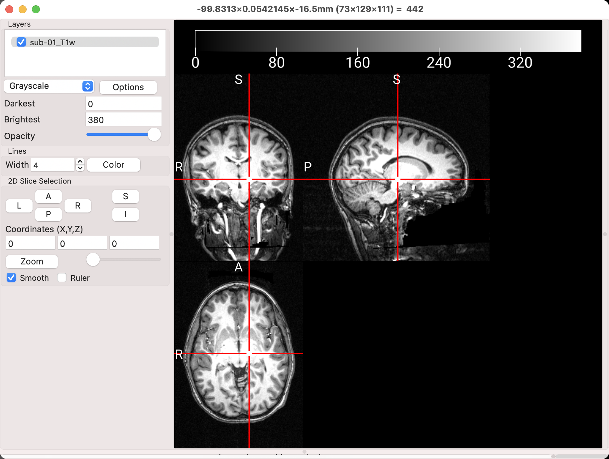
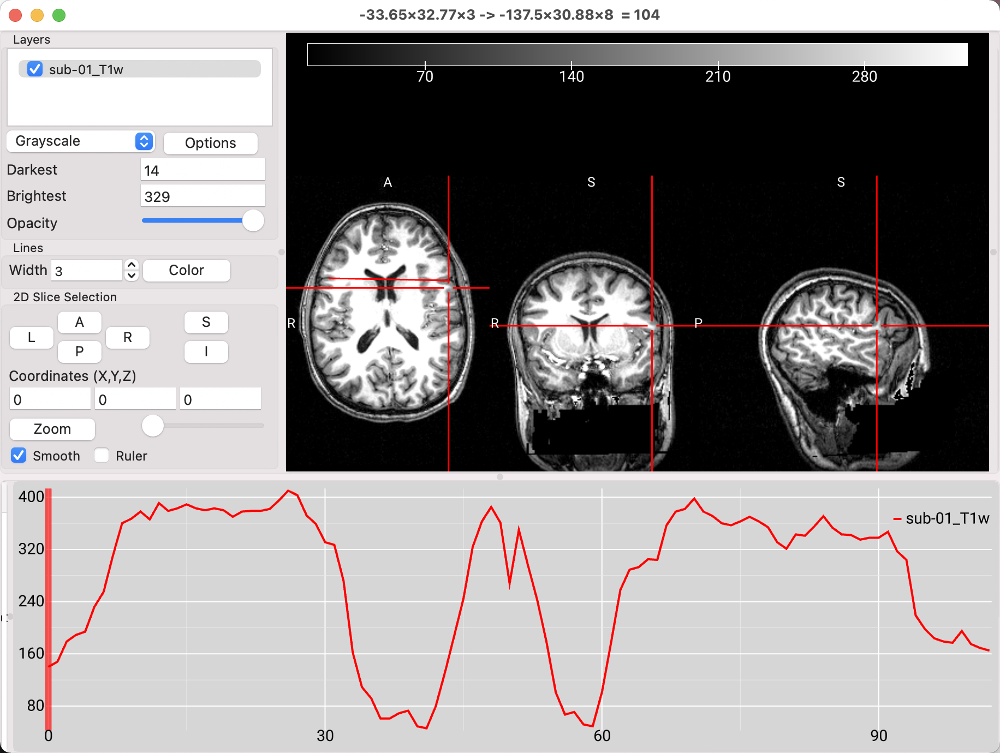
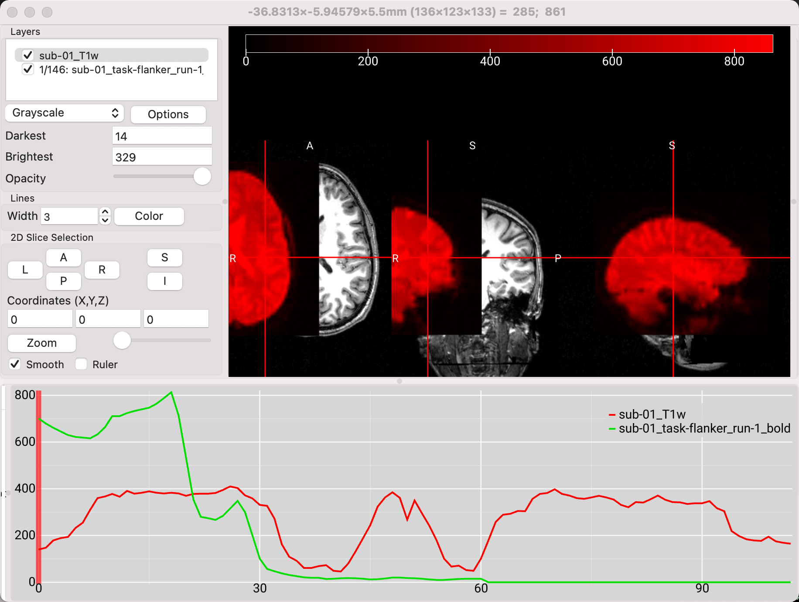

.. _MRIcroGL_3_ViewingImages:

====================================
MRIcroGL Tutorial #3: Viewing Images
====================================

--------

Overview
********

The main feature of MRIcroGL is the ability to view medical images - especially magnetic resonance imaging (MRI) data. For this tutorial, we will focus on MRI, fMRI, and diffusion weighted imaging (DWI), although many other forms of imaging data can be loaded as well.

The default image that is loaded when you open MRIcroGL is the SPM152 template brain. In the first chapter of this walkthrough, you experimented with the basic operations of the viewer, such as the Opacity slider, the crosshairs, and the Brightness settings. We will examine these in more detail, and begin to use multiple images at once, in order to explore the abilities of the software package.

.. note::

  Many of the steps and examples in this tutorial are taken from Chris Rorden's MRIcroGL video, which can be found `here <https://www.youtube.com/watch?v=J7uSSbTJ-iw&t=315s>`__. He covers many different types of images that can be loaded, including animal brains, spinal cords, and lungs. Here we will be focusing on MRI and fMRI data, but I encourage you to look at the other images in your own time.
  
  This tutorial also assumes that you have completed the analysis of the Flanker dataset in any of the major fMRI analysis software packages - SPM, FSL, and AFNI. Here we will be using the fully preprocessed and statistically analyzed data using :ref:`FSL <fMRI_Intro>`, but the parallels with the outputs of any of the other packages should be clear.
  

Loading an Anatomical Image
***************************

We will begin by loading an anatomical image - in this case, the T1-weighted ``sub-01_T1w`` image from ``sub-01/anat``  folder in the Flanker directory. You will see something like this:

  Note that this image has had the face removed, in order to deidentify it.
  
As you saw in an earlier chapter, left-clicking and dragging in any of the window panes will move the crosshairs, which in turn updates the view in the other two panes. You can keep the crosshair where it is and scroll through the slices in the current pane by scrolling the mouse wheel either up or down; holding the ``ctrl`` key while scrolling allows you to zoom in and out of the image. Scrolling one image at a time can be done manually by clicking on the L, R, A, P, S, and I buttons in the ``2D Slice Selection`` subwindow. If you prefer a different color for the crosshair, click the ``Color`` button and select any color that you like. The width of the crosshairs can also be modified by increasing or decreasing the value in the ``Width`` field.

.. note::

  A full list of the combination of mouse clicks and button presses can be found by clicking on ``Help -> Mouse Gestures``.
  
Modifying the values in the ``Darkest`` and ``Brightest`` fields are useful for setting the thresholds for which voxels will be shown. For example, you may not want to see any voxels below an intensity of 30, for example, or anything brighter than an intensity of 300. By setting the ``Darkest`` threshold to 30 and the ``Brightest`` threshold of 300, the darkest color - in this case, black - will be set to those voxels with an intensity of 30, and pure white will be assigned to those voxels with an intensity of 300.

Viewing the Intensity over Slicers
&&&&&&&&&&&&&&&&&&&&&&&&&&&&&&&&&&

One of the new features in MRIcroGL is the ability to visualize the changes in intensity over multiple slices. First, you will need to find the top of a "hidden" window pane at the bottom of the MRIcroGL viewer; click and drag it up to see another window. Then, find an axial slice that clearly shows both lateral ventricle, click somehwere in the lefthand side of the brain, hold down the ``option`` key, and drag the mouse to the righthand side of the brain. You will see an intensity profile generated in the bottom window, depicting how the intensity changes over the slices that you selected. Note that in this case there are two dips in intensity, indicating where the line you drew crossed over the lower-intensity ventricles.

Loading Multiple Images
***********************

Leaving the anatomical image loaded, click on ``File -> Add Overlay``, and select one of the functional images from the ``sub-01/func`` directory. Recall that viewing both the anatomical and functional images can be useful for seeing how far apart the images are, before any preprocessing has been done; images that start farther away from each other may need a larger search area during coregistration in order to find a good fit, or the origins may need to be manually centered before doing any further preprocessing. In this case, the images are quite far away from each other, with the functional image highlighted in red.

