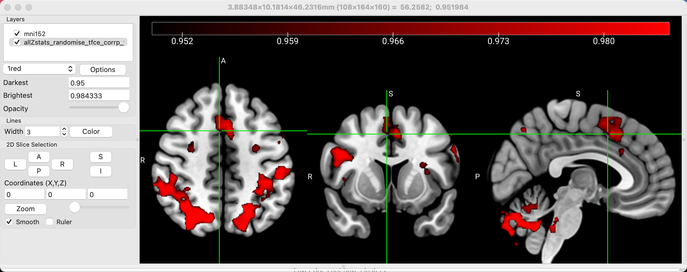
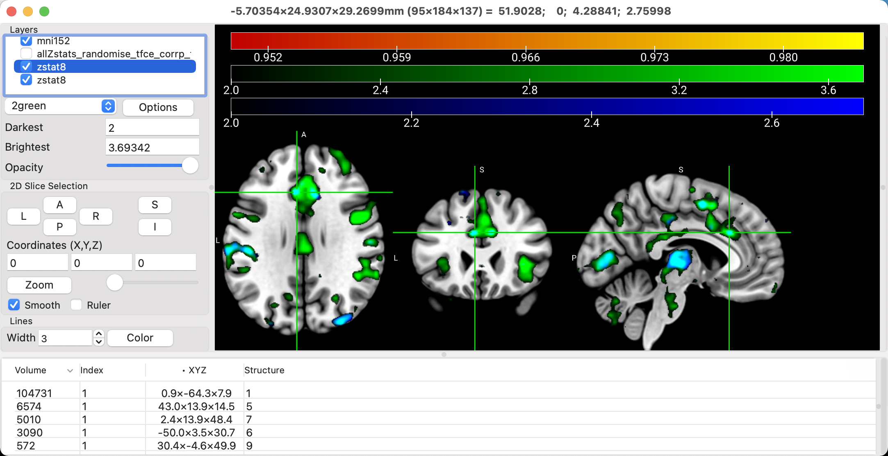
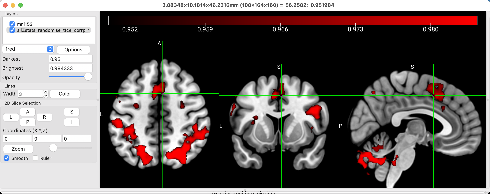
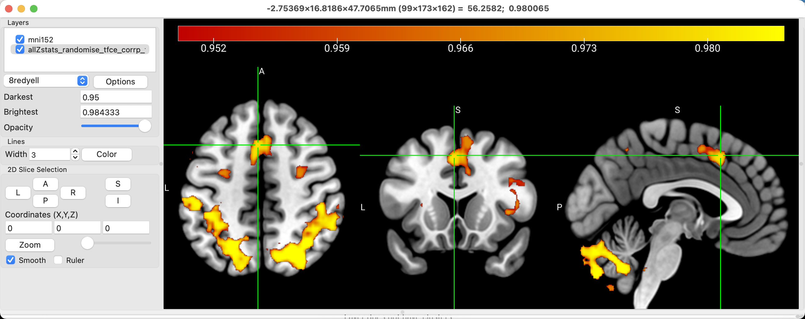
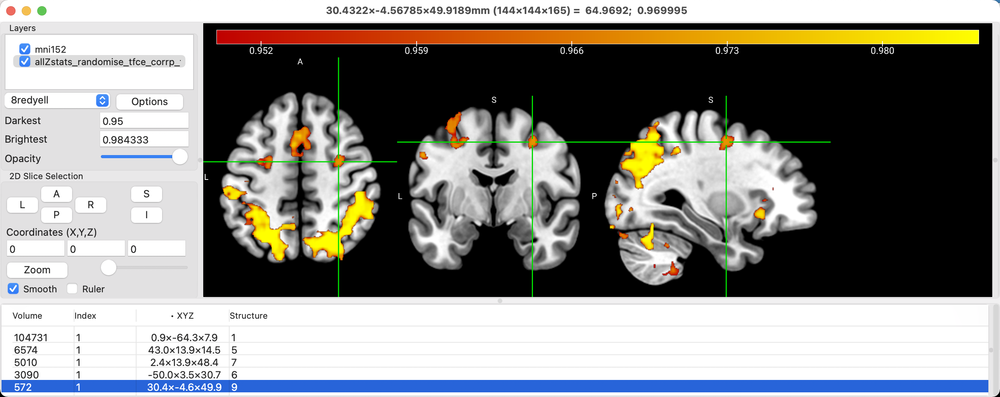
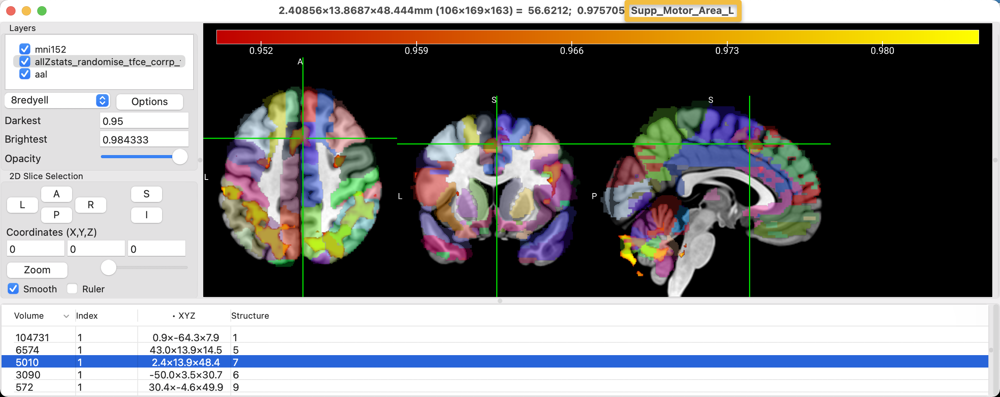
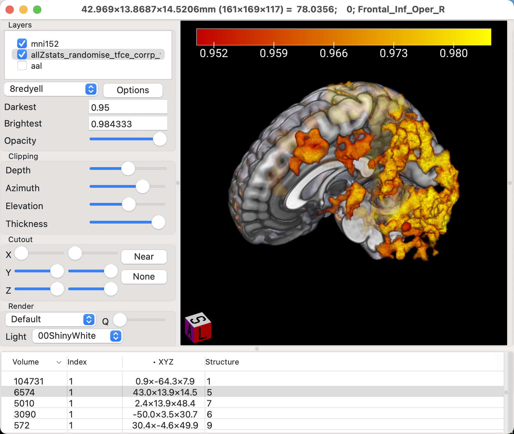

.. _MRIcroGL_4_ViewingResults:

=====================================
MRIcroGL Tutorial #4: Viewing Results
=====================================

--------

Overview
********

As part of writing your manuscript, you will want to create figures that show where your results are located. We have already seen how to view the results in the major fMRI packages, but if you like the MRIcroGL interface, you can view the results there instead.

Staying with the results from our FSL analysis, we will first want to load a template as the **underlay**, or the image on which the results are overlaid. If you click on File and then hover your cursor over ``Open Standard``, you will see a list of templates that come with MRIcroGL. Some of these are used for tutorials specific to MRIcroGL, such as the Iguana image, or any of the CT images. In this case, we will select ``mni152``, a widely-used template in neuroimaging that is in standardized space.

Next, we will want to **overlay** a results image onto the template. You can load any results you want; in this tutorial, we will load the threshold-free cluster enhancement results from the contrast Incongruent-Congruent. Click on ``File -> Add Overlay``, and select the file ``allZstats_randomise_tfce_corrp_tstat1.nii.gz``. Remember that this particular file shows 1-p values; in other words, if we set the lower bound to 0.95, we will only see those voxels that have a p-value of 0.05 or less. Set the value in the field next to ``Darkest`` to ``0.95``, and you should see a thresholded image that looks like this:

.. note::

  You can overlay multiple statistical maps on each other, with the color of the overlap representing a mixture of the colors of the individual overlays. For example, load the file ``zstat8.nii.gz`` for both the 2nd-level Incongruent and Congruent maps. They should default to colors of green and blue, although you can chnage this to whatever you want. To show the overlap of the two, click on ``Options -> Additive Overlay Blending``. In this case, the overlap will be shown in Cyan.
  

Editing the Layout
******************

If you had the crosshairs centered at the peak or the cluster that you wanted, and you removed the crosshairs, you could save this layout as a figure, minus the control bar and surrounding window frame, by selecting ``File -> Save Bitmap``. However, let's stay with this current setup, and see if we can modify the image to be more pleasing and informative to look at.

For example, the default in many viewing software packages is **radiological convention**, in which the right side of the brain is on the left side of the viewer, and vice versa for the left side of the brain. This viewing scheme makes sense if you are looking at the brain from the bottom, which is what many radiologists tend to do. For most people, on the other hand, it makes more intuitive sense to look at the brain in **neurological convention**, in which the left side of the brain is on the left side of the image, and the right side of the brain on the right side of the image. To change this, click on ``MRIcroGL -> Preferences``, and uncheck the box next to ``Radiological convention``. This will flip the brain image and swap the labels.

The current color palette might also be too saturated for your taste. You could either modify the intensity range to sharpen the distinction between voxels with different significance levels, or you could choose another color scheme. In the dropdown menu that says ``1red``, try changing it to ``6warm``. What do you think of this one? Change it again to ``8redyell``. Does this make the figure easier or more difficult to look at and interpret? Ultimately, these choices are up to you; there is no clear right or wrong answer. However, you should start to build up your own standards of taste, and think about why you make certain choices about your illustrations. How would this appear to somebody else who is not familiar with your data? What do you notice about figures you see in other papers that make them clear and easy to understand? These are the questions you can start asking yourself to build up your own aesthetic. Your primary consideration should always be the convenience of the reader; after that, you can make the stylistic choices that make your figures and your prose immediately recognizable, even when unsigned.

You may also choose to hide the crosshairs by setting the value in the ``Width`` box to ``0``, and to hide the color scale at the top by clicking on ``Color -> Colorbar`` and unchecking ``Visible``. It's up to you whether you think these overlays are necessary or unnecessary, and there are many more you can experiment with in the other menus of the software package.

Viewing Clusters
****************

Similar to FSLeyes, you can view the clusters that survive correction, and display them in a table. Click on the ``Options`` button, and select ``Generate Cluster Table with Options``. From here, you can select the voxel intensity and the cluster size as thresholds; in this case, setting the voxel intensity to 0.95 and the cluster size to 32 means to display only those clusters that are composed of 32 or more clusters, with each voxel in the cluster having an intensity value of 0.95 or greater. The dropdown menu with the ``Neighbor`` options allows you to specify how the contiguity of the voxels in the cluster is defined: ``Faces (6)`` means that the entire face of neighboring voxels need to touch in order to be contiguous; ``Faces, Edges (18)`` means that either the faces **or** the edges of the voxels can touch; and ``Faces, Edges, Corners (36)`` means that the faces, edges, or corners can touch in order for the voxels to be contiguous. In sum, the ``Faces (6)`` option sets a more demanding standard for what constitutes a cluster, while ``Faces, Edges, Corners (36)`` is more lenient.

In any case, this example uses the results of a TFCE analysis, in which all of the surviving voxels about the 0.95 threshold should be part of a statistically significant cluster. Click the ``OK`` button, and the clusters will be listed in a table at the bottom of the viewing window. ``Volume`` indicates the size of the cluster in cubic millimeters [or is it voxels? Need to double-check this], while the x-, y-, and z-coordinates are given in the ``XYZ`` column. Clicking on any of these clusters will make the crosshairs jump to the center of that cluster.

Overlaying Atlases
******************

In addition to displaying the results, you may also want to know where the results are located, using an atlas as a guide. You probably won't want to show the atlas as part of the figure that will be published, but a label for the location of the cluster, in addition to its coordinates, can be a useful in a table of the results.

To see the atlases that are available with MRIcroGL, click on ``File -> Add Atlas``. Add the ``aal`` atlas (Automated Anatomical Labeling), and note how you can see different structures color-coded on the template. The default opacity will allow you to see where the cluster is in relation to a particular structure, and the last string at the top of the MRIcroGL viewer tells you which structure the crosshairs are currently on. In this case, the cluster in the anterior middle part of the brain is located within the left supplementary motor area, according to the atlas.

.. note::

  There are many other atlases that come with MRIcroGL; take a look at each of them and guess what they are atlases of. The ``natbrainlab`` atlas, for example, appears to be an atlas of the major white matter pathways, and it may be useful for looking at diffusion weighted imaging results obtained with FSL's TBSS.

Rendering the Results
*********************

There are scenarios in which viewing the results on the surface of the brain can be more useful than viewing the results on three orthogonal slices. To get a more precise location of where the results are located along the gyri and sulci, it is necessary to do a surface-based analysis, using AFNI's SUMA, for example. However, we can still get a rough idea of where the results are on the surface by **rendering** them; that is, interpolating voulmetric data onto a surface. 

Uncheck the box next to the ``aal`` overlay to hide it (or right-click on it and select ``Close``), and then go to ``Display -> Multi-Planar (A+C+S+R)``. This will add another view, a surface of the template brain with the results visible both on the surface and within the folds of the brain. This view is most useful when the activation is on the outer surface, such as the motor cortex or the dorsolateral prefrontal cortex.

.. figure:: 04_Ortho_Render.png

To see the activation more deeply within the brain, however, we will need to restrict our focus just to the rendered view of the brain. Click on ``Display -> Render``, and the orthogonal volumetric views will be removed, leaving just the surface reconstruction of the image. You now have access to ``Clipping`` options, which can be used to remove parts of the surface of the brain. As you move the slider for ``Depth`` from left to right, the front of the brain is removed little by little. After you've moved the ``Depth`` slider about halfway down the scale, try moving the ``Azimuth`` slider; it will twist the clipped area around the z-axis. Lastly, the ``Elevation`` slider will move the clipped area around the y-axis. Experiment with all of them until you remove half of the brain, and can see part of the activation inside one of the hemispheres, and part of the activation extending outside of it.

Creating ROIs
*************

MRIcroGL can be used to create ROIs, similar to how we used tools in the other software packages to generate spheres for data extraction. For example, if we wanted to create a sphere with a radius of 5mm centered at the coordinates 0, 20, 44, we would first enter those coordinates into the fields below ``Coordinates (X,Y,Z)``. Then, click on ``Draw -> Advanced -> Automatic Drawing``. The two fields, ``Difference from origin`` and ``Radius (mm)``, specify 

Next Steps
**********

Now that you have more experience with the MRIcroGL viewer, we will learn about a more advanced option for creating regions of interest (ROIs). To see how to do that, click the ``Next`` button.
