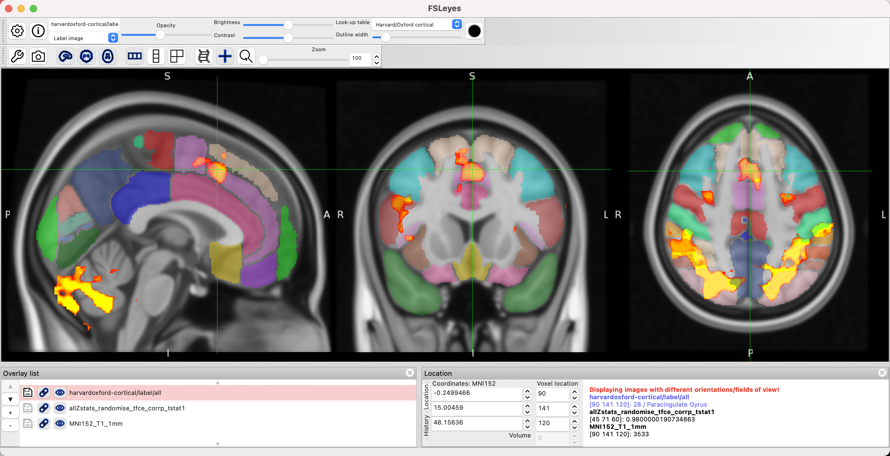
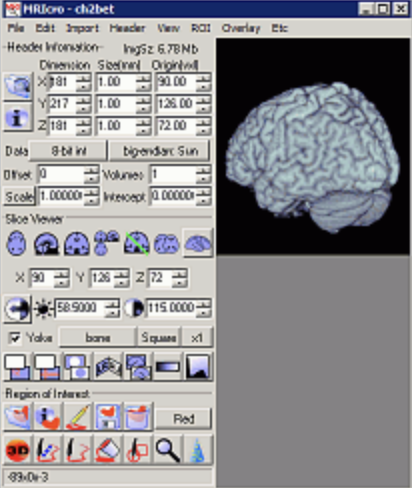

.. _MRIcroGL_Overview:

=================================
Image Visualization with MRIcroGL
=================================

.. note::

  This section is still under construction
  
---------------

Overview
********

If you've worked through the previous tutorials on SPM, FSL, and AFNI, you saw how each one allows you to visualize the data and the results at several different stages of analysis - for example, you may want to see the functional images before and after coregistration, to make sure they are aligned properly with the anatomical image. As of this writing, out of the major packages FSL appears to have the most advanced interface in `fsleyes <https://fsl.fmrib.ox.ac.uk/fsl/fslwiki/FSLeyes>`__; it is easy to load images from any directory, overlay them onto a template brain, and to load a variety of atlases for creating regions of interest.

There is another software package that can be used for visualizing imaging data, especially group-level results: `MRIcroGL <https://www.nitrc.org/projects/mricrogl/>`__. This is an updated version of MRIcro, which has been around for many years; those who started their neuroimaging careers back in the early 2000's probably used MRIcro at some point, using it to view overlays and create ROIs.

  Screenshot from an early version of MRIcro
  
This was succeeded by MRIcron, which could read NIFTI images - a major advance, since the major fMRI software packages both load and write NIFTI format by default. With the addition of new features, such as converting DICOM images to NIFTI and organizing the output in BIDS format, a new version was released as MRIcroGL, which is the software package we will focus on for this tutorial. It should be noted that MRIcroGL can visualize virtually any type of medical imaging data, from CAT scans to PET data to images of any part of the body; however, since this e-book is concerned with analyzing brain data, we will focus on that, while having to ignore other interesting features of the software. (For a more in-depth overview of all of its features, see `this video <https://www.youtube.com/watch?v=J7uSSbTJ-iw>`__ by the developer, Chris Rorden.)

Given the versatility of MRIcroGL, we will begin with some of its most basic and useful features - namely, converting raw DICOM images to NIFTI format, and organizing them into BIDS format; if you choose, you can then use these with a standardized preprocessing pipeline such as :ref:`fMRIPrep <fMRIPrep_Demo>`. We will then see how MRIcroGL can overlay the group-level results from the previous tutorials, regardless of whether you used FSL, SPM, or AFNI. These can be used to create publication-quality figures, depending on what you are trying to illustrate.

.. toctree::
   :maxdepth: 1
   :caption: Walkthrough of MRIcroGL

   MRIcroGL_1_Download
   MRIcroGL_2_dcm2nii
   MRIcroGL_3_ViewingImages
   MRIcroGL_4_ViewingResults
   MRIcroGL_5_CreatingROIs
