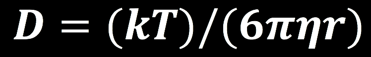
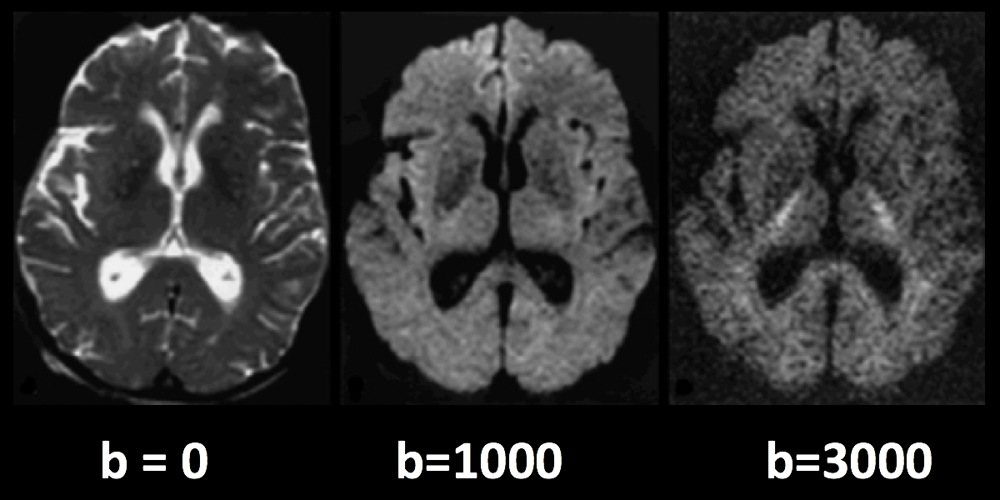
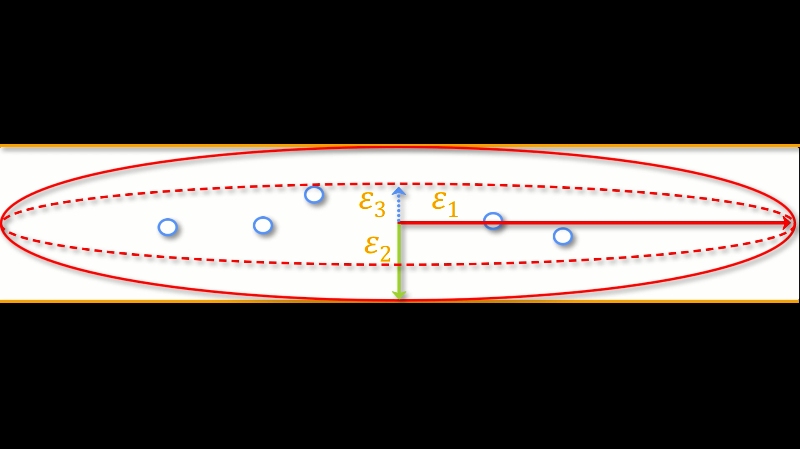
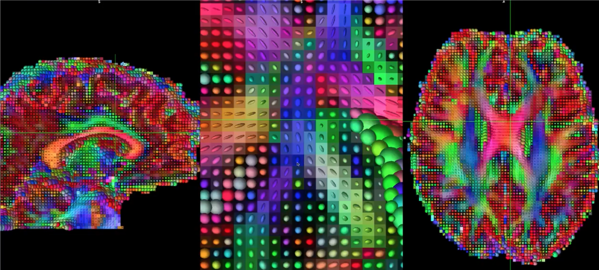
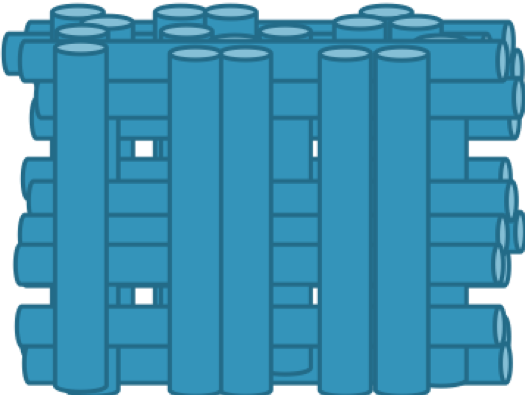
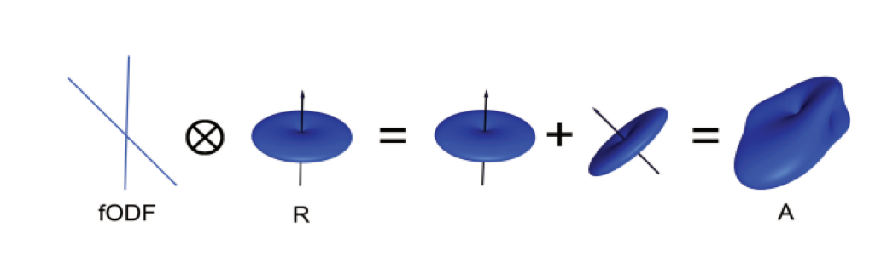
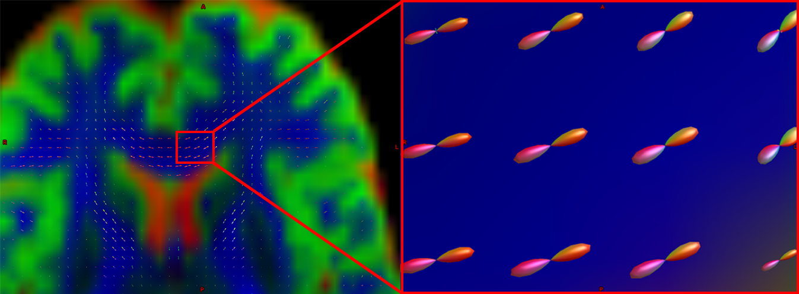
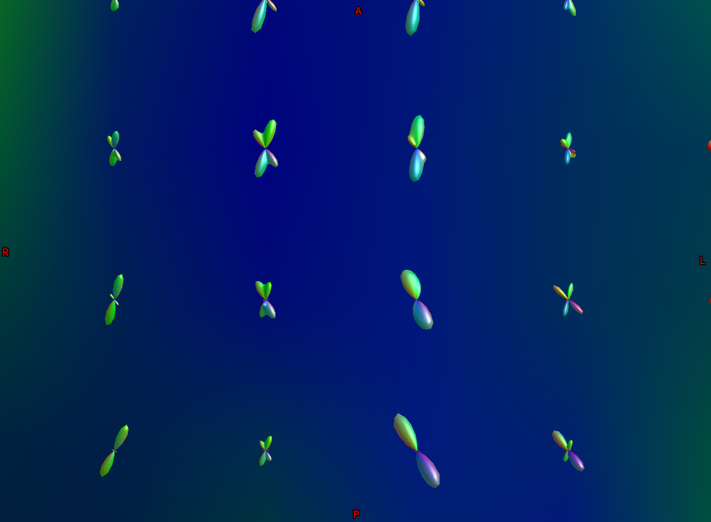

.. _MRtrix_00_Diffusion_Overview:

==================================================
MRtrix Introduction: Overview of Diffusion Imaging
==================================================
  
---------------

Overview
********

Until now, this book has touched on the most popular MRI technique: Functional Magnetic Resonance Imaging, or fMRI. These functional images, which measure signal generated by changes in blood flow, are often accompanied by structural images that are acquired using the same basic method: Different tissue types in the brain have different T1 and T2 **relaxation rates**, which are used to create images with contrast between the tissues. In T1, or anatomical scans, the white matter is lighter than the grey matter, which in turn is lighter than the cerebrospinal fluid; in T2, or functional scans, the relative intensities are flipped.

  Typical T1-weighted (anatomical) and T2-weighted (functional) images. Note how the relative intensities of the tissue types are inverted when going from T1-weighted imaging to T2-weighted imaging.
  
However, there are other types of images that can be acquired with an MRI scanner. In this module we will focus on **diffusion-weighted MRI**, or dMRI, which measures the relative diffusivity within different parts of the brain - in particular, within the white matter tracts.

The Structure of the White Matter
*********************************

Why does dMRI focus on the white matter tracts? Imagine peeling apart a stick of string cheese, and then imagine peeling apart a brain - just like the string cheese, the brain has preferred tear directions. These directions correspond to underlying white matter tracts, which are thick bundles of myelinated neurons that connect both nearby and distant parts of the brain. For example, the inferior longitudinal fasciculus connects the visual and temporal regions of the brain, while the uncinate fasciculus connects the temporal and inferior frontal parts of the brain. These tracts travel along all three dimensions of the brain, and they may run parallel to each other or cross one another.

.. figure:: 00_Tract_Examples.png

  Illustration of several main white matter tracts. Figure taken from Thiebaut et al., 2015.

The white matter of the brain gets its name from its color; these neurons are highly myelinated, meaning they have a thick lipid coating that both insulates them and helps with the transmission of electrical impulses, just like an insulated electrical cable. The grey matter neurons, in contrast, are relatively unmyelinated, which allows for a higher density of neurons to be packed into a given area.

History of Diffusion
********************

While the composition of the brain tissues has been known for some time, imaging the diffusion of the white matter tracts is a new technique. To understand how the properties of the white matter were exploited for this purpose, we will briefly review of the history of diffusion and how scientists came to apply this concept to imaging the brain.

Brownian Motion
^^^^^^^^^^^^^^^

The first formal description of diffusion was made in 1827 by Robert Brown, a Scottish botanist. While looking at microscopic particles through a microscope, he noticed that the particles seemed to move randomly of their own accord - similar to how motes of dust, when observed moving through a shaft of light, appear to move in random patterns. Browning concluded that the movement was caused by smaller particles impinging upon the larger molecues seen through the microscope. When dye is dropped into water, for example, the random motion of the water molecules causes the dye to disperse at random until the water within the contained reaches a consistent hue. A more common, everyday example can be seen by pouring milk into coffee: Observe how the milk swirls and mixes with its surroundings, and you have an excellent demonstration of Brownian Motion.

The properties of the medium determine the speed of the Brownian Movement. For example, increasing the temperature of the surrounding water will cause the water molecules to move faster, and consequently make the particles move faster as well. If the viscosity of the medium is higher - for example, if we drop food dye into a bowl of honey - the molecules move slower, and the particles of the food dye will move slower. Decreasing the temperature and decreasing the viscosity, on the other hand, will have the opposite effects.

Lastly, and most relevant for our future tutorials on diffusion imaging, the Brownian Movement of both the particles and the molecules is determined by the size and shape of the container. Food dye dropped into a spherical bowl of water will diffuse randomly in all directions. Food dye dropped into a cylindrical beaker, on the other hand, will quickly diffuse along the length of the beaker; the particles will soon run into the walls of the container, and be forced to move either up or down. We call this type of container **anisotropic**, meaning that the dimensions of the container cause the particles to diffuse along a predominant axis. (If you have experience with fMRI, think of anisotropic voxels, which have one dimension that is longer than the others.)

.. note::

  For a video of Brownian Motion, click `here <https://www.youtube.com/watch?v=SB7GlVlm60g>`__.

All of these factors - temperature, particle size, and viscosity - were combined by Albert Einstein into a single equation known as the **Stokes-Einstein Equation**:

The diffusion coefficient, **D**, increases as the temperature (**T**) increases, and deceases with higher viscosity (symbolized by eta) and a higher particle radius (**r**). **k** stands for Boltzmann's constant. This diffusion coefficient will play a role in how we acquire **diffusion-weighted images**, which we turn to next.

Diffusion and MRI
^^^^^^^^^^^^^^^^^

In the early 1990's, a new imaging acquisition technique called echo planar imaging (EPI) allowed researchers to collect functional images of the brain much more rapidly than before. At the same time, scientists such as Michael Moseley and Steven Warach began to explore other ways of exploiting the properties of water molecules to generate different types of contrast maps. They reasoned that just as the T1 and T2 properties of the brain tissues could be used to create intensity differences in the images that were acquired, so could the diffusion of water lead to differences in the magnitude of the signal.

You may recall from an introductory MRI physics course that T1-weighted images are often used for anatomical scans, and that T2-weighted images are usually for functional scans. For T2-weighted images, the presence or absence of nearby oxygenated hemoglobin leads to an increase or decrease in the signal emitted by hydrogen protons of the water molecules in the brain. In this scenario a radiofrequency pulse is turned on in order to tilt the spin of the hydrogen atoms and is quickly shut off; the signal is then emitted by the hydrogen protons and detected by a sensor inside the magnet, and the process repeats until an entire time-series of functional data is generated.

What if we instead changed the magnetic field strength across different axes of the brain? Remember that although T2-weighted scans are primarily used for functional imaging, they can also be used to create anatomical images - in this case, the cerebrospinal fluid and grey matter would appear lighter, and the white matter would appear darker. If we applied a **magnetic gradient** while scanning the brain, we could make the magnetic field stronger along one direction and weaker along the opposite direction. For example, let's say that we made the magnetic field slightly weaker on the left side of the brian, and slightly stronger on the right side, with the field gradually increasing in strength as we move from left to right. Since the frequency of the spins of the hydrogren atoms is proportional to the strength of the magnetic field, we would expect the spins on the left side of the brain to be slightly slower than those on the right.

At this point, the spins would be **out of phase** with respect to each other; that is, they would be precessing at different rates depending on which part of the magnetic field they happen to be in. Because the protons are now out of phase, we call the gradient we just applied the **Dephasing Gradient**. If we applied an equal and opposite **Rephasing Gradient** - in other words, the magnetic field would be stronger on the left, and weaker on the right - the spins of the atoms would then be realigned with each other. The following figure summarizes this process of dephasing and rephasing gradients:

  Figure from Mori, 2007. The red, green, and blue circles represent hydrogen atoms, and the arrows within the circles are the direction of the spins; imagine that they are all moving in the same direction around the circumference of the circle, and at the same rate. A Dephasing Gradient (middle row) is slightly weaker on the left, and slightly stronger on the right; as a result, when we turn off the gradient, the atoms are spinning out of phase with respect to each other. A Rephasing Gradient then applies an equal and opposite gradient, and in the end the atoms are spinning in the same direction and at the same rate.
  
Aside: Creating the Diffusion Gradient and B-Values
&&&&&&&&&&&&&&&&&&&&&&&&&&&&&&&&&&&&&&&&&&&&&&&&&&&

The abovementioned diffusion gradients are generated by the following parameters:

* The magnitude of diffusion gradient (G);
* The time between gradients (𝚫) ; and 
* T duration of diffusion gradient (𝜹). 

These can be combined into an equation for what is called the **b-value**, which is shown in the figure below. Note that the b-value is proportional to the magnitude of the gradient, duration of the gradient, and time between the gradients; if any of these parameters increase, the b-value increases as well. For now, keep this equation in mind - we will return to it later when we discuss how b-values affect the contrast of the diffusion-weighted images.

Revisiting the Gradients: Effects of Diffusion
^^^^^^^^^^^^^^^^^^^^^^^^^^^^^^^^^^^^^^^^^^^^^^

In the above example, we assumed that a rephasing gradient would put the hydrogen atoms back into alignment with each other. This assumption is true, but only if the hydrogen atoms don't move in between the turning on and off of the dephasing and rephasing gradients. If, on the other hand, they do move - in other words, if they diffuse, according to the principles of Brownian movement that we discussed earlier - then the rephasing gradient will not lead to a realignment of the hydrogen atoms. Rather, they will be out of alignment in proportion to how much they have diffused in the time between the gradients.

  Figure from Mori, 2007. The period of time between the gradients, which we will refer to as the **mixing phase**, allows the hydrogen atoms from different locations to mix with each other. This depends on factors such as the ambient temperature and how constrained the surrounding environment is - hydrogen atoms in a relatively unrestricted space (such as the ventricles) will diffuse more than those that are in a more restricted space. When the rephasing gradient is applied, the atoms are now spinning out of phase with respect to each other.

The result is a contrast image that looks similar to the T2-weighted functional images you may have come across before: There is contrast between the major tissue types, such as the white matter and the gray matter. Upon closer inspection, however, we notice that the image is darker in certain parts; this is due to the water molecules diffusing during the mixing phase. When the atoms are out of phase with respect to each other, the signal is attenuated. (Think of a group of people all pushing a block in the same direction. The force that they exert will move the block along the direction in which they are pushing. If instead a few people are now pushing at the side, and others are pushing in the opposite direction, the movement of the block either slows or stops altogether.) In this case, greater signal *loss* implies more diffusion, with the amount of loss being relative to a scan that was acquired without any diffusion gradients being applied - in other words, relative to a scan that had a b-value of zero.

The following figure sums up what we have discussed so far. A diffusion-weighted image with a b-value of zero is virtually identical to a typical T2-weighted image - CSF is bright and grey matter is dark. As we increase the b-values, we see that there is greater signal loss in specific parts of the brain, primarily within the white matter. This is because the water within those white matter tracts is diffusing primarily along the direction of the tract, and the image that is generated shows correspondingly lower signal. (Higher b-values also make the image more susceptible to image artifacts such as movement and magnetic currents called eddies; we will revisit those in a later chapter on preprocessing.)

  Higher b-values will be more sensitive to detecting diffusion, but at the risk of more noise and more susceptibility to vibration artifacts.

.. note::

  Diffusion images that are acquired with more than one b-value are referred to as **multi-shell acquisitions**. This allows finer-grained distinctions in the orientation of the diffusion, since the image will show different amounts of signal loss at each b-value depending on the amount of diffusion. We will revisit this concept in a later chapter.

B-vectors
*********

So far, we have learned how diffusion gradients are applied, and how to interpret the resulting signal in the image. To round out our understanding of how the diffusion images are created, we also need to know the **direction** of the gradients that were applied. These directions are known as **b-vectors**, or **bvecs** for short. You will notice that once you have downloaded the data from a diffusion-weighted scan, you have two text files - one usually has the suffix **.bval**, to indicate the b-values, and another with the suffix **.bvec**, which stands for b-vectors.

Suppose that you collected 40 diffusion-weighted images. Let's also assume that the first volume was acquired with a b-value of zero, and the rest of the volumes were acquired with b-values of 1000. The bvals file would have 40 entries, with each bval corresponding to an individual volume in the diffusion-weighted image. The bvecs file, on the other hand, would have 40 *triplets* of numbers indicating the direction of the diffusion gradient for that volume in the x-, y-, and z-directions. If we know both the direction and the magnitude of the gradient, we can make an educated guess about the diffusion along that gradient depending on changes in the signal acquired from those voxels.

.. figure:: 00_bvals_bvecs.png

  Example content of the .bvals and .bvecs files. The structure of the bvecs file is clearer if it is imported into a spreadsheet; the file is formatted to group the numbers into triplets. Each triplet of bvecs corresponds to a single bval.
  
.. note::

  One parameter you have control over is the number of directions you would like to scan with the gradients. For example, you could acquire 64 or 128 images, with each image having diffusion gradients applied from a slightly different direction. More directions leads to higher **angular resolution**, which allows you to make finer spatial distinctions about the direction of the diffusion. The tradeoff, as with anything that increases resolution, is that more scans take more time.
  
Putting it all Together: Modeling the Tensor
********************************************

This combination of bvals and bvecs allows us to construct something called a **tensor** and fit it to each voxel of our diffusion-weighted image. For this tutorial, think of a tensor as model of forces that push along the x-, y-, and z-dimensions. Water flowing through a garden hose, for example, pushes against the boundaries of the tube, but primarily flows along the length of the hose. We call the directions of the energy **eigenvectors**, and the magnitude of the energy **eigenvalues**.

Applied to diffusion-weighted images, we use these same concepts to model the signal observed at each voxel as a combination of eigenvectors and eigenvalues. The eigenvectors indicate the direction of the diffusion, and the eigenvalues represent the magnitude of the diffusion. To bring back the garden hose example, the water's force would have a high eigenvector and eigenvalue along the length of the tube; similarly, we can model the diffusion in each voxel of the brain as a combination of eigenvectors and eigenvalues. Once we calculate the combination of values that best represents the signal observed in the current voxel, we can use a number of different equations to calculate different properties of the diffusion at that voxel. The most popular equation for this **diffusion tensor imaging** is called **Fractional Anisotropy**, or FA for short. 

Fractional anisotropy is a weighted sum of the eigenvectors that are derived in each voxel. A higher FA value indicates greater diffusion along one of the directions, and a lower FA value indicates that there is either very little diffusion, or that the diffusion is unconstrained and going in each direction at random (as in, say, the ventricles of the brain). If we find that the diffusion is greater along one of the dimensions, we can color-code it according to the direction. The convention in diffusion imaging is to represent diffusion along the x-axis in red, diffusion along the y-axis in green, and diffusion along the z-axis in blue. The image below summarizes this color-coding scheme.

Fitting a tensor at each voxel allows for the generation of different types of diffusion maps, such as fractional anisotropy maps. Tract-Based Spatial Statistics (TBSS), a popular FSL diffusion analysis package, can be used to create these maps; similar to the analysis of fMRI data, these maps can be combined into a group-analysis map, and data can be extracted from regions of interest within the map.

Drawbacks of Diffusion Tensor Imaging: The Crossing-Fibers Problem
******************************************************************

Although diffusion tensor imaging has been one of the most popular analysis methods since the beginning of diffusion-weighted imaging, it has been hindered by the **Crossing-Fibers Problem**. The tensor fitting method described above is useful for analyzing voxels that only contain white matter tracts that travel in a single direction. If, on the other hand, the voxel contains fibers that cross each other, the method can lead to spurious results. To take the most extreme case, imagine that we have acquired a diffusion-weighted image for a single voxel, and that this voxel contains white matter fibers that cross at right angles with respect to each other. Since the tensor is constained to generate a single solution to estimating all of its eigenvectors and eigenvalues, it is unable to estimate the direction and magnitude of the diffusion for each bundle of fibers separately. Instead, it will split the difference and conclude that there is no diffusion along any direction - in other words, the diffusion of the two tracts will cancel each other out.

  An illustration of white matter fibers crossing each other at right angles. This image was provided by John Plass.

To address this problem, a technique was developed known as **Spherical Deconvolution**. Instead of trying to find a single solution to a complex signal that is measured at each voxel, spherical deconvolution assumes that the diffusion signal is an average of the signal you would expect from multiple individual fibers crossing each other at different angles. A single fiber is therefore used as a **basis function** to deconvolve the more complex signal.

In order to understand this better, let's revisit how basis functions are used with fMRI data. You may recall from :ref:`another part of the book <03_Stats_HRF_Overview>` that the BOLD signal we acquire from a single voxel can be modeled as an average of several overlapping BOLD responses to events that occur closely together. In order to estimate the amount of BOLD activity for each individual event, we **deconvolve** the more complex signal into its individual parts. The basis function of a single Hemodynamic Response Function (HRF) allows us to estimate what combination of HRFs occuring at different times and with different magnitudes would look like, and we estimate the combination that leads to the observed signal.

Similarly with diffusion-weighted data, we acquire a diffusion signal in each voxel from many different angles in order to form a picture of both the direction of the diffusion and its magnitude. The signal is then deconvolved into a set of individual fibers oriented in different directions. Instead of a single diffusion number at each voxel, spherical deconvolution is used to generate a **fiber orientation density function**, or FOD. The function is represented as a shape with ovoid axes; and although the lobes of the axis that loads on to the predominant direction of diffusion become longer and bigger relative to the other axes, information about the direction and strength of diffusion along the other axes is still retained.

  Pictured is a diffusion-weighted image with FODs overlaid on top of it. If we zoom in to a region of the anterior commissure, we see that the ODFs are primarily going from left to right (which is also represented by their being color-coded in red). Note that the ODFs on the right of the inset begin to turn more green, representing the turning of the orientation from primarily a left-right axis to an anterior-posterior axis. 
  
  

  Another part of the white matter shows FODs that primarily follow an anterior-posterior orientation; however, some of the ODFs have lobes that extend in both the anterior-posterior and inferior-superior directions (with inferior-superior being color-coded as blue). In this way, FODs can represent the orientation of the fibers along multiple dimensions.

Diffusion Analysis with MRtrix
******************************

For this tutorial, we will be using the software package `MRtrix <https://www.mrtrix.org/>`__. It uses the spherical deconvolution approach described above, in addition to advanced techniques such as anatomical constrained tractography. The output from MRtrix can also be combined with the parcellations generated by :ref:`FreeSurfer <FreeSurfer_Introduction>` in order to create a **connectome** representing the amount of connectivity for each parcellation (also known as **nodes** in this context) with every other node in the brain. All of that, and more, will be discussed in the following chapters.
