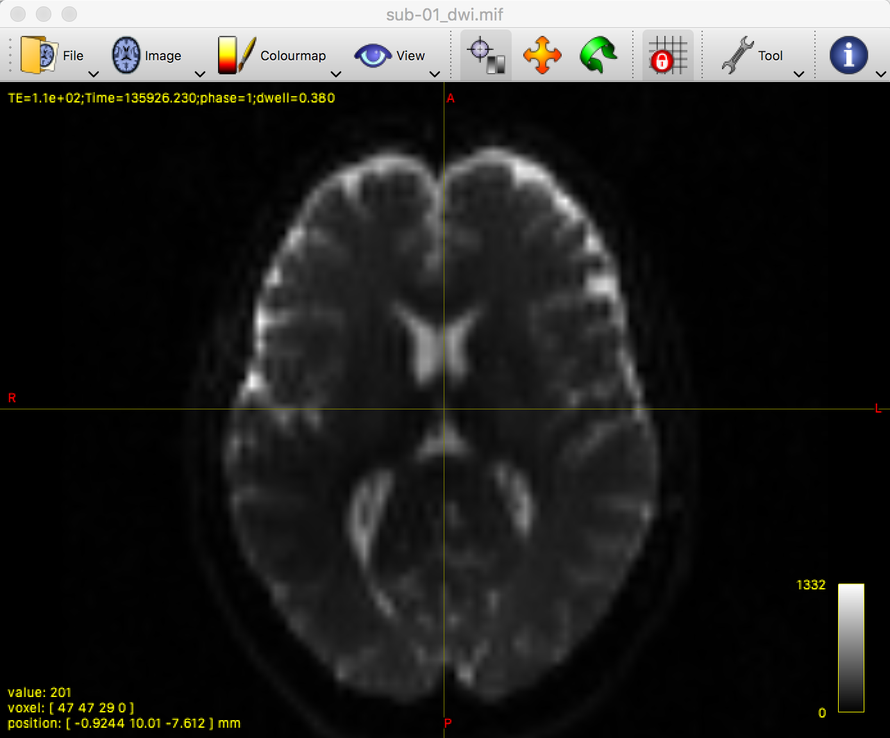
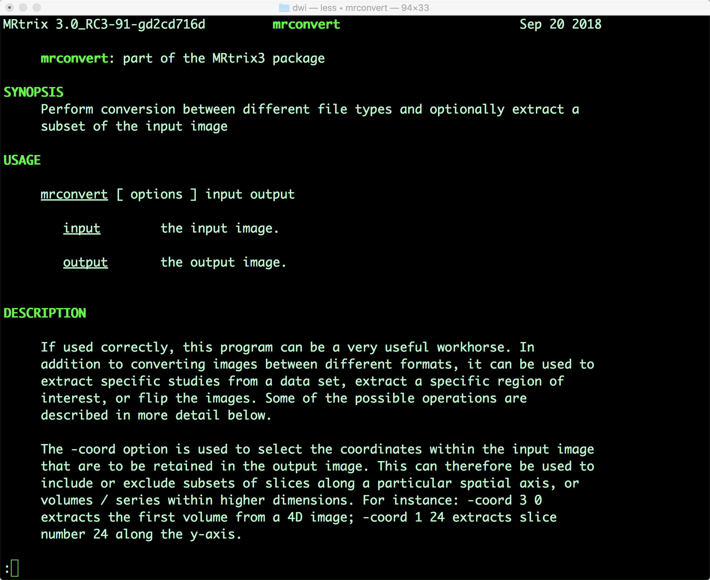

.. _MRtrix_01_Download_Install:

========================================
MRtrix Tutorial #1: Download and Install
========================================

--------------

The `MRtrix download page <http://www.mrtrix.org/download/>`__ contains download and installation instructions for Windows, Macintosh, and Linux users. This process used to take a lot of time, with several dependencies and libraries that needed to be downloaded. Fortunately, the developers have recently created a one-line command that will do all of this for you:

::

  sudo bash -c "$(curl -fsSL https://raw.githubusercontent.com/MRtrix3/macos-installer/master/install)"
  
This will download and install the entire MRtrix3 package to your machine, which will take no more than a few moments.

Once it has downloaded, open a Terminal and type the following to test your installation:

::

  mrview
  
Which will open up the MRtrix viewer. In the next section we will download diffusion data, which you can load into the viewer by clicking ``File -> Open`` and selecting the diffusion image. It should look something like this:

Try also typing one of the commands from the library, such as ``mrconvert``, and press ``enter``. If MRtrix has been installed correctly, you should see the help page printed by default when no arguments are passed to the command:

If both of these work without any errors, you are ready to begin downloading diffusion data, which we turn to in the next chapter.

Video
*****

You can find a video tutorial for Macintosh installation `here <https://www.youtube.com/watch?v=A9j9gbSwU2k>`__.
