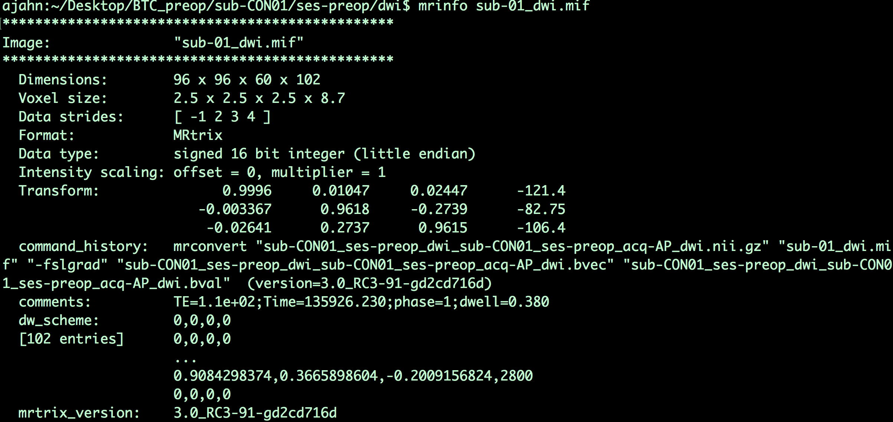

.. _MRtrix_03_DataFormats:

=======================================
MRtrix Tutorial #3: Looking at the Data
=======================================

---------------

Overview
****************

MRtrix uses its own format for storing and displaying imaging data. If you've already gone through the tutorials on the major fMRI software packages, such as SPM, FSL, and AFNI, you may remember that all of them can read and write images in NIFTI format. (AFNI by default will write files in its own BRIK/HEAD format unless you specify that your output should have a .nii extension, but it is the sole exception.) MRtrix is also able to read raw data in NIFTI format, but will output its files in MRtrix format, labeled with a ``.mif`` extension.

To see how this works, navigate to the folder ``sub-CON02/ses-preop/dwi``, which contains your diffusion data. One of the first steps for preprocessing your data is converting the diffusion data to a format that MRtrix understands; we will use the command ``mrconvert`` to combine the raw diffusion data with its corresponding ``.bval`` and ``.bvec`` files, so that we can use the combined file for future preprocessing steps:

::

  mrconvert sub-CON02_ses-preop_acq-AP_dwi.nii.gz sub-02_dwi.mif -fslgrad sub-CON02_ses-preop_acq-AP_dwi.bvec sub-CON02_ses-preop_acq-AP_dwi.bval
  
This command requires three arguments: The input, which is the raw DWI file in the AP directory; an output file, which we will call sub-02_dwi.mif to make it more compact and easier to read; and ``-fslgrad``, which requires the corresponding .bvec and .bval files (in that order).

.. note::

  To make the rest of the tutorial easier to read as well, use the ``mv`` command to rename the .bval and .bvec files:
  
  ::
  
    mv sub-CON02_ses-preop_acq-AP_dwi.bvec sub-02_AP.bvec
    mv sub-CON02_ses-preop_acq-AP_dwi.bval sub-02_AP.bval
    mv sub-CON02_ses-preop_acq-PA_dwi.bvec sub-02_PA.bvec
    mv sub-CON02_ses-preop_acq-PA_dwi.bval sub-02_PA.bval

The output image, ``sub-02_dwi.mif``, can be checked with the command ``mrinfo``:

::

  mrinfo sub-02_dwi.mif
  
The output contains several pieces of information, such as the dimensions of the dataset and the voxel size, along with the commands that were used to generate the current file:

Note that, since this is a 4-dimensional dataset, the last dimension is **time**; in other words, this file contains 102 volumes, each one with dimensions of 96 x 96 x 60 voxels. The last dimension of the ``Voxel size`` field - which in this case has a value of 8.7 - indicates the time it took to acquire each volume. This time is also called the repetition time, or TR.

Bvals and Bvecs
***************

The other files we need to check are the **bvals** and **bvecs** files. (For a more comprehensive review of what these terms mean, see :ref:`this chapter <MRtrix_00_Diffusion_Overview>`.) Briefly, the bvals contain a single number per volume that indicates how large of a diffusion gradient was applied to the data; and the bvecs file contains a triplet of numbers per volume that shows in what directions the gradients were applied. In general, volumes with larger b-values will be more sensitive to diffusion changes, but the images will also be more susceptible to motion and physiological artifacts, as shown in the figure below.

.. figure:: 03_bvals.png

  Three volumes with different b-values. A b-value of 0 is equivalent to a T2-weighted functional scan, while higher b-values lead to lower image quality (but higher sensitivity to diffusion).
  
The most important check is to ensure that the number of bvals and the number of bvecs are the same as the number of volumes in the dataset. For example, we can find the number of volumes in the ``sub-02_dwi.mif`` dataset by typing:

::

  mrinfo -size sub-02_dwi.mif | awk '{print $4}'
  
Which returns a value of 102, the number in the 4th field of the dimensions header that corresponds to the number of time-points, or volumes, in the dataset. We then compare this with the number of bvals and bvecs by using awk to count the number of columns in each text file:

::

  awk '{print NF; exit}' sub-02_AP.bvec
  awk '{print NF; exit}' sub-02_AP.bval
  
Which should both return a value of 102.

.. note::

  If the number of volumes in your dataset and the number of bvals and bvecs do not match, you should check with your scan technician about the discrepancy; the files may not have been properly uploaded to the server, or maybe the diffusion-weighted image wasn't acquired correctly.
  

Looking at the Data with mrview
*******************************
  
MRtrix, like the other imaging software packages we've covered in this e-book, has its own imaging viewer, called **mrview**. For example, you can view the image that we created above by typing:

::

  mrview sub-02_dwi.mif
  
This opens up a single viewing pane of the axial slices:

You can see all three viewing angles by clicking on "View" and then selecting "Ortho view", which will change the window to the following:

.. figure:: 03_mrview_ortho.png

By clicking and dragging the crosshairs, you can examine the whole brain from all three viewpoints. Note that we are seeing the first volume of a **time-series**, and that we can flip through the images by pressing the right and left arrow keys to scroll forward or backward through the volumes. The first volume that is displayed, which has a time-series index of 0 (i.e., 0 indicates the first volumes in the time-series, 1 indicates the second volume, and so on), looks like a typical T2-weighted functional image. We can verify this by comparing it with the b-value for the first volume in the time-series:

Now hover your mouse over the viewing window of mrview, and press the right arrow key to load the next volume in the time-series. If you look at the bval file, would you expect this image to look similar to or different from the one that you just saw? Why? Think about this as you load the third and fourth images in the time-series, noting the intensity differences and how they correspond to their respective b-values. If you find that the drop in intensity makes the image too dark to see, you can increase the brightness by clicking on ``Tool -> View options``, and then entering a lower maximum value for the "Intensity scaling" field:

Next Steps
**********

Once you have practiced looking at the data and seen the relationship between the b-values and the volumes, try the same thing with the diffusion-weighted image with phase-encoding in the PA direction (i.e., sub-CON02_ses-preop_dwi_sub-CON02_ses-preop_acq-PA_dwi.nii.gz). How many volumes are there in this dataset? What are the b-values? How does it compare to what you saw in the AP diffusion-weighted dataset?

Now that you have learned some of the basic MRtrix commands and concepts, we will start to **preprocess** the data so that we can fit **streamlines**. To begin that stage, click the ``Next`` button.
