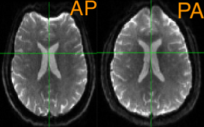
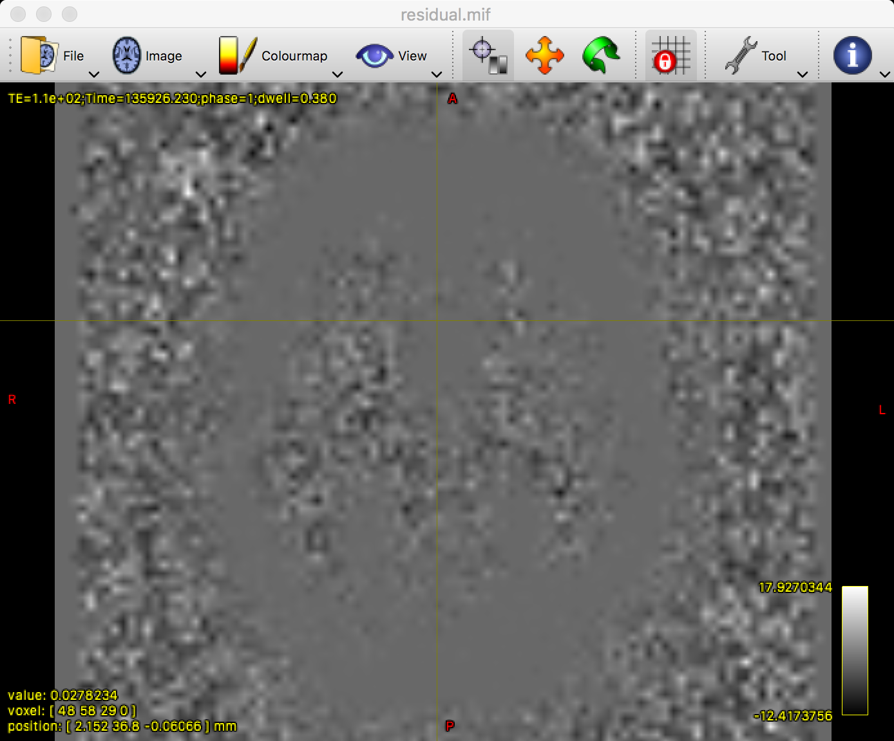

.. _MRtrix_04_Preprocessing:

=================================
MRtrix Tutorial #4: Preprocessing
=================================

---------------

Overview
********

Just like other neuroimaging data, diffusion data should be **preprocessed** before it is analyzed. Preprocessing removes sources of noise from the image, such as movement artifacts and other distortions. Diffusion data in particular is susceptible to **warping artifacts** as a result of the phase-encoding direction: In general, the predominant encoding direction - such as Anterior to Posterior, or AP - will make the anterior part of the brain look more "squished", as though a strong headwind is blowing from the Anterior direction. The opposite is true of the Posterior to Anterior, or PA, phase-encoding direction. Sometimes these distortions are very subtle, but other times they are conspicuous:

The following are common preprocessing steps done with MRtrix. If you have used the software package FSL to analyze diffusion data, note that some of the FSL commands - such as eddy and topup - are used in some of the MRtrix libraries. We will explore that more below.

dwi_denoise
***********

The first preprocessing step we will do is **denoise** the data by using MRtrix's ``dwidenoise`` command. This requires an input and an output argument, and you also have the option to output the noise map with the ``-noise`` option. For example:

::

  dwidenoise sub-01_dwi.mif sub-01_den.mif -noise noise.mif
  
This command should take a couple of minutes to run.

One quality check is to see whether the residuals load onto any part of the anatomy. If they do, that may indicate that the brain region is disproportionately affected by some kind of artifact or distortion. To calculate this residual, we will use another MRtrix command called ``mrcalc``:

::

  mrcalc sub-01_dwi.mif sub-01_den.mif -subtract residual.mif
  
You can then inspect both the noise map and the residual map with mrview:

::

  mrview noise.mif residual.mif
  

