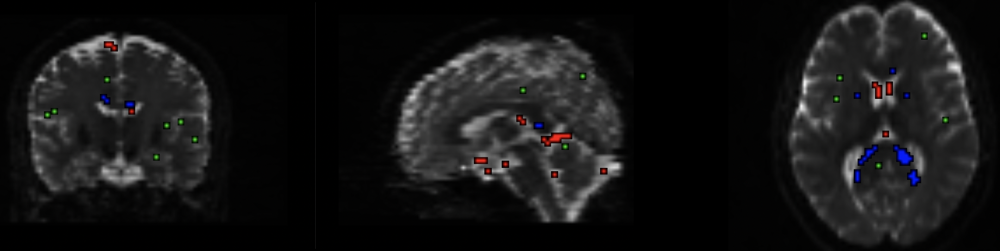
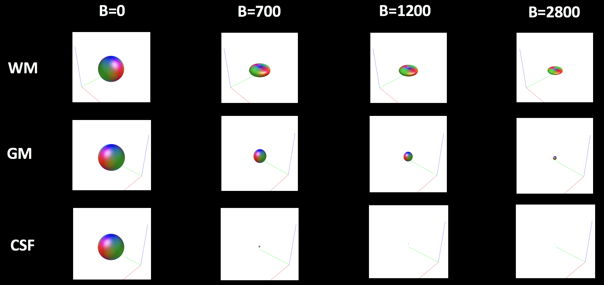
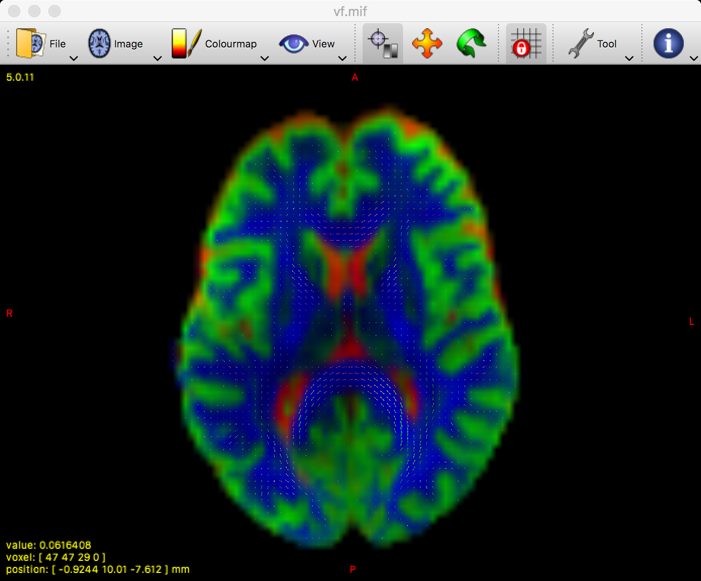
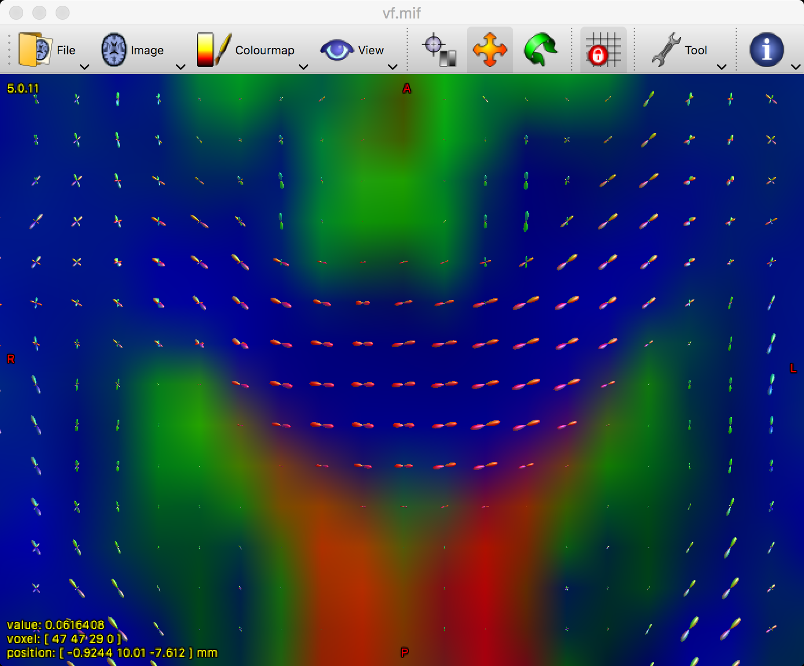

.. _MRtrix_05_BasisFunctions:

=======================================================
MRtrix Tutorial #5: Constrained Spherical Deconvolution
=======================================================

--------------

Overview
********

In order to determine the orientation of diffusion within each voxel, we will create a **basis function** from the subject's own data. By extracting the diffusion signal from representative grey matter, white matter, and cerebrospinal fluid voxels, we will build a model to estimate what the signal should look like in different orientations and when we apply different b-values. The concept is similar to using a hemodynamic response function (HRF) as a basis function for fMRI data: We have a canonical shape of what we believe the fMRI signal should look like in response to a single event, and then we modulate it to fit the observed data.

The response function is similar to the canonical HRF we use in fMRI studies. In this case, however, we’re estimating the response function for each tissue type. If you happened to collect your diffusion data with multiple b-values, then this approach in MRtrix is called **multi-shell multi-tissue (MSMT)**.

dwi2response
************

Unlike most fMRI studies which use a basis function that has already been created, MRtrix will derive a basis function from the diffusion data. Using an individual subject’s data is more precise and specific to that subject. The command ``dwi2response`` has several different algorithms that you can choose from, but for this tutorial we will use the "dhollander" algorithm:

::

  dwi2response dhollander dwi_den_unr_preproc_unbiased.mif wm.txt gm.txt csf.txt –voxels voxels.mif

Let’s unpack what this command does. First, it uses an algorithm to deconvolve the **fiber orientation distributions (FODs)** - in other words, it tries to decompose the diffusion signal into a set of smaller individual fiber orientations. You have several algorithms to choose from, but the most common are tournier and dhollander. The **tournier** algorithm is used for single-shell data and for a single tissue type (e.g., white matter). The **dhollander** algorithm can be used for either single- or multi-shell data, and for multiple tissue types. Estimating the FOD for each tissue type will later help us do **anatomically constrained tractography.**

The next argument specifies your input data, and the resulting response functions for the different tissue types. The order matters; you can call the output files whatever you want, but it makes the most sense to label them as some kind of variation on the phrases "white matter", "grey matter", and "cerebrospinal fluid" (here, labeled as "wm.txt", "gm.txt", and "csf.txt"). The last option, "-voxels", specifies an output dataset that shows which voxels from the image were used to construct the basis functions for each tissue type. This dataset can be viewed by typing the following:

::

  mrview dwi_den_unr_preproc_unbiased.mif -overlay.load voxels.mif
  
Which will generate something like this:

You can then check the response function for each tissue type by typing:

::

  shview wm.txt
  shview gm.txt
  shview csf.txt

Look at each of these files individually. The first image that pops up will look like a sphere; this represents what the diffusion looks like within that tissue type when a b-value of zero has been applied - in other words, when there is no diffusion gradient. By pressing the right and left arrow keys, you can view what the basis function looks like when different b-values have been applied. 

The figure below shows how the basis function changes for each combination of tissue type and b-value. Note how the overall magnitude (or size) of the sphere for each tissue type becomes smaller when higher b-values are applied; although higher b-values are more sensitive to changes in diffusion, the overall signal is smaller and more susceptible to noise. Within the grey matter, the sphere tends to flatten into a pancake when diffusion gradients are applied, reflecting the preferential direction of diffusion along the white matter tracts in these voxels. For the grey matter and the cerebrospinal fluid, on the other hand, the basis function remains spherical across all of the b-values.

.. note::

  The grey matter and cerebrospinal fluid basis functions tends to get smaller at different rates as the b-values increase. Why do you think this might be?

Fiber Orientation Density (FOD)
*******************************

We will now use the basis functions generated above to create **Fiber Orientation Densities**, or FODs. These are estimates of the amount of diffusion in each of three orthogonal directions. As described in the introductory chapter (LINK), these are analogous to the tensors that are used in traditional diffusion studies. However, MRtrix allows for the estimation of multiple crossing fibers within a single voxel, and can resolve the diffusion signal into multiple directions.

To do this, we will use the command ``dwi2fod`` to apply the basis funcions to the diffusion data. The "-mask" option specifies which voxels we will use; this is simply to restrict our analysis to brain voxels and reduce the computing time. The ".mif" files specified after each basis function will output an FOD image for that tissue type:

::

  dwi2fod msmt_csd sub-01_den_unr_preproc_unbiased.mif -mask mask.mif wm.txt wmfod.mif gm.txt gmfod.mif csf.txt csffod.mif

In order to view these FODs, we will combine them into a single image. The command ``mrconvert`` will extract the first image from the wmfod.mif file, which is the image with a b-value of 0. The output of this command is then used as the input into an ``mrcat`` command which combines the FOD images from all three tissue types into a single image that we will call "vf.mif":

::

  mrconvert -coord 3 0 wmfod.mif - | mrcat csffod.mif gmfod.mif - vf.mif

The white matter FODs can then be overlaid on this image, so that we can observe whether the white matter FODs do indeed fall within the white matter, and also whether they are along the orientations that we would expect:

::

  mrview vf.mif -odf.load_sh wmfod.mif
  
The output will look something like this:

  The white matter FODs overlaid on an image color-coded for each tissue type. Green represents grey matter, cerebrospinal fluid is depicted as red, and white matter is shown in blue.
  
You can zoom in on the image by holding ``command`` and scrolling the mouse wheel. Focus on a region such as the corpus callosum; if the FODs have been estimated correctly, the predominant color in the corpus callosum should be red, since red signalizes that the primary orientation is left-to-right:

Remember that green means posterior-to-anterior, and blue represents orientations in the inferior-to-superior direction. By using all three orthogonal views, see if you can find tracts such as the superior longitudinal fasciculus and the corona radiata. Do these match up with the colors that you would expect?

Next Steps
**********

Now that we've correctly estimated the FODs for each tissue type, we are ready to begin laying down the foundation for our tractography analysis. The next step will be to determine the boundary between the grey matter and the white matter, which we will use as a starting point for our streamlines.
