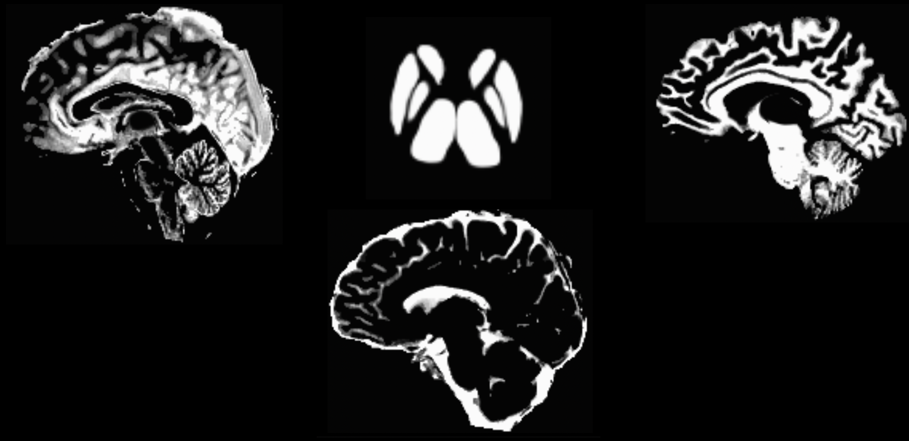

.. _MRtrix_06_TissueBoundary:

==========================================
Chapter #6: Creating the Tissue Boundaries
==========================================

--------------

We are almost ready to begin our streamline analysis, in which we will place **seeds** at random locations along the boundary between the grey matter and the white matter. A streamline will grow from each seed and trace a path from that seed region until it terminates in another region. Some of the streamlines will terminate in places that don't make sense - for example, a streamline may terminate at the border of the ventricles. We will cull these "error" streamlines, and be left with a majority of streamlines that appear to connect distant grey matter regions.

To do this, we will first need to create a **boundary** between the grey matter and the white matter. The MRtrix command ``5ttgen`` will use FSL's FAST, along with other commands, to segment the anatomical image into five tissue types:

1. Grey Matter;
2. Subcortical Grey Matter (such as the amygdala and basal ganglia);
3. White Matter;
4. Cerebrospinal Fluid; and
5. Pathological Tissue.

Once we have segmented the brain into those tissue classes, we can then use the boundary as a mask to restrict where we will place our seeds.

Converting the Anatomical Image
*******************************

The anatomical image first needs to be converted to MRtrix format. Just as we did in a previous chapter, we will use the command ``mrconvert`` (make sure you are in your anatomical directory first):

::

  mrconvert sub-CON01_ses-preop_anat_sub-CON01_ses-preop_T1w.nii.gz T1.mif
  
This creates a new file, ``T1.mif``, which you can look at in mrview.

We will now use the command ``5ttgen`` to segment the anatomical image into the tissue types listed above:

::

  5ttgen fsl T1.mif 5tt_nocoreg.mif

If the segmentation has finished successfully, you should see the following images in mrview (pressing the left and right arrow keys scrolls through the different tissue types):

  The output from ``5ttgen fsl anat.mif 5tt_nocoreg.mif`` will be a single dataset with 5 volumes, one per tissue type. Check this image with mrview, using the right and left arrow keys to toggle between tissue types. The tissue types are: GM, WM, CSF, subcortical GM, and pathological tissue. If no pathological tissue is detected, then that volume is blank.

.. note::

  If the segmentation step fails, this may be due to insufficient contrast between the tissue types; for example, some anatomical images are either very dark across both the grey and white matter, or very light across both tissue types. We can help the segmentation process by increasing the intensity contrast (also known as **intensity normalization**) between the tissues with a command like AFNI's 3dUnifize, e.g.:
  
  ::
   
    3dUnifize -input anat.nii -prefix anat_unifize.nii
    
  The difference between the image before and after may be subtle, but it can prevent a segmentation error from being thrown.

Coregistering the Diffusion and Anatomical Images
*************************************************

If the segmentation has finished without any errors, our next step is to coregister the anatomical and diffusion-weighted images. This ensures that the boundaries of the tissue types are accurately match up with the boundaries of the diffusion-weighted images; even small differences in the location of the two scans can throw off the tractography results.

We will first use the commands ``dwiextract`` and ``mrmath`` to average together the B0 images from the diffusion data. These are the images that look most like T2-weighted functional scans, since a diffusion gradient wasn't applied during their acquisition - in other words, they were acquired with a b-value of zero. To see how this works, type the following command:

::

  dwiextract sub-01_den_unr_preproc_unbiased.mif - -bzero | mrmath - mean mean_b0.mif -axis 3
  
There are two parts to this command, separated by a pipe ("``\``"). The left half of the command, ``dwiextract``, takes the preprocessed diffusion-weighted image as an input, and the ``-bzero`` option extracts the B0 images; the solitary ``-`` argument indicates that the output should be used as input for the second part of the command, to the right of the pipe. ``mrmath`` then takes these output B0 images and computes the mean along the 3rd axis, or the time dimension. In other words, if we start with an index of 0, then the number 3 indicates the 4th dimension, which simply means to average over all of the volumes.

In order to carry out the coregistration between the diffusion and anatomical images, we will need to take a brief detour outside of MRtrix. The software package doesn't have a coregistration command in its library, so we will need to use another software package's commands instead. Although you can choose any one you want, we will focus here on FSL's ``flirt`` command.

The first step is to convert both the segmented anatomical image and the B0 images we just extracted:

::

  mrconvert mean_b0.mif mean_b0.nii.gz
  mrconvert 5tt_nocoreg.mif 5tt_nocoreg.nii.gz
  
Since ``flirt`` can only work with a single 3D image (not 4D datasets), we will use ``fslroi`` to extract the first volume of the segmented dataset, which corresponds to the Grey Matter segmentation:

::

  fslroi 5tt_nocoreg.nii.gz 5tt_vol0.nii.gz 0 1
  
We then use the ``flirt`` command to coregister the two datasets:

::

  flirt -in mean_b0.nii.gz -ref 5tt_vol0.nii.gz -interp nearestneighbour -dof 6 -omat diff2struct_fsl.mat
  
This command uses the grey matter segmentation (i.e., "5tt_vol0.nii.gz") as the reference image, meaning that it stays stationary. The averaged B0 images are then moved to find the best fit with the grey matter segmentation. The output of this command, "diff2struct_fsl.mat", contains the **transformation matrix** that was used to overlay the diffusion image on top of the grey matter segmentation.

Now that we have generated our transformation matrix, we will need to convert it into a format that can be read by MRtrix. That is, we are now ready to travel back into MRtrix after briefly stepping outside of it. The command ``transformconvert`` does this:

::

  transformconvert diff2struct_fsl.mat mean_b0.nii.gz 5tt_nocoreg.nii.gz flirt_import diff2struct_mrtrix.txt
  
