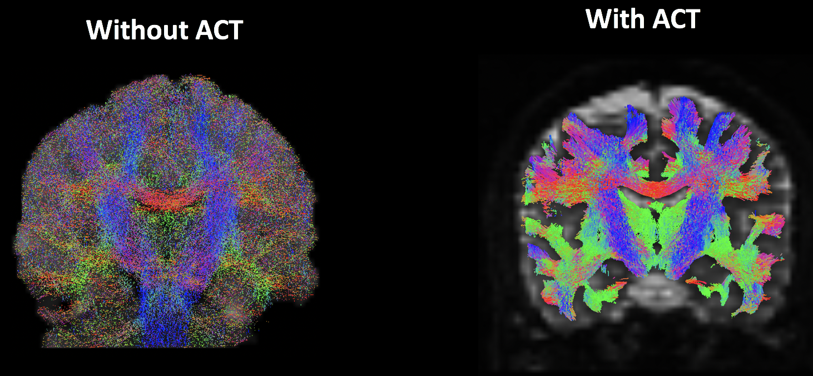

.. _MRtrix_07_Streamlines:

===============================
MRtrix Tutorial #7: Streamlines
===============================

--------------

Overview
********

Having created the interface between the white matter and the grey matter, we are ready to generate **streamlines** - threads that connect anatomically distinct regions of grey matter. These are estimates of the underlying white matter tracts, and MRtrix uses a **probabilistic** approach to do this; a large number of streamlines are generated for each voxel of the grey matter / white matter boundary, and then those streamlines are culled based on different criteria that we specify. We will discuss some of the most popular options below.

Anatomically Constrained Tractography 
*************************************

One of MRtrix's features is **Anatomically Constrained Tractography**, or ACT. This method will only determine that a streamline is valid if it is biologically plausible. For example, a streamline that terminates in the cerebrospinal fluid will be discarded, since white matter tracts tend to both originate and terminate in grey matter. This is another way of saying that the streamlines should be constrained to the white matter, and excluded from the other tissue types. The effect of either including or omitting this step can be seen in the following figure:

  An analysis without (left) and with (right) anatomically constrained tractography. Note how without ACT, the streamlines do tend to congregate within the white matter; however, a large number of them are found within the grey matter and cerebrospinal fluid. Using ACT (right) restricts the streamlines to the white matter tracts that we will want to analyze.
  
Anatomically constrained tractography isn't a separate preprocessing step per se, but rather an option that can be included with the command ``tckgen``, which generates the actual streamlines.

Generating Streamlines with tckgen
**********************************

MRtrix is able to do both **deterministic** and **probabilistic** tractography. In deterministic tractography, the direction of the streamline at each voxel is determined based on the predominant fiber orientation; in other words, the streamline is determined by a single paramter. MRtrix includes multiple options to do this type of deterministic tractography, such as ``FACT`` or ``tensor_det``.

The other method, probabilistic tractography, is the default in MRtrix. In this approach, multiple streamlines are generated from seed regions all along the boundary between the grey matter and white matter. The direction of the streamline will most likely follow the predominant fiber orientation density, but not always; due to a large number of samples, some streamlines will follow other directions. This becomes less likely if the FOD is extremely strong in one direction - for example, the FODs within a structure such as the corpus callosum will tend to all be aligned left-to-right - but the sampling becomes more diverse in regions that do not have a predominant fiber orientation.

The default method is to use an algorithm known as iFOD2, which will use a probabilistic streamline approach. Other algorithms can be found at `this site <https://mrtrix.readthedocs.io/en/latest/reference/commands/tckgen.html>`__, although for the remainer of the tutorial we will use the default of iFOD2.

How Many Streamlines?
^^^^^^^^^^^^^^^^^^^^^

There is a trade-off between the number of generated streamlines and the amount of time that it takes. More streamlines result in a more accurate reconstruction of the underlying white-matter tracts, but a large number of them can take a prohibitively long time. 

The "correct" number of streamlines to use is still being debated, but at least 10 million or so should be a good starting place. 

::

  tckgen -act 5tt_coreg.mif -backtrack -seed_gmwmi gmwmSeed_coreg.mif -nthreads 8 -maxlength 250 -cutoff 0.06 -select 10000000 wmfod_norm.mif tracks_10M.tck
  
The "-act" option specifies that we will use the anatomically-segmented image to constrain our analysis to the white matter. "-backtrack" indicates for the current streamline to go back and run the same streamline again if it terminates in a strange place (e.g., the cerebrospinal fluid); "-maxlength" sets the maximum tract length, in voxels, that will be permitted; and "-cutoff" specifies the FOD amplitude for terminating a tract (for example, a value of 0.06 would not permit a streamline to go along an FOD that is lower than that number). "-seed_gmwmi" takes as an input the grey-matter / white-matter boundary that was generated using the ``5tt2gmwmi`` command.

"-nthreads" can be used to specify the number of processing cores you wish to use, in order to speed up the analysis. And finally, "-select" indicates how many total streamlines to generate. Note that a shorthand can be used if you like; instead of, say, 10000000, you can rewrite it as 10000k (signalizing "ten thousand thousands", which equals "ten million"). The last two arguments specify both the input (``wmfod_norm.mif``) and a label for the output (``tracks_10M.tck``).

If you want to visualize the output, I recommend extracting a subset of the output by using ``tckedit``:

::

  tckedit tracks_10M.tck -number 200k smallerTracks_200k.tck

Refining the Streamlines with tcksift2
^^^^^^^^^^^^^^^^^^^^^^^^^^^^^^^^^^^^^

::

  tcksift2 -act 5tt_coreg.mif -out_mu sift_mu.txt -out_coeffs sift_coeffs.txt -nthreads 8 tracks_10M.tck wmfod_norm.mif sift_1M.txt
