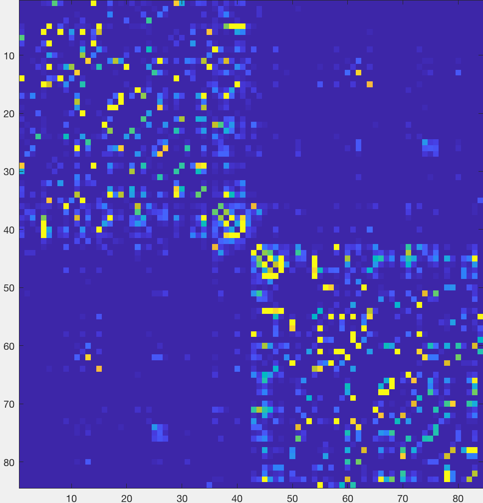

.. _MRtrix_08_Connectome:

=======================================================
MRtrix Tutorial #8: Creating and Viewing the Connectome
=======================================================

------------------------

Overview
********

Now that we have created a streamline map, we can create a **connectome** that represents the number of streamlines connecting different parts of the brain. And in order to do that, we have to first parcellate the brain into different regions, or nodes. One way to do this is by using an **atlas**, which assigns each voxel in the brain to a specific ROI.

You can use any atlas you want, but for this tutorial we will be using the atlases that come with :ref:`FreeSurfer <FS_11_ROIAnalysis>`. Accordingly, our first step will be to run the subject's anatomical image through recon-all, which you can read more about :ref:`here <FS_03_ReconAll>`:

::

  recon-all -i ../anat/sub-CON02_ses-preop_T1w.nii.gz -s sub-CON02_recon -all
  
This will take a few hours, depending on the speed of your computer. When it has finished, make sure to check the output by using the QA procedures described in :ref:`this chapter <FS_12_FailureModes>`.

Creating the Connectome
***********************

When recon-all has finished, we will need to convert the labels of the FreeSurfer parcellation to a format that MRtrix understands. The command ``labelconvert`` will use the parcellation and segmentation output of FreeSurfer to create a new parcellated file in .mif format:

::

  labelconvert sub-CON02_recon/mri/aparc+aseg.mgz $FREESURFER_HOME/FreeSurferColorLUT.txt /usr/local/mrtrix3/share/mrtrix3/labelconvert/fs_default.txt sub-CON02_parcels.mif

We then need to create a whole-brain connectome, representing the streamlines between each parcellation pair in the atlas (in this case, 84x84). The "symmetric" option will make the lower diagonal the same as the upper diagonal, and the "scale_invnodevol" option will scale the connectome by the inverse of the size of the node:

::

  tck2connectome -symmetric -zero_diagonal -scale_invnodevol -tck_weights_in sift_1M.txt tracks_10M.tck sub-CON02_parcels.mif sub-CON02_parcels.csv -out_assignment assignments_sub-CON02_parcels.csv

Lastly, we will create a tract file between the specified nodes that can then be visualized in mrview. Replace the "8,10" pair after the "nodes" option with the labels in /usr/local/mrtrix3/share/mrtrix3/labelconvert/fs_default.txt that you are interested in:

::

  connectome2tck -nodes 8,10 -exclusive sift_1mio.tck assignments_sub-CON02_parcels.csv test
  
  
Viewing the Connectome
**********************

Once you have created the ``parcels.csv`` file, you can view it as a matrix in Matlab. First, you will need to import it:

::

  connectome = importdata('sub-CON02_parcels.csv');
  
And then you will need to view it as a scaled image, so that higher structural connectivity pairs are brighter:

::

  imagesc(connectome)
  

You should see an image like this:

.. figure:: 08_ViewingConnectome.png

The most noticeable feature is a division of the figure into two distinct "boxes", representing increased structural connectivity within each hemisphere. You will also observe a relatively brighter line traced along the diagonal, representing higher structural connectivity between nearby nodes. Brighter boxes in the opposing bottom-left and upper-right corners represent increased structural connectivity between homologous regions.

To make these associations more obvious, you can change the scaling of the color map:

::

  imagesc(connectome, [0 1])
  

.. indicate on the figure what you are talking about

Video
*****

For a video overview of how to create the connectome, click `here <https://www.youtube.com/watch?v=Xt42wDmdvKs>`__.

Next Steps
**********

Now that we've preprocessed a single subject and created a connectome, we will have to do this for all of the remaining subjects. To do that, we will have to **script** the analyses for our entire dataset, which will we do in the next chapter.
