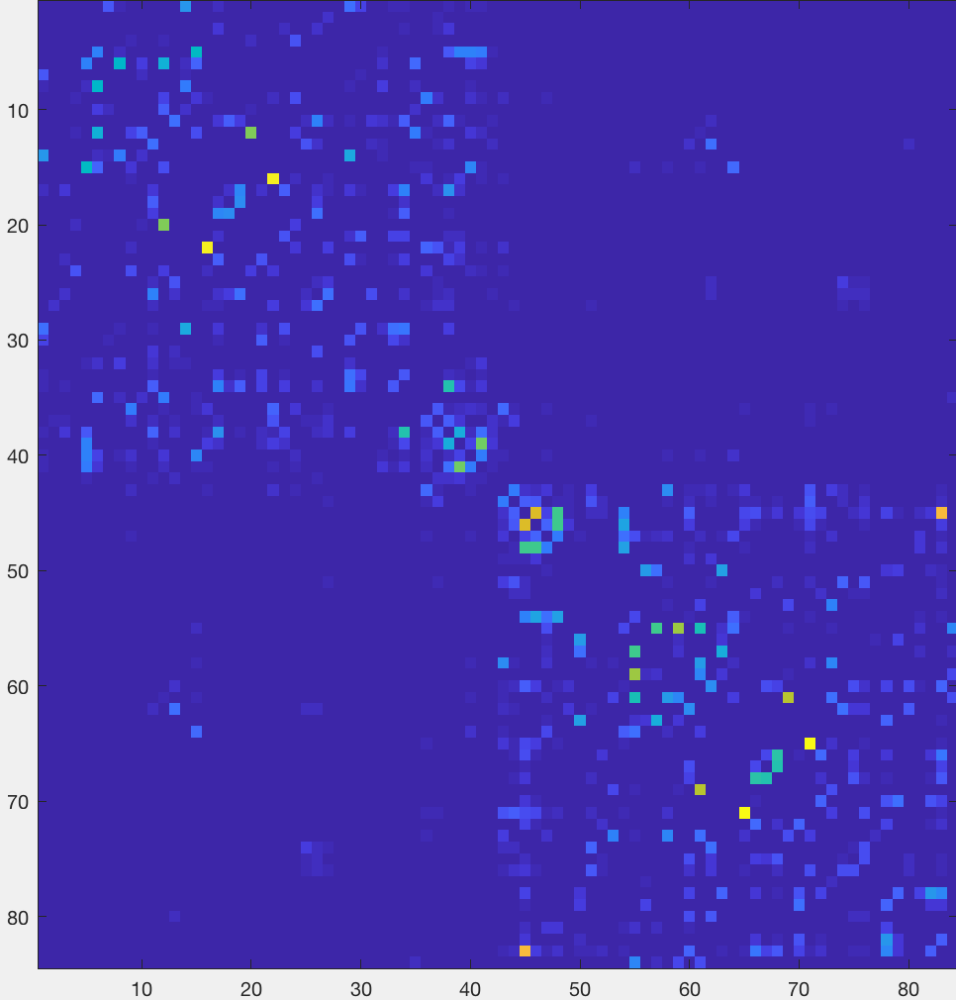

.. _MRtrix_08_Connectome:

=======================================================
MRtrix Tutorial #8: Creating and Viewing the Connectome
=======================================================

------------------------

Creating the Connectome
***********************

::

  #!/bin/bash
  

  #Convert the labels of the FreeSurfer parcellation to a format that MRtrix understands. This requires recon-all to have been run on the subject
  labelconvert -force sub-01_MRtrix_FS/mri/aparc+aseg.mgz $FREESURFER_HOME/FreeSurferColorLUT.txt ~/mrtrix3/share/mrtrix3/labelconvert/fs_default.txt sub-01_parcels.mif

  #Create a whole-brain connectome, representing the streamlines between each parcellation pair in the atlas (in this case, 84x84). The "symmetric" option will make the lower diagonal the same as the upper diagonal, and the "scale_invnodevol" option will scale the connectome by the inverse of the size of the node
  tck2connectome -symmetric -zero_diagonal -scale_invnodevol sift_1mio.tck sub-01_parcels.mif sub-01_parcels.csv -out_assignment assignments_sub-01_parcels.csv

  #Creates a tract file between the specified nodes that can then be visualized in mrview. Replace the "8,10" pair after the "nodes" option with the labels in ~/mrtrix3/share/mrtrix3/labelconvert/fs_default.txt that you are interested in
  connectome2tck -nodes 8,10 -exclusive sift_1mio.tck assignments_sub-01_parcels.csv test
  
  
Viewing the Connectome
**********************

Once you have created the ``parcels.csv`` file, you can view it as a matrix in Matlab. First, you will need to import it:

::

  connectome = importdata('sub-01_parcels.csv');
  
And then you will need to view it as a scaled image, so that higher structural connectivity pairs are brighter:

::

  imagesc(connectome)
  

You should see an image like this:

The most noticeable feature is a division of the figure into two distinct "boxes", representing increased structural connectivity within each hemisphere. You will also observe a relatively brighter line traced along the diagonal, representing higher structural connectivity between nearby nodes. Brighter boxes in the opposing bottom-left and upper-right corners represent increased structural connectivity between homologous regions.

To make these associations more obvious, you can change the scaling of the color map:

::

  imagesc(connectome, [0 1])

[Will need to annotate the figure to indicate what I am talking about.]
