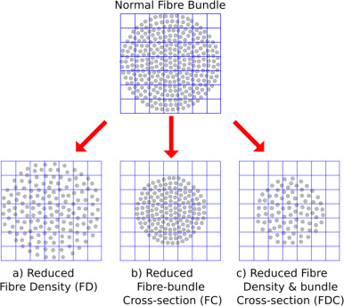
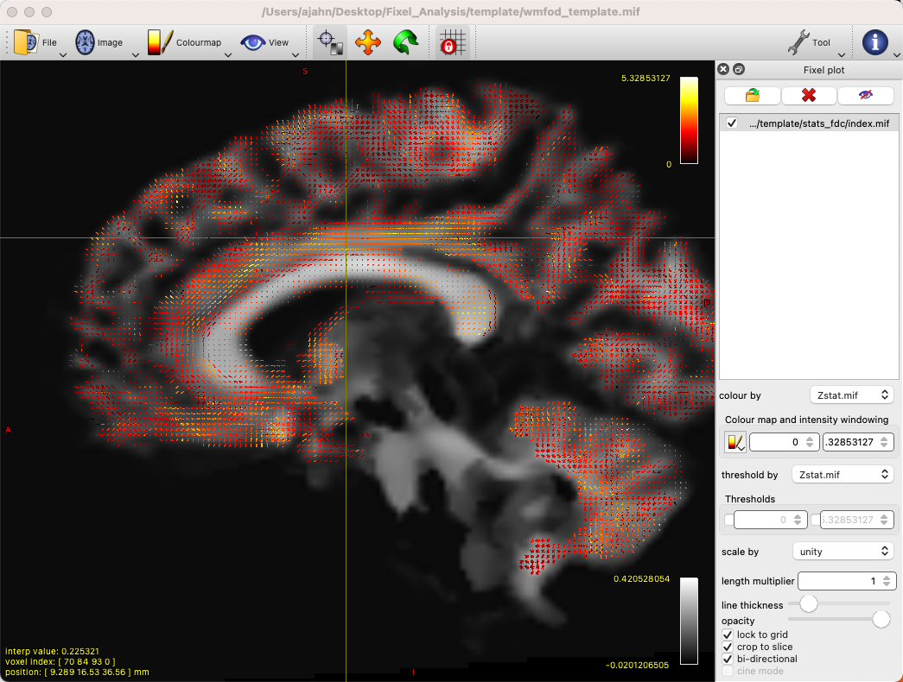
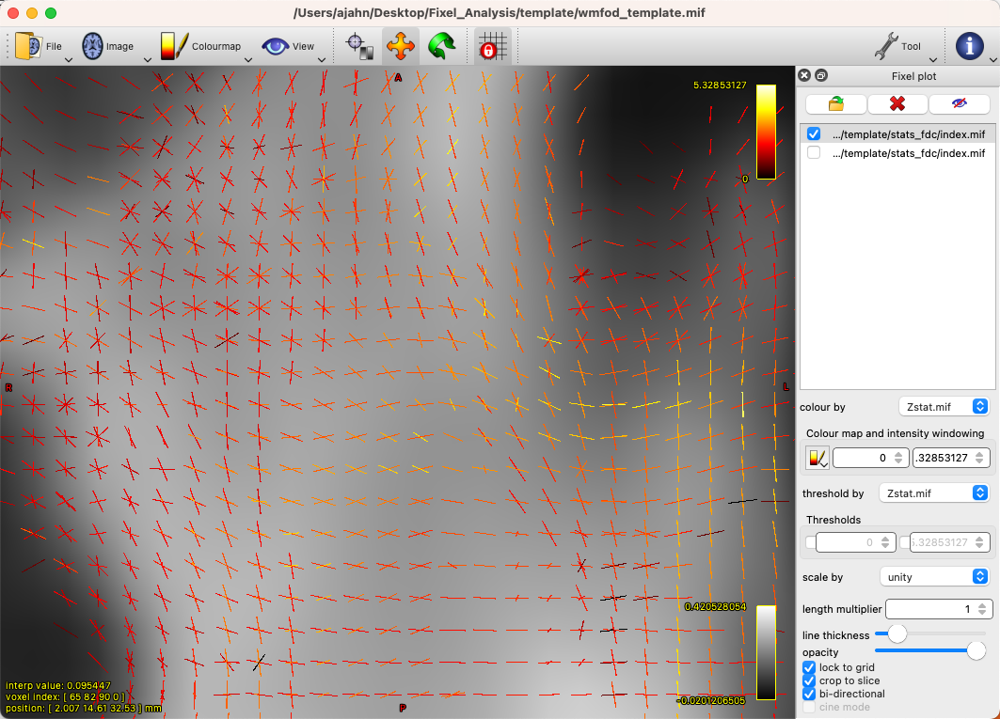

.. _MRtrix_11_FixelBasedAnalysis:

=========================================
MRtrix Tutorial #11: Fixel-Based Analysis
=========================================

--------------

Overview
********

Until now, we have focused on generating **streamlines**, representations of the underlying white-matter tracts. These are probabilistic tracts, which take into account nearby tissue types and amount of angle in order to create biologically plausible connections between distant cortical regions. MRtrix also allows for the generation of **fixels**, or specific fiber populations within a voxel.

Remember that traditional diffusion-tensor methods cannot resolve the crossing-fibers problem, in which two bundles of fibers crossing at right angles will give the appearance of uniform diffusion within that voxel. By using constrained spherical deconvolution (CSD) with a single fiber orientation as a basis function, we can resolve the signal measured within a voxel into its constituent fibers, or fiber orientation distributions (FODs). This can then be used to quantify the fiber density (FD) of the underlying white matter, as well as changes to the overall size of the cross-section within a given voxel (fiber cross-section, or FC). These two metrics can furthermore be combined into a single metric called fiber density and cross-section (FDC).

`Raffelt et al., 2015 <https://www.sciencedirect.com/science/article/pii/S1053811916304943#f0015>`__, illustrated the difference in these metrics by using an example 7x7 matrix of voxels. Given a certain amount of white matter fibers within the voxels, a reduction in the number of fibers can happen in three different ways:

1. The amount of white matter fibers occupies the same number of voxels, but the overall density decerases (reduced FD); or
2. The density stays the same, buy the white matter fibes occupy fewer voxels (reduced FC); or
3. Both the number of occupied voxels and the density of white matter within those voxels decrease (reduced FDC).

The opposite of each of these scenarios could also take place, which would lead to increases in each of those metrics, respectively.

  Figure 1 from Raffelt et al., 2017

Preparing the Data for Fixel-Based Analysis
*******************************************

Some of the steps for doing a Fixel-Based Analysis are similar to what was done in the previous chapters of this module. There are some significant differences, however, once the Fiber Orientations are estimated and then warped to a template.

If you are analyzing a large number of subjects - for example, several dozen or more - you will either need a computer with at least a couple of hundred gigabytes of memory, and ideally multiple processors. Fixel-based analysis can be done on a local machine, but it can take a long time; several days, depending on how many subjects you have. Regardless, you can process these images by using MRtrix's ``for_each`` command (details about the command can be found `here <https://mrtrix.readthedocs.io/en/dev/reference/commands/for_each.html>`__). To illustrate how to use this batch command, we will take a relatively simple case of denoising the raw diffusion-weighted data.

To begin, we will organize our data so that each subject folder contains converted raw data called ``dwi.mif``. For example, if we have three subjects from the BTC_Preop dataset, we can create a new sub-folder called ``Fixel_Analysis``. Within that folder, create another folder called ``subjects``, which contains three sub-folders, ``sub-01``, ``sub-02``, and ``sub-03``. Assuming that each of these folders contain each subject's corresponding raw diffusion data and bvals and bvecs files, you can convert them by typing the following code from the ``subjects`` folder:

::

  for i in sub-01 sub-02 sub-03; do
    mrconvert *.nii.gz dwi.mif -fslgrad *.bvec *bval
    rm *.nii.gz
  done
  
This will create a new raw diffusion-weighted image, which contains the b-vectors and b-values in its header.

The next preprocessing steps can be found on `this webpage <https://mrtrix.readthedocs.io/en/latest/fixel_based_analysis/mt_fibre_density_cross-section.html>`__, on the MRtrix website. They explain each of the steps in detail, so we will not repeat all of the explanations here. Let us instead focus on the first preprocessing step, denoising, to illustrate how the ``for_each`` command works. For example, if we run the following code from the ``subjects`` directory:

::
  
  for_each * : dwidenoise IN/dwi.mif IN/dwi_denoised.mif
  
The code to the left of the colon (``:``) means to loop over every item captured by the ``*`` wildcard. (Note that if there are any other files besides the subject folders in this directory, such as text files, that the command will throw an error, since it is trying to applyg a preprocessing step to a non-diffusion file.) Each of the items are loaded into the ``IN`` keyword; for the first subject, for example, this will expand to:

::

  dwidenoise sub-01/dwi.mif sub-01/dwi_denoised.mif
  
  
Which takes sub-01's dwi.mif file, denoises it, and places the output file, ``dwi_denoised.mif``, in the sub-01 folder. This is the same procedure that is used for all of the other ``for_each`` commands listed in the tutorial. One variation that you should be aware of is the ``PRE`` keyword, which is the input item stripped of its extension.

Running the Preprocessing Steps
*******************************

You can either adapt the commands from the MRtrix tutorial to you data structure, or, assuming that you have the subjects organized with a single ``dwi.mif`` file in each folder, you can copy and paste the following code below (note that this omits bias field correction, which, in my experience, can sometimes results in worse brain mask estimation later on):

::

  for_each * : dwidenoise IN/dwi.mif IN/dwi_denoised.mif
  for_each * : mrdegibbs IN/dwi_denoised.mif IN/dwi_denoised_unringed.mif -axes 0,1
  for_each * : dwifslpreproc IN/dwi_denoised_unringed.mif IN/dwi_denoised_unringed_preproc.mif -rpe_none -pe_dir AP
  for_each * : dwi2response dhollander IN/dwi_denoised_unringed_preproc.mif IN/response_wm.txt IN/response_gm.txt IN/response_csf.txt
  responsemean */response_wm.txt ../group_average_response_wm.txt
  responsemean */response_gm.txt ../group_average_response_gm.txt
  responsemean */response_csf.txt ../group_average_response_csf.txt
  for_each * : mrgrid IN/dwi_denoised_unringed_preproc_unbiased.mif regrid -vox 1.25 IN/dwi_denoised_unringed_preproc_unbiased_upsampled.mif
  for_each * : dwi2mask IN/dwi_denoised_unringed_preproc_unbiased_upsampled.mif IN/dwi_mask_upsampled.mif
  for_each * : dwi2fod msmt_csd IN/dwi_denoised_unringed_preproc_unbiased_upsampled.mif ../group_average_response_wm.txt IN/wmfod.mif ../group_average_response_gm.txt IN/gm.mif  ../group_average_response_csf.txt IN/csf.mif -mask IN/dwi_mask_upsampled.mif
  for_each * : mtnormalise IN/wmfod.mif IN/wmfod_norm.mif IN/gm.mif IN/gm_norm.mif IN/csf.mif IN/csf_norm.mif -mask IN/dwi_mask_upsampled.mif
  mkdir -p ../template/fod_input
  mkdir ../template/mask_input
  for_each * : ln -sr IN/wmfod_norm.mif ../template/fod_input/PRE.mif
  for_each * : ln -sr IN/dwi_mask_upsampled.mif ../template/mask_input/PRE.mif
  population_te mplate ../template/fod_input -mask_dir ../template/mask_input ../template/wmfod_template.mif -voxel_size 1.25
  for_each * : mrregister IN/wmfod_norm.mif -mask1 IN/dwi_mask_upsampled.mif ../template/wmfod_template.mif -nl_warp IN/subject2template_warp.mif IN/template2subject_warp.mif
  for_each * : mrtransform IN/dwi_mask_upsampled.mif -warp IN/subject2template_warp.mif -interp nearest -datatype bit IN/dwi_mask_in_template_space.mif
  mrmath */dwi_mask_in_template_space.mif min ../template/template_mask.mif -datatype bit
  fod2fixel -mask ../template/template_mask.mif -fmls_peak_value 0.06 ../template/wmfod_template.mif ../template/fixel_mask
  for_each * : mrtransform IN/wmfod_norm.mif -warp IN/subject2template_warp.mif -reorient_fod no IN/fod_in_template_space_NOT_REORIENTED.mif
  for_each * : fod2fixel -mask ../template/template_mask.mif IN/fod_in_template_space_NOT_REORIENTED.mif IN/fixel_in_template_space_NOT_REORIENTED -afd fd.mif
  for_each * : fixelreorient IN/fixel_in_template_space_NOT_REORIENTED IN/subject2template_warp.mif IN/fixel_in_template_space
  for_each * : fixelcorrespondence IN/fixel_in_template_space/fd.mif ../template/fixel_mask ../template/fd PRE.mif
  for_each * : warp2metric IN/subject2template_warp.mif -fc ../template/fixel_mask ../template/fc IN.mif
  mkdir ../template/log_fc
  cp ../template/fc/index.mif ../template/fc/directions.mif ../template/log_fc
  for_each * : mrcalc ../template/fc/IN.mif -log ../template/log_fc/IN.mif
  mkdir ../template/fdc
  cp ../template/fc/index.mif ../template/fdc
  cp ../template/fc/directions.mif ../template/fdc
  for_each * : mrcalc ../template/fd/IN.mif ../template/fc/IN.mif -mult ../template/fdc/IN.mif
  cd ../template
  tckgen -angle 22.5 -maxlen 250 -minlen 10 -power 1.0 wmfod_template.mif -seed_image template_mask.mif -mask template_mask.mif -select 20000000 -cutoff 0.06 tracks_20_million.tck
  tcksift tracks_20_million.tck wmfod_template.mif tracks_2_million_sift.tck -term_number 2000000
  fixelconnectivity fixel_mask/ tracks_2_million_sift.tck matrix/
  fixelfilter fd smooth fd_smooth -matrix matrix/
  fixelfilter log_fc smooth log_fc_smooth -matrix matrix/
  fixelfilter fdc smooth fdc_smooth -matrix matrix/

.. note::

  Sometimes the command ``dwi2mask`` may fail to cover the entire brain, especially pockets of cerebrospinal fluid. In that case, you can replace the ``dwi2mask`` command with FSL's ``bet2`` command, which will require converting the mask to NIFTI format and then back to .mif format:
  
.. note::

  On Macintosh operating systems, the command ``ln -sr`` may not work (it should work on most Linux systems). In that case, copy the ``wmfod*.mif`` files into the ``template/fod_input`` folder, and copy the files ``dwi_mask_upsampled*.mif`` into the ``template/mask_input`` folder. You may have to give each of the files a unique subject ID.
  
  ::
  
    mrconvert -force dwi_denoised_unringed_preproc_upsampled.mif tmp.nii
    bet2 tmp.nii tmp -m -f 0.2
    mrconvert -force tmp_mask.nii.gz dwi_mask_upsampled.mif
    rm tmp*
    
  Make sure to check the mask as we did in the previous tutorials of this walkthrough, to ensure that there are no holes in the mask. You may have to change the value after the -f option to generate a good whole-brain mask that covers all of the voxels of the brain. Using this approach may resolve any "balance factor" errors with ``mtnormalise``, especially if one or more of the tissue types is empty.

Creating The GLM
****************

  The last few steps in the tutorial require a design matrix and a contrast matrix, similar to those that are created with FSL (for examples, see `this page <https://fsl.fmrib.ox.ac.uk/fsl/fslwiki/GLM>`__). For a simple effect averaged across all of the participants Fixel-based metrics, we would create a column of all 1's, such as the following:
  
::

  1
  1
  1

And save it into a file called ``design_matrix.txt`` (or whatever label you find most useful). We would also create an accompanying contrast matrix, which would just contain:

::

  1
  
And save it into a file called ``contrast_matrix.txt``, in this example. The above text files specify that we are weighting all of the subjects equally, and giving them a contrast value of 1 to average across all of their values for each fixel. We can then run these simple effect analyses on each of the fixel-based metrics - FD, FC, and FDC:

  fixelcfestats fd_smooth/ files.txt design_matrix.txt contrast_matrix.txt matrix/ stats_fd/
  fixelcfestats log_fc_smooth/ files.txt design_matrix.txt contrast_matrix.txt matrix/ stats_log_fc/
  fixelcfestats fdc_smooth/ files.txt design_matrix.txt contrast_matrix.txt matrix/ stats_fdc/
  
This will generate each metric's corresponding stats folder, with each one containing files that represent different statistics. For example, we can load the file ``wmfod_template.mif`` in mrview as an underlay, and then click on ``Tool -> Fixel plot``; to load, for example, the ``Zstat.mif`` file, click on the folder icron at the top of the Fixel plot panel, navigate to ``stats_fdc``, and select the file ``Zstat.mif``. You should see something like this:

By default, there will be a colorscale bar in the viewing panel showing the minimum and maximum Z-statistic in this image; in our case, the maximum Z-statistic is 5.33, indicating the highest Z-statistic for the FDC values. If we zoom into a region such as the left superior longitudinal fasciculus, we can see each fixel composed of three orthogonal directions, changing in orientation as we move along the different fiber bundles, and each vector of the fixel color-coded by its strength:

You can also load the file ``fwe_1mpvalue.mif``, which will show a 1-p map of significant fixels, which can be thresholded at 0.95 to show only those fixels that pass a significance threshold of p=0.05. Given that we only have three subjects, it's unlikely that we have any significant fixels, and they wouldn't mean much for a simple effects analysis in any case. To look at contrasts between groups, on the other hand, we will analyze the entire dataset on a computing cluster, such as the University of Michigan's Great Lakes supercomputer.

Fixel-Based Analysis on the Supercomputing Cluster
**************************************************

For larger numbers of subjects - such as the entire BTC_Preop dataset - we can use a supercomputing cluster to save both time and storage space on our local machines. In this example, I am using my account on Great Lakes, and I will be using my space on the ``turbo`` folder. First, we will download the dataset using the ``aws`` command:

::

  cd /nfs/turbo/lsa-ajahn
  aws s3 sync --no-sign-request s3://openneuro.org/ds001226 ds001226-download/
  mv ds001226-download BTC_Preop
  
We will also create a template batch script, which has the following SBATCH setup lines:

::

  #!/bin/bash
  
  #SBATCH --job-name=FBA_Template_changeme
  #SBATCH --time=24:00:00
  
  #SBATCH --nodes=1
  #SBATCH --ntasks-per-node=1
  #SBATCH --cpus-per-task=1
  #SBATCH --mem=8gb
  
  #SBATCH --account=ajahn0
  #SBATCH --partition=standard
  
  #SBATCH --mail-type=NONE
  
Many of these parameters are covered in more detail in Bennet Fauber's Supercomputing Tutorial, which can be found `here <https://justbennet.github.io/umich-cluster-neuroimaging/>`__. For now, note that we are using the ``standard`` partition, we are allocating 24 hours for this script to run, and that we will use 8gb per job that we submit. (Using too little memory can lead to errors during commands such as ``dwi2mask``.) The ``--account`` field will need to be changed to your account when you run the script.

The next few lines of code will load the modules needed for MRtrix, as well as a line of code that will be change in a for-loop:

::

  module load mrtrix fsl
  my_job_header
  cd /nfs/turbo/lsa-ajahn/BTC_Preop/changeme
  

The last string, ``changeme``, will be replaced by a ``sed`` command. For example, we can create another auxiliary script, ``submitPreprocJobs.sh``, which contains the following code:

::

  #!/bin/bash
  
  for i in `cat subjList.txt`; do sed "s|changeme|${i}|g" runDWIPreproc.sbat > tmp_${i}.sbat; done
  for i in `cat subjList.txt`; do sbatch tmp_${i}.sbat; done
  
Where ``subjList.txt`` is a list of all of the subject folders used in this experiment; you can create it by typing ``ls | grep ^sub- > subjList.txt``.

Returning to our preprocessing script, the complete file should look something like this:

::

  #!/bin/bash
  
  #SBATCH --job-name=FBA_Template_changeme
  #SBATCH --time=24:00:00
  
  #SBATCH --nodes=1
  #SBATCH --ntasks-per-node=1
  #SBATCH --cpus-per-task=1
  #SBATCH --mem=8gb
  
  #SBATCH --account=ajahn0
  #SBATCH --partition=standard
  
  #SBATCH --mail-type=NONE
  
  #----------------------
  # Load modules
  module load mrtrix fsl cuda/10.2.89
  
  #----------------------
  # Print diagnostic informatino to the job output file
  my_job_header
  
  #----------------------
  # Commands to run during job
  
  cd /nfs/turbo/lsa-ajahn/BTC_Preop/changeme
  dwidenoise -force dwi.mif dwi_denoised.mif
  mrdegibbs -force dwi_denoised.mif dwi_denoised_unringed.mif -axes 0,1
  dwifslpreproc -force dwi_denoised_unringed.mif dwi_denoised_unringed_preproc.mif -rpe_none -pe_dir AP
  dwi2response -force dhollander dwi_denoised_unringed_preproc.mif response_wm.txt response_gm.txt response_csf.txt
  mrgrid -force dwi_denoised_unringed_preproc.mif regrid -vox 1.25 dwi_denoised_unringed_preproc_upsampled.mif
  mrconvert -force dwi_denoised_unringed_preproc_upsampled.mif tmp.nii
  bet2 tmp.nii tmp -m -f 0.2
  mrconvert -force tmp_mask.nii.gz dwi_mask_upsampled.mif
  dwi2mask -force dwi_denoised_unringed_preproc_upsampled.mif dwi_mask_upsampled.mif
  dwi2fod -force msmt_csd dwi_denoised_unringed_preproc_upsampled.mif ../group_average_response_wm.txt wmfod.mif ../group_average_response_gm.txt gm.mif ../group_average_response_csf.txt csf.mif -mask dwi_mask_upsampled.mif
  mtnormalise -force wmfod.mif wmfod_norm.mif csf.mif csf_norm.mif -mask dwi_mask_upsampled.mif

Save this file as ``runDWIPreproc.sbat``. Then, create all of the individual ``.sbat`` files and submit them by typing ``bash submitPreprocJobs.sh``.

.. note::

  At this point, you should use ``mrview`` to check the results of these preprocessing steps. ``mrview`` does not work on the University of Michigan's Great Lakes computing cluster, so you will either need to download the data to your local machine that has ``mrview``, or instead you can **mount** Turbo directly onto your local machine. This allows you to look at the data without having to download it. To mount Turbo, follow the instructions located `here <https://arc.umich.edu/document/mounting-your-turbo-volume/>`__. In my case, I opened a new Finder window on my Macintosh machine, and in the server address field I typed ``smb://lsa-ajahn-win.turbo.storage.umich.edu/lsa-ajahn``, which created a new directory on my local machine called ``/Volumes/lsa-ajahn``. 

At this point, we will run a separate batch script, ``runPopulationTemplate.sbat``, which will create a study-specific template on which we will visualize our results. This step can take a significant amount of time, so we will increase the time limit to 300 hours:

::

  #!/bin/bash

  #----------------------------
  # Slurm variables

  #SBATCH --job-name=runDWIPreproc_changeme
  #SBATCH --time=300:00:00

  #SBATCH --nodes=1
  #SBATCH --ntasks-per-node=1
  #SBATCH --cpus-per-task=1
  #SBATCH --mem=8gb

  #SBATCH --account=fmrilab_project1
  #SBATCH --partition=standard

  #SBATCH --mail-type=NONE

  #-----------------------------
  # Load modules
  module load mrtrix fsl cuda/10.2.89

  #-----------------------------
  # Print diagnostic information to the job output file
  my_job_header

  #-----------------------------
  # Commands to run during job

  cd /nfs/turbo/lsa-ajahn/BTC_Preop/
  
  mkdir -p template/fod_input
  mkdir template/mask_input
  
  for_each `ls | grep ^sub-CON` : ln -sr IN/wmfod_norm.mif template/fod_input/PRE.mif
  for_each `ls | grep ^sub-PAT | head -11` : ln -sr IN/wmfod_norm.mif template/fod_input/PRE.mif
  for_each `ls | grep ^sub-CON` : ln -sr IN/dwi_mask_upsampled.mif template/mask_input/PRE.mif
  for_each `ls | grep ^sub-PAT | head -11` : ln -sr IN/dwi_mask_upsampled.mif template/mask_input/PRE.mif

  population_template template/fod_input -mask_dir template/mask_input/ template/wmfod_template.mif -voxel_size 1.25
  
Note that in this example we have chosen to include all 11 Control subjects, and 11 subjects from the Patient group. This is done both to balance the number of subjects from each group that are used to create the template, and also to save processing time.

When that step has finished (which may take several days), run the next section of code, ``runDWIPreproc_Phase2.sbat``, by saving the following script into your ``BTC_Preop`` directory that contains all of the subjects:

::

  #!/bin/bash

  #----------------------------
  # Slurm variables

  #SBATCH --job-name=runDWIPreproc_changeme
  #SBATCH --time=2:00:00

  #SBATCH --nodes=1
  #SBATCH --ntasks-per-node=1
  #SBATCH --cpus-per-task=1
  #SBATCH --mem=8gb

  #SBATCH --account=fmrilab_project1
  #SBATCH --partition=standard

  #SBATCH --mail-type=NONE

  #-----------------------------
  # Load modules
  module load mrtrix fsl cuda/10.2.89

  #-----------------------------
  # Print diagnostic information to the job output file
  my_job_header

  #-----------------------------
  # Commands to run during job

  cd /nfs/turbo/lsa-ajahn/BTC_Preop/changeme
  #mtnormalise -force wmfod.mif wmfod_norm.mif csf.mif csf_norm.mif -mask dwi_mask_upsampled.mif
  mrregister wmfod_norm.mif -mask1 dwi_mask_upsampled.mif ../template/wmfod_template.mif -nl_warp subject2template_warp.mif template2subject_warp.mif
  mrtransform dwi_mask_upsampled.mif -warp subject2template_warp.mif -interp nearest -datatype bit dwi_mask_in_template_space.mif
  
And then submit the scripts with the following code:

::

  for i in `cat subjList.txt`; do sed "s|changeme|${i}|g" runDWIPreproc_Phase2.sbat > tmp_${i}.sbat; done
  for i in `cat subjList.txt`; do sbatch tmp_${i}.sbat; done
  
This will register each subject's FOD image to the FOD template created above, and then warp those masks to template space. We will also need to take the intersection of all the warped masks with ``mrmath``:

::

  mrmath sub-*/dwi_mask_in_template_space.mif min template/template_mask.mif -datatype bit
  
You should then look at the overall intersected mask with mrview by typing ``mrview template/template_mask.mif``:  

.. figure:: 11_Check_Masks.png

  Intersection mask for this study. Mask sure there are no holes or gaps in the masks, and visualize the orthogonal slices by clicking on the View dropdown menu and selecting Ortho View. According to the MRtrix documentation: "It is absolutely crucial to check at this stage that the resulting template mask includes all regions of the brain that are intended to be analysed. If this is not the case, the cause will be either an individual subject mask which did not include a certain region, or the template building process or individual subject registrations having gone wrong for one or more subjects. It is advised to go back to these steps, and identify and resolve the cause of the problem before continuing any further."
  
We will then create a fixel-based mask, which should clearly show the white matter tracts of the brain:

::

  fod2fixel -mask template/template_mask.mif -fmls_peak_value 0.06 template/wmfod_template.mif template/fixel_mask
  
Also make sure to visualize the output of this step by typing:

::

  mrview template/index.mif
  
.. figure:: 11_Fixel_Mask.mif

  Fixel mask for all of the subjects. According to the MRtrix documentation: "This step ultimately determines the fixel mask in which statistical analysis will be performed, and hence also which fixels’ statistics can contribute to others via the CFE mechanism; so it may have a substantial impact on the final result. Essentially, it can be detrimental to the result if the threshold value specified via the -fmls_peak_value is too high and hence excludes genuine white matter fixels. This risk is substantially higher in voxels containing crossing fibres (and higher the more fibres are crossing in a single voxel). Even though 0.06 has been observed to be a decent default value for 3-tissue CSD population templates, it is still strongly advised to visualise the output fixel mask using mrview. Do this by opening the index.mif found in ../template/fixel_mask via the fixel plot tool. If, with respect to known or normal anatomy, fixels are missing (especially paying attention to crossing areas), regenerate the mask with a lower value supplied to the -fmls_peak_value option (of course, avoid lowering it too much, as too many false or noisy fixels may be introduced). For an adult human brain template, and using an isotropic template voxel size of 1.25 mm, it is expected to have several hundreds of thousands of fixels in the fixel mask (you can check this by mrinfo -size ../template/fixel_mask/directions.mif, and looking at the size of the image along the first dimension)." In sum, the defaults should work fine for most subjects, but you may want to change the ``-fmls_peak_value`` parameter if there are large gaps in the mask.
  
To make the data more normally distributed and thus make the parametric tests for valid, we will convert the data using a log transform:

::

  mkdir template/log_fc
  cp template/fc/index.mif template/fc/directions.mif template/log_fc
 
::

  #!/bin/bash

  #----------------------------
  # Slurm variables

  #SBATCH --job-name=runDWIPreproc_changeme
  #SBATCH --time=0:01:00

  #SBATCH --nodes=1
  #SBATCH --ntasks-per-node=1
  #SBATCH --cpus-per-task=1
  #SBATCH --mem=8gb

  #SBATCH --account=fmrilab_project1
  #SBATCH --partition=standard

  #SBATCH --mail-type=NONE

  #-----------------------------
  # Load modules
  module load mrtrix fsl cuda/10.2.89

  #-----------------------------
  # Print diagnostic information to the job output file
  my_job_header

  #-----------------------------
  # Commands to run during job

  cd /nfs/turbo/lsa-ajahn/BTC_Preop/changeme

  mrcalc ../template/fc/changeme.mif -log ../template/log_fc/changeme.mif

::

  for i in `cat subjList.txt`; do sed "s|changeme|${i}|g" runDWIPreproc_Phase4.sbat > tmp_${i}.sbat; done
  for i in `cat subjList.txt`; do sbatch tmp_${i}.sbat; done
  

To compute a measure of combined fiber density and cross-section (FDC), we will use ``mrcalc`` to multiple the individual fiber density and cross-section images together:

::

  mkdir template/fdc
  cp template/fc/index.mif template/fdc
  cp template/fc/directions.mif template/fdc
  
::

  #!/bin/bash

  #----------------------------
  # Slurm variables

  #SBATCH --job-name=runDWIPreproc_changeme
  #SBATCH --time=0:05:00

  #SBATCH --nodes=1
  #SBATCH --ntasks-per-node=1
  #SBATCH --cpus-per-task=1
  #SBATCH --mem=8gb

  #SBATCH --account=fmrilab_project1
  #SBATCH --partition=standard

  #SBATCH --mail-type=NONE

  #-----------------------------
  # Load modules
  module load mrtrix fsl cuda/10.2.89

  #-----------------------------
  # Print diagnostic information to the job output file
  my_job_header

  #-----------------------------
  # Commands to run during job

  cd /nfs/turbo/lsa-ajahn/BTC_Preop/changeme

  mrcalc ../template/fd/changeme.mif ../template/fc/changeme.mif -mult ../template/fdc/changeme.mif
  
To complete the last steps of fixel-based analysis, we will first need to create two files, ``design_matrix.txt`` and ``contrast_matrix.txt``, which represent the subjects in each group and the contrast to be performed, respectively. In this case, we have 11 control subjects and 25 patient subjects, for a total of 36 subjects; here is the content of ``design_matrix.txt``:

::

  1 0
  1 0
  1 0
  1 0
  1 0
  1 0
  1 0
  1 0
  1 0
  1 0
  1 0
  0 1
  0 1
  0 1
  0 1
  0 1
  0 1
  0 1
  0 1
  0 1
  0 1
  0 1
  0 1
  0 1
  0 1
  0 1
  0 1
  0 1
  0 1
  0 1
  0 1
  0 1
  0 1
  0 1
  0 1
  0 1
  
And the content of ``contrast_matrix.txt``:

::

  1 -1
  
Which will perform a contrast of the FDC images to generate an image showing where the FDC values are greater for the Control group compared to the Patient group.

Here is the code for the last batch job we will submit, which we will store in a script called ``runDWIPreproc_Phase6.sbat``:

::

  #!/bin/bash

  #----------------------------
  # Slurm variables

  #SBATCH --job-name=runDWIPreproc_changeme
  #SBATCH --time=200:00:00

  #SBATCH --nodes=1
  #SBATCH --ntasks-per-node=1
  #SBATCH --cpus-per-task=1
  #SBATCH --mem=8gb

  #SBATCH --account=fmrilab_project1
  #SBATCH --partition=standard

  #SBATCH --mail-type=NONE

  #-----------------------------
  # Load modules
  module load mrtrix fsl cuda/10.2.89

  #-----------------------------
  # Print diagnostic information to the job output file
  my_job_header

  #-----------------------------
  # Commands to run during job

  cd /nfs/turbo/lsa-ajahn/BTC_Preop/template

  tckgen -angle 22.5 -maxlen 250 -minlen 10 -power 1.0 wmfod_template.mif -seed_image template_mask.mif -mask template_mask.mif -select 20000000 -cutoff 0.06 tracks_20_million.tck
  tcksift tracks_20_million.tck wmfod_template.mif tracks_2_million_sift.tck -term_number 2000000

  fixelconnectivity fixel_mask/ tracks_2_million_sift.tck matrix/

  fixelfilter fd smooth fd_smooth -matrix matrix/
  fixelfilter log_fc smooth log_fc_smooth -matrix matrix/
  fixelfilter fdc smooth fdc_smooth -matrix matrix/

  fixelcfestats fd_smooth/ files.txt design_matrix.txt contrast_matrix.txt matrix/ stats_fd/
  fixelcfestats log_fc_smooth/ files.txt design_matrix.txt contrast_matrix.txt matrix/ stats_log_fc/
  fixelcfestats fdc_smooth/ files.txt design_matrix.txt contrast_matrix.txt matrix/ stats_fdc/
  
Which can be submitted by typing ``sbatch runDWIPreproc_Phase6.sbat``.

.. note::

  This last job may take a long time to finish, depending on how many streamlines you generate during ``tckgen`` and how many permutations are computed during each of the ``fixelcfestats`` commands. You can decrease the amount of time by decreasing the number of streamlines, or by decreasing the number of permutations by using the ``-nshuffles`` option with each ``fixelcfestats`` command, and changing it from the default of 5000 to a lower number, such as 2000 or 3000. Changing these parameters can slightly decrease the accuracy of your final results, but for larger datasets the tradeoff might be worth it.

Viewing the Results
*******************

When this last phase finishes, we can visualize the results using ``mrview``. As above, I recommend using the image ``wmfod_template.mif`` as an underlay, which you can find in the ``template`` directory. You can then click on ``Tool -> Fixel Plot``, and load any of the output images generated by the ``fixelcfestats`` commands. For example, you could load the file ``fwe_1mpvalue.mif`` to display which fixels are significant; in this case, since it's a 1-p map, any fixels with a value of 0.95 or greater would pass a corrected p=0.05 threshold. The coordinates of these fixels can then be localized with your crosshairs and reported in any results tables.
