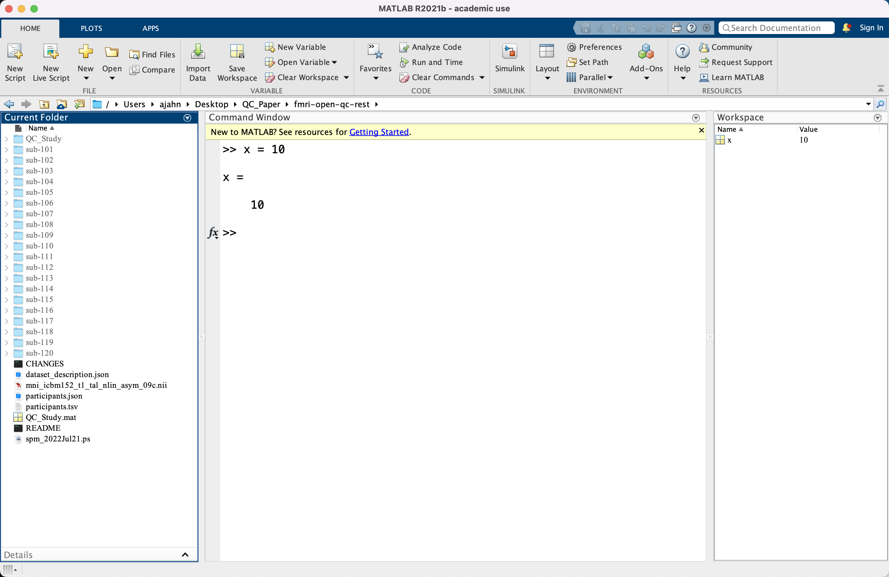
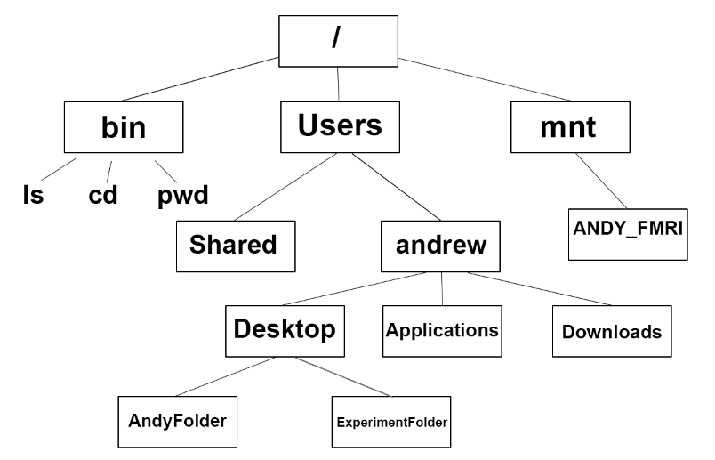
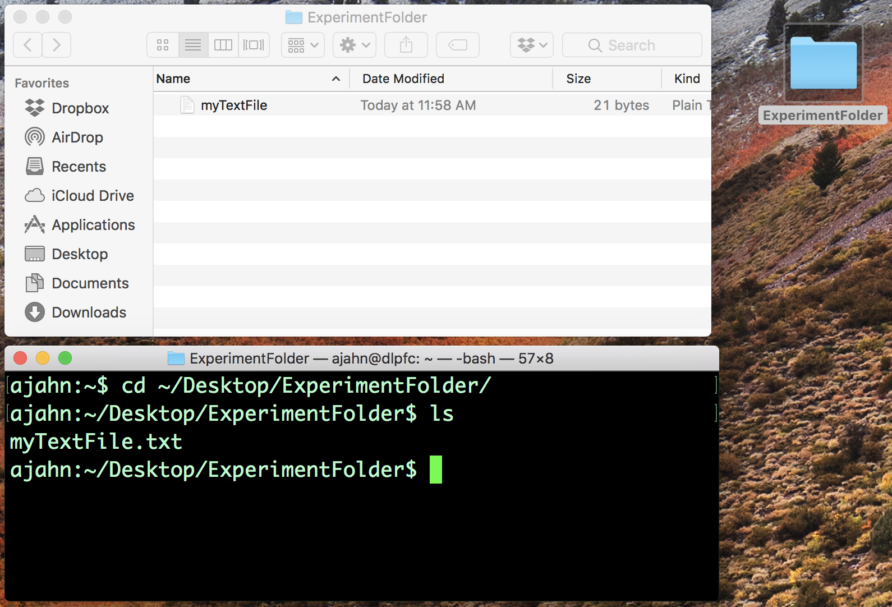
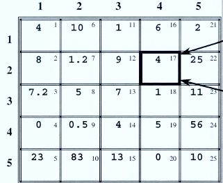

.. _Matlab_01_Navigation::

=========================================
Matlab Tutorial #1: Navigation & Matrices
=========================================

.. note::
    Topics covered: Directories, navigation, matrices, strings, integers
    
    Commands used: pwd, cd, ls

Overview of the Matlab Interface
********************************

When you first open Matlab, you will notice that it has four distinct sections: Four windows, and a ribbon of buttons at the top, similar to the layout of Microsoft Word. The window on the left is the Navigation window, the central window is the Command Window, and the upper-right window is the Workspace. The Navigation window contains a list of all the folders located within the folder you are currently in; for example, if I am in my home directory, you may see sub-folders such as Documents, Desktop, Music, and so on.

The Command Window is where you can directly type commands and see the output of those commands. As you will see below, these can be commands for navigating to different directories, listing the contents of the current directory, or creating variables that can be used in scripts. Most of what we will be doing in this tutorial requires you to use the Command Window. The Workspace window contains **variables** that you have created in your current session. The concept of variables is discussed below in the section on matrices.

Navigating with Matlab
**********************

Like other operating systems, Matlab organizes folders and files using a directory tree - also known as a directory hierarchy, or directory structure. At the top of the hierarchy is a folder called ``root``, written as a forward slash (``/``). All other folders (also known as directories) are contained within the ``root`` folder, and those folders in turn can contain other folders.

Think of the directory hierarchy as an upside-down tree: ``root`` is the base of the tree, and all of the other folders extend from it, just as branches extend from the trunk.

    Root, symbolized by a forward slash (``/``), is the highest level of the directory tree; it contains folders such as ``bin`` (which contains binaries, or commands such as pwd, cd, ls, and so on), ``mnt`` (which shows any currently mounted drives, such as external hard drives), and ``Users``. These directories in turn contain other directories - for example, ``Users`` contains the folder ``andrew``, which in turn contains the ``Desktop``, ``Applications``, and ``Downloads`` directories. This is how folders and files are organized within a directory tree.
    

To navigate around your computer, you will need to know the commands ``pwd``, ``cd``, and ``ls``. ``pwd`` stands for “print working directory”; ``cd`` stands for “change directory”; and ``ls`` stands for “list”, as in “list the contents of the current directory.” This is analogous to pointing and clicking on a folder on your Desktop, and then seeing what’s inside. Note that in these tutorials, the words “folder” and “directory” are used interchangeably.

In the Matlab environment, you can either use an **absolute path** that specifies the entire listing of directories and sub-directories to get to a specific folder, or you can use a **relative path** that either navigates to a folder or lists its contents relative to another directory. For example, assume that I have opened a new Matlab terminal, and by default I am in my home directory (usually indicated by your username). I could list the contents by typing an absolute path, which in my case would be:

::

    ls /Users/andrewjahn
  
Or, I could just type ``ls`` to list the contents of the directory I am currently in, which is a relative path. As another example, let's say I want to navigate to my Desktop directory, which is a sub-directory of my home directory. I could type an absolute path, such as:

::

    cd /Users/andrewjahn/Desktop
    
Or use a relative path:

::

    cd Desktop
    
If you are using a Linux or Macintosh operating system, note that your home directory has a **keyword** reserved for it, which is just the tilde symbol (``~``). (Windows users will probably need to use an absolute path, such as ``C:/Users/<Username>``, replacing ``<Username>`` with your username.) Since the home directory is often used as a reference point, I could replace my absolute path above with:

::

    cd ~/Desktop
    
Which would also navigate to my Desktop directory.

Two other keywords you should be familiar with are ``.`` and ``..``. They represent your current working directory and a directory one level above, respectively. For example, if I am in my Desktop folder and I wanted to return to my home folder one directory above, I could simply type:

::

    cd ..
    
This keyword in particular will be frequently used in scripts and for-loops, when you need a shorthand for change directories using relative paths.

    Navigation in Matlab is the same thing as pointing and clicking in a typical graphical user interface. For example, if you have the folder "ExperimentFolder" on my Desktop, you can point and double-click to open it. You can do the same thing by typing ``cd ~/Desktop/ExperimentFolder`` in the Terminal and then typing ``ls`` to see what's in the directory.

Introduction to Matrices
************************

In addition to being able to navigate from the command line and the ability to host software programs such as SPM12 and the CONN toolbox, Matlab allows the user to create and manipulate **matrices**. For example, we can create a matrix simply by typing:

::

    x = 1
    
Once you press enter, this will automatically print output to the terminal that says "x = 1". Note that "x" is now stored as a **variable** in the Workspace window; you can see both the name of the variable, and its value. The reason we call these objects "variables" is that they can contain any value, and can be updated in a command structure such as a **for-loop**, which will be discussed in a later chapter.

If you ever want to find out the value contained within the variable, you can simply type ``x`` at the command line and press enter, or you can look in the Workspace. For even more detailed information about the variable, you can type:

::

    whos x
    
This will display the following:

::

  Name      Size            Bytes  Class     Attributes
  x         1x1                 8  double              

For now we will ignore the last three fields, and focus on the first two. The first column, "Name", is simply the name of the variable; but notice that the second column, "Size", contains the value "1x1". Even a single value stored in a variable - in this case, the value "1" contained in the variable "x" - is labeled by Matlab as a 1x1 matrix. If we wanted to create a variable that spanned multiple dimensions, such as a 4x5 matrix, we could type something like the following:

::

    a = [4 10 1 6 2; 8 1.2 9 4 25; 7.2 5 7 1 11; 0 0.5 4 5 56; 23 83 13 0 10];

.. note::

    In this line of code, we ended it with a semicolon (``;``). This suppresses the output from being automatically printed to the terminal, while still storing the value in the variable.
    
Notice that we now have a new variable in our Workspace window called "a", which is a 4x5 matrix. If you type ``a`` in the terminal and press enter, you will see the following:

::

    4.0000   10.0000    1.0000    6.0000    2.0000
    8.0000    1.2000    9.0000    4.0000   25.0000
    7.2000    5.0000    7.0000    1.0000   11.0000
         0    0.5000    4.0000    5.0000   56.0000
   23.0000   83.0000   13.0000         0   10.0000
    
Immediately after the variable name, if you type a number or pair of numbers in parentheses, it will **index** the rows and columns of this matrix - in other words, extract certain parts of it. For example, typing ``a(1)`` will return ``4``; typing ``a(9)`` will return ``0.5``. Two-dimensional matrices have the following index structure, in which the first cell in the upper-left is indexed as 1, the cell below that is indexed as 2, and so on until the first cell of the next column, which in this case would be indexed as 6.

Instead of using a single number for indexing, we could use a pair of numbers separated by commas. The first number of the pair indexes the row of the matrix, and the second number indexes the column. For example, if we wanted to extract the value contained in the third row and fourth column of the matrix, we could type:

::

    a(3,4)
    
Which would return a value of ``1``. This indexing can be extended to three- and four-dimensional matrices, as well as higher-dimensional ones, which will not be covered here.

An entire column or row can be extracted by using a colon (``:``). For example, if we wanted to extract the second column of the matrix ``a``, we could type:

::

    a(:,2)
    
Likewise, to extract the fifth row, we could type:

::

    a(5,:)
    
You can also extract every nth element of the matrix by inserting another number in-between the first and last indices. For example,

::

    a(10:2:20)
    
Will start at the matrix index 10 and go up through index 20, increasing by intervals of 2. In this case, the matrix values contained within indices 10, 12, 14, 16, 18, and 20 will be extracted.
    
This will take some time to get used to, but with practice, you will become more fluent with how to index rows and columns.

Matrix Arithmetic
&&&&&&&&&&&&&&&&&

Matrices can also be added to and subtracted from each other, multiplied and divided by one another. For example, if we create two matrices:

::

    a = [9 8 7; 3 2 1]
    b = [1 2; 4 5 ; 7 8]
    
We can multiply them by typing ``c = a*b``. (Note that the inner dimensions must be identical; in this case, ``a`` is a 2x3 matrix, and ``b`` is a 3x2 matrix. For more information about matrix multiplication, click `here <https://www.mathworks.com/help/matlab/ref/mtimes.html>`__).

::

    a'.*b
    
Will transpose ``a`` to be a 3x2 matrix. The resulting product will also be a 3x2 matrix. You can also add or subtract matrices, as long as they have the same dimensions. Multiplying by a constant requires no special transformations, and will simply multiply each cell of the matrix by a single number:

::

    a'-b
    a'+b
    7*a

Concatenating Matrices and Strings
&&&&&&&&&&&&&&&&&&&&&&&&&&&&&&&&&&

We can juxtapose, or **concatenate**, two or more matrices by using brackets. For example,

::

    d = [a' b]
    
Which will simply place the two matrices side by side, in this case creating a new 3x4 matrix. However, we can also use brackets to concatenate both numbers and text, or **strings**. Later, we will see how this can be used with **scripting** to automate analyses. For now, create a new variable:

::

    x = 'subject-'
    y = 1
    
We could try to concatenate them into a new variable, ``z``, by using brackets:
 
 ::
 
    z = [x y]
    
You may be surprised to see that the output from this command is simply ``subject-``. It turns out that we will need both the variables ``x`` and ``y`` to be strings, which we could do by typing ``y='1'``. If we want to keep the option to use ``y`` as either an integer or a string, we can use the command ``num2str`` to convert the variable when we need to:

::

    z = [x num2str(y)]
    
Which will generate the expected output, ``subject-1``. We will revisit this in a later chapter on **scripting**, in which we will need to loop over multiple subjects and analyze them.

Video
-----

Click `here <https://www.youtube.com/watch?v=TQqJD-v6glE&list=PLIQIswOrUH69xOiblvvEz5KBwWaNRMEUp&index=2>`__ to see a video overview of the commands cd, ls, and pwd - the basic commands you will need to navigate around your directory tree. This particular video is written using a Unix terminal, but the basic navigation commands are the same between Unix and Matlab.

-------------

Exercises
---------

Open a Matlab terminal, and do the following exercises:

1.  Type ``ls ~`` and note what it returns; then type ``ls ~/Desktop``. How are the outputs different? Why?

.. In the first case we are listing the contents of the home directory; in the second case, we are using shorthand to list the contents of the Desktop. We are using relative paths instead of absolute paths.

2.  Navigate to the Desktop by typing ``cd ~/Desktop``. Type ``pwd`` and note what the path is. Then create a new directory using the ``mkdir`` command, choosing a name for the directory on your own, such as ``mkdir myFolder``. Navigate into that new directory and think about how your current path has been updated. Does that match what you see from typing ``pwd`` from your new directory? Take a screenshot of the Matlab terminal that shows the ``pwd`` command being typed from the newly created directory, and the output from that command.

3.  Define the terms ``cd``, ``ls``, and ``pwd`` in your own words.

.. This should be straightforward, given the definitions provided above.

4. Using the ``a`` matrix defined above, what would ``a(14)`` return? Make your prediction about the output before typing the code and pressing return.

5. Use the ``help`` function to find out what the keyword ``end`` does by typing ``help end`` (for our purposes, read the third paragraph of the output from the help file). Use this keyword with the ``a`` matrix defined above to print rows 2 through 5. Do the same procedure to print only the last four rows of columns 3 through 5.
