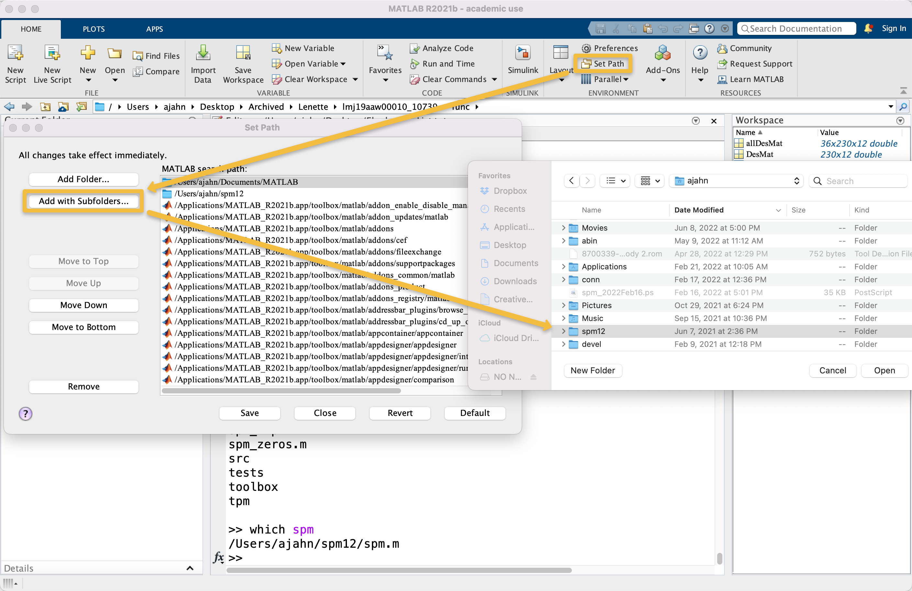
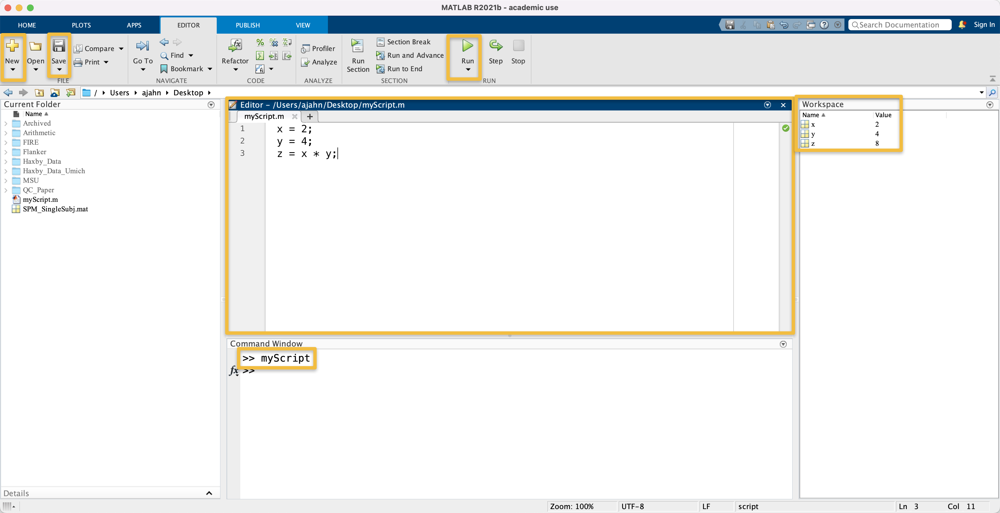
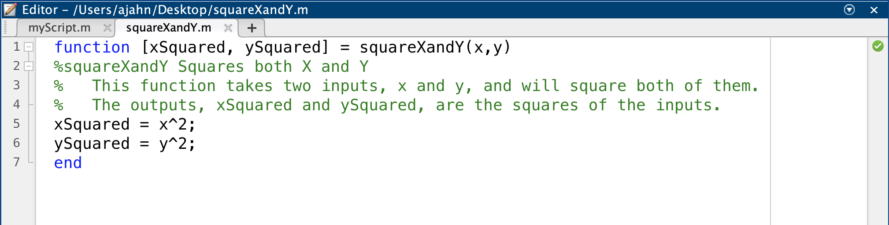

.. _Matlab_03_FunctionsPaths:

***************************************
Matlab Tutorial #3: Paths and Functions
***************************************

.. note::
  Topics covered: paths, functions, scripts
  Commands covered: addpath
  
------------

Paths
*****

Paths allow you to use Matlab commands from anywhere in the Terminal. For example, SPM, like all the other software packages, has a **library**, or directory that contains all of the functions needed to run SPM - such as spm_vol, spm_get_data, spm_spm, and so on. To run those commands, we would need to either be in that directory, or we would need to specify the absolute path to the command that we want to run. To give us the flexibility to run SPM commands anywhere, we’ll set the path variable to indicate where the SPM library is.

For example, if you have already :ref:`downloaded and installed SPM12 <SPM_fMRI_Intro>`, you can set a path to the SPM12 folder a couple of different ways. Assuming that you've downloaded the SPM12 software package into your home directory - e.g., on my computer, ``/Users/ajahn/spm12`` - you can click on the "Home" tab at the top of the Matlab window, and then click the "Set Path" button. Select the ``spm12`` directory located in your home directory, and then click "Add Folder". Click the "Save" button to ensure that the path is set every time Matlab is opened, and then close the window.

Another way to set the path is from the command line. For example, we could type the following:

::

  addpath /Users/ajahn/spm12
  
The drawback to this approach is that it would need to be typed every time you open a new instance of Matlab. Alternatively, you could modify the file ``pathdef.m``, which is located in ``/Users/$USER/Documents/Matlab``, in which case you would replace ``$USER`` with your username. This is a more advanced technique that requires entering the path as a string in the vector ``p``. Consult with a Matlab expert before attempting this option.

Functions
*********

In mathematics class, you may remember learning about **functions**: a mathematical operation that takes an **input**, or independent variable specified by the user, and generates an **output**, or dependent variable, based on the rules of the function. For example, a function such as:

::

  f(x) = x * 2
  
Will take a given input of ``x``, multiply it by ``2``, and return the product of the multiplication. If we gave it an input of ``x=2``, say, it would return a value of ``4``.

Scripts
&&&&&&&

Functions in Matlab are similar in that they also take inputs and generate outputs. However, a function in Matlab doesn't necessarily have to perform any mathematical operations; variables can be assigned, directories can be navigated, and so on. If we did want to create a mathematical function, you would first have to create a **script**. We will talk about scripts in more detail in a later chapter, but for now, think of a script as simply a collection of commands. Instead of typing the same commands repeatedly in the command line, one at a time, you could save them as a collection inside of a script. For example, if you click on the downward-pointing arrow below the ``New`` button at the top of the Matlab window and select ``Script``, you will generate a blank untitled script in a new window. You can type anything you want in this new window; e.g.:

::

  x = 2;
  y = 4;
  z = x * y;
  
You can then save the script by clicking on the ``Save`` icon and giving a new name for the script. In this case, let's call it ``myScript``. It will automatically append a ``.m`` extension, indicating that has been created in Matlab, and is designed to be run in Matlab. You can then run the script by clicking on the green ``Run`` button, or by just typing the script's name (without the .m extension) from the command line. Note that you will need to either be in the directory that contains the script, or you will need to set a path to the script if you want to run it from another directory.

  Screenshot highlighting the New and Save buttons, the Editor window, and the Run button. Also highlighted is the command ``MyScript`` that is executed from the Command Window, and the new variables of x, y, and z that are listed in the Workspace window.

Creating a Function
&&&&&&&&&&&&&&&&&&&

We will now move on to creating a function. Let's start by using a template: Click on the downward arrow below the ``New`` button, and select ``Function``. This will create a new untitled script that has the following code already generated for you:

::

  function [outputArg1,outputArg2] = untitled6(inputArg1,inputArg2)
  %UNTITLED6 Summary of this function goes here
  %   Detailed explanation goes here
  outputArg1 = inputArg1;
  outputArg2 = inputArg2;
  end
  
Matlab functions can take some time to get used to, so let's begin with a simple example by editing the variables that are given to us here. The first line of code is called the **declaration**, in which you specify the name of the function, the input to the function, and the names for the variables that will be output by the function. Note that the first word in this line is called **function**, indicating that everything which follows should be formatted as a function. The output, counterintuitively, comes first; both ``outputArg1`` and ``outputArg2`` are contained within a vector (indicated by the brackets), and are separated by a comma. Then, on the other side of the equals sign, is the name of the function, which for now is called ``untitled6`` (your default name may differ, depending on how many scripts you've edited in your Matlab session so far). Then, in parentheses, we specify the names of the input arguments, which are labeled here as ``inputArg1`` and ``inputArg2``.

Below the declaration line, we have two lines that begin with a percent sign (``%``). In Matlab scripts, this indicates a **comment**, or a line of code that is not run, but is there to tell the user what the following lines do. In a function, the commented lines just after the declaration serve as the **help manual** for the function - in other words, if someone types ``help`` followed by the name of your function, the text in the comments will be printed to the screen. The lines of code after the comments specify what operations will be performed on the input, the the last line, ``end``, is a keyword that needs to be written at the end of each function.

Imagine that we wanted to create a function that squares the values of two inputs that are provided to the function. Let's call this function ``squareXandY``. If we wanted to give it two inputs, x and y, and call the output xSquared and ySquared, we would modify the template so that it looks like this:

Note that we have changed the name of the function in the declaration, and, importantly, we have also saved the function with the same name of ``squareXandY``. The inputs are called ``x`` and ``y``, and the outputs are ``xSquared`` and ``ySquared``. In the comments section of the function, we have given a brief summary in the first comment line, and a more detailed guide in the comment lines after that. The body of the function contains two lines of code, ``xSquared = x^2`` and ``ySquared = y^2``, which are the operations performed on the input; and finally, the function is closed with the ``end`` keyword.

Make sure your function also looks like this, and then either click the green ``Go`` button, or type the name of the function in the terminal, ``squareXandY``, and press enter. You shoudl see two new variables in the Workspace window labeled xSquared and ySquared, with values of 4 and 16, respectively.

Using the ttest Function
&&&&&&&&&&&&&&&&&&&&&&&&

One of the functions that comes with Matlab's library is called ``ttest``. This is a simple function for performing either a one-sample or paired-samples t-test, and will return the p-value and confidence interval. For example, let's create two vectors, ``Cond1_Betas`` and ``Cond2_Betas``. Imagine that these correspond to beta estimates we extracted from a region of interest for two separate conditions in a paired-samples design:

  Cond1 = [0.44, 0.56, 0.31, 0.34, -0.21, 0.31, 0.7, 0.09];
  Cond2 = [0.21, 0.76, 0.03, 0.07, -0.13, -0.07, -0.03, 0.21];
  
Read the help file for the ttest command by typing ``help ttest``. Note that this function can either take a single vector and perform a one-sample t-test on it, or it can take a pair of vectors, assuming that it was a within-subjects design. First, let's run the function without specifying any of the outputs, e.g.:

::

  ttest(Cond1, Cond2)
  
The resulting output is simply ``0``, which indicates the value for the first output that should have been specified. In this case, the full range of output is ``[h, p, ci, stats]``, which, from the help file, we learn represent the following:

::

  H = ttest(X,Y) performs a paired t-test of the hypothesis that two
    matched samples, in the vectors X and Y, come from distributions with
    equal means. The difference X-Y is assumed to come from a normal
    distribution with unknown variance.  X and Y must have the same length.
    X and Y can also be matrices or N-D arrays of the same size.
 
    [H,P] = ttest(...) returns the p-value, i.e., the probability of
    observing the given result, or one more extreme, by chance if the null
    hypothesis is true.  Small values of P cast doubt on the validity of
    the null hypothesis.
 
    [H,P,CI] = ttest(...) returns a 100*(1-ALPHA)% confidence interval for
    the true mean of X, or of X-Y for a paired test.
 
    [H,P,CI,STATS] = ttest(...) returns a structure with the following fields:
       'tstat' -- the value of the test statistic
       'df'    -- the degrees of freedom of the test
       'sd'    -- the estimated population standard deviation.  For a
                  paired test, this is the std. dev. of X-Y.
                  
If we specify the function to give the full range of outputs, for example, it would look like this:

::

  [h, p, ci, stats] = ttest(Cond1, Cond2)
  
Now we get outputs not just of whether the null hypothesis was rejected or not, but statistics for the p-value, the confidence interval, and the t-statistic. Note that there are more options to use with the ttest function, which can be found in the help file. For example, we could change the alpha level with the following code:

::

  [h, p, ci, stats] = ttest(Cond1, Cond2, 'alpha', 0.1)
  
Is the null hypothesis now rejected? Why or why not?

You could also change the test to only be left-tailed, i.e., test whether the mean is less than 0:

::

  [h, p, ci, stats] = ttest(Cond1, Cond2, 'tail', 'left')

We will use the ttest function, and other functions like it, when extracting data after preprocessing and modeling fMRI data with SPM. In the meantime, do the following exercises to improve your understanding of scripts and functions.

Exercises
*********

1. Using the same Cond1 and Cond2 vectors as defined above, change the t-test to a right-tailed test (i.e., testing whether then mean is greater than 0).

2. Create a new vector ``myBetas`` and populate it with whatever values you choose. Run a one-sample t-test on the vector ``myBetas``. Report the p-value, confidence level, t-statistic, degrees of freedom, and standard deviation of the estimate. Show the contents of the ``myBetas`` vector that you used.

3. Edit the function ``squareXandY`` to create a new function called ``squareXYZ``. Give it a new input, ``z``, and a new output, ``zSquared``. Add a line of code to the body of the function to reflect this change, and update the comments to instruct the use how to use this new function. Run the function with any values for x, y, and z that you choose, and report the output. Show the script you used as well.
