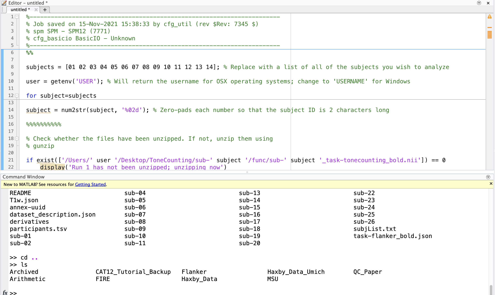

.. _Matlab_Overview:

=======================
Matlab for Neuroimagers
=======================

--------------

.. figure:: Matlab_Logo.png
    :width: 240px

What is Matlab?
***************

Matlab is a programming language that is centered around matrices. Within Matlab, you are able to use a mouse to point and click on icons to run certain commands; however, Matlab primarily uses a command line interface, or **command line** for short: Instead of pointing and clicking like you would in a Windows or Macintosh operating system, you type the commands that you want to run. 

While this may look strange and maybe even tedious, in fact using the command line will allow you to be quicker, more flexible, and more efficient when running programs and analyzing data. And as you'll see, becoming fluent in programming will save you time, minimize errors, and make you more versatile as a scientist.

The goal of this tutorial is to walk you through how to use Matlab to automate SPM analyses from the command line. SPM requires Matlab to run, although many researchers are able to use SPM with minimal coding experience. If you have already gone through the :ref:`SPM12 tutorial <SPM_Overview>` on this website, you may have already read a chapter that focused on :ref:`scripting <SPM_06_Scripting>`; this tutorial will arrive at that same point, while explaining in detail what the syntax means.

This tutorial also overlaps considerably with the :ref:`Unix tutorials <Unix_Intro>`, which are geared more towards understanding Unix within the context of using it with AFNI and FSL. Researchers with access to both Matlab and Unix will benefit from learning both languages, not only to enable them to use a wider variety of software packages, but to see the similarities and differences between two of the most popular programming languages available. 

.. note::

    Matlab is proprietary software, and price quotes can be found on the `Mathworks website <https://www.mathworks.com/store/>`__. Most universities have a an education license that can be accessed for free by both students and staff. Ask your local IT department whether this is provided at your institution. 

Video
-----

Click here to see a video introducing you to Matlab. When you have finished watching the video, click the "Next" button down below to begin the Matlab tutorial series.

Overview of the Computational Anatomy Toolbox
*********************************************

.. toctree::
   :maxdepth: 1
   :caption: Start to Finish Analysis with CAT12

   Matlab_01_Navigation
   Matlab_02_VariablesStructures
   Matlab_03_FunctionsPaths
   Matlab_04_ForLoops
   Matlab_05_IfElse
   Matlab_06_Scripting
   Matlab_07_AutomatingTheAnalysis
