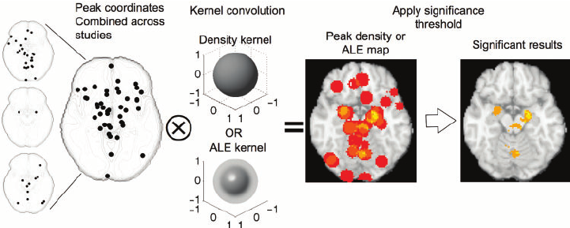
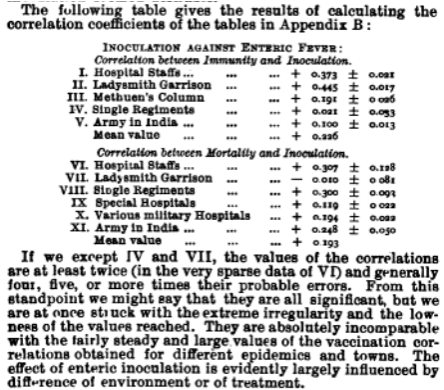
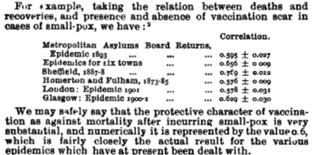

.. _MetaAnalysis_Overview:

==============================
Meta-Analysis for Neuroimagers
==============================

---------------

  Illustration of fMRI Meta-Analysis by Wager et al., 2007

Overview
********

When enough experiments have been carried out on a particular subject, one might ask whether the average result across all of the studies is a more accurate estimate than the result of any one study in itself. As this average is calculated by taking the average reported in each individual study, we call this method a **meta-analysis**: That is, an analysis of many separate analyses.

While this concept may seem obvious, it took time to develop in the fields of clinical trials and the social sciences; and the first known use of this method was done by Karl Pearson to examine the effect of inoculation on enteric fever (also called typhoid fever). Pearson first looked at the correlation between immunity and inoculation across different sites, with a positive correlation indicating a higher likelihood of developing immunity against the disease. He then reported the correlation between inoculation and mortality (i.e., survival rate), and also reported the "probable error" for each site, a measure of the variability in the measurement reported in each study:

  Reproduction of the table from the original Pearson 1904 paper, comparing across studies the effect of inoculation on enteric fever.

  Comparison table with smallpox data, considered at the time a more established and effective vaccine.

Also notable is Pearson's comment on the "extreme irregularity" of the values that were reported, and how in some cases - that is, IV and VII - the values were either low enough to be virtually zero, or were in fact negative. As these correlations were much lower than would be expected for an effective vaccine, such as the then-established smallpox vaccine, Pearson judged that other factors were possibly at play, such as the environment in which the inoculations were administered - which could mean anything from the local climate's effects on the durability of the vaccine before the advent of reliable refrigeration, to the competence of the doctors administering the vaccine - or the self-selection bias of the volunteers, which could be a confound. (For more details on the history of meta-analysis, see `this paper <https://www.ncbi.nlm.nih.gov/pmc/articles/PMC2121629/>`__ by Kevin O'Rourke, and for a more in-depth statistical overview of the Pearson paper, see `this article <https://journals.sagepub.com/doi/full/10.1177/0141076816659003>`__ by Harry Shannon.)

Over a century later, instead of a dozen or so inoculation sites, we are confronted with a mass of experiments that have been run in virtually every field of study - many thousands in the field of neuroimaging alone, with dozens or hundreds conducted on specific topics. In the following brief series of tutorials, we will learn how to use some of the most popular meta-analysis tools in order to find where there is significant overlap between different studies. You can do this without having to collect any raw imaging data of your own - all you need is access to the coordinates reported by other studies. And, since you can refine the meta-analysis to meet whichever criteria you choose, you can make it as customized as you like.

.. toctree::
   :maxdepth: 1
   :caption: Meta-Analysis Tools

   MetaAnalysis_ShortCourse/MetaAnalysis_01_GingerALE
   MetaAnalysis_ShortCourse/MetaAnalysis_02_SeedBasedDMapping
   MetaAnalysis_ShortCourse/MetaAnalysis_03_NeuroQuery
   MetaAnalysis_ShortCourse/MetaAnalysis_04_NiMARE
