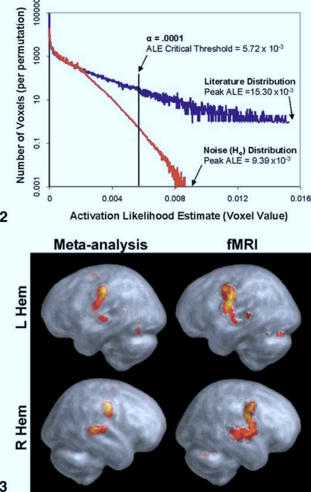

.. _MetaAnalysis_01_GingerALE:

===============================================
Activation Likelihood Estimation with GingerALE
===============================================

---------------

Overview
********

The earliest meta-analysis tool developed for neuroimaging data was a method called **Activation Likelihood Estimation**, or ALE. First demonstrated by Turkeltaub et al. in 2002, ALE estimates the likelihood of overlap between the activation of different studies (also referred to as the "concordance" between the studies) as compared to a null distribution computed over several permutations. In this way, it is similar to :ref:`how significant clusters are calculated for fMRI studies <Appendix_A_ClusterCorrection>`: The cluster reported in your study is compared to a distribution of clusters generated at random, and the cluster is deemed significant if it is larger than the largest 5% of randomly generated clusters.

  Figures 2 and 3 from Turkeltaub et al., 2002. Figure 2 illustrates an example of the Activation Likelihood Estimate derived from the meta-analysis data (blue line) compared to a random noise distribution (red line). The black line bisecting the two lines represents an alpha threshold of p=0.0001 for the null distribution, and the data distribution is compared to the null distribution at that level; in this case, all of the ALE values for the dataset were greater than the null dataset at the p=0.0001 level. Figure 3 depicts the thresholded results of the meta-analysis side-by-side with the results of a separate fMRI study to illustrate their similarities and to validate the method.

Further modifications to Turkeltaub's original ALE study led to a new meta-analysis package called `GingerALE <https://www.brainmap.org/ale/>`__. This is part of a suite of packages called BrainMap, which also includes the auxiliary programs Scribe and Sleuth; for now, however, we will just focus on GingerALE, demonstrating how to replicate the results of another meta-analysis, and then to contrast two meta-analyses to determine where there is either overlap or differences between them. And to do that, we first need to briefly review the GingerALE Interface.

The GingerALE Interface
***********************

The GingerALE package can be downloaded by clicking on `this link <https://www.brainmap.org/ale/>`__ and choosing the version matching your operating system; downloading and installing the package is straightforward, and should only take a couple of minutes. Click on the file once you have downloaded it, and then click and drag the GingerALE icon into your Applications directory, which allows you to open the package by using your Finder to search for "GingerALE". Click on the software package result that appears, which will open the GingerALE interface.

.. figure:: GingerALE_02_Interface.png

The radio button by default is set to "Single Dataset", which is what we will start with; that is, we will test whether the results of several different studies have significant overlap. The 

Replicating the Meta-Analysis of Kumar et al., 2016
***************************************************
