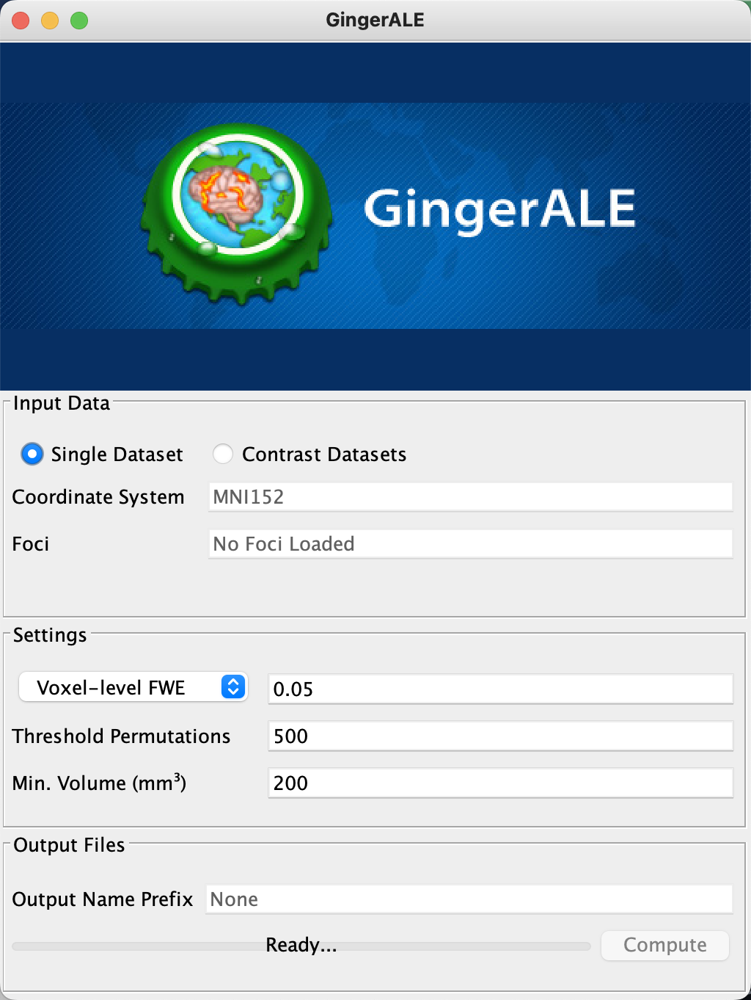
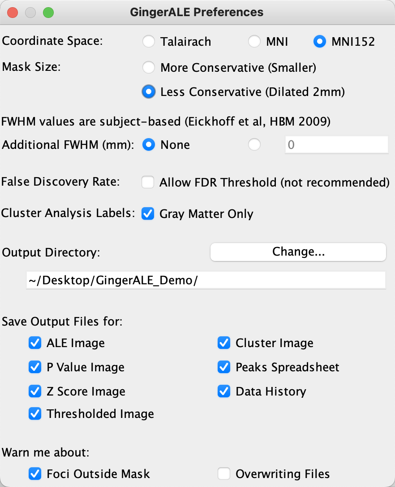
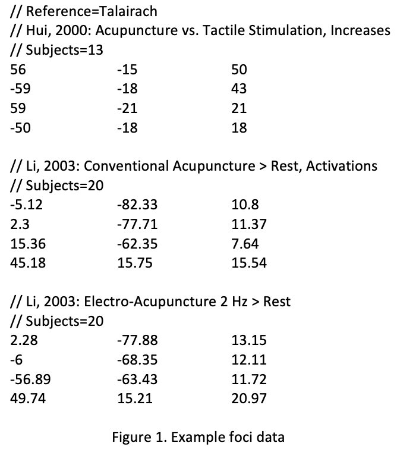
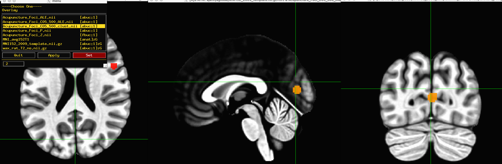

.. _MetaAnalysis_01_GingerALE:

==========================================================================
Meta-Analysis Tutorial #1: Activation Likelihood Estimation with GingerALE
==========================================================================

---------------

Overview
********

The earliest meta-analysis tool developed for neuroimaging data was a method called **Activation Likelihood Estimation**, or ALE. First demonstrated by Turkeltaub et al. in 2002, ALE estimates the likelihood of overlap between the activation of different studies (also referred to as the "concordance" between the studies) as compared to a null distribution computed over several permutations. In this way, it is similar to :ref:`how significant clusters are calculated for fMRI studies <Appendix_A_ClusterCorrection>`: The cluster reported in your study is compared to a distribution of clusters generated at random, and the cluster is deemed significant if it is larger than the largest 5% of randomly generated clusters.

.. figure:: GingerALE_01_Turkeltaub.png

  Figures 2 and 3 from Turkeltaub et al., 2002. Figure 2 illustrates an example of the Activation Likelihood Estimate derived from the meta-analysis data (blue line) compared to a random noise distribution (red line). The black line bisecting the two lines represents an alpha threshold of p=0.0001 for the null distribution, and the data distribution is compared to the null distribution at that level; in this case, all of the ALE values for the dataset were greater than the null dataset at the p=0.0001 level. Figure 3 depicts the thresholded results of the meta-analysis side-by-side with the results of a separate fMRI study to illustrate their similarities and to validate the method.

Further modifications to Turkeltaub's original ALE study led to a new meta-analysis package called `GingerALE <https://www.brainmap.org/ale/>`__. This is part of a suite of packages called BrainMap, which also includes the auxiliary programs Scribe and Sleuth; for now, however, we will just focus on GingerALE, demonstrating how to replicate the results of another meta-analysis, and then to contrast two meta-analyses to determine where there is either overlap or differences between them. And to do that, we first need to briefly review the GingerALE Interface.

The GingerALE Interface
***********************

The GingerALE package can be downloaded by clicking on `this link <https://www.brainmap.org/ale/>`__ and choosing the version matching your operating system; downloading and installing the package is straightforward, and should only take a couple of minutes. Click on the file once you have downloaded it, and then click and drag the GingerALE icon into your Applications directory, which allows you to open the package by using your Finder to search for "GingerALE". Click on the software package result that appears, which will open the GingerALE interface.

The radio button by default is set to "Single Dataset", which is what we will start with; that is, we will test whether the results of several different studies examining the same contrast have significant overlap. Not all of the studies need to use the exact same contrast, it should be noted; there will be differences in experimental design, as well as number of subjects and number of trials. But each study that is included in the meta-analysis ought to tap into the same underlying cognitive phenomenon, whether it be working memory, cognitive control, and so forth. In the Turkeltaub et al. 2002 paper discussed above, for example, they included studies which measured where reading aloud elicited higher PET signals in the brain, relative to some control condition. Here is a partial list of those controls:

* Silent Reading
* Fixation
* Rest

As you can see, there were a variety of control conditions, which entails more variability when comparing studies; but since all of the contrasts used Reading, we can combine them into a meta-analysis. It is up to you to define the criteria for which studies you will include in your meta-analysis.

You may notice that the default coordinate system listed by GingerALE is "Talairach", a template used by many neuroimaging studies in the 1990s and early 2000s, but which has been superseded by a newer template space, Montreal Neurological Institute (or MNI). To change the coordinate space to MNI, click on ``GingerALE -> Settings``, and select the radio button next to "MNI152" - a variation of the MNI template composed of an average of 152 subjects, and with slightly different dimensions than MNI.

The next field, "Mask Size", specifies whether to make the mask bigger or smaller - that is, to make the space of our analysis included more or fewer voxels. It may be the case, for example, that one of the studies included in your meta-analysis used a slightly bigger mask than usual, and that this in turn led to a peak activation being located beyond the edge of a more conservative mask used by the other studies. Later on you may find that the foci you want to use in your study fall outside the default, more conservative mask used by GingerALE, and you can change that here.

All of the other options are mostly self-explanatory, and the defaults should be left as they are. The only other option you may want to change is the "Output Directory" field, which by default points to the home directory. To better organize our results, create a new directory on your Desktop called ``GingerALE_Demo``, and then select this folder as your output directory. When you are finished, your GingerALE preferences should look like this:

Once you have closed the Preferences window, you may see your changes reflected in the main GingerALE interface; for example, the coordinate system will change from Talairach to MNI152. Passing over the ``Foci`` field for now, you will see the ``Settings`` field, with a drop-down menu showing options for different correction methods. The first one in the list, ``P Value``, is an uncorrected value applied to all of the voxels, and unless you are exploring your meta-analysis data without the intent to publish, I would not recommend using it. 

The second option, ``Voxel-level FWE``, is similar to Bonferroni correction for fMRI data; it ensures that no more than a specified fraction of ALE scores exceed a given value. Once you choose this option, you will see additional fields; the one next to ``Voxel-level FWE`` is your alpha level at each voxel, while ``Threshold Permutations`` specifies how many null datasets will be simulated to build up the null distribution. The last field, ``Min. Volume (mm3)`` will remove any remaining voxels that do not belong to a cluster as large or larger than the volume entered.

Similar to cluster-based thresholding for fMRI data, the last option, ``Cluster-level FWE``, allows you to specify the cluster-forming threshold in the field next to ``P Value`` (which should be kept at ``0.001``), and the alpha level in the field next to ``Cluster-level FWE`` for the resulting clusters (which I recommend setting to the nominal ``0.05`` value). As with the previous option of ``Voxel-level FWE``, the number of threshold permutations determines the amount of null clusters that are created in order to create a null distribution. For the purposes of this tutorial, let's stick with ``Cluster-level FWE`` as our correction method.

.. figure:: GingerALE_01_Correction.png

.. note::

  If you are testing GingerALE for the first time, you may decide to use fewer permutations, e.g., 100 or 200, to quickly create a meta-analysis map. For most published analyses, permutations of 1000 or more are commonly used (e.g., Papitto et al., 2020; Hardwick et al., 2018; Teghil et al., 2019).

Creating Foci Files
*******************

Once you have gathered a list of studies you want to include in your meta-analysis, you will also need to extract the **foci**, or peaks, for the contrasts that they reported in their paper. There are tools on the Brainmap website designed to automate this task for you, although you can extract the peaks manually if you wish. In any case, the foci need to be formatted in a particular way in order to be used with GingerALE, and a representative example can be found in the GingerALE manual:

From this sample file, we can see that it requires the following fields:

* Reference space, in which all of the coordinates have been reported. Note that if different studies report their coordinates in different spaces, you can convert them to the same space by clicking ``Tools -> Convert Foci``, selecting the file you would like to convert, and choosing the appropriate conversion - for example, Talairach to MNI.
* Listing the study name, followed by the contrast reported in that study whose coordinate you are reporting.
* Number of subjects in the study
* List of coordinates in x-y-z format for each foci reported in the study.

Note that the reference space field is listed only once at the beginning of the file, and that this field, along with the fields listing the study name and the number of subjects, are preceded by two forward slashes ("``//``"). Each triple of coordinates is listed on a separate line, while a carriage return separates each study.

Let's use this example file to run a small GingerALE meta-analysis. Either transcribe or copy and paste the values into a text file, using a program such as Macintosh's ``TextEdit``. (Be sure to remove the Rich Text Formatting by selecting ``Format -> Make Plain Text``, or else GingerALE won't be able to read the file.) Save the file into your ``GingerALE_Demo`` folder as ``Acupuncture_Foci.txt``.

.. note::

  If you do copy and paste the values from the GingerALE manual, or from one paper's table into your text file, make sure that the negative signs are formatted correctly; e.g., copying the negative signs from another paper may be represented as dashes when they are pasted into the text file. If you run into an error with GingerALE unable to interpret these signs, using TextEdit, select ``Edit -> Find -> Find and Replace``. Copy one of the dashes in the ``Find`` field, and enter a hypen (i.e., negative sign) into the ``Replace`` field, and click the ``All`` button.

Running the Analysis
********************

Now that you have the materials you need for the meta-analysis, open GingerALE and click ``File -> Open Foci``. Select the ``Acupuncture_Foci.txt`` file you created, and click ``Open``. When you see a window asking you to change the coordinate system, select ``Change to Talairach``; you may have noticed that the coordinate system specified in the foci file was Talairach, and you should use the corresponding template space for the analysis.

You will notice that the field next to ``Foci`` now displays the file you loaded, and it has detected 12 foci across 3 experiments, which you can verify by reading the foci file; the field next to ``Output Name Prefix`` has also been changed to the same name as the foci file, although you can modify it if you wish. Click the ``Compute`` button, and wait a few minutes for GingerALE to calculate the meta-analysis maps; the output of the analysis is annoted below, which is copied from the GingerALE user manual:

* ALE Image: contains the unthresholded ALE values, one computed at every voxel in the brain. The file name used to save this file will be your “Output Name Prefix” setting and the suffix “_ALE.nii”
* P Value Image: contains each voxel’s unthresholded P value. File name suffix: “_P.nii”
* Thresholded Image: ALE map threshold at a given alpha value. This is considered the final output image, and is used as the input for contrast analyses. It has a variable file name, depending on the thresholding method and value chosen. For example, when using FDR pN < 0.01, the suffix would be “_ALE_pN01.nii”. It could also be “_ALE_p001.nii” or “_ALE_FWE05.nii”, etc.
* Cluster Image: The first step in cluster analysis is identifying the contiguous non‐zero regions in the thresholded image. Each voxel in each region is given an integer value, according to which cluster it is in. The clusters are sorted by size, with #1 assigned to the largest cluster. Suffix: “_clust.nii”
* Cluster Spreadsheet: An excel document with 10 columns of information about the result’s clusters:
(1) cluster number, with the largest at #1
(2) volume of cluster in mm3
(3‐5) x,y,z values of the weighted center of mass
(6) maximum ALE value observed in the cluster
(7‐9) x,y,z values of the location of the maximum ALE value
(10) Talairach Daemon anatomical label associated with the peak coordinates
If your preferences are for a cluster analysis to contain all extrema, then columns 6‐10 will be repeated in a new row with information on each local maximum. Output suffix: “_clust.xls”
* Data History: A text file that contains all the parameters and output file names used in the analysis. It also includes any additional information about the different stages of analysis, such as the FWHM value range and the total non‐zero volume in the thresholded image. It also includes an expanded cluster analysis, with all of the information from the spreadsheet as well as cluster extent and a volumetric Talairach Label analysis. File name suffix: “_clust.txt”

When the analysis has finished, you can navigate into the directory and examine the output with any viewing software that you like; in this case, I will use AFNI. Using the MNI152_2009_template as an Underlay image, you can view any of the output images as an Overlay. The most useful one for our purposes of meta-analysis would be the file ``Acupuncture_Foci_C05_500_clust.nii``, which is the cluster-corrected image that shows where there is significant overlap between the foci of the different studies. In this case we can see two distinct clusters, one in the occipital lobe and one in the inferior frontal gyrus. For exact coordinates of the peaks of each of these clusters, you can open the spreadsheet ``Acupuncture_Foci_C05_500_peaks.xls``, which was also created in the output directory as a result of the analysis.

Replicating the Meta-Analysis of Kumar et al., 2016
***************************************************

Having used GingerALE to perform a small meta-analysis, let's expand our scope by using the coordinates reported in a paper by `Kumar et al., 2016 <https://www.jneurosci.org/content/jneuro/36/15/4170.full.pdf>`__ which were drawn from several studies examining speech production. The tasks used in these studies, which are listed in Table 1 of the paper, range from saying nouns, vowels, pseudowords, and different kinds of vowel and consonant sequences.

In fact, it is this table that we will draw all of our coordinates from, in order to replicate their meta-analysis. 
