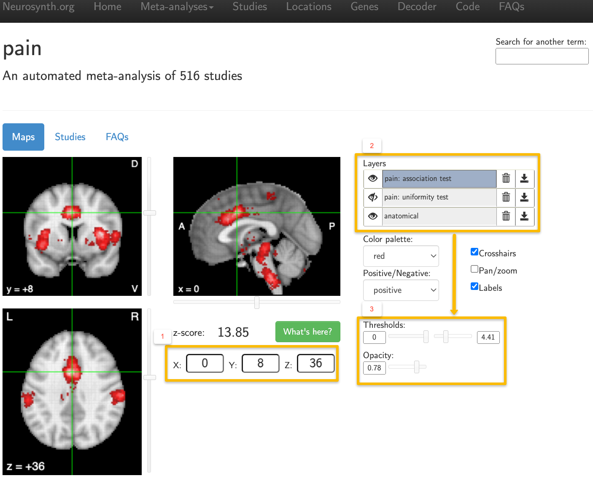

.. _MetaAnalysis_03_NeuroQuery:

===============================================================
Meta-Analysis Tutorial #3: Online Meta-Analysis with Neuroquery
===============================================================

---------------

Neurosynth: The First Web-Based Meta-Analysis Tool for Neuroimaging Data
************************************************************************

The previous chapters have showed you how to use two of the most common meta-analysis tools: GingerALE and SDM. While those packages require you to download software onto your computer and enter the coordinates from studies you have curated, you may decide that you want to conduct a quicker meta-analysis at the expense of control over the finer details of which studies are included. In that case, web-based meta-analysis programs such as Neurosynth or Neuroquery may be a better fit.

For example, although `Brainmap.org <https://brainmap.org/>`__ - the hosting site for GingerALE and Sleuth, which were covered in the previous chapters of this tutorial - is still being updated, with over 4,000 papers in its database, it is difficult to keep up with the increasing number of neuroimaging studies published every year. `Neurosynth <https://neurosynth.org/>`__, on the other hand, is able to extract data from over 14,000 studies to generate a meta-analysis in a matter of seconds. The drawbacks are that the analyses are restricted to only those papers that have a published HTML format, and that you are not able to select which particular studies are used for the meta-analysis. In other words, Neurosynth can rapidly generate results from a large volume of studies, at the expense of a loss of flexibility.

.. figure:: Neuroquery_03_NeurosynthExample.png

  Screenshot from a Neurosynth meta-analysis of the search term "working memory", extracting the coordinates reported in 1,091 studies.

If this is your first time using Neurosynth, you will probably want to click on the ``Meta-Analysis`` button at the top of the screen, and then select ``Terms``. You will see an alphabetical ordering of all of the different terms that Neurosynth has identified in the abstracts in its database, and you can use the Search box to look for any term that you want. For example, let's say that we wanted to look at studies that use the term "pain". If we search for "pain" and click on the result that appears, you will generate a map showing which voxels are most likely to be activated by studies that examine pain - in this case, voxels in the dorsal anterior cingulate and anterior insula.

Notice that these results are displayed on an MNI brain, which is in standardized space. The X-, Y-, and Z-coordinates of your crosshairs are shown below the orthogonal viewing windows, and you can manually enter coordinates as well. You can also change the color palette, whether to display either positive or negative effects, and whether you want to hide the crosshairs and the labels. Usually, you will want to leave these as they are.

The ``Layers`` panel, on the other hand, is important for interpreting the meta-analysis results that are displayed. You will see three layers: At the bottom is the anatomical layer, which is the MNI brain mentioned above. The other two layers contain the search term that you used, followed by the labels ``association test`` and ``uniformity test``. Uniformity tests are similar to the meta-analyses described in the previous chapters of this module, in that they show how consistently an effect is reported in a given voxel. Assocation tests, on the other hand, control for whether a given voxel or region is activated across a range of different terms. For example, many studies report activity within the dorsal anterior cingulate not just in response to pain, but also in response to conflict, cognitive control, surprise, and other phenomena. Consequently, the association map for a given term will display voxels that show more consistent activation for studies using that term compared to studies that do not.

The "eye" icon next to each layer can be toggled to either display or hide that layer. The default is to display both the association test and the anatomical image, while hiding the uniformity test (indicated by a slash mark on top of the eye). Layers can be removed by clicking on the Trash Can icon, or downloaded by clicking on the Download icon. These downloaded maps can then be used as masks for an ROI analysis, either as they are, or by creating a sphere around the peak of the map. Note that if you want to change the threshold or the opacity for any of the layers, you will need to first click on the layer to highlight it; any changes will then be applied to that layer.

  Example output from using the search term "Pain". The results are displayed on an MNI template, and MNI coordinates can be manually entered (1). The layers panel (2) can be toggled to display either association tests or unformity tests for a given term, or both tests at once. When a layer is highlighted, you can change its threshold and opacity (3).

Neurosynth is straightforward to use, and any further questions about the interface or how Neurosynth works can be found on their `Frequently Asked Questions page <https://neurosynth.org/faq/>`__, or in an :ref: `Appendix of this book <Appendix_E_Meta_Analysis>`. As mentioned previously, Neurosynth is a useful tool for not only generating your own meta-analysis maps, but also for quickly comparing your results to what other studies have found - or predicting where you should find significant BOLD activity before you run your experiment.

Neuroquery: Refinement of Search Terms
**************************************

For meta-analyses that test where there is probable overlap in activation across studies, both GingerALE and Neuroynth will generate Z-statistics at each voxel, and these Z-statistics in turn can be used to calculate t-tests between maps. 
