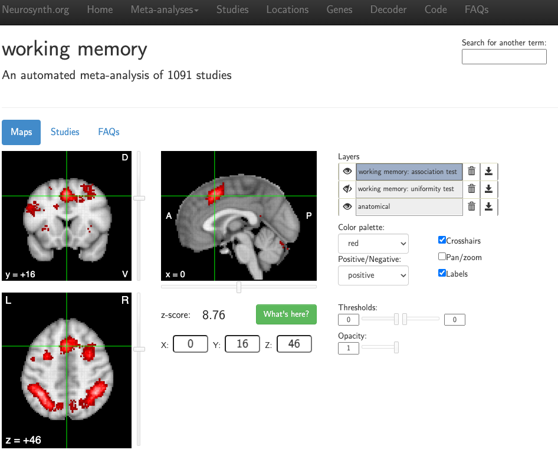

.. _MetaAnalysis_03_NeuroQuery:

===============================================================
Meta-Analysis Tutorial #3: Online Meta-Analysis with Neuroquery
===============================================================

---------------

Neurosynth: The First Web-Based Meta-Analysis Tool for Neuroimaging Data
************************************************************************

The previous chapters have showed you how to use two of the most common meta-analysis tools: GingerALE and SDM. While those packages require you to download software onto your computer and enter the coordinates from studies you have curated, you may decide that you want to conduct a quicker meta-analysis at the expense of control over the finer details of which studies are included. In that case, web-based meta-analysis programs such as Neurosynth or Neuroquery may be a better fit.

For example, although `Brainmap.org <https://brainmap.org/>`__ - the hosting site for GingerALE and Sleuth, which were covered in the previous chapters of this tutorial - is still being updated, with over 4,000 papers in its database, it is difficult to keep up with the increasing number of neuroimaging studies published every year. `Neurosynth <https://neurosynth.org/>`__, on the other hand, is able to extract data from over 14,000 studies to generate a meta-analysis in a matter of seconds. The drawbacks are that the analyses are restricted to only those papers that have a published HTML format, and that you are not able to select which particular studies are used for the meta-analysis. In other words, Neurosynth can rapidly generate results from a large volume of studies, at the expense of a loss of flexibility.

  Screenshot from a Neurosynth meta-analysis of the search term "working memory", extracting the coordinates reported in 1,091 studies.

Neurosynth is straightforward to use, and any further questions about the interface or how Neurosynth works can be found on their `Frequently Asked Questions page <https://neurosynth.org/faq/>`__, or in an :ref: `Appendix of this book <Appendix_E_Meta_Analysis>`. As mentioned previously, Neurosynth is a useful tool for not only generating your own meta-analysis maps, but also for quickly comparing your results to what other studies have found - or predicting where you should find significant BOLD activity before you run your experiment, as the case may be.

Neuroquery: Refinement of Search Terms
**************************************

For meta-analyses that test where there is probable overlap in activation across studies, both GingerALE and Neuroynth will generate interpretable Z-statistics at each voxel. 
