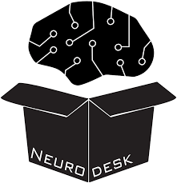
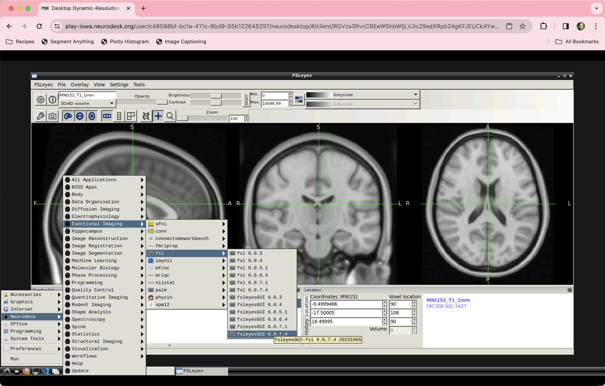

.. _Neurodesk_Overview:

=====================
Overview of Neurodesk
=====================

---------------

Overview
********

Teaching a neuroimaging workshop is tricky. If there is any boredom, any lull in the action, you are already at risk of losing your audience; but the one thing guaranteed to sink their attention is a student having problems with their software while you are giving a follow-along demonstration. Up goes a hand; then comes a voice, perplexed and slightly annoyed, while they squint at their screen with the same unprepossessing facial expression they would make while passing a log of feces the size of a foam roller: “It says there’s a problem with…” followed by any number of potential errors:

There is a path conflict between that software package and another one installed on their machine;

The student made a typo in the Unix terminal that caused a chain reaction wiping everything off their system, including their trusted homemade recipe for Metamucil;

The computer is not, technically, on.

At this point the demonstration grinds to a halt, and the audience is jarred by the stopped momentum, their minds feeling like riders on a bus that has suddenly hit the brakes to avoid hitting a man sprinting across the street trying to get to the closest restroom before having an unforgivable accident. Once the passengers understand that it may take a while to get moving again, their attention wanders off through any of the numerous gates nearby: phones, neighbors, bathroom break (turns out their facial expression meant more than one thing); and - take it from me - it is hell not only trying to gather together their attention again for another collective push, but to reset their minds into the same train of thought that you tried so hard to establish in the first place.

Why does this happen? Consider the two primary workshop setups: On the one hand, we can have everyone bring their own computer, and install all of the software on it. On the other hand, we can conduct the workshop in a computer lab, in which each computer is identical.

There are advantages and disadvantages to each. If everyone brings their own computer, they understand how to analyze the data on their machine, which they will probably be using for most of their analyses; but at the same time they run the risk of path issues, or conflicts with other software, or they simply may not have the right computer. (I’m sure you have encountered those sad souls who try installing AFNI on a Windows machine - no matter how many patches and other tricks they try, it simply doesn’t work that well.)

If the workshop is held in a computer lab instead, you get around the problems of path conflicts and any other issues with the software, since everyone is using the same machine. But then again, they probably will never use those computers once they leave the room, and when they return to the computers they usually work with, they will probably be at a loss as to how to apply what they learned to another environment. Sad!

These problems have been known for some time, but no matter how much we complained about them, nothing ever got better. That is, until the release of Neurodesk.org, a web-based neuroimaging suite. This is a website that can be accessed from anywhere, whether you are using Windows or Ubuntu, and the environment will be the same for everybody. Imagine a computer that you can access from anywhere which contains all of the neuroimaging software you could ever need, from different versions of AFNI to MRtrix to FreeSurfer, and beyond. It may not be neuroimaging nerd paradise, but it’s pretty close.

The idea is the same as a container - and Neurodesk can in fact be downloaded as one. Containers such as Docker have been around for a while now, and one of its most popular uses in the neuroimaging community is to enable fMRIPREP, a preprocessing pipeline that draws upon libraries and commands from many different software packages; putting them all into a single container segregates them from the rest of your computer, and prevents any issues with paths or different software versions. The advantage of Neurodesk is to not only provide an extensive suite of packages covering every type of neuroimaging analysis, but to allow you to use them within a web browser:

   Example screenshot of the Neurodesk environment, launched from a Google Chrome browser. The Functional Imaging section, for example, lists a dozen software packages, from the more popular AFNI, SPM, and FSL, to lesser known packages such as laynii and niistat. The most recent half dozen versions of the package are shown in the FSL menu. Loading any of these packages is quick, easy, and reliable.

The following tutorials will show you how to download and install Neurodesk, and how to use some of the examples on the website.

.. toctree::
   :maxdepth: 1
   :caption: How to Use Neurodesk

   Neurodesk_ShortCourse/Neurodesk_00_Install
