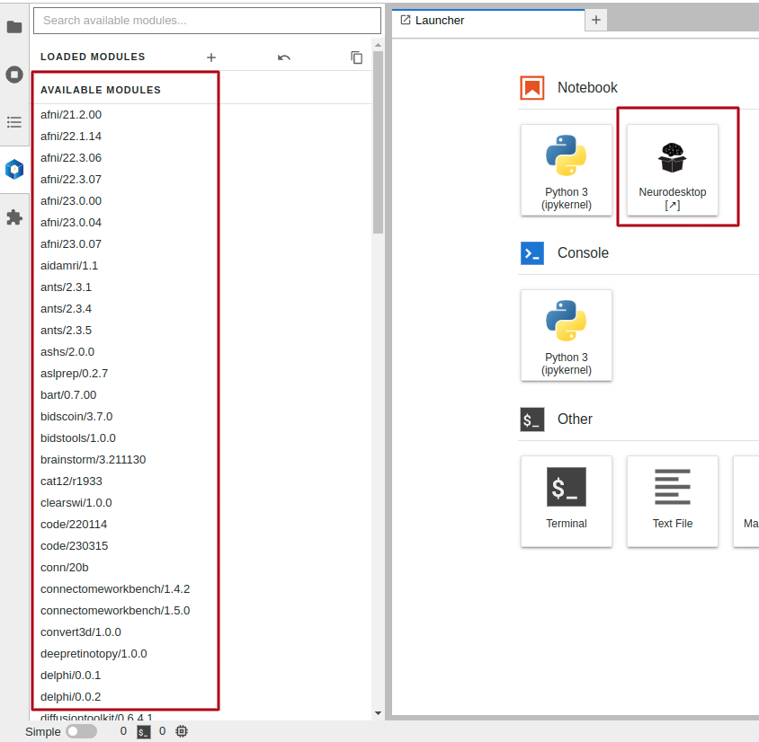
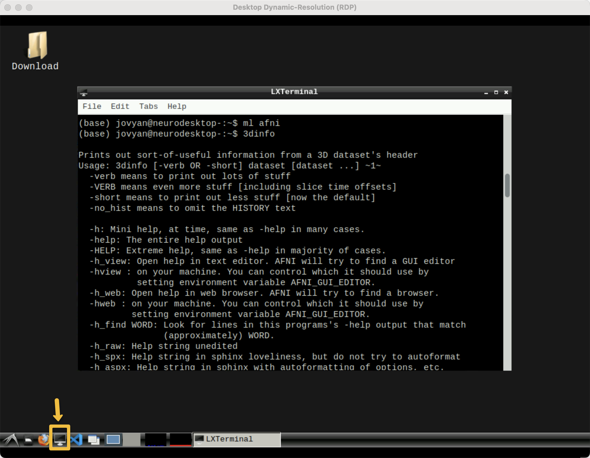

.. _Neurodesk_00_Install:

.. _AFNI_Overview:

===========================================
Neurodesk Tutorial #1: Download and Install
===========================================

---------------

Downloading the Right Version
*****************************

Neurodesk comes in two flavors: One that you can access directly from a web browser, and a downloadable version that is run as a container. The benefits of using Neurodesk within a web browser is that it is quick, easy, and doesn't require installing anything on your local machine. The downsides are that you are limited in the amount of data you can upload and the amount of memory you can use, and that your instance will be deleted after about twenty-four hours. Also, it is not as secure as analyzing data on your own machine, so you probably don't want to upload any data that is HIPAA protected or not deidentified.

That said, this chapter will focus on downloading the container version. I am using a Macintosh computer with a Silicon processor (i.e., Apple M1 Silicon chip), but you will have to download the version that is correct for your machine. Neurodesk should work regardless of what operating system or computer you are using, whether it be Macintosh, Windows, or Unix.

Docker version 4.32.0: https://docs.docker.com/desktop/release-notes/#4320
NeurodeskApp: https://www.neurodesk.org/docs/getting-started/neurodesktop/neurodeskapp/ 

.. note::

  As of this writing (October 2024), it appears that Docker versions 4.33 and above do not work with Macintosh computers with Apple Silicon chips; this may change in the future, but version 4.32.0 does work. This version will be available until January 4th, 2025.

You will need to select the version appropriate for your computer. For example, if you have a Macbook Pro with an M1 chip, you would download the "Mac with Apple chip" version of Docker, and the "macOS Apple silicon Installer" for the NeurodeskApp. Download and install both packages, and make sure Docker is running before you open NeurodeskApp.

When you open NeurodeskApp, you will see an option to "Open Local Neurodesk"; click on that option, and you will see a new Launcher window. This shows you different options for how to use Neurodesk: For example, you could open a Terminal just like you would with a Macintosh or Linux operating system, or you could open a new Jupyter notebook. All of the items in the left panel display folders you can navigate to, and different files you can open:

If you click on the Neurodesktop launcher icon, it will open a new window giving you a couple of different options; I suggest using the ``Desktop Dynamic-Resolution (RDP)`` option, since this can be resized to whatever dimensions you prefer. This opens a new **virtual desktop**, which you can use to preprocess and visualize data as though it were on your local machine. To test whether the libraries work, open a Terminal by clicking the icon in the bottom tray of the new window. Then, in the terminal that opens, type "ml afni" and "3dinfo"; you should see something like this:

Now that you've seen how Neurodesk works, you probably want to sample the other options as well. There are many libraries available which almost exhaustively cover the range of imaging analysis software that is available; you can see the full suite by clicking on the icon at the extreme lower left of the virtual desktop, and then selecting ``Neurodesk -> All Applications``. Before leaving you to explore on your own, notice that if you open a new Terminal and type ``ls``, there is a folder called ``neurodesktop-storage``. This is the portal between your local machine and Neurodesk; assuming you used the defaults when installing NeurodeskApp, there should also be a folder on your local machine in your home directory with the same name. Anything that is placed in that folder on your local machine will be accessible in the virtual desktop, and vice versa; for example, you may choose to upload the data from your local machine to the virtual desktop through this portal, analyze it in Neurodesk, and then place the analyzed data in the same folder for use on your local machine. There are other options for transferring files to and from your virtual desktop, including clicking and dragging and using a service like Dropbox, and you can choose whichever one best suits your needs.

Video
*****

For a video overview of how to download and install Neurodesk, click `here <https://www.youtube.com/watch?v=dz2RO9XuAuE>`__.
