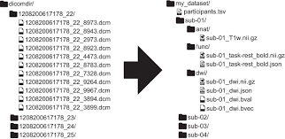

.. _BIDS_Overview:

=============
BIDS Overview
=============

-------------

.. note::

  This article was contributed by `Daniel Levitas <https://brainlife.io/team/>`__ of the brainlife.io team at the University of Texas at Austin. For transparency's sake, it should be noted that the author is the lead developer of one of the BIDS conversion tools highlighted below (`ezBIDS`).

What is BIDS?
*********************************

BIDS is an acronym that stands for the **Brain Imaging Data Structure**, a standardized format for the organization and description of neuroimaging and behavioral data. The result of converting data to BIDS is an organized dataset that can be easily shared and understood by other researchers. The rules governing the structure and description of BIDS data are stipulated by the `BIDS specification <https://bids-specification.readthedocs.io/en/stable/>__`.

   
   `Gorgolewski et al., Scientific Data 2016`

The picture above offers a visual explanation of how the BIDS conversion works. On the left side is a researcher's raw (e.g. DICOM) data, stored and labelled in some idiosyncratic manner. On the right, is the same data, but now in BIDS. There are several components of this BIDS structure to understand:

1. The `my_dataset` folder is the root-level BIDS folder, where all BIDS data is contained. The name of this folder is irrelevant and can be anything the researcher wishes.

2. Data for individual subjects are stored within subject folders (e.g. `sub-01`). This is an `entity label <https://bids-specification.readthedocs.io/en/stable/appendices/entities.html>`__ (key-value pair) that is used in folder and file names to describe their contents. Note that folders and files can have multiple entities, separated by the underscore (`_`) character.

3. Within the subject folder are sub-folders that denote the datatype of the data. For example, anatomical data are labelled as `anat`, functional as `func`, field maps as `fmap`, etc.

4. The data files themselves are stored within these datatype folders, labelled with the entity convention described in point 2. An important point to note is the inclusion of a suffix label before the file extension. Within the `anat` folder, the data file suffix is `T1w`, denoting that the data is a specific kind of anatomical acquisition.

5. File extensions denote whether we're dealing with the imaging data itself (`.nii.gz`) or corresponding metadata sidecar (`.json`). These sidecar files provide parameter information regarding the acquisition data. For example, with functional BOLD data, its sidecar would need to have a `RepetitionTime` key and value to be BIDS-compliant.

These general aspects of BIDS are necessary in order to properly convert raw imaging data to BIDS.

Benefits of BIDS
*********************************

1. Data Sharing and Reproducibility: A common issue imaging researchers encounter is accessing data from a colleague or group and having to spend unnecessary time understanding it: how the data are named and organized (may be unintuitive), finding pertinent parameter information (e.g. Repetition Time), etc. What transpires is time wasted trying to make sense of the data. Thanks to BIDS however, the hassles of data sharing are largely ameliorated. By extension, improved data sharing allows researchers to better assess and reproduce others’ experimental findings.

2. Access to BIDS-apps: Once converted to BIDS, data can be applied to software packages that take BIDS-formatted datasets as their input, referred to as `BIDS-apps <https://bids-apps.neuroimaging.io/>`__. Two commonly used apps are MRIQC (a quality control pipeline that generates metrics of your data), and fMRIPrep (a standardized pre-processing pipeline). Having access to fMRIPrep is incredibly useful, as labs (and even individuals within a single lab) typically have their own idiosyncratic pre-processing pipelines, which can influence findings in subsequent analyses, and create confusion for others when attempting to re-process the data. By having a standardized pipeline such as fMRIPrep, which incorporates different software packages (such as FSL, AFNI, ANTs, FreeSurfer, and nipype), datasets across labs/institutions can be pre-processed in a highly reproducible and transparent manner.

3. Share your own BIDS-app(s): It is not uncommon for researchers to develop a novel analysis tool or technique that languishes on their Github or some other repository, unable to gain exposure in the neuroimaging community. As BIDS becomes increasingly popular, dataset organization and pre-processing is becoming increasingly standardized, which can be used by various BIDS-apps. By developing a tool that accepts BIDS-formatted data, you have created a BIDS-app that is potentially applicable to a broad range of researchers.

How do I convert my data to BIDS?
*********************************

The process of converting data to BIDS can be time-consuming. Fortunately, software tools known as BIDS converters have been developed to assist researchers in this process, rather than forcing them to do so manually. A non-exhaustive list of BIDS converters can be found `here <https://bids.neuroimaging.io/benefits>`__.

For the sake of brevity, this overview highlights four conversion tools, due to their popularity and range of features. These are:

1. `HeuDiConv <https://github.com/nipy/heudiconv>`__

2. `Dcm2Bids <https://github.com/UNFmontreal/Dcm2Bids>`__
   
3. `BIDScoin <https://github.com/Donders-Institute/bidscoin>`__

4. `ezBIDS <https://github.com/brainlife/ezbids>`__

BIDS converters (`HeuDiConv` & `Dcm2Bids`)
********************************************

`HeuDiConv` and `Dcm2Bids` represent two of the earliest and most popular BIDS conversion tools available. This is largely due to their flexibility in enabling users to specify the mapping between their imaging data and resulting BIDS output.
For `HeuDiConv`, users are expected to create custom code in the Python language that specifies the mapping. `HeuDiConv` then takes this user-specified mapping and converts the input data to a BIDS-compliant dataset.
`Dcm2Bids` performs a similar process, except that in lieu of users generating custom Python code, the expectation is that users provide a JSON-formatted configuration file that specifies the mapping. 
These packages are well-suited for tech-savvy, BIDS-knowledgeable researchers, who may incorporate them into [semi]-automated conversion and processing/analysis pipelines.
A potential limitation is that they require users to have a good understanding of the BIDS specification and decent coding skills.

BIDS converters (`BIDScoin` & `ezBIDS`)
****************************************

These packages are a bit newer to the game, representing attempts to lower the barrier of entry to BIDS. This is primarily done through the use of a GUI (`BIDScoin`) and a web-based approach (`ezBIDS`).
Additionally, both limit the amount of coding needed (if any) by users, and make educated guesses regarding the identity of data to suggest the appropriate BIDS information and subsequent structure.
These packages are more geared to researchers who are less familiar with BIDS or do not wish to have to learn the syntax and structure of a new software tool.

Resources
**********

This section provides helpful links for each of the BIDS conversion tools discussed above.

1. `HeuDiConv`

   - `GitHub repository <https://github.com/nipy/heudiconv>`__

   - `Documentation <https://heudiconv.readthedocs.io/en/latest/>`__

   - `Tutorial <https://heudiconv.readthedocs.io/en/latest/tutorials.html>`__

   - `Citation <https://zenodo.org/records/8364586>`__

2. `Dcm2Bids`

   - `GitHub repository <https://github.com/UNFmontreal/Dcm2Bids>`__
  
   - `Documentation <https://unfmontreal.github.io/Dcm2Bids/3.1.1/>`__

   - `Tutorial <https://unfmontreal.github.io/Dcm2Bids/3.1.1/tutorial/>`__

   - `Citation <https://zenodo.org/records/8436509>`__

3. `BIDScoin`

   - `GitHub repository <https://github.com/Donders-Institute/bidscoin>`__

   - `Documentation <https://bidscoin.readthedocs.io/en/stable/>`__

   - `Tutorial <https://bidscoin.readthedocs.io/en/stable/tutorial.html>`__

   - `Citation <https://www.frontiersin.org/articles/10.3389/fninf.2021.770608/full?ref=https://githubhelp.com>`__

4. `ezBIDS`

   - `GitHub repository <https://github.com/brainlife/ezbids>`__

   - `Documentation <https://brainlife.io/docs/using_ezBIDS/>`__

   - `Tutorial <https://brainlife.io/docs/tutorial/ezBIDS/>`__

   - `Citation <https://www.nature.com/articles/s41597-024-02959-0>`__

Conclusion
**************

The purpose of this article was to provide an overview and the benefits of BIDS, as well as highlighting specific conversion tools that can aid researchers interested in describing their data according to BIDS. 
As alluded to earlier, this piece merely focuses on a select few tools, there are many others, listed `here <https://bids.neuroimaging.io/benefits>`__.
Lastly, the article perscribes no single tool as the be-all end-all for BIDS conversion. Each has their pros and cons, it is up to you the researcher to decide which tool best serves your interests.

Next Steps
**********

1. Select a tool of your choosing to convert your data to BIDS. 

2. Once you have converted data BIDS, you are ready to begin using BIDS apps, such as MRIQC and fMRIPrep. To see how to use MRIQC, click the ``Next`` button.
