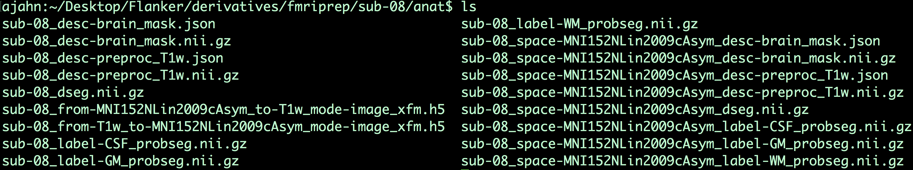
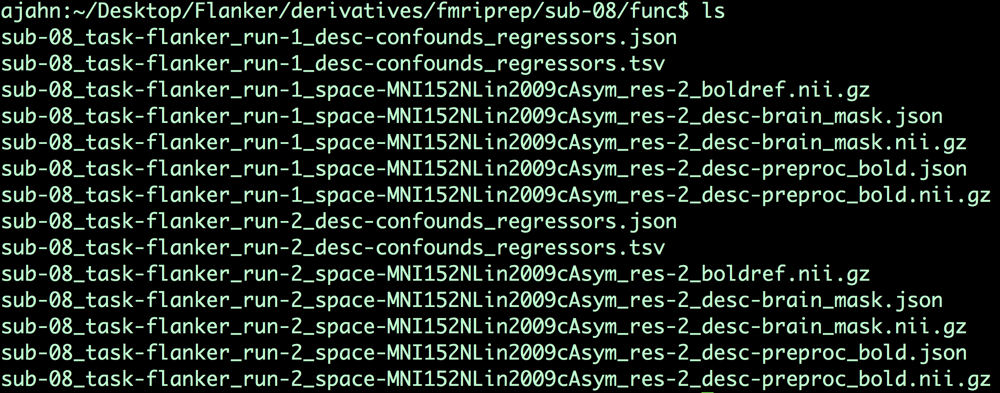
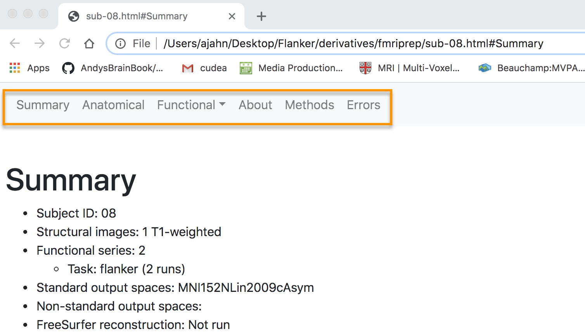
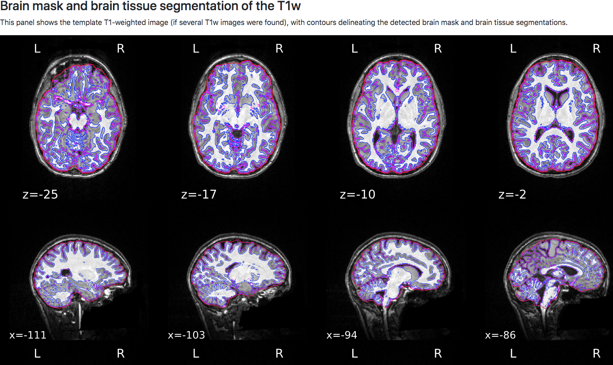

.. _fMRIPrep_Demo_3_ExaminingPreprocData:

fMRIPrep Tutorial #3: Examining the Preprocessed Data
=====================================================

---------

.. note::

  This section is still under construction; please check back soon!

Overview
********

When fMRIPrep has finished, the output will be located in the sub-directory ``derivatives/fmriprep``. Within that directory, we see the folder ``sub-08``; this contains all of the preprocessed functional and anatomical data, including intermediate files that were created in order to generate the final product, as well as ".json" files that contain header information for each of their corresponding images.

Within the ``anat`` directory, for example, we find the following files:

The files that contain the string ``MNI152NLin2009cAsym`` are anatomical images that have been normalized to that template, while those files without that string are in native space (i.e., they are not normalized). For example, the file ``sub-08_space-MNI152NLin2009cAsym_label-CSF_probseg.nii.gz`` is the CSF probabilistic segmentation in normalized space, while the anatomical image that has been preprocessed and normalized is the file ``sub-08_space-MNI152NLin2009cAsym_desc-preproc_T1w.nii.gz``. Many of these files are intermediate images used to improve the normalization process, as well as for extracting the time-courses of tissue types as confound regressors.

Moving on to the ``func`` directory, we have the following:

You will see two distinct blocks of files, one for each run. The first block contains a list of confound regressors, such as time-courses from the white matter and cerebrospinal fluid, and the motion parameters and their derivatives in the x-, y-, and z-directions. (For a review of motion parameters, see :ref:`this chapter <04_AFNI_Alignment>`.) The file ``sub-08_task-flanker_run-1_space-MNI152NLin2009cAsym_res-2_boldref.nii.gz`` is the reference image used for registration and normalization, while the file ``sub-08_task-flanker_run-1_space-MNI152NLin2009cAsym_res-2_desc-brain_mask.nii.gz`` is the estimated brain mask for that run, and the file ``sub-08_task-flanker_run-1_space-MNI152NLin2009cAsym_res-2_desc-preproc_bold.nii.gz`` is the preprocessed functional data, up through normalization. Similar files are generated for the other runs in your dataset.

All of these output files will be used in the HTML summary, which we now turn to.

.. note::

  Much of the QA analysis can be found `here <https://fmriprep.org/en/stable/outputs.html>`__ on the fMRIPrep ReadTheDocs webpage. The following recapitulates most of what is on that site, applied to the current dataset.

The HTML Output
***************

fMRIPrep summarizes all of the preprocessing output in a single HTML file called ``sub-08.html``. You can open this by using finder and double-clicking on the file, or navigating to the directory with your terminal and typing ``open sub-08.html``.

The layout of the webpage is organized into the following sections: Summary, Anatomical, Functional, About, Methods, and Errors, with corresponding links at the top of the page. The first section, "Summary", contains details about the number of structural and fucntional images, the template that was used for normalization, and whether FreeSurfer was run. These should match the options you specified in the fmriprep.sh script that we ran in the previous chapter

Although the output of fMRIPrep in the terminal should note whether there were any errors during preprocessing, it's worth checking the Error tab first to see whether there is anything that you need to address.

Anatomical QA
^^^^^^^^^^^^^

The next section contains anatomical QA checks, with the first figure showing the anatomical image in sagittal, axial, and coronal views. The estimated brain mask is outlined in red, the grey matter boundary is outlined in magenta, and the white matter boundary is outlined in blue. These boundaries will be used for component extraction, which is discussed in more detail below.

Normalization of the anatomical image to the template - in this case, the MNI152NLin2009cAsym template - is shown in a back-and-forth GIF. Make sure to check the alignment not only between the outlines of the brain, but also the internal structures such as the ventricles:

.. figure:: 03_AnatomicalQA.gif

Functional QA
^^^^^^^^^^^^^

We now move on to the functional QA, which uses a GIF to show the alignment between the functional and anatomical images. As with the normalization QA check, make sure that the internal structures are well aligned, remembering that lighter voxels in the functional images represent fluid, and vice versa in the anatomical image:

.. figure:: 03_Functional_Alignment.gif

This will open a webpage with the output from each preprocessing step. Some of the outputs, such as normalization, will show you "before" and "after" images if you hover your mouse cursor over the image.

