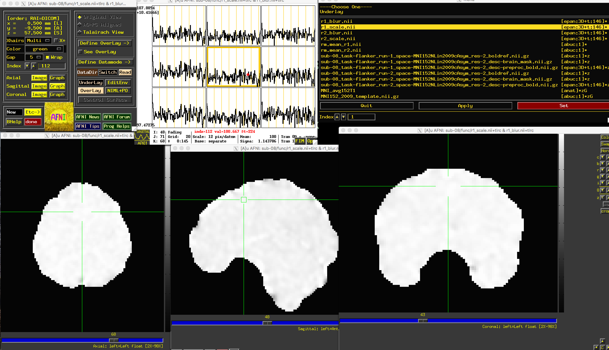

.. _fMRIPrep_Demo_4_AdditionalPreproc:

====================================================
fMRIPrep Tutorial #4: Additional Preprocessing Steps
====================================================

---------

Overview
********

Although fMRIPrep runs your data through a standard preprocessing pipeline, it leaves out certain steps. For example, you may remember from the fMRI tutorials that **smoothing** was one of the preprocessing steps - often, one of the last ones.

Smoothing has been omitted by design; the fMRIPrep developers don't make assumptions about how you will analyze your data in your 1st-level analysis, and smoothing is an important determiner of how that will be done. For example, some MVPA studies don't do any smoothing, in order to keep the patterns of activation of nearby voxels as distinct as possible, which in turn leads to better classification. Even for fMRI studies, the amount of smoothing is a matter of taste, and experiments that are focused on larger cortical areas will probably use larger smoothing kernels.

In order to make a valid comparison with the **sub-08** data that we analyzed in the AFNI tutorial, we will run two final preprocessing steps: :ref:`smoothing 05_AFNI_Smoothing>` and :ref:`scaling <06_AFNI_Masking_Scaling>`.

Smoothing
*********

In the AFNI tutorial, we used a smoothing kernel of 4mm on the functional data, applied with the command ``3dmerge``. First, navigate to the directory ``Flanker/derivatives/fmriprep/sub-08/func``. We will run the following code to apply the smoothing kernel:

::

  for run in 1 2; do
    3dmerge -1blur_fwhm 4.0 -doall -prefix r${run}_blur.nii \
            sub-08_task-flanker_run-${run}_space-MNI152NLin2009cAsym_res-2_desc-preproc_bold.nii.gz
  done

.. note::

  Smoothing in FSL can be done with the command ``fslmaths``; for example, fslmaths <input image> -s <smoothing sigma> <output image>. Note that the input for ``-s`` is sigma, not the full-width half-maximum; for a 5mm FWHM, for example, you would use a sigma of 2.12.

  Also in FSL, since registration was not run through FEAT and therefore there is not ``reg`` directory, you will need to create a dummy registration directory to trick FSL into thinking that registration has been performed. (For some reason, higher-level analyses will not run unless there is a ``reg`` directory in each subject's main directory.) To do this, run the following steps, which is taken from `this message board thread <https://www.jiscmail.ac.uk/cgi-bin/webadmin?A2=fsl;a779b3b8.1408>`__:

  - run one subject through a normal FEAT analysis (first level)
  - in the "reg" subdirectory that it produces:
  - replace all the *.mat files with a copy of $FSLDIR/etc/flirtsch/ident.mat (do not delete these files or change their name)
  - delete all the *warp* files
  - run updatefeatreg in the feat directory
  - The resulting "reg" subdirectory can then be copied into your first level analysis directories and this will allow you to use your data in MNI space (without it being changed/resampled).

  In my case, I copied the ident.mat file to my reg directory, and then ran commands such as ``cat indent.mat > example_fun2highres.mat`` to overwrite the contents of each .mat file. When you run your second-level analysis, it may look as though the registration is off in the figures, but assuming that the original registration worked well through fMRIPREP, it should be fine. As always, check the output once it has finished.

Scaling
*******

We will also have to :ref:`scale <06_AFNI_Masking_Scaling>` the data to ensure that the mean BOLD signal across the run is 100, so that any deflections can be expressed in percent signal change. We will also use each run's corresponding mask that was generated by fMRIPrep:

::

  for run in 1 2; do
    3dTstat -prefix rm.mean_r${run}.nii r${run}_blur.nii
    3dcalc -a r${run}_blur.nii -b rm.mean_r${run}.nii \
           -c sub-08_task-flanker_run-${run}_space-MNI152NLin2009cAsym_res-2_desc-brain_mask.nii.gz                            \
           -expr 'c * min(200, a/b*100)*step(a)*step(b)'       \
           -prefix r${run}_scale.nii
  done
  rm rm*
  
If you open the scaled images in the AFNI viewer, you should see something like this:

Since two separate masks have been created, you may want to combine them to use as a mask for your 1st-level analysis. Taking the **union** of the masks will incorporate voxels in *either* mask, while an **intersection** will only keep those voxels that are common to *both* masks. In this case, we will take the union of the masks, which will be slightly more generous:

::

  3dmask_tool -inputs *mask.nii.gz -union -prefix full_mask.nii
  

Next Steps
**********

With all of the files we have generated - preprocessed, smoothed, and scaled - we will need to run a **first-level analysis**, using any software package we want. To see how to do this in AFNI, click the ``Next`` button.

Video
*****

A walkthrough of the additional preprocessing steps can be found `here <https://www.youtube.com/watch?v=lA9ZUefF3Po>`__.
