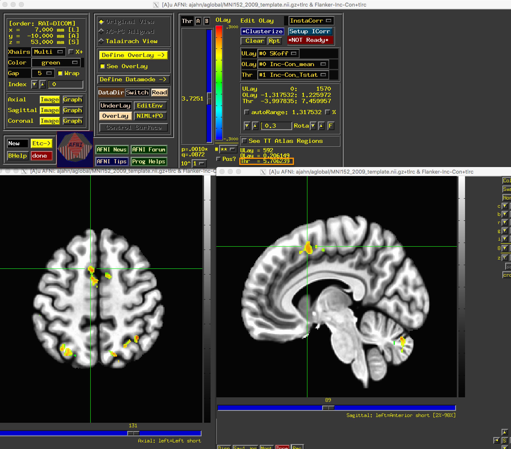
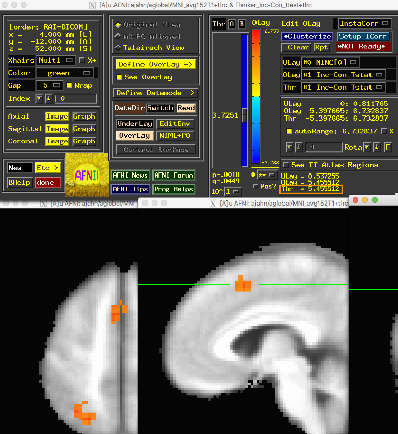

.. _fMRIPrep_Demo_6_GroupAnalysis:

====================================
fMRIPrep Tutorial #6: Group Analysis
====================================

---------

Overview
********

Our group-level analysis requires that we preprocess all of the individual subjects and run 1st-level analyses for each of them. To do that, we will put our preprocessing and 1st-level analysis code in a for-loop.

Modifying the fmriprep.sh Script
********************************

Previously, we used the ``fmriprep.sh`` script that had a hard-coded subject number. To put this code into a for-loop, we will need to include this line of code just below the first line:

::

  subject=$1
  
And modify the "subj" line to the following:

::

  subj=$subject
  
You can make the changes yourself if you like, and save the file as ``fmriprep_Scripted.sh``; otherwise, you can download the script for `here <https://github.com/andrewjahn/OpenScience_Scripts/blob/master/fmriprep_Scripted.sh>`__. Also make sure to download the script `doDecon.sh <https://github.com/andrewjahn/OpenScience_Scripts/blob/master/doDecon.sh>`__ to your Flanker directory.
  
Running the for-loop
********************

To create our for-loop, we will simply combine all of the code we ran in the previous chapters, making sure that they are in the correct order. Assuming that you already ran the script "make_Timings.sh", you should already have a file in your Flanker directory called ``subjList.txt``, which contains a list of all the subjects in your study. 

The combined code will look like this:

::

    for i in `cat subjList.txt`; do
      cd code;
      bash fmriprep_Scripted.sh $i;
      cd ../derivatives/fmriprep/${i}/func
      for run in 1 2; do
        3dmerge -1blur_fwhm 4.0 -doall -prefix r${run}_blur.nii \
            ${i}_task-flanker_run-${run}_space-MNI152NLin2009cAsym_res-2_desc-preproc_bold.nii.gz;
        done
      for run in 1 2; do
        3dTstat -prefix rm.mean_r${run}.nii r${run}_blur.nii;
        3dcalc -a r${run}_blur.nii -b rm.mean_r${run}.nii \
           -c ${i}_task-flanker_run-${run}_space-MNI152NLin2009cAsym_res-2_desc-brain_mask.nii.gz                            \
           -expr 'c * min(200, a/b*100)*step(a)*step(b)'       \
           -prefix r${run}_scale.nii;
        done
        rm rm*;
        3dmask_tool -inputs *mask.nii.gz -union -prefix full_mask.nii
      mkdir stimuli;
      cp ../../../../${i}/func/*.1D stimuli;
      cp ../../../../doDecon.sh .;
      for reg in trans_x trans_y trans_z rot_x rot_y rot_z; do
        for run in 1 2; do
         awk -v col=$reg 'NR==1{for(i=1;i<=NF;i++){if($i==col){c=i;break}} print $c} NR>1{print $c}' ${i}_task-flanker_run-${run}_desc-confounds_regressors.tsv > ${reg}_run${run}_all_tmp.txt;
         sed '1d' ${reg}_run${run}_all_tmp.txt > ${reg}_run${run}_noHead_tmp.txt
         sed '1!d' ${reg}_run${run}_all_tmp.txt > ${reg}_run${run}_Head_tmp.txt
        done
      done
      NT=`3dinfo -nt r1_scale.nii`
      if [ -f zeros_tmp.txt ]; then rm zeros_tmp.txt; fi
      for ((j=0; j<$NT; j++)); do echo 0 >> zeros_tmp.txt; done
      for reg in trans_x trans_y trans_z rot_x rot_y rot_z; do
        for run in 1 2; do
          if [ $run -eq 1 ]; then
            cat ${reg}_run${run}_noHead_tmp.txt > ${reg}_run${run}.txt
          else
            cat zeros_tmp.txt ${reg}_run${run}_noHead_tmp.txt > ${reg}_run${run}.txt
          fi
        done
      done
      rm *tmp*
      tcsh doDecon.sh $i
      cd ../../../..
    done
  
Each block of this code is discussed in the previous chapters; the only difference is that we now use variables for input where appropriate. You can either copy and paste this code into the Terminal while in the Flanker directory, or download `this script <https://github.com/andrewjahn/OpenScience_Scripts/blob/master/script_fMRIPrep_Analysis.sh>`__ from Andy's GitHub page (again, making sure to run it from the Flanker directory). This will take a long time to run - maybe a few days, depending on the speed of your computer.

Running the Group Analysis
**************************

When the script has finished, do the same quality assurance checks that we covered in the previous chapters. If everything looks OK, then we are ready to do a group-level analysis using the same approach as in the :ref:`AFNI tutorial <AFNI_07_GroupAnalysis>`. The code will look like this:

::

  #!/bin/tcsh -xef

  set dirA = derivatives/fmriprep

  # specify and possibly create results directory
  set results_dir = test.results
  if ( ! -d $results_dir ) mkdir $results_dir

  # ------------------------- process the data -------------------------

  3dttest++ -prefix $results_dir/Flanker-Inc-Con                     \
            -setA Inc-Con                                            \
               01 "$dirA/sub-01/func/stats.sub-01+tlrc[7]" \
               02 "$dirA/sub-02/func/stats.sub-02+tlrc[7]" \
               03 "$dirA/sub-03/func/stats.sub-03+tlrc[7]" \
               04 "$dirA/sub-04/func/stats.sub-04+tlrc[7]" \
               05 "$dirA/sub-05/func/stats.sub-05+tlrc[7]" \
               06 "$dirA/sub-06/func/stats.sub-06+tlrc[7]" \
               07 "$dirA/sub-07/func/stats.sub-07+tlrc[7]" \
               08 "$dirA/sub-08/func/stats.sub-08+tlrc[7]" \
               09 "$dirA/sub-09/func/stats.sub-09+tlrc[7]" \
               10 "$dirA/sub-10/func/stats.sub-10+tlrc[7]" \
               11 "$dirA/sub-11/func/stats.sub-11+tlrc[7]" \
               12 "$dirA/sub-12/func/stats.sub-12+tlrc[7]" \
               13 "$dirA/sub-13/func/stats.sub-13+tlrc[7]" \
               14 "$dirA/sub-14/func/stats.sub-14+tlrc[7]" \
               15 "$dirA/sub-15/func/stats.sub-15+tlrc[7]" \
               16 "$dirA/sub-16/func/stats.sub-16+tlrc[7]" \
               17 "$dirA/sub-17/func/stats.sub-17+tlrc[7]" \
               18 "$dirA/sub-18/func/stats.sub-18+tlrc[7]" \
               19 "$dirA/sub-19/func/stats.sub-19+tlrc[7]" \
               20 "$dirA/sub-20/func/stats.sub-20+tlrc[7]" \
               21 "$dirA/sub-21/func/stats.sub-21+tlrc[7]" \
               22 "$dirA/sub-22/func/stats.sub-22+tlrc[7]" \
               23 "$dirA/sub-23/func/stats.sub-23+tlrc[7]" \
               24 "$dirA/sub-24/func/stats.sub-24+tlrc[7]" \
               25 "$dirA/sub-25/func/stats.sub-25+tlrc[7]" \
               26 "$dirA/sub-26/func/stats.sub-26+tlrc[7]"
               
As explained in the AFNI group analysis chapter, this code will run a one-sample t-test on the Inc-Con beta weights from each subject's stats file. The output will be placed in the folder ``test.results``, and you can examine them in the AFNI viewer:

Compared to the results from AFNI, the cluster appears to be slightly larger, and with a higher peak:

As you can see, the basic pattern of the results did not change, but the results did appear to get slightly stronger.

Next Steps
**********

Now that we have seen how fMRIPrep can improve our results, we can take a closer look at some of the advanced options, which we will cover in the next chapter.

Video
*****

For a video demonstration of scripting and group analysis, click `here`.
