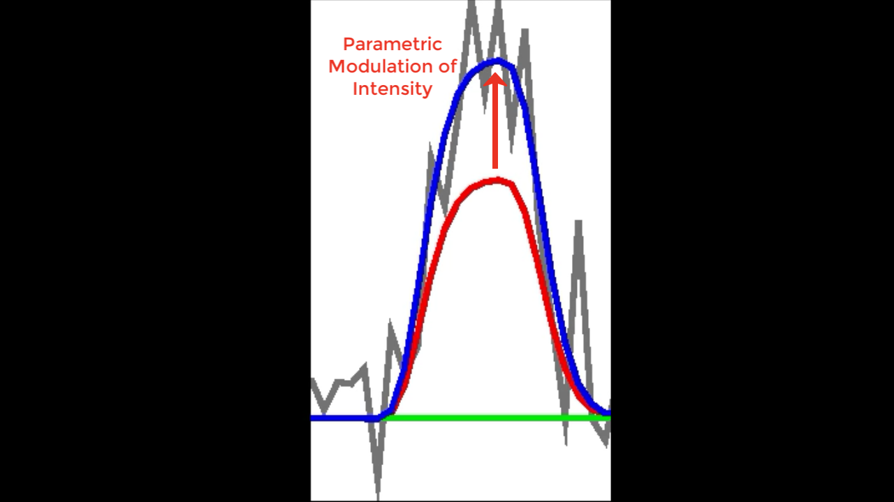
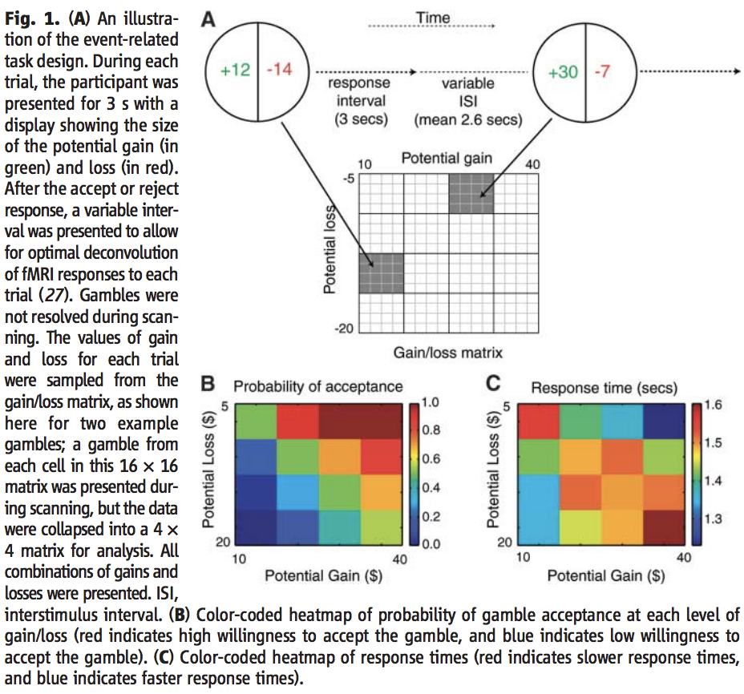
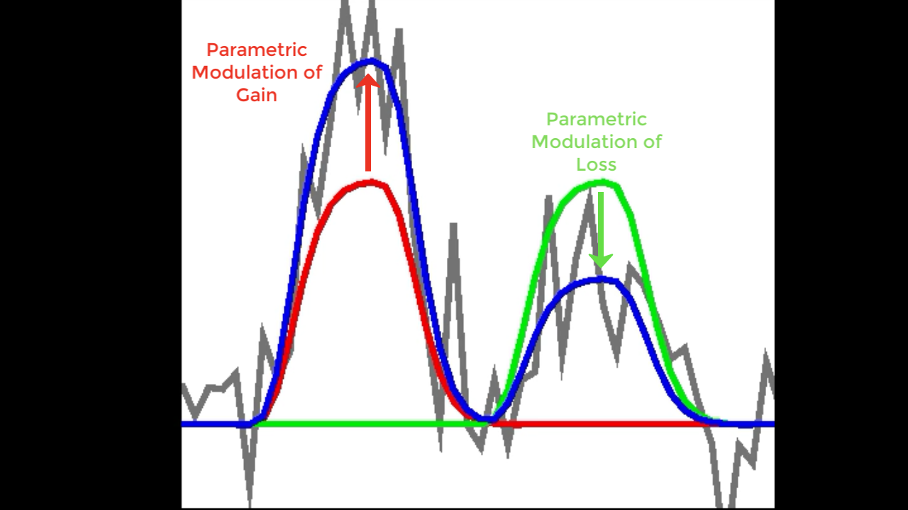
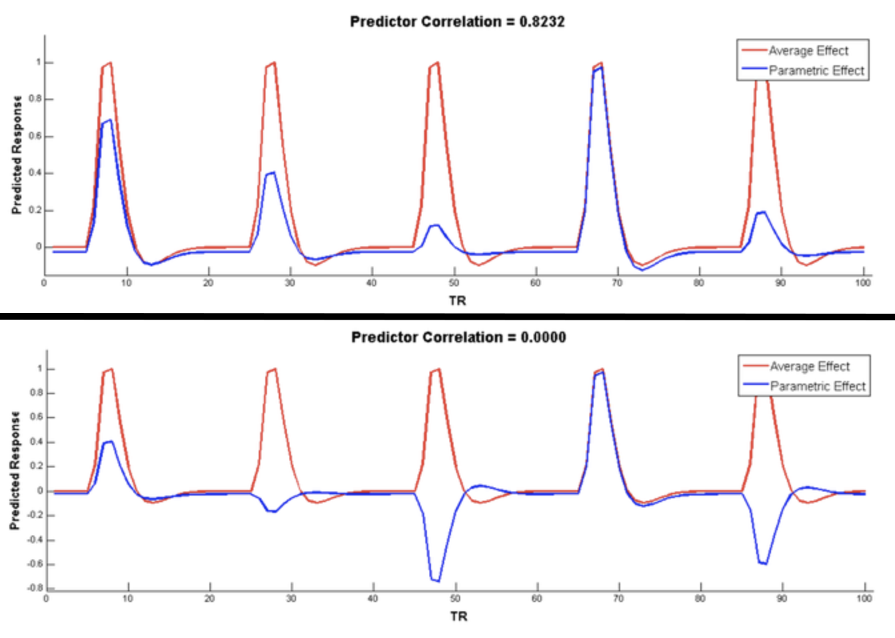

.. _PM_Overview:

Parametric Modulation in SPM, FSL, and AFNI
===========================================

Overview
********

If you have completed the previous tutorials on SPM, FSL, or AFNI, you are able to create general linear models (GLMs) for an fMRI task study. You may have noticed that a single parameter estimate was calculated for each regressor in your model; these parameter estimates were then calculated for each voxel for each subject, and then used for a group-level analysis to determine where there were significant differences between parameter estimates.

While many experiments use this approach, there are other scenarios in which we examine not just the BOLD response to the condition itself, but the BOLD response to different aspects of the stimulus. For example, assume that we have a condition in which a light is shown for a few seconds, and then switched off. During certain trials the light is relatively weak, while during other trials, the light is relatively strong. If we had a measurement of the light intensity, in candelas, we could determine whether the BOLD response covaries with the light intensity.

    Illustration of parametric modulation. If the average BOLD response that is estimated (red) doesn't exactly fit the raw data (grey), parametric modulation may help explain the additional variance, or gap, between the two (red arrow).

This covariation is called **parametric modulation**; in other words, does the BOLD signal seem to increase as the intensity of the stimulus increases, and decrease as the intensity decreases? This same idea can be applied to other kinds of experiments; for example, social psychology researchers may require the participant to rate a particular image on how aversive it is, how attractive it is, or on some other scale.

Setting up a Parametric Modulation Analysis: The Tom et. al (2007) Dataset
**************************************************************************

To illustrate how parametric modulation works, we will be using a dataset from `Tom et al., 2007 <https://science.sciencemag.org/content/sci/315/5811/515.full.pdf>`__ that used a **gambles task**. In this task, each trial presented both a potential gain and a potential loss; the probability of getting either one was 50%. The main point of this study was to examine the BOLD response to the presentation of the gambles themselves when the participant was making a decision, instead of anticipating an immediate outcome, or evaluating the outcome itself. By presenting a range of potential gains and losses, the researchers were able to make the gains and losses **orthogonal** to each other; that is, they did not systematically go up or down together. In other words, the gambles were **independent**. When designing your own parametric modulation study, it is important to make the modulators orthogonal to each other like they did in this paper, in order to increase statistical power and more accurately identify which voxels are responsive to which modulator.

  Figure 1 from Tom et al., 2007. The original caption is included for completeness.
    
In the supplementary material, it is written that four regressors were included in the general linear model: The response to the gamble itself, parametric modulators for potential gain and potential loss, and a parametric modulator for the Euclidean distance of the gain and loss from the diagonal of the gamble matrix. Since they didn't report a result for this last modulator, and since they should be orthogonal, in order to keep things simple we will not include this last modulator in our general linear model.

You may notice that, unlike the example above, there are two parametric modulators instead of one. How does that look when they are fit to the model? If we have two modulators, they will both be used to modulate the amplitude of the BOLD response to see which one better fits it to the original time-series. If one is a better fit than the other, it will capture more of the variance, and have a larger associated t-statistic. It is important to note, however, that both are being fit at the same time; in the figure below, let's say that Red represents the parametric modulation of Gain, and Green represents the parametric modulation of Loss. For the first BOLD response, assume that we've recorded the behavioral data from the experiment, and the Gain is 3, while the Loss is -1. The Gain better fits the amplitude of the Gamble BOLD response to the data, and therefore will have a large t-statistic associated with it. On the second trial, by contrast, the parametric modulation of Loss is a better fit than the potential Gain. Note that the parametric modulator can be weighted **negatively** to fit the data; in that case, the t-statistics will be negative as well. We will see examples of both with the dataset below.

Mean-Centering
^^^^^^^^^^^^^^

In order to make the parametric modulators orthogonal to the regressors they are modulating, you should mean-center them. This reduces the correlation with the main regressor, as illustrated in the figure below (taken from Bob Spunt's webpage `here <https://www.bobspunt.com/resources/teaching/single-subject-analysis/parametric-modulation/>`__):

  Example of mean-centering. Before mean-centering, the parametric modulator (blue) is highly correlated with the main regressor (red, top panel). After mean-centering, the correlation drops to zero (bottom panel).
    
Similarly, if the model contains multiple parametric modulators, the modulators should be orthogonal with respect to each other, or at least not highly correlated (e.g., having a correlation value greater than 0.4). In the experiment described above, the modulators were orthogonalized as part of the experimental design, as well as mean-centered; consequently, we don't need to edit the regressors.

.. warning::

    Although the parametric modulators have been orthogonalized with respect to each other as part of the experimental design, this is not the same as orthogonalizing the regressors with respect to each other *in the model*. For example, SPM has an option called ``Orthogonalise modulations`` as part of its ``Specify First-Level`` tab; the default is set to ``Yes``, when it should be set to ``No``. Orthogonalizing in the model will assign any shared variance to the first regressor that is entered in the model, which is probably not what most researchers want; it changes the interpretation of the modulators, and makes any but the first virtually guaranteed to not be significant. By default, the regressors are not orthogonalized in either FSL or AFNI. For more details on orthogonalization in the model and whether or not to use it, see `this paper <https://journals.plos.org/plosone/article?id=10.1371/journal.pone.0126255>`__ by Jeanette Mumford.

Now that we have reviewed what parametric modulation is and the dataset we will be using, we now move on to the practical part of the tutorial. In the following chapters we will learn how to download the dataset and how to analyze it in each of the major fMRI software packages: SPM, FSL, and AFNI.

Downloading the Dataset
***********************

-------------

As with the datasets for the tutorials in SPM, FSL, and AFNI, we will download our data from openneuro.org. Click on `this link <https://openneuro.org/datasets/ds000005/versions/00001>`__ to see the Mixed Gambles dataset.

.. figure:: 01_GamblesPage.png

Download the dataset by clicking on the "Download" button at the top of the page. The dataset is about 2 Gigabytes, and comes in a zipped folder. Extract it by double-clicking on the folder.

After you have downloaded and unzipped the dataset, click on the Next button for an overview of the experimental task used in this study.

Alternative Download Options
****************************

If the download button doesn't work, try using the `Amazon Web Services (AWS) <https://aws.amazon.com/>`__ option. Go to `this page <https://aws.amazon.com/cli/>`__ and download the appropriate AWS client for your operating system. Once it has been installed, open a Terminal, navigate to the Desktop, and type the following:

::

    aws s3 sync --no-sign-request s3://openneuro.org/ds000005 ds000005-download/

It should take about half an hour to download. When it finishes downloading, move it to the Desktop and rename it by opening a Terminal and typing:

::

    mv ds000005-download Gambles
    
Analyzing the Dataset in Different Software Packages
****************************************************

When you have downloaded the data, you have a choice of analyzing it in any of the major fMRI analysis packages:

1. SPM (Under construction)
2. :ref:`FSL <Appendix_F_ParametricModulation>`
3. AFNI (Under construction)

You can use any of these packages to do parametric modulation, although the details are slightly different between them. If you are already familiar with how to preprocessing a typical dataset using these packages, the major difference will be in setting up the general linear model to estimate regressors for the parametric modulators.

Video
*****

For a video on how parametric modualtion works, click `here <https://www.youtube.com/watch?v=C8__lwEAQ28>`__.

.. toctree::
..   :maxdepth: 1
..   :caption: Start to Finish Analysis with SPM

   PM_Short_Course/PM_01_DataDownload
   PM_Short_Course/PM_02_SPM
   PM_Short_Course/PM_03_FSL
   PM_Short_Course/PM_04_AFNI
