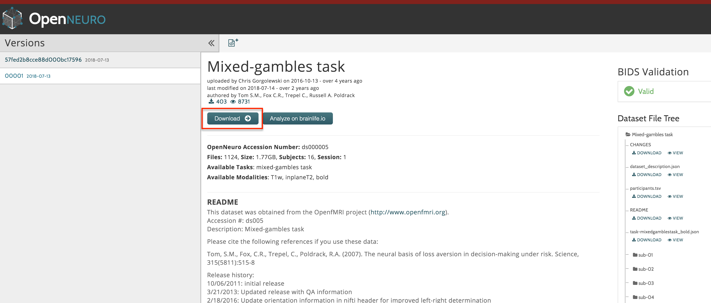

.. _PM_Overview:

Parametric Modulation in SPM, FSL, and AFNI
===========================================

Overview
********

If you have completed the previous tutorials on SPM, FSL, or AFNI, you are able to create general linear models (GLMs) for an fMRI task study. You may have noticed that as single parameter estimate was calculated for each regressor in your model; these parameter estimates were then calcualted for each voxel for each subject, and then used for a group-level analysis to determine where there were significant differences between parameter estimates.

While many experiments use this approach, there are other scenarios in which we examine not just the BOLD response to the condition itself, but the BOLD response to different aspects of the stimulus. For example, assume that we have a condition in which a light is shown for a few seconds, and then switched off. During certain trials the light is relatively weak, while during other trials, the light is relatively strong. If we had a measurement of the light intensity, in candelas, we could determine whether the BOLD response covaries with the light intensity.

This covariation is called **parametric modulation**; in other words, does the BOLD signal seem to increase as the intensity of the stimulus increases, and decrease as the intensity decreases? This is not just restricted to the intensity of a light stimulus. For example, social psychology researchers may require the participant to rate a particular image on how aversive it is, how attractive it is, or on any other scale.

Setting up a Parametric Modulation Analysis: The Tom et. al (2007) Dataset
**************************************************************************

In order to illustrate how parametric modulation works, we will be using a gambling dataset from `Tom et al., 2007 <https://science.sciencemag.org/content/sci/315/5811/515.full.pdf>`__. In the following chapters we will learn how to download the dataset and how to analyze it in each of the major fMRI software packages: SPM, FSL, and AFNI.

Downloading the Dataset
***********************

-------------

As with the datasets for the tutorials in SPM, FSL, and AFNI, we will download our data from openneuro.org. Click on `this link <https://openneuro.org/datasets/ds000005/versions/00001>`__ to see the Mixed Gambles dataset.

Download the dataset by clicking on the "Download" button at the top of the page. The dataset is about 2 Gigabytes, and comes in a zipped folder. Extract it by double-clicking on the folder.

After you have downloaded and unzipped the dataset, click on the Next button for an overview of the experimental task used in this study.

Alternative Download Options
****************************

If the download button doesn't work, try using the `Amazon Web Services (AWS) <https://aws.amazon.com/>`__ option. Go to `this page <https://aws.amazon.com/cli/>`__ and download the appropriate AWS client for your operating system. Once it has been installed, open a Terminal, navigate to the Desktop, and type the following:

::

    aws s3 sync --no-sign-request s3://openneuro.org/ds000005 ds000005-download/

It should take about half an hour to download. When it finishes downloading, move it to the Desktop and rename it by opening a Terminal and typing:

::

    mv ds000005-download Gambles
    
Analyzing the Dataset in Different Software Packages
****************************************************

When you have downloaded the data, you have a choice of analyzing it in any of the major fMRI analysis packages:

1. SPM (Under construction)
2. :ref:`FSL <Appendix_F_ParametricModulation>`
3. AFNI (Under construction)

You can use any of these packages to do parametric modulation, although the details are slightly different between them. If you are already familiar with how to preprocessing a typical dataset using these packages, the major difference will be in setting up the general linear model to estimate regressors for the parametric modulators.

Video
*****

For a video on how parametric modualtion works, click here (INSERT LINK).

.. toctree::
..   :maxdepth: 1
..   :caption: Start to Finish Analysis with SPM

   PM_Short_Course/PM_01_DataDownload
   PM_Short_Course/PM_02_SPM
   PM_Short_Course/PM_03_FSL
   PM_Short_Course/PM_04_AFNI
