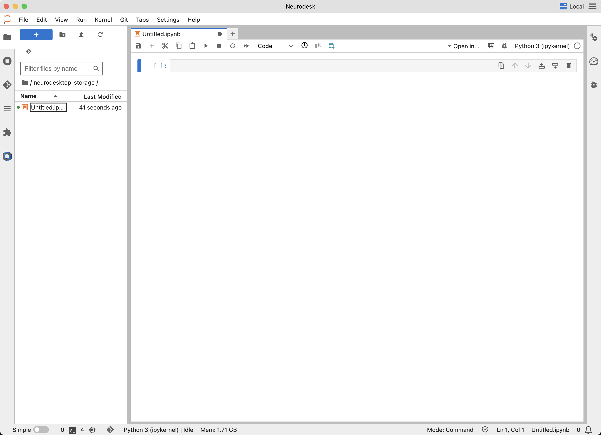
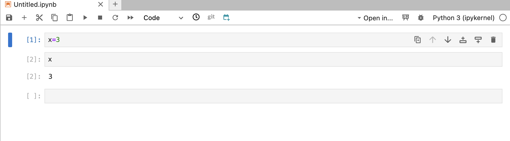
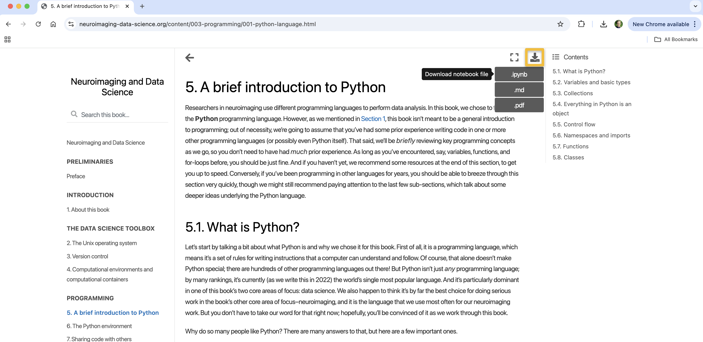
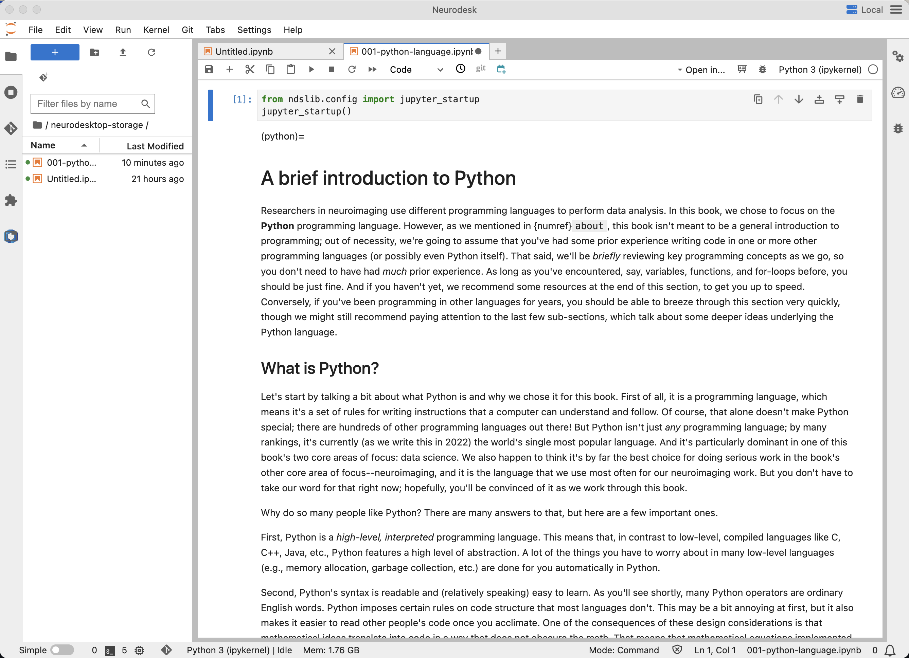

.. _Python_01_Basics:

=============
Python Basics
=============

---------------

The Python Environment: From Integrated Development Environments to Jupyter Notebooks
*************************************************************************************

Python was invented in 1991, and for much of its history it was written and run from the command line - similar to how you would write a shell script in a Unix terminal. Over time, the developers realized that programming and debugging could be done more efficiently if the user was able to edit the code in an interface that allowed for greater customization, such as opening multiple files, highlighting certain parts of code with different colors, and setting break points that would stop the code when it ran into an error. These environments were called **Integrated Development Environments**, or IDEs, and Python created its own version called IDLE (Integrated Developmental and Learning Environment). For many years, this was the preferred way to learn Python and write code.

Although this was an important step, users were likely to run into version errors; for example, someone may have been using Python version 2.7 for a number of years since it was installed by default on his iMac, but found that a new software package he wanted to use was only available with Python 3.1. This could lead to conflicting paths, and often stall an entire project. One way around this was to build **virtual environments**, or self-contained terminals that loaded and used specific software versions that were sequestered from the rest of the computer. The idea is similar to those of containers, which are environments that are segregated from your local machine; the most popular command for creating a virtual Python environment is **conda**. 

Later on, in 2014, this concept was combined with a more efficient Integrated Development Environment to create an interface called **Jupyter Notebooks**. The main advantage of Jupyter Notebooks is their portability, readability, and straightforward editing interface. They can also be used as a web-based interactive application, meaning that you can easily embed images and videos from the Internet, as well as access online datasets - a feature that is particularly important for downloading and analyzing datasets from repositories such as OpenNeuro.org.

My recommendation is to use Jupyter notebooks for learning Python, and to use them within `Neurodesk <https://www.neurodesk.org/>`__. (For a video tutorial of how to download and install Neurodesk, click `here <https://youtu.be/dz2RO9XuAuE>`__.) One of the major problems that newcomers run into is incorrect versions of Python; for example, you may want to use a certain version of Nilearn, but it is not supported by the version of Python that you are using. An environment like Neurodesk takes care of these version issues for you, and makes the experience much smoother.

Getting Started with Jupyter Notebooks
**************************************

Once you have downloaded and installed Neurodesk, use the launcher to select a new Notebook (Python 3 kernel). This will open a blank Jupyter notebook, which looks like this:

The panel on the left is the navigation panel, which shows the current directory and any files within that directory. The panel on the right, which takes up the most space, is the editing pane. Here you can write and execute code by clicking in the grey box (also called a **cell**) and typing something such as ``x=3``. To run the code, you could either click ``Run -> Run Selected Cell`` from the menu bar, or you could simply highlight the cell by clicking in it and pressing ``Shift + Enter``.

What we've done is assigned a variable, one of the basics of computer programming; in this case, we have assigned a value of ``3`` to the variable ``x``. Notice that once you have run the code it automatically creates a new blank cell immediately below the one you have just run. In our case, there wasn't any output from the cell we ran; if we wanted to see what value was contained in ``x``, we would just type ``x`` in the new cell and then run it:

Notice that after we run this cell, the number ``3`` is returned outside of the cells. This is output that cannot be directly manipulated, although it can be overwritten by editing the previous cells and re-running them. If you end up with a notebook that has many cells and you want to run all of them in one go, you can click ``Run -> Run All Cells``. The brackets next to each cell, which are assigned an index number once they are run, will change to an asterisk (``*``) when they are running - usually too fast to see if you are doing something simple like assigning a variable, but which can be present for quite a while if you are doing something more computationally intensive.

Downloading and Editing a Jupyter Notebook
*****************************************

Now that you have learned how to open and operate a Jupyter notebook, you may find it more efficient to edit a notebook that has already been written. This is not to say that you will run the exact same code, but rather that there is an abundance of Jupyter notebooks already available online, and one of them is probably close to what you want to do; with a few judicious edits, you can probably make it compatible with the dataset you are analyzing. This is the main advantage of using Jupyter notebooks, and one of the reasons why they are important for reproducibility.

To get started with Jupyter notebooks, I recommend a textbook by Tal Yarkoni and Ariel Rokem called *Neuroimaging and Data Science*, which is also available as an online e-book `here <https://neuroimaging-data-science.org/root.html>`__. This is an excellent introduction to Python for neuroimagers, as many of the examples are specific to neuroimaging and fMRI analysis. It also includes an introduction to the basics of Python.

Let's begin with chapter 5 of their book, titled `A Brief Introduction to Python <https://neuroimaging-data-science.org/content/003-programming/001-python-language.html>`__. This is an example of a Jupyter notebook that has been embedded in a web page; the web page itself is static, but you can download the text as a Jupyter notebook and edit it on your own computer. For example, you could read the chapter as a text, or you could interact with it and test the examples yourself. Click on the download icon in the upper right of the web page and select ``Download as .ipynb``:

If you already have ``Jupyter Lab <https://jupyter.org/install>`__ installed on your machine, you could open it in that application. For this tutorial, we will place the notebook in the folder ``neurodesktop-storage``, where it can be opened and analyzed in Neurodesk. For example, you could open a new Finder window and click and drag the file (001-python-language.ipynb) into the neurodesktop-storage folder, or you could open a terminal and type:

::

  mv ~/Downloads/001-python-language.ipynb ~/neurodesktop-storage

Once the notebook is in that folder, you can open it by loading the NeurodeskApp, and navigating to the ``neurodesktop-storage`` folder, in which you should see the new Jupyter notebook. Double-click on it to open the notebook, which will now be displayed in your Neurodesk window:

You can now work with the notebooks interactively by clicking within a cell and pressing ``Shift + Enter``. This will kick you to the next block of text, whether it is code or not; you can keep pressing ``Shift + Enter`` to go through each block consecutively. Notice that if we don't make any changes to the code, it will simply replace the output with what was there before; this can help you evaluate the difference between what the output should be with the default code, compared to what changes when you make edits. And of course, you can simply run everything in one go by clicking ``Run -> Run All Cells``. 

Going Further
*************

Now that you know the basics of Jupyter notebooks and how to edit and run them, we can move on to learning more about the basics of Python. Note that many of the concepts underlying Python are identical to those of other programming languages: for example, if you have already studied the :ref:`Unix tutorials <Unix_Intro>` of this book, you will already be familiar with variables, paths, and control statements. We will cover those in the next chapter, using the Yarkoni & Rokem textbook to illustrate how to implement them in Python.

Video
*****

For a video overview of Jupyter notebooks, click `here <https://youtu.be/r1Z46bQZIqM>`__.
