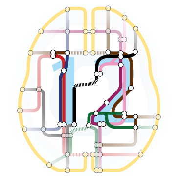

.. _SPM_Overview:

================================
SPM Overview
================================

.. note::

  This page is under construction

---------------

What is SPM?
*****************

`SPM <https://www.fil.ion.ucl.ac.uk/spm/>`__ (Statistical Parametric Mapping) is an fMRI analysis software package that is run in `Matlab <https://www.mathworks.com/products/matlab.html>`__. In addition to fMRI analysis, SPM contains toolboxes for performing volume based morphometry and effective connectivity.

The following tutorials will show you how to analyze a sample dataset with SPM. You will begin by learning the fundamentals of fMRI preprocessing, and then proceed to create a model. We will finish by learning about different types of group analyses, and how to do region of interest (ROI) analyses.

.. toctree::
   :maxdepth: 1
   :caption: Start to Finish Analysis with SPM

   SPM_Short_Course/SPM_fMRI_Intro
   SPM_Short_Course/SPM_01_DataDownload
   SPM_Short_Course/SPM_02_Flanker
   SPM_Short_Course/SPM_03_LookingAtData
   SPM_Short_Course/SPM_04_Preprocessing
   SPM_Short_Course/SummaryStatistics
   SPM_Short_Course/SPM_PPI
