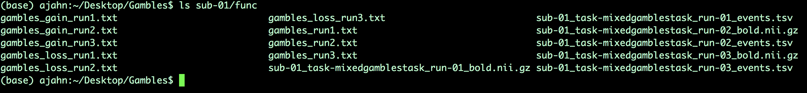
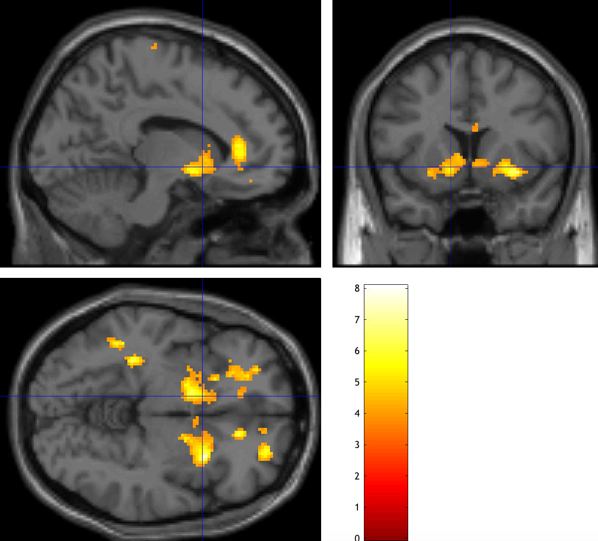
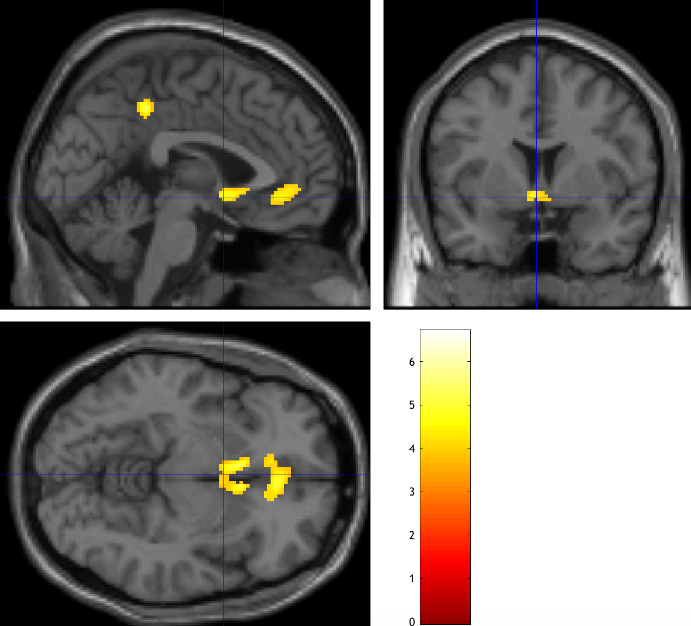
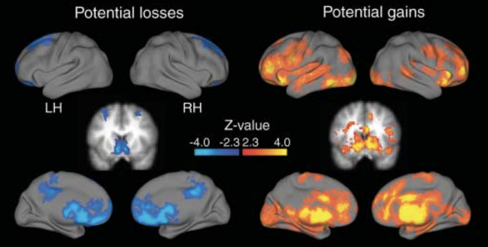

.. _AppendixC_ParametricModulation:

=================================
Appendix C: Parametric Modulation
=================================

------------------

Overview
********

This tutorial will show you how to set up a parametric modulation analysis in SPM. A review of parametric modulation, as well as the dataset we will be analyzing, can be found :ref:`here <PM_Overview>`. This tutorial will focus on preprocessing the data and using the parametric modulators in the general linear model.

Preprocessing the Data
**********************

------------------

Creating the Timing Files
^^^^^^^^^^^^^^^^^^^^^^^^^

We will first create timing files that contain onsets for the Gamble, the parametric value for the potential Gain, and the parametric value for the potential Loss, for each run; in total, we will create nine regressors.

You can download a script to convert the timings into a format that FSL understands by clicking `here <https://github.com/andrewjahn/FSL_Scripts/blob/master/make_FSL_Timings_Gambles.sh>`__, clicking on the ``Raw`` button, and right-clicking anywhere on the screen and selecting ``Save As``. Save the file as a shell script into the ``Gambles`` directory. Once it has been downloaded, navigate to that directory with a Terminal and run the script by typing ``bash make_FSL_Timings_Gambles.sh``. You should see nine text files in each ``func`` directory:

Creating the Preprocessing Script
^^^^^^^^^^^^^^^^^^^^^^^^^^^^^^^^^

Similar to the :ref:`scripting section <SPM_06_Scripting>` of the SPM tutorial, we will create a Batch script that can be used in a for-loop to analyze all of our subjects. Assuming you are familiar already with the details of preprocessing, we won't go over how to fill in each of the fields; however, for this dataset, note that the functional and anatomical data for subject 01 need to be reoriented in order to normalize the brain appropriately. From the Matlab terminal, navigate into both the ``anat`` and ``func`` directories and unzip the files with:

::

  gunzip *.gz
  
Then, open the SPM GUI, click on the ``Display`` button, and select ``sub-01_task-mixedgamblestask_run-01_bold.nii``. This subject's images are tilted forward in the "pitch" orientation; let's undo this by typing ``6`` in the ``pitch (rad)`` field, and setting the origin at the anterior commissure; click on ``Reorient`` and apply these transformations to all of the functional images. Then, open the anatomical image in same display window, and set the origin at the anterior commissure. The rest of the steps should run without any errors.

To prepare the data for a parametric modulation analysis, we will create a preprocessing pipeline similar to the one we used for the example dataset :ref:`here <SPM_Overview>`. If you haven't already, go through the tutorial with the Flanker dataset; there you can find the details of each preprocessing and statistical analysis step, which we won't discuss here in depth; the modules of coregistration, slice-timing correction, and normalization are virtually identical. The only major difference is in the model setup, which has one condition per run - here, labeled "Gamble" - and two parametric modulators, Gain and Loss. We set the polynomail expension to 1st order, and switch the ``Orthogonalise modulations`` option from ``Yes`` to ``No``. This last step is important; the default of ``Yes`` will orthogonalize all of the parametric modulators with respect to the first one, which means that it becomes extremely (and artificially) difficult to generate a significant result for any of the modulators besides the first one. For a detailed discussion about why this is the case, see the link to the Mumford et al. paper in the more info box down below.

At this point, you would save the Batch file and edit the matlab script to turn it into a for-loop; an edited script has already been created `here <https://github.com/andrewjahn/SPM_Scripts/blob/master/run1stLevelAnalysis_job_PM.m>`__, which you can download by clicking on ``Raw``, right-clicking anywhere on the screen, and selecting ``Save As``. Save it to your ``Gambles`` directory, removing the ".txt" extension. Then, from the Matlab terminal, make sure you are in the ``Gambles`` directory, and type:

::

  run1stLevelAnalysis_job_PM
  
This will start preprocessing and analyzing all of the subjects, and it will take about three to four hours.

Setting up the Second-Level Analysis
************************************

For our group analysis, we will create two directories, one for the parametric modulation of Gain and one for the parametric modulation of Loss. From the Matlab terminal, type:

::

  mkdir 2ndLevel_GainPM
  mkdir 2ndLevel_LossPM
  
Then, click on ``Specify 2nd-level`` from the SPM GUI, and for the ``Directory`` field select ``2ndLevel_GainPM``. Within ``Scans``, use the filter field to select ``con_0001.nii``, which is the contrast for the Gain modulator, and then click the ``Go`` button. Estimate the model, and then click on ``Results``; type ``GainPM`` for the name, and give it a contrast weight of +1. Click ``OK``, and set the following parameters:

::

  Apply masking -> none
  p value adjustment to control -> none -> 0.001
  extent threshold (voxels) -> 50
  
These thresholds have been chosen ad hoc, but they should be close to giving you a cluster false positive rate of p=0.05. Click on ``overlays -> sections`` and select a template from the ``canonical`` directory of your SPM folder. You should see an activation map like this, with significant clusters within the ventral striatum:

Now do the same procedure for the Loss parametric modulators, which should be the image con_0002.nii. In the ``Results`` window, give it a weight of -1, using the same parameters as before. Compare both of your results to Tom et al., 2007, and observe whether there is a similar pattern.

  The original results from Tom et al., 2007.
  
  
Next Steps
**********

You may have noticed that the extent of the results is not the same as it was in the original Tom et al. paper. One option to enhance the results is to instead use Threshold-Free Cluster Enhancement (TFCE), as outlined in this chapter. If you have FSL installed, you could merge all of the con_0001.nii images, for example, by typing:

::

  fslmerge -t allCon_0001s.nii.gz `ls $PWD/sub-??/1stLevel/con_0001*`
  
And then running randomise with the TFCE option:

::

  randomise -i allCon_0001s.nii.gz -o allCon_0001s_randomise -1 -T -n 5000
  
You can then load the file ``allZs_randomise_tfce_corrp_tstat1`` in fsleyes, and change the ``Min.`` threshold of 0.95. This will show all of the TFCE clusters at an alpha threshold of p=0.05. Note how many more clusters there are, and how these were hidden with the traditional SPM approach.

Video
*****

For a screencast of how to set up a parametric modulation analysis in SPM, click here.
