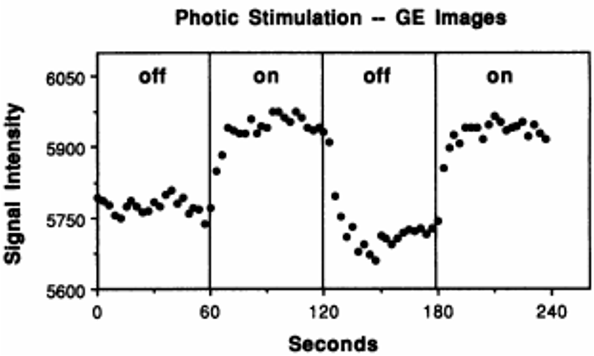

.. _AppendixD_DesignOptimization:

===============================
Appendix D: DesignOptimization
===============================

.. note::

  Some of the text and figures in this chapter are taken from the annual University of Michigan fMRI Training Course.

------------------

Overview: Different Types of Designs
************************************

You may be a researcher who is analyzing or has analyzed a dataset that was already collected for you, and you may be thinking about designing your own experiment. Or, you may have already designed your own experiment, but are curious about whether another design may be more appropriate for your needs.

For those who are thinking about creating their own experiment, you have three main types of task-based designs to choose from: block designs, event-related designs, and a mixture of both block and event-related designs, often referred to as mixed designs. Event-related designs can be further subdivided into either rapid or slow event-related designs, depending on the amount of jitter in the experiment, or how much time there is between consecutive trials. These three designs have been the main ones used by researchers since the beginning of task-based fMRI, and although there are exceptions for certain experiments - for example, using a sparse design to briefly stop scanning while the subject listens to an auditory stimulus, before the scanner begins to measure the BOLD signal again - these too can be seen as variants of the three designs, as you will see.

The earliest task-based experiment was a block design used in the Kwong et al. 1992 paper: The participant in the scanner looked at a flashing checkerboard pattern for thirty seconds, followed by thirty seconds of no checkerboard, and this on/off pattern repeated for the duration of the experiment. This design, in other words, had two conditions: Checkerboard and No Checkerboard, each one lasting for a relatively long time. We call it a block design because many instances of the same condition occur in a given chunk of time, usually lasting at least a dozen seconds, and this period of time, when shown on a line depicting the time-course of the experiment, tends to look like a block, also called a boxcar. The period of time between blocks is also usually long enough to allow the BOLD signal to resolve back to baseline, which can take around 12-20 seconds. Furthermore, we model the entire block as a single instance of that condition, instead of modeling all of the trials within that block individually. The idea is that all of the trials should elicit the same basic pattern of BOLD activity, and that by clustering them together, the signal will be enhanced, and the noise will tend to cancel itself out.

    Figure from Kwong et al., 1992. Each ``off`` and ``on`` rectangle encompasses sixty seconds of that condition, in which the particpant either saw a blank screen or a flashing checkerboard. During the ``on`` block, notice how the BOLD Signal Intensity tends to increase and then plateau after about a dozen seconds.

If the condition we are modeling is straightforward for the participant to understand and if the condition elicits a robust BOLD signal, then a block design can generate the most statistical power, as it has the highest signal-to-noise ratio of all possible designs. However, as a researcher you need to consider the psychological effects as well. Although on paper block designs should yield the greatest statistical power, they can also become boring for the participant, due to the repetitive, predictable nature of identical or similar trials happening for long periods of time. This can lead to confounds such as habituation or prediction effects, and the participant’s behavioral responses may also become uniform, which you may not want.

In contrast, event-related designs place individual trials from different conditions next to each other with a smaller interval of time between them. The order can be determined ahead of time as part of the experimental setup, or it can be randomized. The idea behind event-related designs is to make the experiment more engaging for the participant, while maximizing the amount of individual trials that are presented and maximizing the discriminability between conditions. Slow event-related designs typically have at least 12-15 seconds between consecutive trials - enough time for the BOLD response to go back to baseline before the next stimulus elicits another BOLD signal.

.. figure:: 

Increasing the number of trials is straightforward enough, but what does it mean to maximize the discriminability between conditions? Remember that the typical BOLD response takes time to unfold, and generally looks like a gamma distribution - that is, a bell-shaped curve with a long tail skewed to the right. If many BOLD responses occur close enough in time so that one response begins before the previous response has resolved, the two are averaged together over time. This phenomenon, known as convolution, is part of the reason that the observed BOLD signal usually looks noisy, jagged, and random. There are other factors contributing to the overall messiness of the signal, but even when these other sources of noise are removed from the data, we are left with a convolved signal that obscures the amplitude of each individual condition. In order to accurately calculate the amplitude for each condition, we therefore need to deconvolve the signal; in other words, we need to disentangle the knot of BOLD responses that overlap with each other.

In principle, deconvolution is easy to understand, and all fMRI analysis packages contain algorithms to do it for you. The catch is that the overlap should not be too regular - that is, the interval between one stimulus and the next cannot be the same, or close to the same, every time. Such regularity leads to collinearity, which means that two regressors are highly correlated. The term collinearity is used in statistics to describe one regressor being predicted by a linear combination of other regressors; if this happens, the possible number of solutions can become close to infinite, making it impossible to estimate the beta weights for individual regressors.

To understand this more intuitively, imagine that you are at a noisy party in which you are talking with two people. If one person talks, and then pauses, and then the other person talks, you will probably be able to understand each of them, the background noise notwithstanding. If they both talk at the same time, on the other hand, it will be difficult to understand what each of them are saying; and if they repeat what they just said with one person beginning to talk a few seconds after the other person began to talk, you would probably understand the part of each person’s conversation that didn’t overlap with the other’s. If they keep repeating their sentences at the same offset from each other, however, you will never be able to completely decode what each of them are saying. But if they keep repeating their sentences, only with overlap at different times, you will eventually be able to understand what they are saying by piecing the individual parts together. Similarly, by varying the amount that the BOLD responses overlap, over time we can reconstruct a clearer picture of what they look like individually.

You may ask whether there is an optimal amount of jitter that can be applied to every experiment, given the length of the scan and the number of trials. There are in fact software packages designed to create a timing schedule that optimizes the power of your design, which is the ability to detect an effect if it is there. Before going further, however, you will need to understand the difference between **detection** and **estimation**. Researchers are usually more interested in detection, or the ability to 1) find an effect, and 2) determine whether the amplitude of the BOLD response is significant for a condition compared to baseline, or whether the BOLD response for one condition is significantly different from another condition. Block designs are excellent for detection, because the BOLD response for one condition is isolated from the others; if there actually is an effect, this experimental design gives you the most power to detect it, and provides the highest signal to noise ratio as well. Similarly, in an event-related design, this means optimizing the interval of time between consecutive trials in order to best discriminate the BOLD response between conditions, and to accurately estimate the magnitude of each condition’s response.

Estimation, on the other hand, is the accurate measurement of individual time points along the BOLD response. This is related to another type of analysis called Finite Impulse Response analysis (FIR), in which time points can be compared to each other, and the magnitude of the BOLD response tested for significant differences. The user specifies the number of time points to estimate and the length of time in which to estimate them. For example, you may want to estimate ten time points within an eighteen-second window, or one every two seconds (including an estimate of time point zero, which indicates the start of the trial). Event-related designs are much better suited for estimation, since jittering the trials allows you to estimate different time points along the curve of the BOLD response; block designs, by contrast, have too much overlap of the same type of trial, which makes it difficult it not impossible to measure the finer details of that condition’s BOLD response.

To look at it from a different perspective, and to understand the trade-off between optimizing jitter and optimizing power for either detection or estimation, consider an experimental design in which just one instance of a trial is presented, and enough time is allowed for the BOLD response to return to baseline before the presentation of the second trial - say, twenty seconds. This would allow for both good estimation and detection, assuming that you had time for enough trials in order to obtain a good signal to noise ratio. However, you will probably run into the limitations of how long you can scan, depending on your budget, and participants usually don’t want to be in the scanner for more than sixty to ninety minutes. Furthermore, you should consider how this feels psychologically: One trial at a time every twenty seconds will likely bore the subject, and you will probably run into attention and fatigue-related confounds.

Clearly, then, the best experimental design depends on not just optimizing jitter, but balancing this with the most trials you can reasonably obtain in a given amount of time, and also considering how the experimental feels psychologically. For example, if we had an experiment tapping into cognitive control measured with congruent and incongruent trials, you should be aware of a phenomenon called the Gratton Effect. This is a phenomenon in which the BOLD signal is larger for incongruent trials immediately following congruent trials than it is for congruent trials following congruent trials, or congruent trials following incongruent trials, which may reflect a measure of the preparedness of the brain to process an upcoming incongruent trial. If you generate a timing scheme using either optseq2 or OptimizeX - two popular software packages for creating timings for experimental designs - you may end up with a design that has a large number of incongruent trials preceding congruent trials, which you may or may not want. In any case, you should examine the timing scheme, test it behaviorally, and make sure that participants are able to perform the way you expect.

Design Optimization with optseq2
********************************

`Optseq2 <https://surfer.nmr.mgh.harvard.edu/optseq/>`__ is developed by Doug Greve of Massachusetts General Hospital. It is a straightforward package to use, and requires a Unix terminal or terminal emulator. Note, however, that optseq does not seem to be actively maintained, and that it is designed to optimize the estimation of your design - in other words, it will make your experiment better able to estimate points along the BOLD response, at the expense of detection.

I have written a walkthrough for optseq2 which can be found `here <http://andysbrainblog.blogspot.com/2012/09/optseq-and-event-related-designs.html>`__, along with videos demonstrate how to use it.

Design Optimization with OptimizeX
**********************************

Another optimization tool is `OptimizeX <http://www.bobspunt.com/easy-optimize-x/>`__, developed by Bob Spunt. This is a Matlab package that generates timing schedules to maximize detection of the BOLD response, and you can indicate which contrast you want to optimize out of all the possible combinations of your design matrix.

