.. _AppendixD_DesignOptimization:

==============================
Appendix D: DesignOptimization
==============================

Overview: Different Types of Designs
************************************

If you are thinking about creating your own experiment, you have three main types of task-based designs to choose from: block designs, event-related designs, or a mixture of both block and event-related designs, often referred to as mixed designs. Event-related designs can be further subdivided into either rapid or slow event-related designs, depending on the amount of jitter in the experiment, or how much time there is between consecutive trials. These three designs have been the main ones used by researchers since the beginning of task-based fMRI, and although there are exceptions for certain experiments - for example, using a sparse design to briefly stop scanning while the subject listens to an auditory stimulus, before the scanner begins to measure the BOLD signal again - these too can be seen as variants of the three designs, as you will see.

The earliest task-based experiment was a block design used in the Kwong et al. 1992 paper: The participant in the scanner looked at a flashing checkerboard pattern for thirty seconds, followed by thirty seconds of no checkerboard, and this on/off pattern repeated for the duration of the experiment. This design, in other words, had two conditions: Checkerboard and No Checkerboard, each one lasting for a relatively long time. We call it a block design because many instances of the same condition occur in a given chunk of time, usually lasting at least a dozen seconds, and this period of time, when shown on a line depicting the time-course of the experiment, tends to look like a block, also called a boxcar. The period of time between blocks is also usually long enough to allow the BOLD signal to resolve back to baseline, which can take around 12-20 seconds. Furthermore, we model the entire block as a single instance of that condition, instead of modeling all of the trials within that block individually. The idea is that all of the trials should elicit the same basic pattern of BOLD activity, and that by clustering them together, the signal will be enhanced, and the noise will tend to cancel itself out.

.. figure:: AppendixD_Kwong_BlockDesign.png

    Figure from Kwong et al., 1992. Each ``off`` and ``on`` rectangle encompasses sixty seconds of that condition, in which the participant either saw a blank screen or a flashing checkerboard. During the ``on`` block, notice how the BOLD Signal Intensity tends to increase and then plateau after about a dozen seconds.

If the condition we are modeling is straightforward for the participant to understand and if the condition elicits a robust BOLD signal, then a block design can generate the most statistical power, as it has the highest signal-to-noise ratio of all possible designs. However, as a researcher you need to consider the psychological effects as well. Although on paper block designs should yield the greatest statistical power, they can also become boring for the participant, due to the repetitive, predictable nature of identical or similar trials happening for long periods of time. This can lead to confounds such as habituation or prediction effects, and the participant’s behavioral responses may also become uniform, which you may not want.

In contrast, event-related designs place individual trials from different conditions next to each other with a smaller interval of time between them. The order can be determined ahead of time as part of the experimental setup, or it can be randomized. Slow event-related designs typically have at least 12-15 seconds between consecutive trials - enough time for the BOLD response to go back to baseline before the next stimulus elicits another BOLD signal. Rapid event-related designs, on the other hand, have less time between consecutive trials, and therefore there is overlap in the BOLD responses. Both types of designs are shown below, which are taken from the AFNI website: 

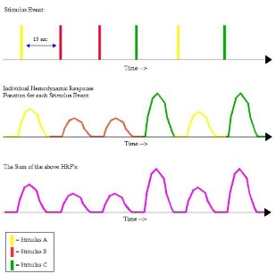

  An example timing schedule for a slow event-related design. The top row depicts the individual presentation of each trial (each one color-coded to represent a different condition), while the middle row shows the corresponding hemodynamic response for each stimulus type. The bottom row illustrates the sum of the HRFs from the middle row. Note that there is enough time between trials to allow the BOLD response to go back to its baseline before the stimulus was presented; therefore, the shape of the individual and summed BOLD responses look identical.

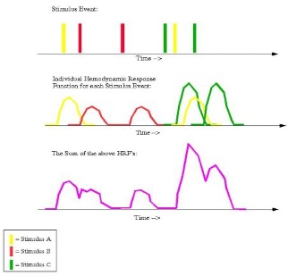

  An example timing schedule for a rapid event-related design; the meaning of each row is the same as in the figure immediately above. Note that in this case there is less time between consecutive trials, and there is considerable overlap between their BOLD responses. Consequently, the sum of their BOLD responses (depicted in the bottom row) is a convolution, or moving average, of the individual responses.

Regardless of whether you use slow or rapid event-related designs, the idea behind both of them is to make the experiment more engaging for the participant, while maximizing the amount of individual trials that are presented and maximizing the discriminability between conditions. Increasing the number of trials is straightforward enough, but what does it mean to maximize the discriminability between conditions? Remember that the typical BOLD response takes time to unfold, and generally looks like a gamma distribution - that is, a bell-shaped curve with a long tail skewed to the right. If many BOLD responses occur close enough in time so that one response begins before the previous response has resolved, the two are averaged together over time. This phenomenon, known as **convolution**, is part of the reason that the observed BOLD signal usually looks noisy, jagged, and random. There are other factors contributing to the overall messiness of the signal, but even when these other sources of noise are removed from the data, we are left with a convolved signal that obscures the amplitude of each individual condition. In order to accurately calculate the amplitude for each condition, we therefore need to deconvolve the signal; in other words, we need to disentangle the knot of BOLD responses that overlap with each other.

In principle, deconvolution is easy to understand, and all fMRI analysis packages contain algorithms to do it for you. The catch is that the overlap should not be too regular - that is, the interval between one stimulus and the next cannot be the same, or close to the same, every time. Such regularity leads to collinearity, which means that two regressors are highly correlated. The term collinearity is used in statistics to describe one regressor being predicted by a linear combination of other regressors; if this happens, the possible number of solutions can become close to infinite, making it impossible to estimate the beta weights for individual regressors. This is illustrated in the following figure, also taken from the AFNI website:

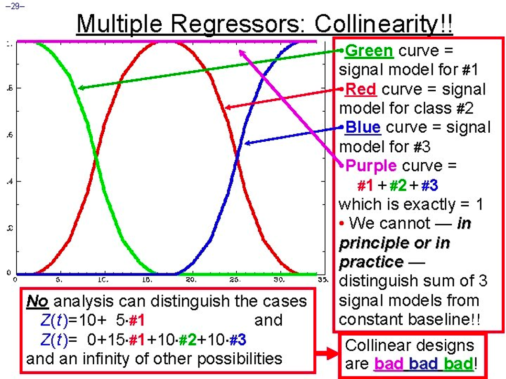

  Example of collinearity. If these three conditions (highlighted in green, red, and blue) always occur at the same time relative to each other, then it becomes impossible to determine how much each condition contributed to the overall convoluted signal, depicted here in magenta and pinned to a single value. Randomized intertrial intervals, or jitter, is needed to accurately disentangle the convoluted signal into its constituent parts.

.. note::

  To understand this more intuitively, imagine that you are at a noisy party in which you are talking with two people. If one person talks, and then pauses, and then the other person talks, you will probably be able to understand each of them, the background noise notwithstanding. If they both talk at the same time, on the other hand, it will be difficult to understand what each of them are saying; and if they repeat what they just said with one person beginning to talk a few seconds after the other person began to talk, you would probably understand the part of each person’s conversation that didn’t overlap with the other’s. If they keep repeating their sentences at the same offset from each other, however, you will never be able to completely decode what each of them are saying. But if they keep repeating their sentences, only with overlap at different times, you will eventually be able to understand what they are saying by piecing the individual parts together. Similarly, by varying the amount that the BOLD responses overlap, over time we can reconstruct a clearer picture of what they look like individually.

You may ask whether there is an optimal amount of jitter that can be applied to every experiment, given the length of the scan and the number of trials. There are in fact software packages designed to create a timing schedule that optimizes the power of your design, which is the ability to detect an effect if it is there. Before going further, however, you will need to understand the difference between **detection** and **estimation**. Researchers are usually more interested in detection, or the ability to 1) find an effect, and 2) determine whether the amplitude of the BOLD response is significant for a condition compared to baseline, or whether the BOLD response for one condition is significantly different from another condition. Block designs are excellent for detection, because the BOLD response for one condition is isolated from the others; if there actually is an effect, this experimental design gives you the most power to detect it, and provides the highest signal to noise ratio as well. Similarly, in an event-related design, this means optimizing the interval of time between consecutive trials in order to best discriminate the BOLD response between conditions, and to accurately estimate the magnitude of each condition’s response.

Estimation, on the other hand, is the accurate measurement of individual time points along the BOLD response. This is related to another type of analysis called Finite Impulse Response analysis (FIR), in which time points can be compared to each other, and the magnitude of the BOLD response tested for significant differences. The user specifies the number of time points to estimate and the length of time in which to estimate them. For example, you may want to estimate ten time points within an eighteen-second window, or one every two seconds (including an estimate of time point zero, which indicates the start of the trial). Event-related designs are much better suited for estimation, since jittering the trials allows you to estimate different time points along the curve of the BOLD response; block designs, by contrast, have too much overlap of the same type of trial, which makes it difficult it not impossible to measure the finer details of that condition’s BOLD response.

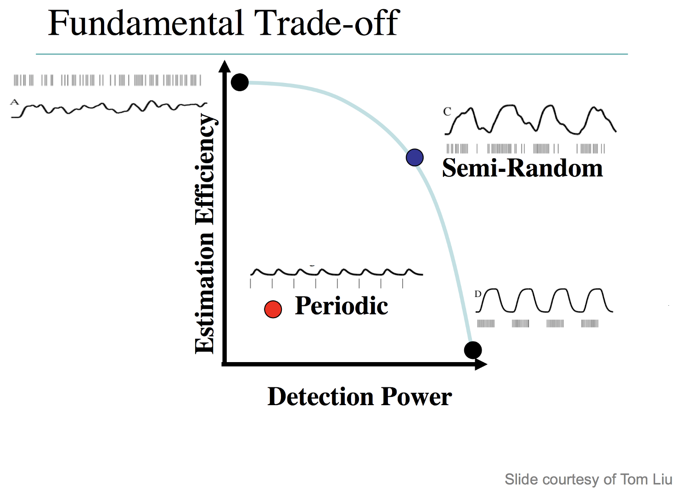

  Illustration of the tradeoffs between detection and estimation. Block designs provide the best detection, while minimizing estimation; a design with completely randomized intertrial intervals gives the best estimation, but the lowest detection power. Semi-random designs, which give more weight to shorter intertrial intervals than longer intervals (i.e., make the occurrence of shorter intervals relatively more frequent), provide a balance between detection and estimation. Periodic designs, which are like slow event-related designs, yield both poor estimation and low power.

.. note::

  To look at this from a different perspective, and to understand the trade-off between optimizing jitter and optimizing power for either detection or estimation, consider an experimental design in which just one instance of a trial is presented, and enough time is allowed for the BOLD response to return to baseline before the presentation of the second trial - say, twenty seconds. This would allow for both good estimation and detection, assuming that you had time for enough trials in order to obtain a good signal to noise ratio. However, you will probably run into the limitations of how long you can scan, depending on your budget, and participants usually don’t want to be in the scanner for more than sixty to ninety minutes. Furthermore, you should consider how this feels psychologically: One trial at a time every twenty seconds will likely bore the subject, and you will probably run into attention and fatigue-related confounds.

To sum up, the best experimental design depends on not just optimizing jitter, but balancing this with the most trials you can reasonably obtain in a given amount of time, and also considering how the experiment feels psychologically. For example, if we had an experiment tapping into cognitive control measured with congruent and incongruent trials, you should be aware of a phenomenon called the Gratton Effect. This is a phenomenon in which the BOLD signal is larger for incongruent trials immediately following congruent trials than it is for congruent trials following congruent trials, or congruent trials following incongruent trials, which may reflect a measure of the preparedness of the brain to process an upcoming incongruent trial. If you generate a timing scheme using either optseq2 or OptimizeX - two popular software packages for creating timings for experimental designs - you may end up with a design that has a large number of incongruent trials preceding congruent trials, which you may or may not want. In any case, you should examine the timing scheme, test it behaviorally, and make sure that participants are able to perform the way you expect. We now turn to examining each of these design optimization packages.

Design Optimization with optseq2
********************************

`Optseq2 <https://surfer.nmr.mgh.harvard.edu/optseq/>`__ is developed by Doug Greve of Massachusetts General Hospital. It is a straightforward package to use, and requires a Unix terminal or terminal emulator. Note, however, that optseq does not seem to be actively maintained, and that it is designed to optimize the estimation of your design - in other words, it will make your experiment better able to estimate points along the BOLD response, at the expense of detection.

I have written a walkthrough for optseq2 which can be found `here <http://andysbrainblog.blogspot.com/2012/09/optseq-and-event-related-designs.html>`__, along with videos demonstrating how to use it.

Design Optimization with OptimizeX
**********************************

.. note::

  Most of the text and figures in this section and the following section are taken from the annual University of Michigan fMRI Training Course.

Another optimization tool is `OptimizeX <http://www.bobspunt.com/easy-optimize-x/>`__, developed by Bob Spunt. This is a Matlab package that generates timing schedules to maximize detection of the BOLD response, and you can indicate which contrast you want to optimize out of all the possible combinations of your design matrix.

This package will also help you to maximize your design **efficiency**, which can be thought of as the inverse of variance. If we have a timing scheme that optimizes the sampling along different curves of the BOLD response, we will reduce our uncertainty of the shape of the individual BOLD response for each condition, and therefore increase our power to detect an effect that is actually there. In other words, efficiency is a measure of how well the timing scheme allows SPM to deconvolve the amplitudes of the individual conditions, and, all things being equal, a higher efficiency is more desirable. Best of all, efficiency can be calculated before you begin scanning, which can save you time and money from having to later edit your design.

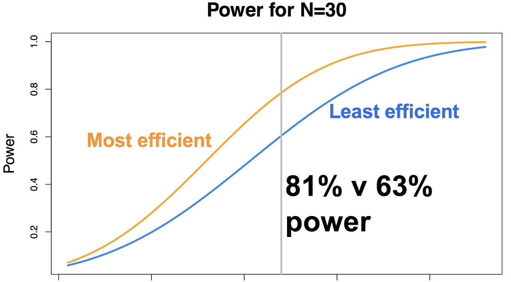

    Illustration of the difference in power yield for the most efficient and least efficient timing schedule for a given experiment, focusing on a sample size of N=30 subjects. Note that this assumes everything else is equal - number of conditions and number of trials - all that changes is the timing between the trials. Figure courtesy of Jeanette Mumford.

To get started, click on the link above and then click on ``Download ZIP`` from the menu bar on the left. When it has finished downloading, unzip the package, and then (assuming that it is in your Downloads directory), move it to your home directory and add it to your Matlab path:

::

  mkdir '~/OptimizeX/Demo'
  movefile('~/Downloads/spunt-easy-optimize-x-7c4d2f8/*', '~/OptimizeX')
  addpath '~/OptimizeX'
  cd ~/OptimizeX/Demo

This will create the folders ``OptimizeX`` and the subfolder ``DemoFiles`` in your home directory; the scripts to run OptimizeX will be placed in the ``OptimizeX`` folder, and we have the subdirectory into which we can write out our example timing schedules.

If you then type

::

    optimizeXGUI

You should now see the main input dialogue:

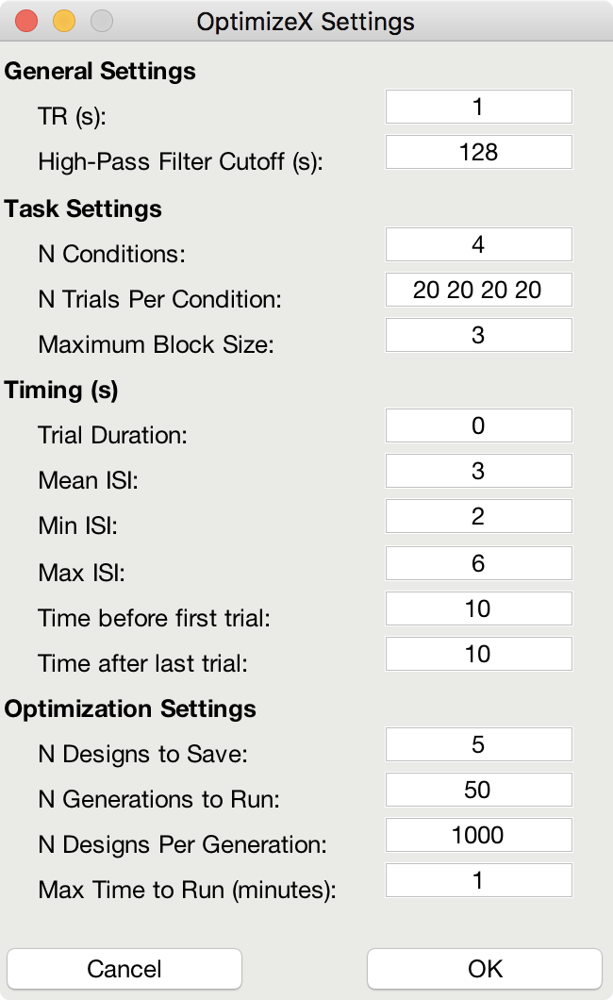

The menu has the following options:

::

  General Settings
  
  TR (s): TR you will use to acquire images
  High-Pass Filter Cutoff (s): high-pass filter you will use to analyze images
  Task Settings
  
  N Conditions: number of conditions in your design
  N Trials Per Condition: number of trials per condition (unbalanced OK, e.g., 25 20 15 25)
  Maximum Block Size: block = trials from same condition occurring in a row
  Timing (s)
  
  Time Duration: duration of your trials (0 purely event-related)
  Mean ISI: mean interstimulus interval
  Min ISI: minimum value for interstimulus interval
  Max ISI: maximum value for interstimulus interval
  Time before first trial: "rest" interval to add to beginning of scan
  Time after last trial: "rest" interval to add at end of scan
  Optimization Settings
  
  N Designs to Save: number of "optimal" designs to save
  N Generations to Run: number of generations to test
  N Designs Per Generation: number of designs to include in each generation
  Max Time to Run (minutes): maximum amount of time to run the program

Feel free to create your own unique design by modifying the inputs. Or, you can just use the "default" values to proceed on to the next step, which is to tell the software which contrasts you care most about:

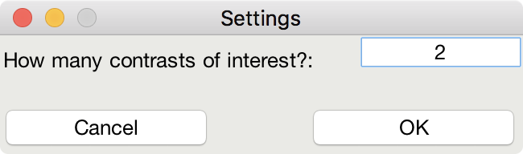

This is me telling the software that I am looking for a design that maximizes the efficiency of two contrasts among my conditions

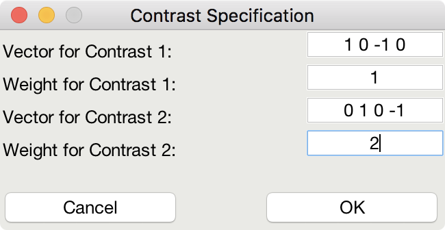

This indicates that although I do care about the comparison among predictors 1 and 3 (Contrast 1), I actually care more about the comparison of predictors 2 and 4 (Contrast 2).

That's it! The software will do the rest of the work, some of which you can see in the MATLAB command window:

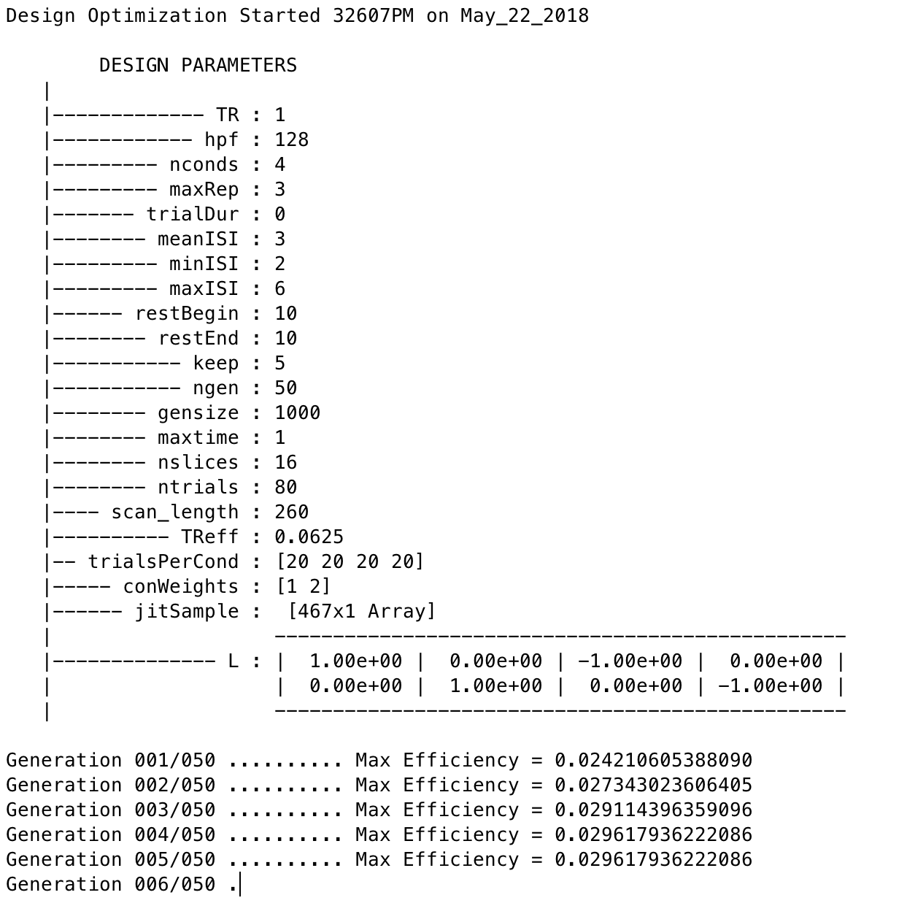

Note that the efficiency values have no unit and that larger values indicate more efficient designs.

Once it finishes, you should see a figure pop up showing you the most efficient design matrix:

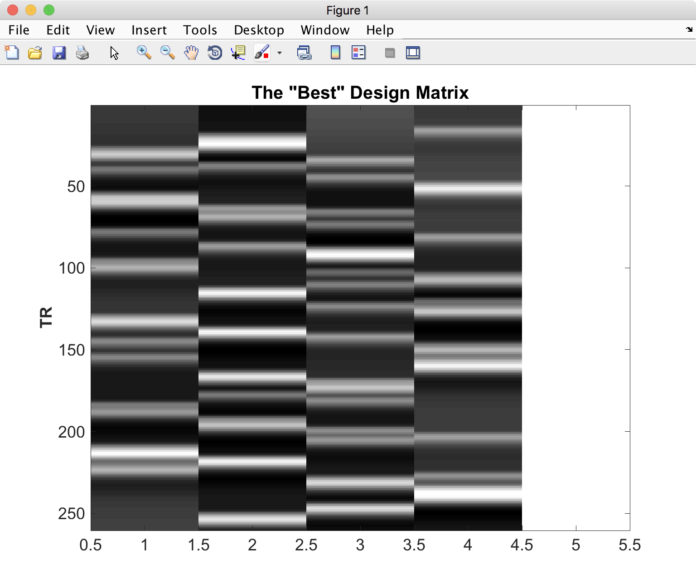

In addition, you should see a new folder starting with 'best_designs_' followed by the current date in the directory in which you ran the program (which should be ``~/OptimizeX/Demo``. Inside that directory are .csv files and their corresponding .txt files for each of the of the number of designs that you set to write out in the OptimizeX menu (under 'N Designs to Save'). You can load the .csv files into Matlab or Excel, which would look like this:

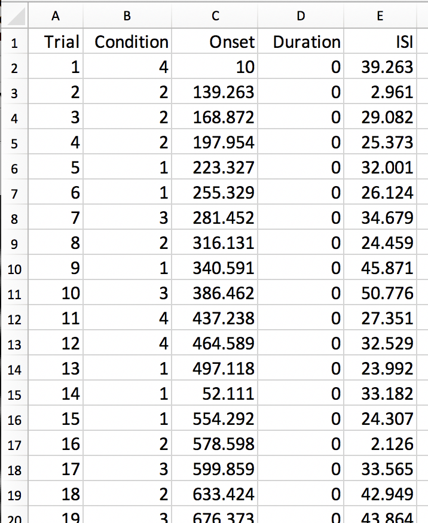

You can read in the .txt files in Matlab and display their contents with:
::

    load('design1.txt');
    design1

Alternatively, OptimizeX also writes out the file designinfo.mat, which includes a structure with all the designs that you requested OptimzeX to save. You can read it into Matlab with:
::

    load('designinfo.mat');

...and access for example the first design in the structure using:

::

    design{1}.combined

For most applications, this should be all of the information you need to implement your experiment, and to do so in a manner that is optimal given the contrasts you care about. Of course, you might want to think about running the software for more than a minute if you do decide to use this for a study! There is no hard-and-fast rule for how long you do need to run it, but it wouldn't hurt (presumably) to run it overnight.

Evaluating Design Efficiency
****************************

In the previous two sections, you got a feel for design optimization. In this last section, we'll learn to more concretely assess design efficiency. This will allow you to evaluate and compare designs, and better understand how to optimize them.

Let's begin by evaluating the optimized design that you just created. Within the OptimizeX folder, your design should have been saved in a directory called "best_designs_DATE_TIME." Locate that directory, which should be under ``~/OptimizeX/Demo``, and load the file "designinfo.mat".

load designinfo % make sure you are in the right directory
This will load a variable called "design" into your workspace that contains the design information for each of the designs you generated. In particular, the design matrix is stored in a field called "X":

::

    X = design{1}.X; % store the first design matrix into variable X
    figure
    imagesc(X)
    colormap('gray');

This command will plot the design matrix you observed before, but without the intercept (the last column that was on the right).

Now, let's evaluate the design. First, we'll examine the variance inflation factors (VIF). Variation inflation factors estimate how stable/unstable parameter estimates will be. You get one variance inflation factor per regressor. A variance inflation factor of 1 is perfect and indicates that the design will provide a stable estimate of the parameter. A variance inflation factor of 2 indicates that there will be a twofold increase in the variance of the parameter. In other words, if you were to repeat the experiment over and over assuming the same underlying true parameter, the estimate of that parameter would be variable to a factor of 2. Similarly, a variance inflation factor of 3 indicates a threefold increase, and so on. There is no hard rule on how much variance inflation one can tolerate, but the lower the better!

::

    vif = diag(inv(corrcoef(X)))';
    vif

Are the VIFs near 1? Are they high (e.g. > 10)? VIFs are inflated due to multi-collinearity. Let's take a look at the correlation between regressors:

::

    r = corrcoef(X);
    r

This shows the correlation matrix. Are there strong correlations between any regressors? How might you decrease the correlation between regressors?

Next, we will look at the efficiency of the design. While variance of parameter estimates (VIFs) are bad, variance of the regressors used to estimate those parameters is good. This is because variance in a regressor gives it a unique signature that can be observed in the signal (if it is there).

More technically, efficient designs minimize the quantity (X'X)-1. Or in MATLAB inv(X'*X). In particular, we are interested in the diagonal elements of this matrix, each of which corresponds to a predictor in our design. So, we'll calculate this quantity and focus on the diagonals. Since we typically think of efficiency in positive terms (i.e. more efficiency is better), we'll take the reciprocal:

::

    eff = (1./diag(inv(X'*X)))';
    eff

Note that this is a unit-less measure. It is affected by the scaling of the design matrix (and scaling of contrasts when we calculate contrast efficiency). As a result, it is a relative term and comparing grossly different designs is not meaningful. But, so long as we keep our scaling constant, we can compare different simulations of a design (e.g., same number of conditions and trials) using this metric.

While higher efficiency for each regressor is a good thing, what we are typically interested in are contrasts. When you ran the optimizeX script previously, you gave it the contrasts that you wanted to be optimized. Let's see the metric it used to measure this. The contrasts you gave the script were saved in the variable "params.L."

::

    C = params.L'; % extract the contrasts and transpose for matrix multiplication
    effCons = (1./diag(C'*inv(X'*X)*C))';
    effCons

Again, this is unit-less and should be used for relative comparisons. If you told the script to weight one contrast more than another, you might see that the more highly weighted contrast has greater efficiency. If you asked for equal weighting, then both contrast efficiencies should be about equivalent.

Next, re-run the Optimization script, but this time, increase the ISI. How does this change affect the VIFs? The efficiency?

Finally, you may be interested in evaluating designs you have used in the past. Locate the SPM.mat file of the design that you have estimated, which contains the design matrix, which you can access with the following code:

::

    load SPM % make sure you are in the right directory
    X = SPM.xX.X(:,SPM.Sess(1).col); % pick out Session/Run 1
    
    % Now let's get the contrast from our SPM file
    xCon=horzcat(SPM.xCon(:).c)';
    xCon=xCon(:,1:3);

This code extracts the regressors for the first session/run. If you had a multi-session/run design, you could change the column indexing to access different sessions/runs, or all of them. Now, you can repeat the steps above to examine the VIFs and efficiencies. Are there any VIFs that are particularly bad? Are there any regressors that are relatively inefficient? If so, what elements of the design do those correspond to? Will this be problematic for the design estimation? These are questions you will need to ask yourself as you decide on the best design to use.

Summary
*******

You now have the tools and concepts to optimize your design: First, by increasing the efficiency of your design matrix using OptimizeX, and also by thinking about any potential confounds that might arise with a given design. Remember that the most efficient design doesn't necessarily mean the best one; you will have to decide for yourself whether a given timing schedule "feels" right, and for this there is no substitute for experience.
