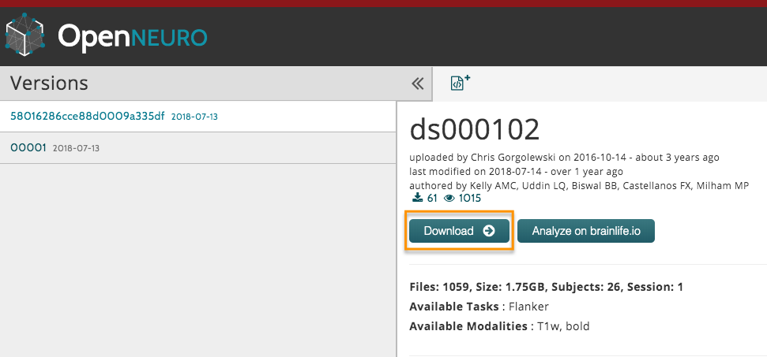

.. _SPM_01_DataDownload:

=====================================
SPM Tutorial #1: Downloading the Data
=====================================

---------------

Overview
--------------

For this course we will be analyzing an fMRI dataset that used the Flanker task. The dataset can be found `here <https://openneuro.org/datasets/ds000102/versions/00001>`__ on the `OpenNeuro <https://openneuro.org>`__ website, an online repository for neuroimaging data.

.. figure:: OpenNeuro_Flanker.png

    The OpenNeuro page for the Flanker dataset includes a Dataset File Tree, which includes the folders ``anat`` (containing the anatomical image) and ``func`` (containing the functional images and onset times for each run). There are additional files containing subject data such as sex and age (``participants.tsv``) and scanning parameters (``task-flanker_bold.json``). These data are in a format called BIDS - Brain Imaging Data Structure. A standardized directory tree such as this makes scripting much easier, as we will see in a later tutorial.
    
    
Download the dataset by clicking on the "Download" button at the top of the page. The dataset is about 2 Gigabytes, and comes in a zipped folder. Extract it by double-clicking on the folder.

After you have downloaded and unzipped the dataset, click on the Next button for an overview of the experimental task used in this study.

Video
******

For a video tutorial of how to download the data, click `here <https://www.youtube.com/watch?v=4Y0LfKNj8Ns>`__. (The video has the title "AFNI Tutorial #1", but since it's essentially the same thing as what you'll be doing for SPM, I've decided to use the same video for both tutorials.)
