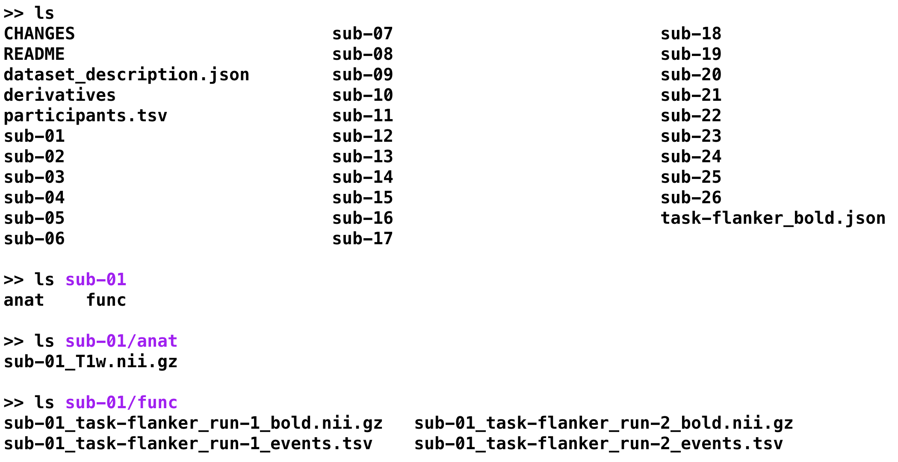
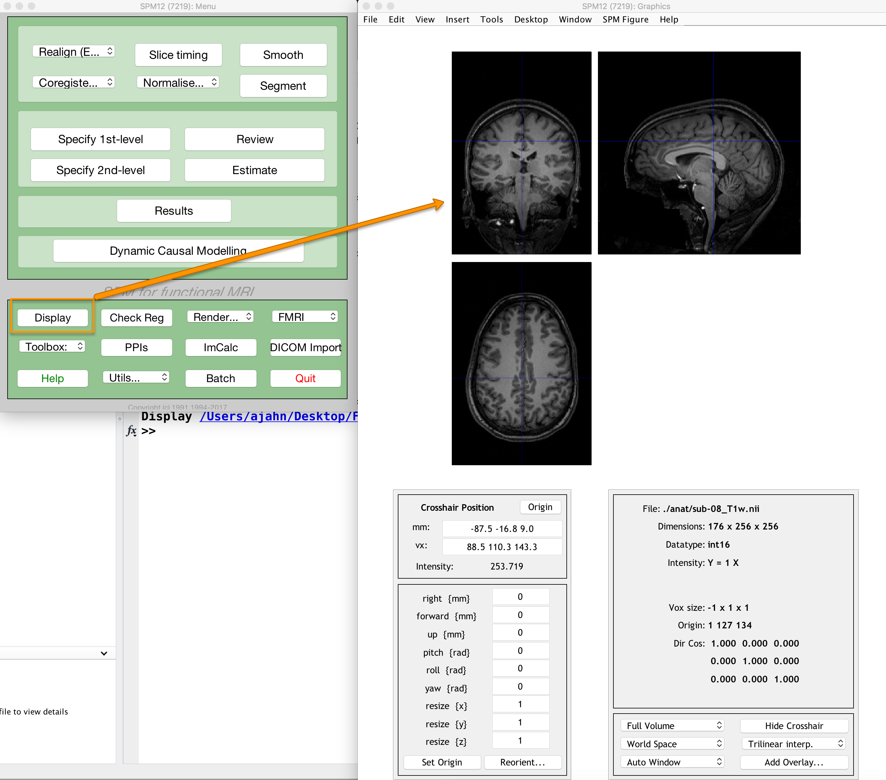
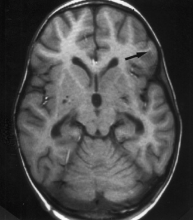
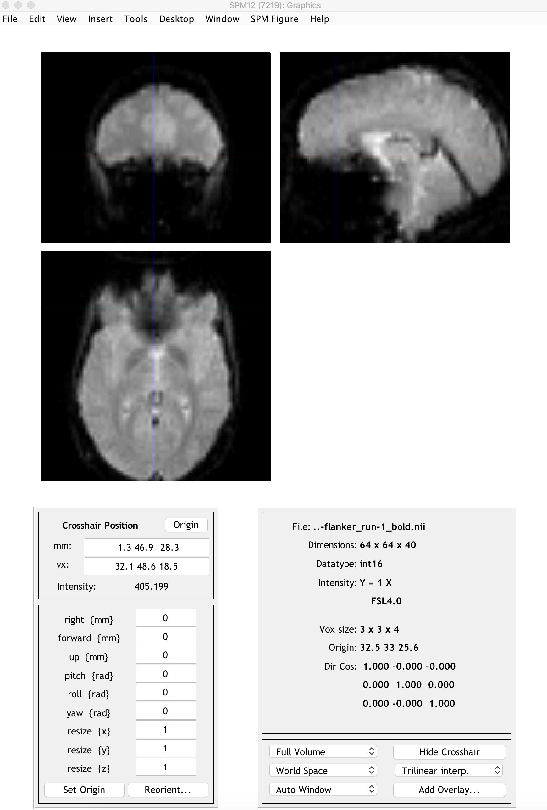

.. _SPM_03_LookingAtData:

====================================
SPM Tutorial #3: Looking at the Data
====================================

----------------

Overview: The SPM Graphical User Interface
---------

Now that you've downloaded the dataset, you will want to **look at your data** - for example, you will want to know if there are any artifacts or problems with your data, and whether these can be alleviated by :ref:`preprocessing <SPM_04_Preprocessing>`. 

Let's first rename the dataset to something that is clear and informative. If the dataset has been downloaded to your Downloads directory, navigate to the Desktop and type the following:

::

    mv ~/Downloads/ds000102_0001/ Flanker
    
Which will rename the folder to ``Flanker`` and put it on your Desktop.

.. figure:: 03_Move_Flanker_Folder.png

    After downloading the Flanker dataset, type the command above to move it to your Desktop. Note: If you need to review Unix commands such as ``mv``, see :ref:`this tutorial <Unix_02_CopyRemove>`.
    
    
As you saw in the previous :ref:`Data Download page <AFNI_01_DataDownload>`, the dataset has a standardized structure: Each subject folder contains an anatomical directory and a functional directory labeled ``anat`` and ``func``, and these in turn contain the anatomical and functional images collected during the experiment. (The ``func`` directory also contains **onset times**, or timestamps for when the subject underwent either a Congruent or Incongruent trial.) This format is known as `BIDS <http://bids.neuroimaging.io/>`__, or Brain Imaging Data Structure, which makes it easy to organize and analyze your data.

    Example of the BIDS format. Note that the ``func`` directory contains functional data - in this case, two runs of functional data - and corresponding "events.tsv" files, which contain **onsets**, or timestamps of which condition happened at what time. You can open these as a text file or as a spreadsheet. We will use these later when we build our General Linear Model.
    
To look at and inspect the data, we will be using the **SPM Graphical User Interface**, or GUI for short. You can open the GUI by opening a new Matlab terminal, typing ``spm fmri`` from the command line, and pressing enter.

--------

Inspecting the Anatomical Image
----------
    
Whenever you download imaging data, check the anatomical and functional images for any **artifacts** - scanner spikes, incorrect orientation, poor contrast, and so on. It will take some time to develop an eye for what these problems look like, but with practice it will become quicker and easier to do.

To begin, let's take a look at the anatomical image in the ``anat`` folder for ``sub-08``. If you haven't already opened SPM, navigate to the sub-08 folder and then type

::

    spm fmri
    
and press return, which will open the SPM graphical user interface. If you click on the ``Display`` button, you will be prompted to select an image. 

.. note::

  SPM can read any image that are in NIFTI format, but they cannot be compressed - that is, if the datasets end with a ``.gz`` extension, you will first need to unzip them by navigating to the directory containing the images and then type

  ::

    !gunzip *.gz

  Which will expand the images and remove the ``.gz`` extension.

    The anatomical image displayed in the SPM viewer in axial, sagittal, and coronal views. You can close any of the windows if you only want to focus on a subset of the views. 
    
   
Inspect the image by clicking around in one of the viewing windows. Notice how the other viewing windows and crosshairs change as a result - this is because MRI data is collected as a three-dimensional image, and moving along one of the dimensions will change the other windows as well.

.. note::

    You may have noticed that this subject appears to be missing his face. That is because the data from OpenNeuro.org have been **de-identified**: Not only has information such as name and date of scanning been removed from the header, but the faces have also been erased. This is done in order to ensure the subject's anonymity.
    

As you continue to inspect the image, here are two things to watch out for:

1. Lines that look like ripples in a pond. These are called **Gibbs Ringing Artifacts**, and they may indicate an error in the reconstruction of the MR signal from the scanner. These ripples may also be caused by the subject moving too much during the scan. In either case, if the ripples are large enough, they may cause preprocessing steps like brain extraction or normalization to fail.

    Photo credit: Sundar Amartur

2. Abnormal intensity differences within the grey or the white matter. These may indicate pathologies such as aneurysms or cavernomas, and they should be reported to your radiologist right away; make sure you are familiar with your laboratory's protocols for reporting artifacts. For a gallery of pathologies you may see in an MRI image, click `here <http://www.mrishark.com/brain1.html>`__.

----------

Inspecting the Functional Images
----------
    
When you are done looking at the anatomical image, click on the ``Display`` button again, navigate to the ``func`` directory, and select one the ``run-1`` functional image.

.. note::

    Loading a new session into memory will allow you to look at any of the images in that session. If you want to switch to another session, click on ``Switch`` and select the session you want to load.

A new image will be displayed in the orthogonal viewing windows. This image also looks like a brain, but it is not as clearly defined as the anatomical image. This is because the **resolution** is lower. It is typical for a study to collect a high-resolution T1-weighted (i.e., anatomical) image and lower-resolution functional images, which are lower resolution in part because they are collected at a very fast rate. One of the trade-offs in imaging research is between spatial resolution and temporal resolution: Images collected at higher temporal resolution will have lower spatial resolution, and vice versa.

Many of the quality checks for the functional image are the same as with the anatomical image: Watch out for extremely bright or extremely dark spots in the grey or white matter, as well as for image distortions such as abnormal stretching or warping. One place where it is common to see a little bit of distortion is in the orbitofrontal part of the brain, just above the eyeballs. There are ways to `reduce this distortion <https://andysbrainbook.readthedocs.io/en/latest/FrequentlyAskedQuestions/FrequentlyAskedQuestions.html#how-can-i-unwarp-my-data>`__, but for now we will ignore it.

.. Reference the time-series glossary

Another quality check is to make sure there isn't excessive motion. Functional images are often collected as a time-series; that is, multiple volumes are concatenated together into a single dataset. EXPAND ON THIS, TALK ABOUT HOW YOU CAN LOOK AT IT IN THE SPM VIEWER.

--------

Exercises
-----------

Video
--------
