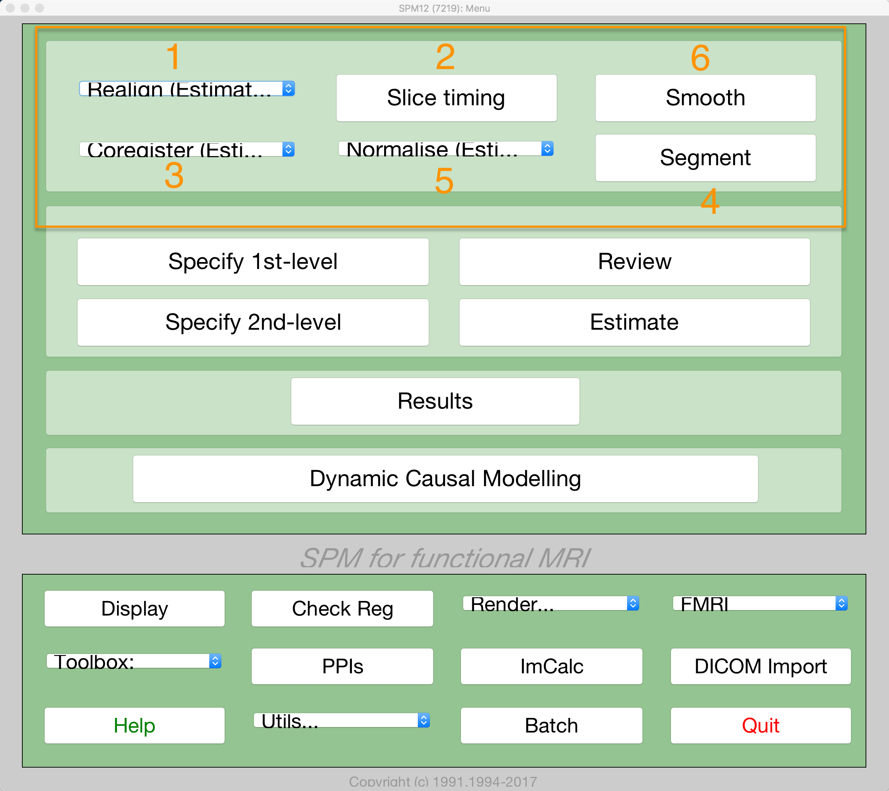

.. _SPM_04_Preprocessing:

=============
SPM Tutorial #4: AFNI Commands and Preprocessing
=============

-----------

.. note::
  Many of the examples are run from the ``Flanker/sub-08`` directory; I recommend navigating to that directory in the Matlab Terminal before reading the rest of the chapter.
  
   
Overview
-------------

Now that we know where our data is and what it looks like, we will do the first step of fMRI analysis: **Preprocessing**.

Think of preprocessing as cleaning up the images. When you take a photo with a camera, for example, there are several things you can do to make the image look better:

* Remove red eye;
* Increase color saturation;
* Remove shadows.

  A picture we take with a camera may be dark, blurry, or noisy (left panel). After editing the image by enhancing contrast, reducing blur, and increasing brightness, we end up with a more defined and clearer picture.

Similarly, when we preprocess fMRI data we are cleaning up the three-dimensional images that we acquire every :ref:`TR <Repetition_Time>`. An fMRI volume contains not only the signal that we are interested in - changes in oxygenated blood - but also fluctuations that we are not interested in, such as head motion, random drifts, breathing, and heartbeats. We call these other fluctuations **noise**, since we want to separate them from the signal that we are interested in. Some of these can be regressed out of the data by modeling them (which is discussed in the chapter on modeling fitting), and others can be reduced or removed by preprocessing.

To begin preprocessing sub-08's data, read through the following chapters. We will begin with **Realignment** and **Slice-Timing Correction**, which correct misalignments and timing errors in the functional images, before moving on to **Coregistration** and **Normalization**, which align the functional and structural images and move them both to a standardized space. The typical sequence of preprocessing steps is numbered in the image below:

.. toctree::
   :maxdepth: 1
   :caption: Preprocessing Steps
   
   SPM_04_Preprocessing/01_Realign_Unwarp

.. note::
  Different software packages will do these steps in slightly different order - for example, FSL will normalize the statistical maps after model fitting. There are also analyses which omit certain steps - for example, some people who do multi-voxel pattern analyses don't smooth their data. In any case, the list above represents the most common steps that are performed on a typical dataset.

---------

Video
*********

  
  
