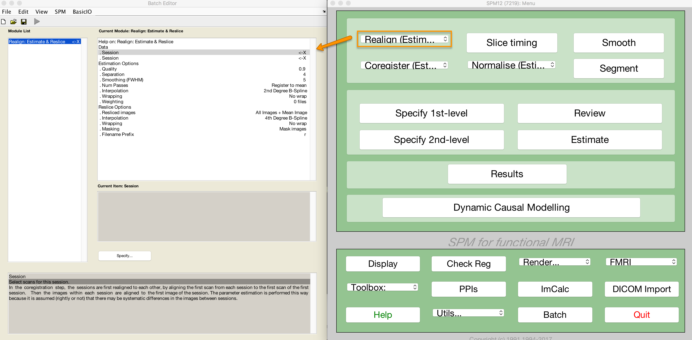
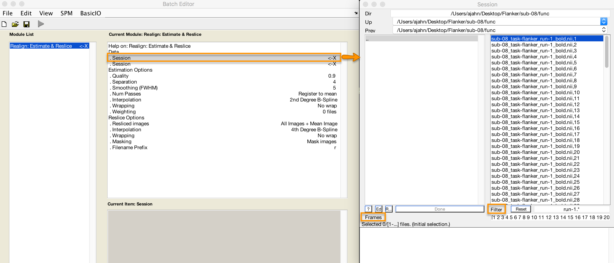
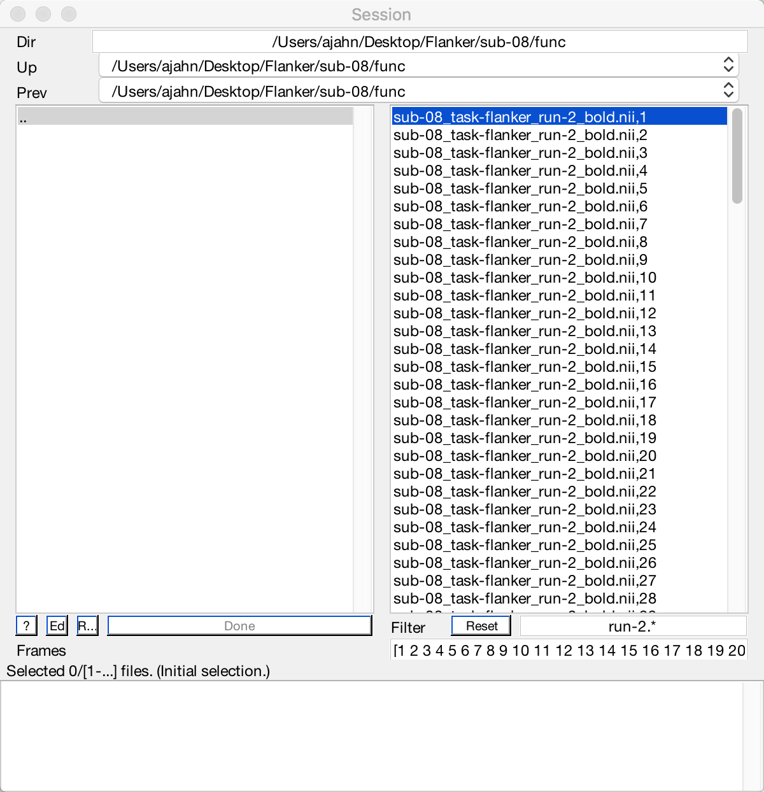

.. _01_SPM_Realign_Unwarp:

============================================
Chapter 1: Realigning and Unwarping the Data
============================================

---------------

The first step of preprocessing is to **realign** the functional images. If you think of a time-series as a deck of cards, with each volume as a separate card, realignment will put all the cards in the same orientation and make the sides line up - similar to what you do after you shuffle a deck of cards. 

If you click on the button ``Realign (Estimate & Reslice)``, a window opens up showing the options for realigning and reslicing the data. The ``Estimate`` part refers to estimating the amount that each volume is out of alignment with a **reference volume**, and ``Reslice`` indicates that these estimates will be used to nudge each of the volumes into alignment with the reference volume. The reference volume is set in the field "Num Passes", which allows you to specify whether the volumes will be aligned to the mean of all of the volumes, or to the first volume. For this tutorial, leave it as the default, and leave the rest of the defaults alone, as well.

  This menu will appear after you click on the "Realign: Estimate & Reslice" button.

.. note::

  In this preprocessing step and in the steps that follow, we will leave most of the defaults as they are. These defaults have been computed to produce the best results for a wide range of image field of views, voxel sizes, and so on; that said, you may find that it is useful to change the defaults of the File Prefix, for example, to something you find more intelligible. If you decide to change any of the other options, clicking on them will open a help file which is displayed in the information box at the bottom of the Batch Editor screen.
  
  
Loading the Images
******************

In this experiment, there were two runs of data per subject (SPM refers to each run as a **session**). If you click on the ``Data`` field, you will see an option to add more sessions. Click on ``New: Session`` to add another session. You will see an ``<-X`` to the right of each Session field, indicating that this field needs to be filled in before the program can be run.

Double-click on the first session to open up the Image Selection window. Navigate to the ``func`` directory and select the file ``sub-08_task-flanker_run-1_bold.nii,1``. The ``,1`` at the end of the file name indicates that only the first **frame**, or volume, is available for selection. In order to select all of the volumes for that run, we will need to **expand** the number of frames available for selection. In the ``Frames`` field (underneath the ``Filter`` field), type ``1:146`` and press enter.

.. note::

  If you don't know how many frames are in the current dataset, you can set the upper bound to an arbitrarily high number - e.g., ``1:10000``. This command will max out at the number of available frames, and will ensure that you do not miss any.

However, you will notice that all of the frames for both run-1 and run-2 have been selected, even though we only want the frames for run-1. You could simply click and drag from frame 1 to frame 146 for run-1, but you risk accidentally including other frames by mistake. To restrict our file selection to only the frames we are interested in, on the other hand, we can use the ``Filter`` field. This field uses **regular expressions**, a type of coding shorthand to indicate which characters to include in a string. In this case, to the left of the ``.*`` characters that are already in the field, type ``run-1`` and press return. This will refresh the screen to display only those frames which include the string ``run-1``. Either click and drag to select all of the images, or right click in the selection window and click ``Select All``.

  The figure selection screen. If you have followed the instructions above, the window should look like this. Note that entering the string ``1:146`` in the ``Frames`` field will automatically expand to ``[1 2 3 4 5 ... 146]``.
  
When you are finished, click ``Done``. Do the same procedure for the second session, using the ``Filter`` field to restrict your search to frames containing the string ``run-2``.

Now that you have filled in all of the fields that had a ``<-X`` next to them, the "Play" button in the top left corner of the screen has changed from grey to green. Click on the button to begin the Realignment preprocessing step.

.. figure:: 01_Realign_Demo.gif

.. note::

  **Regular expressions** can be used to create very specific filters. For example, if you type the string ``run-1.*`` in the Filter field, the file window will return only those files that contain the string "run-1" anywhere in their name. Typing the string ``^sub-08_task-flanker_run-1`` will return any files that *begin* with the string "run-1" (signalized by the carat symbol, ``^``).
  
  
-----------

Exercises
*********

1. In the Filter field, the dollar sign (``$``) can be used to return files that *end* with a particular string. For example, typing ``run-1_bold.*$`` would return those files that end with the string "run-1_bold". Use the filter field to return only those files that end with ``run-2_bold``. If you've run the realignment step, use the filter to field to return those files that begin with ``rsub-08``. Use the Frames field to select the frames 10-20.

2. Re-run the realignment step on just the run-1 images, changing the Quality field from 0.9 to 0.5. When you highlight the Quality field, read the help text at the bottom of the window. What do you think this change will do to the quality of your realignment? To keep these files separate from the other output, change the Filename Prefix to ``qual_05``. Check the output in the Check Reg window, loading a representative image from the rsub-08_task-flanker_run-1 files, and an image from the qual_05 files you just created. Do you notice any difference between them? Why or why not?

3. Re-run the realignment step by changing the Num Passes from "Register to mean" to "Register to first". Read the help file and determine what the tradeoffs are. Which one would you prefer to use as the default for your analysis, and why?

Next Steps
**********

This tutorial has covered the basics of how to use the different menus within the SPM GUI, including how to change options and how to select frames. We will be using these same methods for the rest of the preprocessing steps, continuing with **slice-timing correction**.
