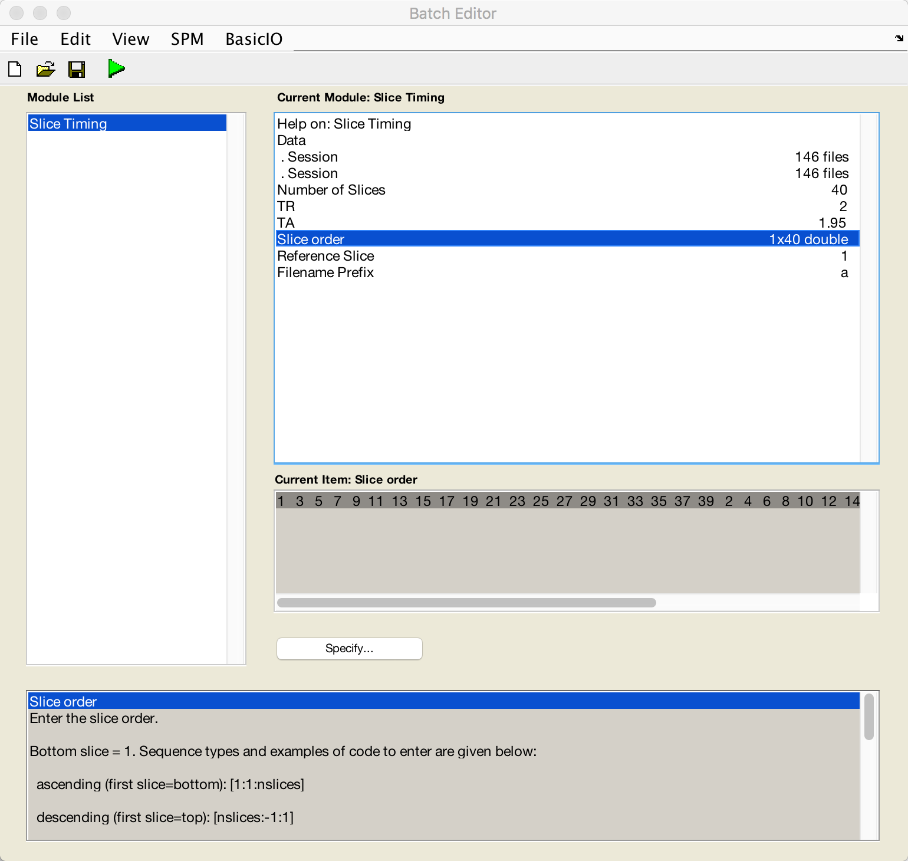

.. _02_SPM_SliceTiming:

==================================
Chapter 2: Slice-Timing Correction
==================================

-------------

Background
**********

Unlike a photograph, in which the entire picture is taken in a single moment, an fMRI volume is acquired in slices. Each of these slices takes time to acquire - from tens to hundreds of milliseconds.

The two most commonly used methods for creating volumes are sequential and interleaved slice acquisition. Sequential slice acquisition acquires each adjacent slice consecutively, either bottom-to-top or top-to-bottom. Interleaved slice acquisition acquires every other slice, and then fills in the gaps on the second pass. Both of these methods are illustrated in the video below.

.. figure:: 04_02_SliceTimingCorrection_Demo.gif

.. note::

  For another illustration of how slice-timing works using **linear interpolation**, see `Matthew Brett's page <https://matthew-brett.github.io/teaching/slice_timing.html>`__.

As you'll see later on, when we model the data at each voxel we assume that all of the slices were acquired simultaneously. To make this assumption valid, the :ref:`time-series <Time_Series>` for each slice needs to be shifted back in time by the duration it took to acquire that slice. `Sladky et al. (2011) <https://www.sciencedirect.com/science/article/pii/S1053811911007245>`__ also demonstrated that slice-timing correction can lead to significant increases in statistical power for studies with longer TRs (e.g., 2s or longer), and especially in the dorsal regions of the brain.

Although slice-timing correction seems reasonable, there are some objections:

1. In general, it is best to not interpolate (i.e., edit) the data unless you need to;

2. For short TRs (e.g., around 1 second or less), slice-timing correction doesn't appear to lead to any significant gains in statistical power; and

3. Many of the problems addressed by slice-timing correction can be resolved by using a **temporal derivative** in the statistical model (discussed later in the chapter on model fitting).

For now, we will do slice-timing correction, using the first slice as the reference.

Doing Slice-Timing Correction in SPM
************************************

Similar to what we did with :ref:`Realignment <01_SPM_RealignUnwarp>`, we will first click on the ``Slice Timing`` button in the SPM GUI. Click on the ``Data`` field and create two new Sessions. Double-click on the first Session, and in the Filter column type ``^rsub-08_task-flanker_run-1.*``. In the Frames field, enter ``1:146`` and press enter; select all of the frames that are displayed, and click ``Done``. Do the same procedure for the run-2 files for the second session.

For the ``Number of Slices`` field, we will need to find out how many slices there are in each of the volumes in our dataset. From the Matlab terminal navigate to the directory ``sub-08/func`` and type:

::

  V = spm_vol('sub-08_task-flanker_run-1_bold.nii')
  
This will load the **header** of the image into a variable called ``V``. If you now type ``V`` and press return, you will see that it contains the following fields:

::

    fname
    dim
    dt
    pinfo
    mat
    n
    descrip
    private
    
``fname`` is the name of the file, and ``dim`` contains the dimensions for each volume in the file. (We won't be looking at the other fields right now; all you need to know is that they contain other header information that SPM needs to read the file.) If you type
 
::

  V(1).dim

It will return the dimensions of the first volume in the time-series in the x-, y-, and z-directions. You should see something like this:

::

  64 64 40
  
This means that the first volume of the time-series has the dimensions of 64x64x40 voxels, with 40 being the number of **slices** in the z-dimensions. We will assume that the dimensions of each image and the number of slices will be the same for every volume in the subject's functional data.

Now go back to the Batch Editor window, double-click on ``Number of Slices``, enter a value of ``40``, and click ``OK``. 

For the TR, enter 2; for the TA, follow the formula provided in the help window and enter ``2-(2/40)``. For Slice order enter ``[1:2:40 2:2:40]``, and for the Reference Slice enter a value of ``1``. Leave the filename prefix as is, which will prepend an ``a`` to the files that are generated. Do this same procedure for run-2 as well. When you are finished, the preprocessing window should look like this:

When the images have been slice-time corrected, you are ready to **coregister** the functional data to the anatomical data; in other words, we will align the two sets of images as best we can.

Exercises
*********

1. Sometimes the slices are acquired from the bottom to the top of the volume, without any interleaving. How would you change the code for the slice order to reflect this?

2. Now do the same edits, but for slices that are interleaved going from the top of the volume to the bottom.

3. Download another functional run from a random study on openneuro.org, and use spm_vol to determine how many slices there are. Repeat exercises 1 and 2 for this dataset.
