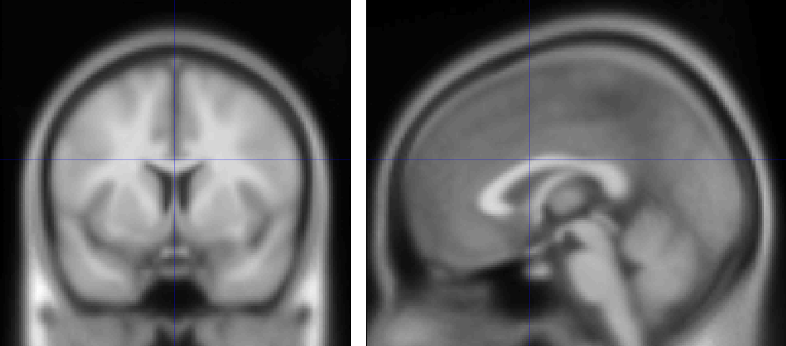
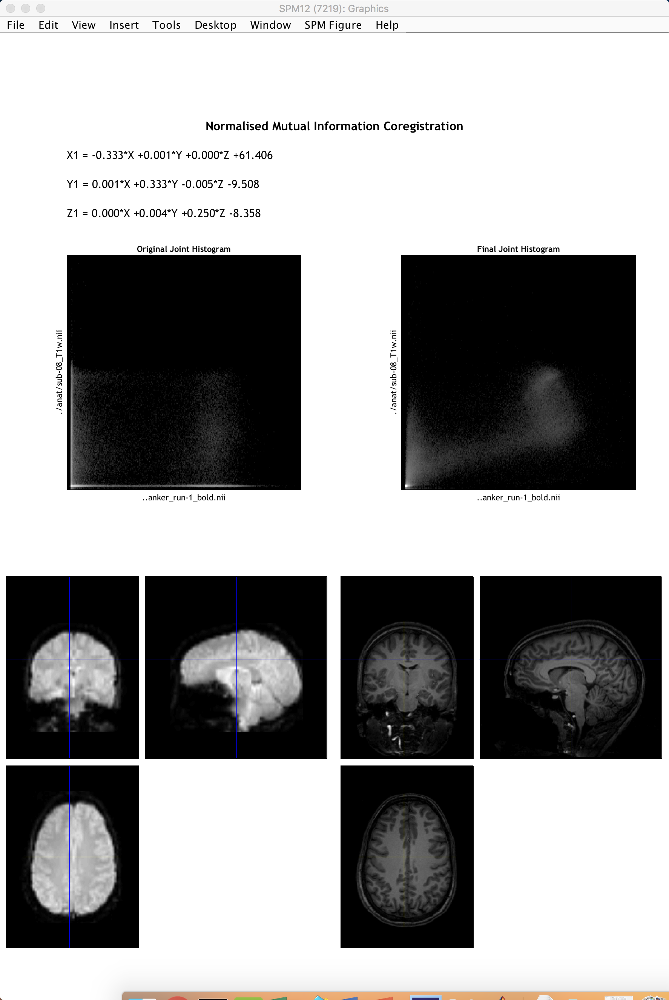

.. _03_SPM_Coregistration:

=========================
Chapter 3: Coregistration
=========================

-------------

Overview
********

Although most people's brains are similar - everyone has a cingulate gyrus and a corpus callosum, for instance - there are also differences in brain size and shape. As a consequence, if we want to do a group analysis we need to ensure that each voxel for each subject corresponds to the same part of the brain. If we are measuring a voxel in the visual cortex, for example, we would want to make sure that every subject's visual cortex is in alignment with each other.

This is done by **Registering** and **Normalizing** the images. Just as you would fold clothes to fit them inside of a suitcase, each brain needs to be transformed to have the same size, shape, and dimensions. We do this by normalizing (or **warping**) to a **template**. A template is a brain that has standard dimensions and coordinates - standard, because most researchers have agreed to use them when reporting their results. That way, if you normalize your data to that template and find an effect at coordinates X=3, Y=20, Z=42, someone else who has warped their data to the same template can check their results against yours. The dimensions and coordinates of the template brain are also referred to as **standardized space**.

  An example of a commonly used template, the :ref:`MNI152 brain <MNI>`. This is an average of 152 healthy adult brains, which represent the population that most studies draw from. If you are studying another population - such as children or the elderly, for example - consider using a template created from representatives of that population. (Question: Why is the template blurry?)
  
Affine Transformations
****************

To warp the images to a template, we will use an **affine transformation**. This is similar to the rigid-body transformation described above in Motion Correction, but it adds two more transformations: **zooms** and **shears**. Whereas translations and rotations are easy enough to do with an everyday object such as a pen, zooms and shears are more unusual - zooms either shrink or enlarge the image, while shears take the diagonally opposite corners of the image and stretch them away from each other. The animation below summarizes these four types of **linear transformations**.

.. figure:: 04_03_AffineTransformations.gif

.. note:: As with rigid-body transformations, zooms and shears each have three degrees of freedom: You can zoom or shear an image along the x-, y-, or z-axis. In total, then, affine transformations have twelve degrees of freedom. These are also called linear transformations because a transformation applied in one direction along an axis is accompanied by a transformation of equal magnitude in the opposite direction. A translation of one millimeter *to* the left, for example, implies that the image has been moved one millimeter *from* the right. Likewise, if an image is enlarged by one millimeter along the z-axis, it is enlarged by one millimeter in both directions along that axis. Transformations without these constraints are called **nonlinear transformations**. For example, a nonlinear transformation can enlarge the image in one direction while shrinking it in the other direction, as when squeezing a sponge. These types of transformations will be discussed later.

Registration and Normalization
***************

Recall that we have both anatomical and functional images in our dataset. Our goal is to warp the functional images to the template so that we can do a group-level analysis across all of our subjects. Although it may seem reasonable to simply warp the functional images directly to the template, in practice that doesn't work very well - the images are low-resolution, and therefore less likely to match up with the anatomical details of the template. The anatomical image is a better candidate.

Although this may not seem to help us towards our goal, in fact warping the anatomical image can assist with bringing the functional images into standardized space. Remember that the anatomical and functional scans are typically acquired in the same session, and that the subject's head moves little, if at all, between the scans. If we have already normalized our anatomical image to a template and recorded what transformations were done, we can apply the same transformations to the functional images - provided they start in the same place as the anatomical image.

This alignment between the functional and anatomical images is called **Registration**. Most registration algorithms use the following steps:

1. Assume that the functional and anatomical images are in roughly the same location. If they are not, align the outlines of the images.

2. Take advantage of the fact that the anatomical and functional images have different contrast weightings - that is, areas where the image is dark on the anatomical image (such as cerebrospinal fluid) will appear bright on the functional image, and vice versa. This is called **mutual information**. The registration algorithm moves the images around to test different overlays of the anatomical and functional images, matching the bright voxels on one image with the dark voxels of another image, and the dark with the bright, until it finds a match that cannot be improved upon. This procedure is also known as a **cost function**.

3. Once the best match has been found, then the same transformations that were used to warp the anatomical image to the template are applied to the functional images.

.. figure:: 04_03_Registration_Normalization_Demo.gif

-----

Co-registration with SPM
************************

To co-register the functional and anatomical images, go back to the SPM GUI and click on ``Coregister (Estimate & Reslice)``. This will open up a batch editor window with only two fields that need to be filled in - a **Reference Image** and a **Source Image**.

The Reference Image is the image that will remain stationary; the Source Image, on the other hand, is moved around until a best fit is found between the Reference and the Source image, using the cost functions described above. For most experiments, you will want to use a representative of the functional data as the Reference Image, and the anatomical data as the Source Image, since we generally want to introduce as few edits as possible to the functional data.

Double-click on the Reference Image, and select the ``meansub-08_task-flanker_run-1_bold.nii``. For the source image, navigate to the ``anat`` directory and select the file ``sub-08_T1w.nii``. Then click the green Go button. This step should only take a few moments.

When it finishes, another window will be generated showing the coregistration results with the mean functional image on the left and the anatomical image on the right. Click and drag the crosshairs in either image to see how well the images are aligned - in addition to the outlines of the brains being matched, you should also check to make sure that internal structures such as the ventricles are aligned as well. Remember that the intensities will be flipped: Darker areas in the anatomical image (such as the ventricles) will appear brighter in the functional image.

.. note::

  Open the resliced anatomical image by itself using the Display Image button (i.e.,load the image ``rsub-08_T1w.nii``). What do you notice about the image as compared to the original anatomical image? (Hint: Compare the numbers in the "Dimension" and "Vox size" fields.)

--------------

Exercises
*********

1. As with the :ref:`Realignment step <01_SPM_Realign_Unwarp>`, we have the option of making the coregistration step faster but lower quality, or slower but higher quality. Use the "Interpolation" field to examine the differences between the different options that are available, and set it to "Nearest Neighbour". Change the Filename prefix to "NN", and run the coregistration. What do you notice about the output? How does it compare to the default interpolation of "4th Degree B-Spline"? Next, test how using the option of "7th Degree B-Spline" changes the output. Take screenshots of the output from NN, 4th-Degree B-Spline, and 7th Degree B-Spline, and label them clearly.

2. Try swapping the Reference and the Source Images - that is, make the anatomical image the Reference, and the functional image the Source. (Remember to change the Filename prefix to something that makes sense to you, in order to keep the outputs organized.) How have the dimensions and resolution of the functional data changed? Keeping in mind that we have a total of 292 functional volumes as compared to 1 anatomical volume, and knowing that a higher resolution dataset takes up more space on the computer, what reasons could be given for keeping the anatomical image as the Source, and the functional data as the Reference?

Next Steps
**********

Now that we have co-registered the images, we are ready to normalize all of our data to a standardized space. Before we can do that, however, we need to **Segment** the anatomical image in order to more accurately align the different tissue types when we normalize the anatomical image.
