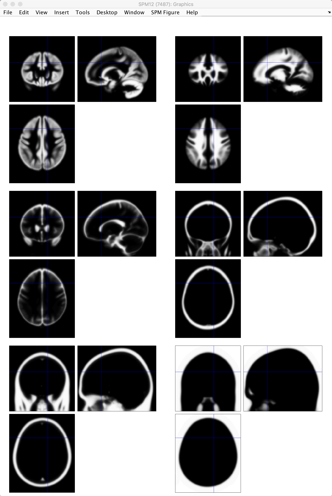

.. _04_SPM_Segmentation:

========================
Chapter 4: Segmentation
========================

-------------

Tissue Probability Maps
***********************

The brain is composed of two main tissue types: Grey matter (representing high densities of unmyelinated neurons) and white matter (representing high densities of myelinated neurons). The brain is also surrounded by a fluid layer of cerebrospinal fluid (CSF), and large amounts of CSF are contained in internal spaces within the brain called ventricles.

Knowing which voxels belong to which tissue type can assist in :ref:`Normalizing <05_SPM_Normalize>` the anatomical image, or warping it to match a template in standardized space. SPM has images of six tissue priors representing their best guess as to which voxel in standardized space belongs to which tissue type. Accurately mapping the tissues of our anatomical image to the tissues of the template will increase the accuracy of our registration.

Why six priors, instead of the three we just listed? The anatomical image also contains non-brain tissues, such as soft tissue (e.g., dura mater) and skull. The last tissue type is reserved for all other tissues not captured by any of the above; usually this just means air inside the sinuses and outside the brain, but it can also indicate a tumor.

  SPM's tissue priors, located in the file ``spm12/tpm/TPM.nii``. The tissue priors, from going from left to right on each row, are: Grey matter; white matter; CSF; soft tissue; bone; other.
  
Setting up the Segmentation step only requires the realigned anatomical file as input. Click on the ``Segmentation`` button from the SPM GUI, and double-click the ``Volumes`` field. Select the file ``rsub-08_T1w.nii``, and then set the ``Save Bias Corrected`` field from ``Save Nothing`` to ``Save Bias Corrected``. Also change ``Deformation Fields`` to ``Forward``. Then click the green Go button.

Once the segmentation has finished, you are now ready to use the information generated by this step for **Normalization**. We turn to that next.
