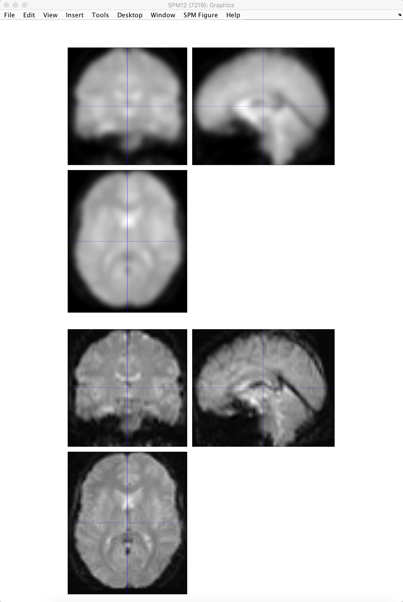

.. _06_SPM_Smoothing:

==================
Chapter 5: Smoothing
==================

------

Why Smooth?
***********

It is common to **smooth** the functional data, or replace the signal at each voxel with a weighted average of that voxel's neighbors. This may seem strange at first - why would we want to make the images blurrier than they already are?

It is true that smoothing does decrease the spatial resolution of your functional data, and we don't want less resolution. But there are benefits to smoothing as well, and these benefits can outweigh the drawbacks. For example, we know that fMRI data contain a lot of noise, and that the noise is frequently greater than the signal. By averaging over nearby voxels we can cancel out the noise and enhance the signal.

.. figure:: 05_06_Smoothing_Demo.gif

  In this animation, two different smoothing kernels (4mm and 10mm) are applied to an fMRI scan. Notice that as we use larger smoothing kernels, the images become blurrier and the anatomical details become less distinct. Also note that, for the sake of simplicity, this animation uses a 2D slice of the brain to demonstrate this preprocessing step. In actual fMRI data, the kernel would be applied in all three dimensions.
  
  
How to Smooth in SPM
********************

In the SPM GUI, click on the ``Smooth`` button and double-click on ``Images to Smooth``. Select the warped functional images, and expand them to include all 146 frames for each run. (See the previous chapters for examples on how to use the Filter and Frames fields to select the images that you want.) Leave the other defaults as they are, and then click on the green Go button.

.. note::

  The default FWHM of 8x8x8mm is probably too large for most studies; it may help boost the signal over larger cortical regions, but it is likely to diulte the signal of functionally smaller but more homogeneous regions. Once you have finished this series, you are encouraged to test different smoothing kernels to see how it affects the profile and the significance of your results.
  
  
Checking the Smoothed Images
****************************

As before, use the ``Check Reg`` button to load a representative volume from the output you just created, and view it side by side with a warped functional image that hasn't been smoothed. Does it look like the image has been smoothed the amount that you wanted?

