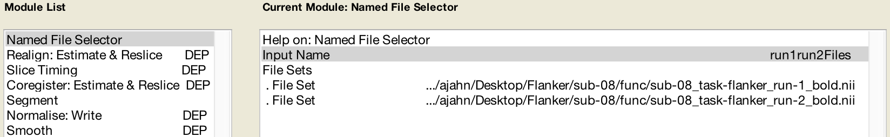
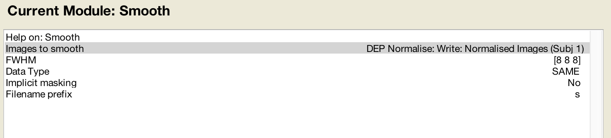

.. _SPM_06_Scripting:

===========================
SPM Tutorial #6: Scripting
===========================

----------

Overview
********

After you've preprocessed and set up a model for a single run for a single subject, you will need to do the same steps for all of the runs for all of the subjects in your dataset. This may seem tedious but doable - we only have twenty-six subjects, and two runs per subject. You may think that it can be done over the course of a week or so; and you can always assign the task to a couple of Research Assistants.

This attitude is admirable, and if you take this approach you will be able to analyze all of the data eventually. But at some point you will run into two problems:

1. You will find that manually analyzing each run is not only tedious but prone to error, and the probability of making a mistake increases significantly as the number of runs to analyze also increases; and

2. For larger datasets - for example, eighty subjects with five runs each - this approach quickly becomes impractical.

An alternative is to **script** your analysis. Just as an actor has a script which tells him what to say and where to stand and where to move, so can you write a script that tells your computer how to analyze your datasets. This has the double benefit of automating your analyses and being able to analyze datasets of any size - the code for analyzing two subjects or two hundred is virtually identical.

First we will create a template that contains the code needed to analyze a single run, and then we will use a :ref:`for-loop  <Unix_05_ForLoops>` to automate the analysis for all of the runs. The idea is simple; and although the code can be difficult to understand at first, once you become more comfortable with it you will see how you can apply it to any dataset.

.. note::

  The following tutorial complements the Unix tutorial on :ref:`automating the analysis <Unix_09_AutomatingTheAnalysis>`. I recommend reading through that chaper if you need to review the Unix terms for scripting.

Creating the Template
*********************

When we analyzed the data for ``sub-08``, clicking on each preprocessing button of the SPM GUI opened up a **Batch Editor** window. To create our script template, we will begin with the Batch Editor and add each of the preprocessing **modules** to our batch. We will then fill in the required inputs for each preprocessing and statistical modeling section, just like we did in the previous tutorials, and convert what we see in the GUI into Matlab code.

To begin, open up the SPM GUI and click on the ``Batch`` button. From the top of the Batch Editor window, click on the ``SPM`` menu and select the following modules in this order:

::

  BasicIO -> File/Dir Operations -> File Operations -> Named File Selector
  SPM -> Spatial -> Realign -> Estimate & Reslice
  SPM -> Temporal -> Slice Timing
  SPM -> Spatial -> Coregister: Estimate & Reslice
  SPM -> Spatial -> Segment
  SPM -> Spatial -> Normalise -> Write
  SPM -> Spatial -> Smooth
  BasicIO -> File/Dir Operations -> File Operations -> File Set Split
  SPM -> Stats -> fMRI Model Specification
  SPM -> Stats -> Model Estimation
  SPM -> Stats -> Contrast Manager
  
When you are done the "Module List" panel should look like this:

.. figure:: 06_ModuleList.png

File Selection and File Splitting
^^^^^^^^^^^^^^^^^^^^^^^^^^^^^^^^^

You may have noticed two additional modules that don't appear to have anything to do with analyzing the data directly. These are the ``Named File Selector`` and ``File Set Split`` modules.

The first one, ``Named File Selector``, requires an input name and sets of files. We will create two file sets, and enter the ``run-1_bold.nii`` and ``run-2_bold.nii`` files for each set. When we come to the first preprocessing module, Realignment, we create two sessions and enter the respective files for each session.

The Smoothing module only accepts one session of images - in our example, the images that are output by the Normalisation module. Since the following preprocessing module, Model Specification, requires a separate set of files for each session, we can't use the single file set from the Smoothing module as a **dependency** (explained in more detail below). The File Set Split module allows us to split the single set of output images from the Smoothing module into two separate sets, which we can then use as dependencies in the Model Specification module.

First, we label the File Set Name as ``run1run2FileSplit`` (this name is simply a label for reference in modules that come afterward). The Input File Set is the smoothed images from the Smoothing module, and as with the Named File Selector module, we create two Output File Sets. The Selection Index for the first one is ``1``, and the Selection Index for the second one is ``2``. This directs the module to split the smoothed images into two separate sets, based on how they were labeled by the previous Named File Selector module.

.. figure:: 06_FileSetSplit.png

Filling in the Preprocessing Modules
^^^^^^^^^^^^^^^^^^^^^^^^^^^^^^^^^^^^

You will now need to fill in each of the required fields, just like we did in the previous chapters. This will be the most tedious part of the tutorial, but remember: If you don't script your analysis, you would have to do this manually for *every subject in your study*. The amount of time that would take, coupled with the fact that the odds of making a mistake increase with each subject you analyze by hand, should make this part seem worth the effort.

As you go along, at some point you may wonder what you are supposed to input for a later preprocessing step if the required data hasn't been created yet. The Batch Editor allows you to use **Dependencies** from earlier steps, indicating that the input should come from the output of the previous step. For example, in the Realign module for the first Session if you click the ``Dependency`` button, you can select the option "Named File Selector: run1run2Files(1)", and likewise for the second Session. It should look like this once you have filled it in:

And the same with the Slice Timing module:

Likewise, the Coregister step's Reference Image can use the mean functional image generated during Realignment:

This is followed by Segmentation, which will use the same parameters that we specified :ref:`earlier <04_SPM_Segmentation>`:

.. figure:: 06_SegmentDependency.png

The Normalise preprocessing step requires both the Forward Deformation fields from Segmentation, as well as both the Slice Timing outputs from Sessions 1 and 2 (which you can select by holding shift and clicking):

The Smooth module will use the images generated by Normalization:

And the Model Specification module will use the images created during Smoothing:

The Model Estimation module analyzes the data output from Model Specification:

.. figure:: 06_ModelEstimationDependency.png

And lastly, the contrast manager will load the SPM.mat file created by the Model Estimation module:

.. figure:: 06_ContrastDependency.png

For the contrast module, we select the "Replicate&Scale" option. This will replicate the contrast weights across all of the sessions for that subject, and scale them in inverse proportion to the number of sessions. In this example, since there are two sessions, each contrast weight will be scaled to 0.5 and -0.5, respectively.

Editing the Matlab file
************************

The Batch module we have just created is specific to ``sub-08``: We have used sub-08's images and timing files, and the results will only apply to sub-08. If you clicked on the green Go button, it would run all of the preprocessing and model estimation steps in one go. With a few adjustments, however, we can adapt this module to all of the other subjects in our study.

First, we need to save the modules into a Matlab script. Click on ``File -> Save Batch and Script``, and label the file ``RunPreproc_1stLevel``. Save it to the Flanker directory that contains all of your subjects. This will create a Matlab script file that you can open in the Matlab window.

From the Matlab terminal, navigate to the Flanker directory which contains the RunPreproc_1stLevel.m script, and type

::

  open RunPreproc_1stLevel_job.m
  
To adapt this file so that it can analyze any subject, we will need to make the following edits:

1. Replace the number "08" with a variable containing a different subject number on each instance of a for-loop; and 
2. Replace the username (in this case, "ajahn") with a variable pointing to the username of whichever machine is currently being used.

These two changes will allow us to place the existing code in a for-loop which will run over a set of numbers indicating each subject in the study.

At the beginning of the script, type the following code:

::

  subjects = [01 02]; % Replace with a list of all of the subjects you wish to analyze

  user = getenv('USER'); % Will return the username for OSX operating systems

  for subject=subjects

  subject = num2str(subject, '%02d');

  if exist(['/Users/' user '/Desktop/Flanker/sub-' subject '/func/sub-' subject '_task-flanker_run-1_bold.nii']) == 0
      display('Run 1 has not been unzipped; unzipping now')
      gunzip(['/Users/' user '/Desktop/Flanker/sub-' subject '/func/sub-' subject '_task-flanker_run-1_bold.nii.gz'])
  else
      display('Run 1 is already unzipped; doing nothing')
  end

  if exist(['/Users/' user '/Desktop/Flanker/sub-' subject '/func/sub-' subject '_task-flanker_run-2_bold.nii']) == 0
      display('Run 2 has not been unzipped; unzipping now')
      gunzip(['/Users/' user '/Desktop/Flanker/sub-' subject '/func/sub-' subject '_task-flanker_run-2_bold.nii.gz'])
  else
      display('Run 2 is already unzipped; doing nothing')
  end

  if exist(['/Users/' user '/Desktop/Flanker/sub-' subject '/anat/sub-' subject '_T1w.nii']) == 0
      display('Anatomical image has not been unzipped; unzipping now')
      gunzip(['/Users/' user '/Desktop/Flanker/sub-' subject '/anat/sub-' subject '_T1w.nii.gz'])
  else
      display('Anatomical image is already unzipped; doing nothing')
  end
  
  
You should also type the word ``end`` at the last line of the script to indicate that all of the code that comes before is part of the for-loop.

The above code does the following: 

* First, an **array** of numbers is created and stored in the variable **subjects**. The values are ``01`` and ``02``; later on, we will expand this array to include all of the subject identification numbers in our experiment. 

* Next, the variable ``user`` takes the value returned from the command ``getenv('USER')``. This should return the username of the current user of the computer - in the current example, "ajahn".

* We then begin a for-loop that is initialized with the code ``for subject=subjects``. This means that a new variable, "subject", will assume the value of each consecutive entry in the array "subjects". In other words, the first instance of the loop will assign the value "01" to subject; on the second instance, it will assign the value "02", and so on, until the loop reaches the end of the array.

* Since an array will strip any leading zeros, and since we need to convert the numbers in our array to a string, the "subject" variable is converted using the ``num2str`` command. The text ``'%02d'`` is **string-formatting code** indicating that the current value being converted from a number to a string should be **zero-paddded** with as many zeros as needed until the number is two characters long. (Details about string formatting can be found `here <https://www.mathworks.com/help/matlab/matlab_prog/formatting-strings.html>`__.)

* The :ref:`conditional statements <Unix_06_IfElse>` look for whether the unzipped functional and anatomical files exist, and if they don't, the files are unzipped using Matlab's ``gunzip`` command.

Concatenating strings
^^^^^^^^^^^^^^^^^^^^^

Throughout the rest of the code that was generated when we saved the Batch module as a Matlab script, we will need to replace each instance of ``08`` with the string ``subject``, and each instance of ``ajahn`` (or whatever your username is) with the variable ``user`` that was defined above. This can be done using search and replace, but be careful that there aren't other instances of the string "08" that aren't attached to the string "sub-".

In the example code above, we used brackets to **horizontally concatenate** strings with variables. A line of code like the following:

::

  ['/Users/' user '/Desktop/Flanker/sub-' subject '/anat/sub-' subject '_T1w.nii']
  
will concatenate the strings surrounded by single apostrophes with the variables. If the variable "user" contains the value "ajahn" and the variable "subject" contains the value "08", then the above code would expand to the following:

::

  '/Users/ajahn/Desktop/Flanker/sub-08/anat/sub-08_T1w.nii'
  
You will need to perform these substitutions for the rest of the script, taking care to use single apostrophes to set off the strings from the variables. Brackets will be required for this concatenation, even within the **cells** denoted by curly braces. (Cells are arrays that can contain several different data types, such as strings and numbers.)

Loading the Onset Files
^^^^^^^^^^^^^^^^^^^^^^^

The last part of the script we have to edit is the onset times. In this experiment, each subject had different onset times for each condition. If the timing files have already been converted to a different format, then you can create a variable that contains the timing information and insert it into the "onset" field for the stats module. For example, the following code found around line 107 of the Matlab script can be changed from this, which contains onset times specific to sub-08:

::

  matlabbatch{9}.spm.stats.fmri_spec.sess(1).cond(1).onset = [0
                                                            10
                                                            20
                                                            52
                                                            88
                                                            130
                                                            144
                                                            174
                                                            248
                                                            260
                                                            274];
                                                            
To this:

::

  data_incongruent_run1 = load(['/Users/' user '/Desktop/Flanker/sub-' subject '/func/incongruent_run1.txt']);

  matlabbatch{9}.spm.stats.fmri_spec.sess(1).cond(1).onset = data_incongruent_run1(:,1);
  
In which the variable ``data_incongruent_run1`` stores the onset times for the subject in the current loop, and then enters those numbers into the onset field. Note that the code (:,1) indicates that only the first column of the variable should be read, which contains the onset times.

.. note::

  You will need to read the onset times for each session and each condition separately - i.e., you will need to create variables for the Incongruent and Congruent conditions for both run 1 and run 2.
  
  
Running the Script
******************
  
When you have finished editing the script, save it and return to the Matlab terminal. You can then execute the script by typing:

::

  RunPreproc_1stLevel_job
  
You will then see windows pop up as each preprocessing and statistical module is run, similar to what you would see if you executed each module manually through the GUI.

Next Steps
**********

The script should only take a few minutes to run for both sub-01 and sub-02. When you are finished, we will examine the output; and as you will see, there are still some issues that need to be resolved. To see what the problems are, and how to fix them, click the ``Next`` button.

A copy of this script can be found on Andy's github page located `here <https://github.com/andrewjahn/SPM_Scripts/blob/master/RunPreproc_1stLevel_job.m>`__. Note that the script is set up to analyze all 26 subjects in the dataset.

Video
*****

For a video tutorial of how to script your analysis in SPM, click `here <https://www.youtube.com/watch?v=-1m8nriF11I>`__.
