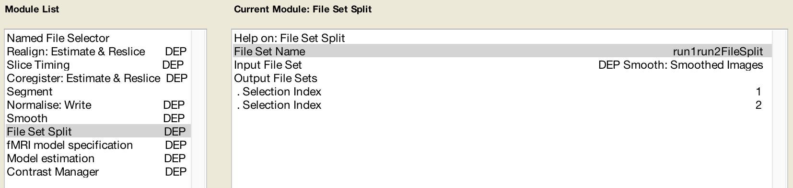

.. _SPM_06_Scripting:

===========================
SPM Tutorial #6: Scripting
===========================

----------

Overview
********

After you've preprocessed and set up a model for a single run for a single subject, you will need to do the same steps for all of the runs for all of the subjects in your dataset. This may seem tedious but doable - we only have twenty-six subjects, and two runs per subject. You may think that it can be done over the course of a week or so; and you can always assign the task to a couple of Research Assistants.

This attitude is admirable, and if you take this approach you will be able to analyze all of the data eventually. But at some point you will run into two problems:

1. You will find that manually analyzing each run is not only tedious but prone to error, and the probability of making a mistake increases significantly as the number of runs to analyze also increases; and

2. For larger datasets - for example, eighty subjects with five runs each - this approach quickly becomes impractical.

An alternative is to **script** your analysis. Just as an actor has a script which tells him what to say and where to stand and where to move, so can you write a script that tells your computer how to analyze your datasets. This has the double benefit of automating your analyses and being able to analyze datasets of any size - the code for analyzing two subjects or two hundred is virtually identical.

First we will create a template that contains the code needed to analyze a single run, and then we will use a :ref:`for-loop  <Unix_05_ForLoops>` to automate the analysis for all of the runs. The idea is simple; and although the code can be difficult to understand at first, once you become more comfortable with it you will see how you can apply it to any dataset.

.. note::

  The following tutorial complements the Unix tutorial on :ref:`automating the analysis <Unix_09_AutomatingTheAnalysis>`. I recommend reading through that chaper if you need to review the Unix terms for scripting.

Creating the Template
*********************

When we analyzed the data for ``sub-08``, clicking on each preprocessing button of the SPM GUI opened up a **Batch Editor** window. To create our script template, we will begin with the Batch Editor and add each of the preprocessing **modules** to our batch. We will then fill in the required inputs for each preprocessing and statistical modeling section, just like we did in the previous tutorials, and convert what we see in the GUI into Matlab code.

To begin, open up the SPM GUI and click on the ``Batch`` button. From the top of the Batch Editor window, click on the ``SPM`` menu and select the following modules in this order:

::

  SPM -> BasicIO -> File/Dir Operations -> File Operations -> Named File Selector
  SPM -> Spatial -> Realign -> Estimate & Reslice
  SPM -> Temporal -> Slice Timing
  SPM -> Spatial -> Coregister: Estimate & Reslice
  SPM -> Spatial -> Segment
  SPM -> Spatial -> Normalise -> Write
  SPM -> Spatial -> Smooth
  SPM -> BasicIO -> File/Dir Operations -> File Operations -> File Set Split
  SPM -> Stats -> fMRI Model Specification
  SPM -> Stats -> Model Estimation
  SPM -> Stats -> Contrast Manager
  
When you are done the "Module List" panel should look like this:

.. figure:: 06_ModuleList.png

File Selection and File Splitting
^^^^^^^^^^^^^^^^^^^^^^^^^^^^^^^^^

You may have noticed two additional modules that don't appear to have anything to do with analyzing the data directly. These are the ``Named File Selector`` and ``File Set Split`` modules.

The first one, ``Named File Selector``, requires an input name and sets of files. We will create two file sets, and enter the ``run-1_bold.nii`` and ``run-2_bold.nii`` files for each set. When we come to the first preprocessing module, Realignment, we create two sessions and enter the respective files for each session.

.. figure:: 06_NamedFileSelector.png

The Smoothing module only accepts one session of images - in our example, the images that are output by the Normalisation module. Since the following preprocessing module, Model Specification, requires a separate set of files for each session, we can't use the single file set from the Smoothing module as a **dependency** (explained in more detail below). The File Set Split module allows us to split the single set of output images from the Smoothing module into two separate sets, which we can then use as dependencies in the Model Specification module.

First, we label the File Set Name as ``run1run2FileSplit`` (this name is simply a label for reference in modules that come afterward). The Input File Set is the smoothed images from the Smoothing module, and as with the Named File Selector module, we create two Output File Sets. The Selection Index for the first one is ``1``, and the Selection Index for the second one is ``2``. This directs the module to split the smoothed images into two separate sets, based on how they were labeled by the previous Named File Selector module.

Filling in the Preprocessing Modules
^^^^^^^^^^^^^^^^^^^^^^^^^^^^^^^^^^^^

You will now need to fill in each of the required fields, just like we did in the previous chapters. This will be the most tedious part of the tutorial, but remember: If you don't script your analysis, you would have to do this manually for *every subject in your study*. The amount of time that would take, coupled with the fact that the odds of making a mistake increase with each subject you analyze by hand, should make this part seem worth the effort.

As you go along, at some point you may wonder what you are supposed to input for a later preprocessing step if the required data hasn't been created yet. The Batch Editor allows you to use **Dependencies** from earlier steps, indicating that the input should come from the output of the previous step. For example, in the Slice Timing module for the first Session if you click the ``Dependency`` button, you can select the option "Realign: Estimate & Reslice: Resliced Images (Sess 1)". (We select the resliced images, since that is the last output from the Realignment step.) For example, the Slice Timing step should look like this once you have filled it in:

.. figure:: 06_SliceTimingDependency.png

Likewise, the Coregister step's Reference Image can use the mean functional image generated during Realignment:

.. figure:: 06_CoregisterDependency.png

The Normalise preprocessing step requires both the Forward Deformation fields from Segmentation, as well as both the Slice Timing outputs from Sessions 1 and 2 (which you can select by holding shift and clicking):

.. figure:: 06_NormaliseDependency.png

The Smooth module will use the images generated by Normalization:

.. figure:: 06_SmoothDependency.png

And the Model Specification module will use the images created during Smoothing:

.. figure:: 06_ModelSpecificationDependency.png

The Model Estimation module analyzes the data output from Model Specification:

.. figure:: 06_ModelEstimationDependency.png

And lastly, the contrast manager will load the SPM.mat file created by the Model Estimation module:

For the contrast module, we select the "Replicate&Scale" option. This will replicate the contrast weights across all of the sessions for that subject, and scale them in inverse proportion to the number of sessions. In this example, since there are two sessions, each contrast weight will be scaled to 0.5 and -0.5, respectively.

Creating the Matlab file
************************

The Batch module we have just created is specific to ``sub-08``: We have used sub-08's images and timing files, and the results will only apply to sub-08. If you clicked on the green Go button, it would run all of the preprocessing and model estimation steps in one go. With a few adjustments, however, we can adapt this module to all of the other subjects in our study.

First, we need to save the modules into a Matlab script. Click on ``File -> Save Batch and Script``, and label the file ``RunPreproc_1stLevel``. Save it to the Flanker directory that contains all of your subjects. This will create a Matlab script file that you can open in the Matlab window.

From the Matlab terminal, navigate to the Flanker directory which contains the RunPreproc_1stLevel.m script, and type

::

  open RunPreproc_1stLevel.m
  

::

  cp sub-08/subject_results/group.Flanker/subj.sub_08/proc.sub_08 proc_Flanker.sh
  
We will make the following changes to the script:

1. We will remove every reference to ``sub-08``, and turn those strings into a variable that is taken from an argument given to the script. For example, we will change the script so that if we execute it by typing ``tcsh proc_Flanker.sh sub-01``, it will replace the variable in our script with the string ``sub-01``, and analyze that subject's data.

2. We will replace the paths to be more generalizable.

To begin, open the proc_Flanker.sh file in a text editor such as TextWrangler. Scroll to lines 26-31, which contains the following code:

::

  # the user may specify a single subject to run with
  if ( $#argv > 0 ) then
      set subj = $argv[1]
  else
      set subj = sub_08
  endif
  
This is a :ref:`conditional statement <Unix_06_IfElse>` using tcsh syntax. The first few lines state that if the user provides an argument (i.e., an input), then set the variable "subj" to whatever the argument is (see the above text about making changes to the script, #1). If you look through the rest of the script, you will see numerous lines that contain the variable "$subj", which will be replaced by the argument. However, there are many instances - usually involving paths - that still have the string ``sub-08`` hard-coded into them. In order to make the script more flexibile and have it analyze the subject that we specify, we will need to replace these with the "$subj" variable. If you are using TextWrangler, click on "Search" from the menu at the top of the screen, and select "Find". In the "Find" field, type ``sub-08``, and in the "Replace" field, type ``${subj}``. 

Next, we will need to replace any absolute paths with a :ref:`relative path <Unix_04_ShellsVariables>`. As you can see in the script, there are several lines of code that contain paths starting with ``/Users/ajahn/Desktop/Flanker``. We will replace this with the $PWD variable, which is a shorthand for the path to the current working directory. This will ensure that the script will be adapted to the current computer's directory structure, and that no errors will be thrown due to the script being unable to locate where certain files are. From the TextWrangle Search and Replace screen, "Find" the string ``/Users/ajahn/Desktop/Flanker`` (or whatever the name of the path is which points to the directory containing your subjects), and "Replace" it with ``${PWD}``. Also replace on line 255 ``/Users/ajahn/aglobal`` (or whatever your username is) with ``~/abin``.

The template script with all of the edits can be found `here <https://github.com/andrewjahn/AFNI_Scripts/blob/master/proc_Flanker.sh>`__.

.. note::

  To speed up the analysis, I prefer to use the ``-mask`` option with the 3dDeconvolve command. For example, I would change line 299 of the script to: ``3dDeconvolve -input pb04.$subj.r*.scale+tlrc.HEAD  -mask mask_group+tlrc``.
  There are reasons against this, such as the fact that there may be systematic variations outside of the brain that you will miss by masking out the non-brain voxels. Nevertheless, using a mask speeds up the regression block considerably; and I would argue that if there are any "problem" voxels outside of the brain, they would be detected by inspecting the output of each of the preprocessing blocks.

Automating the Analysis
***********************

We will now use this updated preprocessing script in a for-loop to analyze all of the subjects in our dataset. Save this code in a file called ``1stLevelAnalysis.m``:

::

Video
*****
