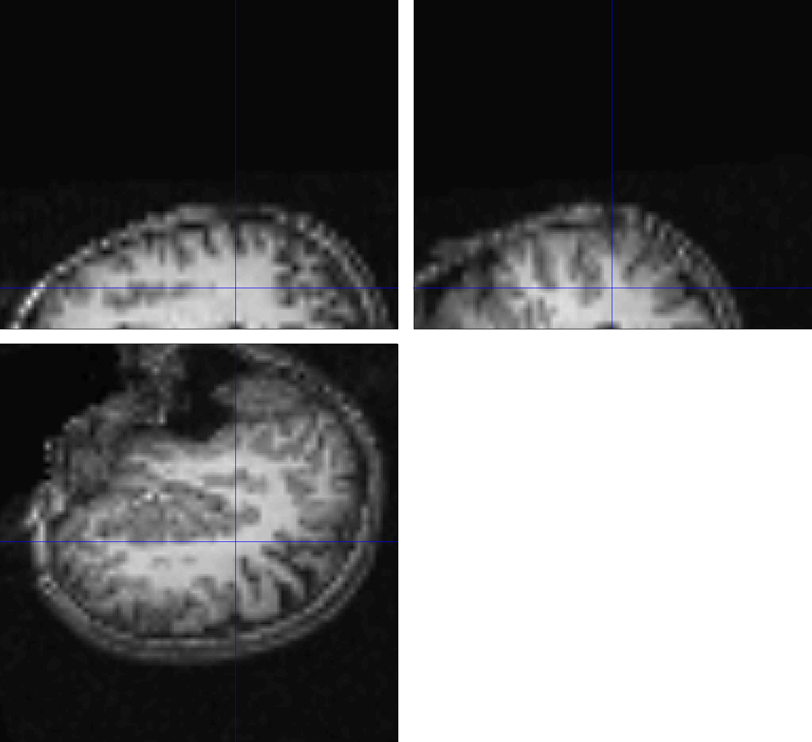
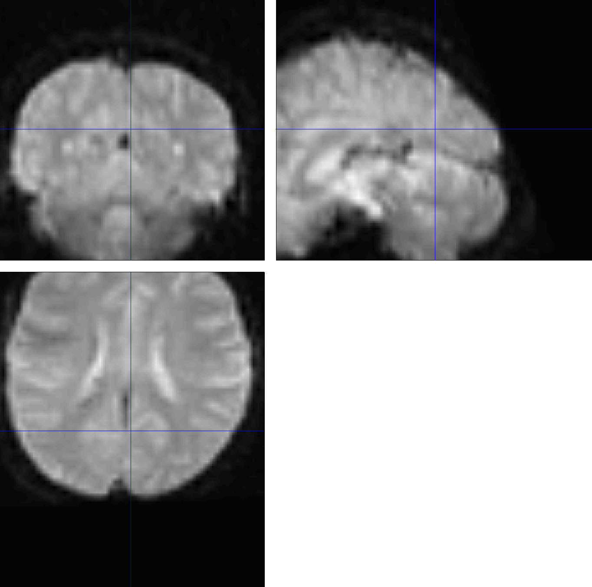
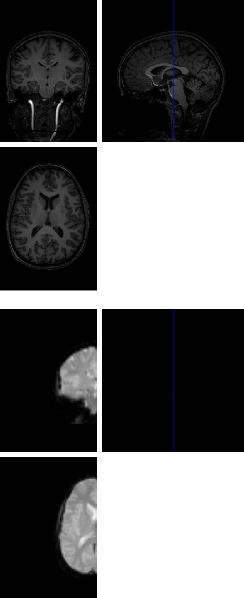
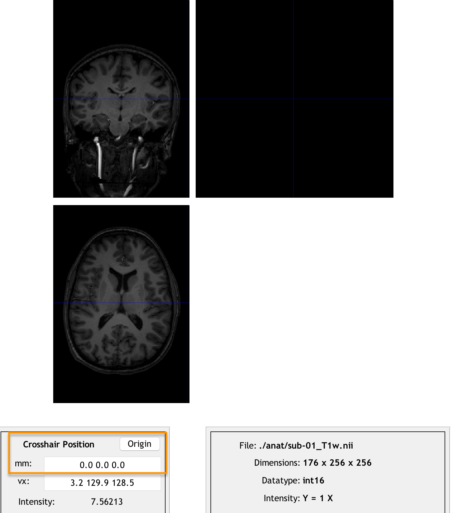
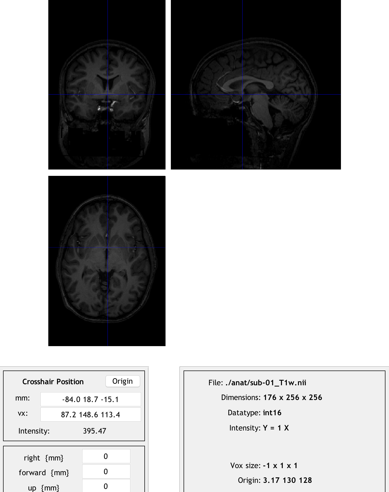
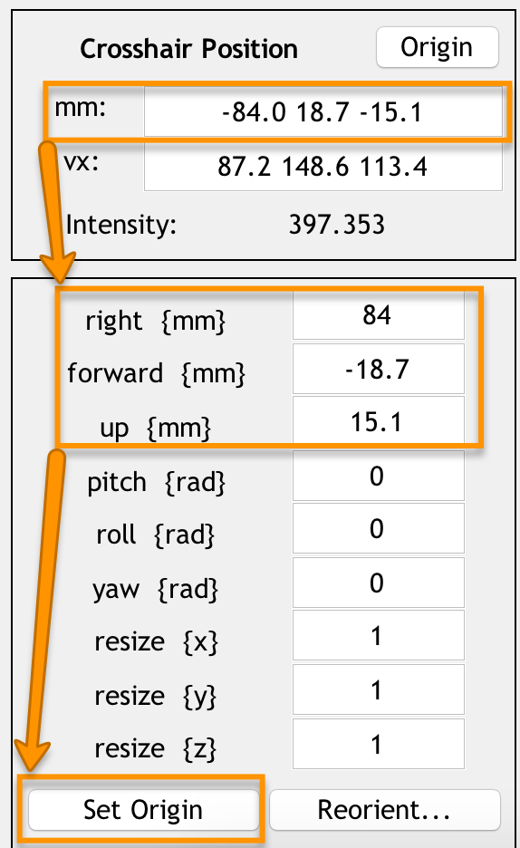
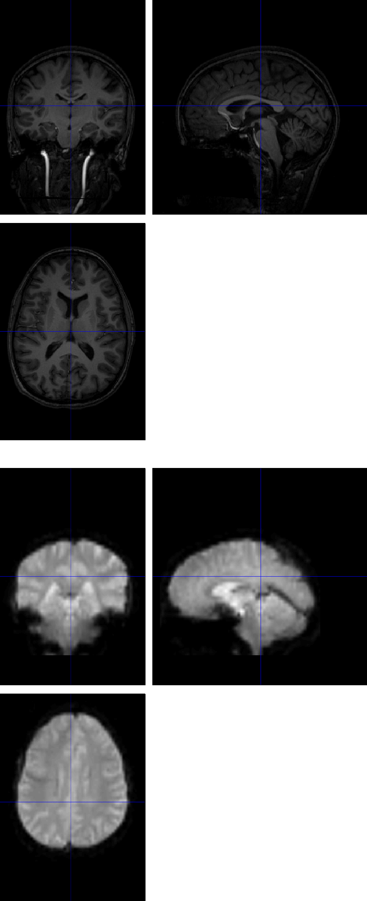

.. _SPM_07_SettingTheOrigin:

===========================
SPM Tutorial #7: Setting the Origin
===========================

----------

Overview
********

After we :ref:`scripted our analysis <SPM_06_Scripting>`, it would appear that all we need to do is run the script for the rest of the subjects. Before going on, it is wise to check whether the scripted analysis did as well as the analysis we did by hand for sub-08. If there are any errors in the script, they will propagate throughout all of our subjects - a good habit is to run the script for one or two subjects, and see whether there are any problems.

If you examine the output from each preprocessing step by loading the images into the Display viewer of the SPM GUI, you will notice that the initial preprocessing steps, such as realignment and slice-timing correction, appear to have run without any errors. When we look at the output of coregistration, however, we begin to see an anomaly: Although the functional data looks normal, the realigned anatomical image looks as though the orientations have been flipped. When we look at the output of later stages, such as normalization or the 1st-level analysis, this error has been propagated to the functional data as well. Consequently, any results that we generate from this analysis will be meaningless.

  Example of a coregistration failure. The large distance between the origins of the anatomical and functional scans leads to an inaccurate match between the images; the mismatch is so extreme that the orientation inferior-superior axis of the anatomical image is flipped.

  The error above is propagated to the functional images. Since the anatomical image is in the wrong orientation, the normalization between the anatomical image and the template will result in a mismatch as well. These faulty warping parameters are then applied to the normalized functional data shown here.
  
To see why this error happens in the first place, click on the ``Check Reg`` button from the SPM GUI, and select the raw anatomical image and one of the functional images. The centers of the images are very far away from each other, which causes the errors listed above.

Setting the Origin
******************

The problem is not in the data itself; nor is it an error in the script. Instead, it is a problem with the initial alignment of the anatomical image, which causes the later preprocessing steps to fail. If you have read the other walkthroughs, you may recall from the :ref:`AFNI tutorial <07_AFNI_Checking_Preprocessing>` that an anatomical image sometimes requires a nudge or a push for a better initial alignment with the template that is being normalized to. While AFNI and FSL have methods to automatically perform these adjustments, SPM requires us to manually set the origin (i.e., values of 0,0,0 for the x-, y-, and z-dimensions). Specifically, we need to set the origin at the **anterior commissure**, a bundle of white matter fibers that connect the anterior lobes of the brain. The MNI templates that we use have the anterior commissure at their origin, and setting the origin of the anatomical images to the anterior commissure as well will improve the chances that our normalization will be successful.

To do this, click on the Display button and load the raw anatomical image for sub-01. (You may need to use Matlab's ``gunzip`` command to decompress the original gzipped image again before you can select it from the Display GUI.) Note that if you click on the ``Origin`` button, the origin is far away from the anterior commissure. Our task is to undo these differences in coordinates so that the origin will be set at that structure.

  Clicking the origin button reveals that the origin is far away from the center of the image. We will transform the image so that the origin lies at the anterior commisure instead.
  
Now, click and drag the crosshairs until they are on the anterior commissure. This thin band of white matter fibers can be found at the base of the fornix, an arch-like band of white matter extending downward from the corpus callosum. The anterior commissure can be found most easily from the sagittal view; once you have placed your crosshairs in the vicinity of the anterior commissure, you should also see a thin band of white matter in the axial view and the coronal view. (In the coronal view, imagine that the ventricles are eyes; the anterior commissure then looks like a white mustache.)

Take a look at the numbers in the ``mm:`` field; these are how far away from the origin the crosshairs are along the right/left, anterior/posterior, and inferior/superior axes. We will use the fields found below - ``right {mm}``, ``forward {mm}``, and ``up {mm}`` - to manually shift the origin to the anterior commissure. Enter the opposite of each number in the ``mm:`` field with its corresponding field below.

For example, if you clicked the ``Origin`` button and the numbers ``-84.0, 18.7, -15.1`` were returned in the ``mm:`` field, you would enter the following opposite numbers in the right, forward, and up fields:

::

  84.0
  -18.7
  15.1
  

  Setting the origin to the anterior commissure. Once you have filled in these numbers for the right, forward, and up fields, press ``Enter``. To make sure that the new origin is at the anterior commissure, press the ``Origin`` button.
  
.. note::

  An easier method to set the origin is to point your crosshairs to the anterior commissure, and simply click the ``Set Origin`` button at the bottom of the screen. The point of doing it the other way first was to introduce the reader to functions of the Display GUI that he may use later when manually adjusting an image. For setting the origin of future images, you are encouraged to use the simpler way of clicking the ``Set Origin`` button.
  
We will now click the ``Reorient`` button to permanently set this new origin of the anatomical image and any functional images. When you click on the Reorient button, you will be prompted to select any images to reorient, with the anatomical image already selected. Click ``Done``, and save the reorientation matrix when prompted.

Now check the initial registration again between the anatomical and functional images. The centers of the images, while not perfectly aligned, are now in a much better initial position. This increases the odds that coregistration, and by extension normalization and the 1st-level modeling, will succeed.

Should the Origin be Reset for Each Subject?
********************************************

If you attempted to analyze all of your subjects using the script mentioned in the previous chapter, you may have noticed that the preprocessing succeeded for the majority of the subjects, and failed for about a fourth of the subjects. This raises the question of whether the origin should be reset to each subject's anterior commissure. The conservative approach would be to do it for each subject; although you should still check the output of the preprocessing to make sure that there were no errors.

Next Steps
**********

Once you have reset the origin for each subject, rerun the preprocessing script. Note that if the script has already been run for some of the subjects (such as sub-01, sub-02, and sub-08), at the model estimation stage you will be asked whether you want to overwrite the currently existing statistical output. You will either have to do this by hand, or delete the currently existing 1st-level directories. The other preprocessing output will be overwritten.

Once you have analyzed all of the individual subjects, you are now ready to perform a group level analysis. For an overview of the method and how to do it in SPM, click the ``Next`` button.
