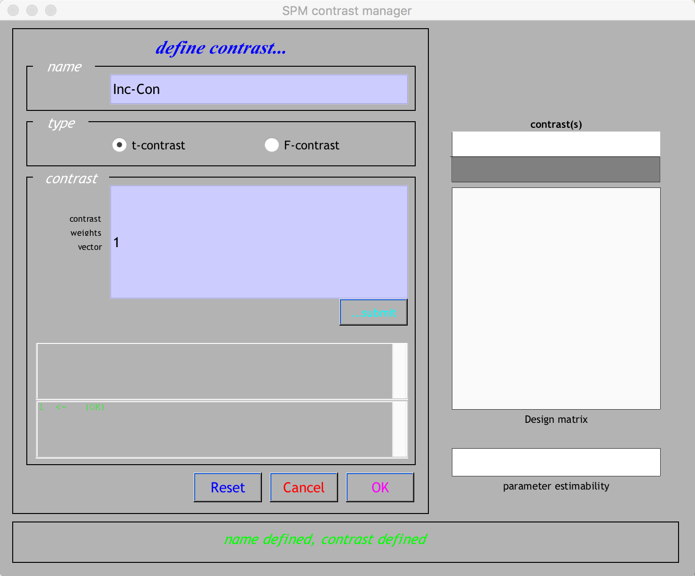
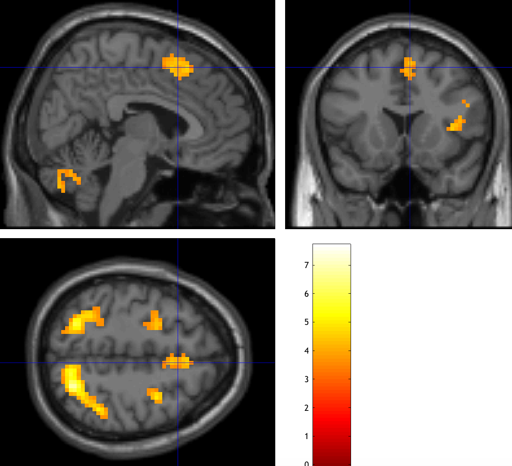

.. _SPM_08_GroupAnalysis:

===============================
SPM Tutorial #8: Group Analysis
===============================

--------

Overview
***************

Our goal in analyzing this dataset is to generalize the results to the population that the sample was drawn from. In other words, if we see changes in brain activity in our sample, can we say that these changes would likely be seen in the population as well?

To test this, we will run a **group-level analysis** (also known as a **second-level analysis**). In SPM, this means that we calculate the standard error and the mean for a contrast estimate, and then test whether the average estimate is statistically significant. We will be doing this group-level analysis using a **summary statistic** approach which ignores the variability in the parameter estimates, and performs a t-test over the mean parameter estimates from each subject.

Specifying the 2nd-Level Analysis
*********************************

Once all of the 1st-level analyses have finished, create a new directory in which to store your 2nd-level results. From the Matlab terminal, navigate to the Flanker directory containing all of your subjects, and type ``mkdir 2ndLevel_Flanker``.

From the SPM GUI, click on the button ``Specify 2nd-level``. The default test that will be conducted is a one-sample t-test, and there are only two fields that need to be filled in: The output directory for the results, and the scans that you will conduct the test on - in other words, the contrast images that were created during each 1st-level analysis.

Double-click on the ``Directory`` field, and select the 2ndLevel_Flanker folder you just created. For the ``Scans`` field, navigate to sub-01's 1stLevel directory, and select the Incongruent-Congruent contrast image, ``con_0001.nii``. Navigate into all of the other subject's 1stLevel directories, and select the con_0001.nii image for each subject. The animation below shows a couple of ways to make this process quicker. When you have finished selecting the con_0001.nii image for all 26 subjects, click the green "Go" button.

.. figure:: 08_SelectConImages.gif

.. note::

  If you forget which contrast image corresponds to which conditions being contrasted, you can figure it out using one of the following methods. One option is to load the SPM.mat file through the Results GUI for a sample subject, and see which number contrast corresponds to the ``con`` images that are generated in each subject's folder. The other way is to use the Matlab terminal to navigate to a sample subject's 1stLevel results folder, and type ``load SPM.mat``. This will load the SPM **structure** into memory, and this structure contains information about all of the data that was entered into the 1st-level analysis. If you then type ``SPM.xCon.name``, Matlab will return the label for each contrast.
  
  
Estimating the 2nd-Level Analysis
**********************************

Specifying the model will only take a second. When it has finished, you will need to **estimate** the model, just as you did with the 1st-level analyses. From the SPM GUI, click the ``Estimate`` button. Select the SPM.mat file from the 2ndLevel_Flanker directory that you created, and then click the green "Go" button.

Viewing the Results
*******************

As with the 1st-level analyses, we can now view the results by clicking on the ``Results`` button from the SPM GUI. Select the SPM.mat file from the 2ndLevel_Flanker directory, and click Done. You will see another contrasts window, with a slight difference: Whereas the 1st-level analyses had a design matrix that contained all of the regressors in the model, this design matrix looks like a white box. That indicates that there is only one regressor to test, namely the mean activation across all of the individual contrast images that went into the model.

Click ``Define new contrast...``, call the contrast "Inc-Con", and give it a contrast weight of ``1``. When you are finished, it should look like this:

Click ``OK``, and then click ``Done``. You will be asked the same questions as before about masking, cluster-thresholding values, and cluster extent. For this group analysis, select the following:

::

  apply masking -> none
  p value adjustment to control -> none
  threshold {T or p value} -> 0.001
  & extent threshold {voxels} -> 20
  
This will threshold the image to only show clusters that are composed of individual voxels each passing a threshold of 0.001. Later, we will learn how to determine what cluster-defining threshold gives us a false positive rate of 0.05.

When you are finished, you should see output like this, showing a significant cluster in the dorsal ACC:

Exercises
*********

1. Display the results on one of the MNI template brains using the "sections" option. Make the table show only the cluster in the dorsal ACC (roughly the coordinates 5, 20, 50).

2. Go back to the Results GUI, and create a contrast that tests for voxels showing significant activation for Congruent-Incongruent. Use the same thresholds as before.

Video
*****
