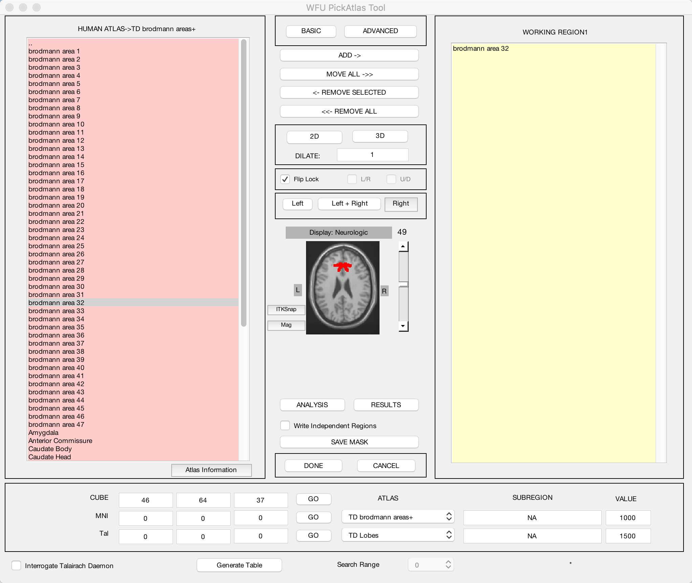

.. _SPM_09_ROIAnalysis:

=============================
SPM Tutorial #9: ROI Analysis
=============================

---------

Overview
********

You've just completed a group-level analysis, and identified which regions of the brain show a significant difference between the Incongruent and Congruent conditions of the experiment. For some researchers, this may be all that they want to do.

This kind of analysis is called a **whole-brain** or **exploratory** analysis. These types of analyses are useful when the experimenter doesn't have a hypothesis about where the difference may be located; the result will be used as the basis for future research.

When a large number of studies have been run about a specific topic, however, we can begin to make more specific hypotheses about where we should find our results in the brain images. For example, cognitive control has been studied for many years, and many fMRI studies have been published about it using different paradigms that compare more cognitively demanding tasks to less cognitively demanding tasks. Often, significant increases in the BOLD signal during cognitively demanding conditions are seen in a region of the brain known as the **dorsal medial prefrontal cortex**, or dmPFC for short. For the Flanker study, then, we could restrict our analysis to this region and only extract data from voxels within that region. This is known as a **region of interest (ROI)** analysis. A general name for an analysis in which you choose to analyze a region selected before you look at whole-brain results is called a **confirmatory analysis**.

Whole-brain maps can hide important details about the effects that we’re studying. We may find a significant effect of incongruent-congruent, but the reason the effect is significant could be because incongruent is greater than congruent, or because congruent is much more negative than congruent, or some combination of the two. The only way to determine what is driving the effect is with ROI analysis, and this is especially important when dealing with interactions and more sophisticated designs.

Using Atlases
*******

One way to create a region for our ROI analysis is to use an **atlas**, or a map that partitions the brain into anatomically distinct regions.

The WFU PickAtlas toolbox that you installed in the :ref:`last tutorial <SPM_Intermezzo_Toolboxes>` contains several different atlases: Two human atlases, two monkey atlases, and a mouse atlas. Select the ``HUMAN ATLAS`` option to open up an atlas of **Brodmann Areas**, cortical parcellations based on their tissue structure and cell organization. From previous studies of cognitive control we would expect our study to show significant BOLD activity in the **dorsal anterior cingulate** (dACC) region, corresponding to Brodmann Area 32. Click on the region ``brodmann area 32`` in the left menu, and then click the ``ADD->`` button near the top of the screen. The axial slices that you see in the middle of the screen represent a template brain, and voxels that belong to the working region you selected will be highlighted in red. Click the up and down arrows to the right of the brain to see the extent of the region that you selected.

You may think that the default voxels of that region are painted on too thin a slice of cortex to adequately capture your region of interest. In that case, you can enter a number in the ``DILATE`` field, and click either the ``2D`` or ``3D`` buttons to dilate the mask by the number of voxels you specify in either two dimensions or three dimensions. Enter a value of "1" and click ``3D``; observe how the size and extent of the mask changes.

.. note::

	You can add as many regions as you want to your ROI. For example, if you wanted to cover the entire anterior cingulate region, you could select both brodmann areas 32 and 24. Both sets of voxels would be highlighted in red, and both would belong to the same mask when you save it.

When you are satisfied with the mask you have generated, click the ``SAVE MASK`` button near the bottom of the screen. Label the mask "BA_32", and save it to the Flanker directory that contains all of your subjects. (If you wanted to better organize your data, you could create another directory called "Masks", and save the mask into that folder.)
  

Extracting Data from the Anatomical Mask
************

Once you've created the mask, you can then extract each subject's contrast estimates from it. There are two ways that we could extract our contrast of interest Incongruent-Congurent:

1. Extract the contrast estimate Incongruent-Congruent from our stats file; or
2. Extract the individual beta weights for Incongruent and Congruent separately, and then take the difference between the two.

As we will see, option #2 allows you to determine what is driving the effect; in other words, whether a significant effect is due to both beta weights being positive but the Incongruent beta weights being more positive, both weights being negative but the Congruent betas more negative, or a combination of the two. It is only by extracting both sets of beta weights that we can determine this.

First, click the Results button from the SPM GUI, and load the SPM.mat file from the folder ``2ndLevel_Incongruent``. Select the ``Incongruent`` contrast, and for ``apply masking``, select ``image``. Load the BA_32.nii image you created using the WFU PickAtlas toolbox, and choose ``inclusive`` when it asks you the nature of the mask; this will restrict our analysis to the voxels inside the mask, as opposed to analyzing only those voxels that are excluded by the mask. (The latter option can be useful if you have a mask of a lesioned area, for example.) Select ``No`` for ``ROI Analysis``, and ``none`` for the p-value adjustment. 

For the uncorrected p-value threshold, set the value to ``1`` and the extent threshold to 0 - this will in effect do no thresholding at all, for reasons we will see in just a moment.

The glass brain now shows highlighted voxels in the BA_32 mask that we selected. Right click in any of the glass brain panels and select ``goto global maximum``. This will highlight the current ROI that you have created. Then right-click again, and select ``Extract data -> whitened and filtered y -> This cluster``. This will output to the Matlab terminal a list of each contrast estimate for each subject, for each voxel in the mask. To make this list of numbers more manageable and easier to interpret, type the following:

::

	Inc = mean(y,2)

This returns a set of 26 numbers representing the contrast estimate for each subject averaged over all of the voxels in the ROI. We will then do the same procedure for the Congruent contrasts, loading the SPM.mat file from the ``2ndLevel_Congruent`` directory and selecting the same options as above. When you have displayed the results within the BA_32 ROI, extract the data, and then type:

::

	Con = mean(y,2)
	
We now have a pair of 26 numbers, one pair per subject. We can enter this pair into a paired-samples t-test with the following:

::
	
	[h, p, ci, stats] = ttest(Inc,Con)
	
This will return four variables, representing different parts of the hypothesis test:

::

	h: Is the result significant? (0 = No; 1 = Yes)
	p: The p-value for the hypothesis test
	ci: The confidence interval for the contrast estimate
	stats: Additional statistics, including the t-statistic, degrees of freedom, and the standard deviation
	

.. note::

	As an exercise, do the same procedure for the 2ndLevel_Inc-Con results. After you have extracted the data and put it into a variable labeled ``Inc_Con``, compare the values to the output from typing "Inc-Con" (note the difference between the underscore character and the dash character). What do you notice? Does it make sense?
  	
  
Extracting Data from a Sphere
************

You may have noticed that the results from the ROI analysis using the anatomical mask were not significant. This may be because the ACC mask covers a very large region; although the ACC is labeled as a single anatomical region, we may be extracting data from several distinct functional areas. Consequently, this may not be the best ROI approach to take.

Another technique is called the **spherical ROI** approach. In this case, a sphere of a given diameter is centered at a triplet of specified x-, y-, and z-coordinates. These coordinates are often based on the peak activation of another study that uses the same or a similar experimental design to what you are using. This is considered an **independent** analysis, since the ROI is defined based on a separate study.

The following animation shows the difference between anatomical and spherical ROIs:

.. figure:: 09_ROI_Analysis_Anatomical_Spherical.gif

To create this ROI, we will need to find peak coordinates from another study; let's randomly pick a paper, such as Jahn et al., 2016. In the Results section, we find that there is a Conflict effect for a Stroop task - a distinct but related experimental design also intended to tap into cognitive control - with a peak t-statistic at MNI coordinates 0, 20, 44.

To create the sphere, we will be using the **Marsbar** toolbox that we installed in the :ref:`last chapter <SPM_Intermezzo_Toolboxes>`. From the SPM GUI, click on ``Toolbox -> marsbar``.

Marsbar allows you to create an ROI using several different methods, such as:

1. A sphere (which we will do in this tutorial);
2. The cluster from a result that you generate;
3. A box with dimensions that you specify.

To create a sphere, click on ``ROI definition -> Build``. From the ``Type of ROI`` dropdown menu, select ``Sphere`` and enter the coordinates ``0 20 44``. Enter a Sphere radius of 5, and for both the Description of ROI and Label for ROI fields, enter ``dACC_Sphere``. Save the file to your Flanker directory as ``dACC_Sphere_roi``.

.. note::

	In the paper, the peak of the activation was technically within a region called the pre-supplementary motor area, or pre-SMA. There is still some debate over where these cognitive control activations are located, but for this tutorial I have chosen to use the term dACC.

Now we have a .mat file that contains the necessary information to build our spherical ROI. Before we generate the ROI as a NIFTI file, click on ``ROI definition`` and select ``View``. Click on your newly created ``dACC_Sphere_roi.mat`` file, and make sure that it is located in the region where it should be.

	Examining the ROI created by marsbar.
	
If the sphere is in the right place, go back to the marsbar ROI and select ``ROI definition -> Export``. In the ``Export ROI(s) to`` dropdown menu, select ``image``; from the selection menu, click on the ``dACC_Sphere_roi.mat`` file. Leave the ``Space for ROI image`` as the default (i.e., Base space for ROIs), and select the Flanker directory as the output folder. Label the image as ``dACC_Sphere``.

We now have a mask that we can use for our ROI analysis, and we can use the same method as we did in the above section on extracting data from the anatomical mask. If you do it correctly, you should get a p-value of 0.04 for a t-test of the Incongruent-Congruent contrast.

.. note::
	
	Marsbar is also capable of ROI analyses using the marsbar GUI. This procedure involves many steps, and will not be covered in this tutorial. For those interested in learning more about it, see `this blog post <http://andysbrainblog.blogspot.com/2012/11/parameter-extraction-with-marsbar.html>`__.
	
	
Using the Command Line for ROI Analysis
***************************************

If you already have a mask and a contrast that you are extracting from, you can do an ROI analysis using Matlab code and SPM's spm_get_data command. The following script (which can also be downloaded `here <https://github.com/andrewjahn/SPM_Scripts/blob/master/Extract_ROI_Data.m>`__) requires an ROI and a contrast as arguments:

::

	function ROI_data = Extract_ROI_Data(ROI, Contrast)

	    Y = spm_read_vols(spm_vol(ROI),1);
	    indx = find(Y>0);
	    [x,y,z] = ind2sub(size(Y),indx);

	    XYZ = [x y z]';

	    mean(spm_get_data(Contrast, XYZ),2)

	end
	
The ``Contrast`` argument can be a path pointing to a contrast, such as "con_0001.nii" that was generated during either the 1st- or 2nd-level analysis. Alternatively, you can navigate into a 2nd-level directory and type ``load SPM``. This will load the SPM structure, and it contains a field called ``SPM.xY.P``: a cell array with paths to each of the contrasts that went into the 2nd-level analysis.

In our current example, navigate to the folder ``2ndLevel_Inc-Con``. Save the above code into a .m file and call it ``Extract_ROI_Data``. Then type the following:

::

	load SPM
	Extract_ROI_Data('BA_32.nii', SPM.xY.P)
	
It should return the same values as when you did the anatomical ROI analysis above for the BA32 mask.

.. note::

	The default voxel resolution is 2x2x2mm for masks created with either the wfupickatlas or marsbar toolbox. In order to use the script above, this voxel resolution needs to match the resolution of the data you are extracting from. For example, if you specfied a resampling resolution of 3x3x3 during the normalization preprocessing step, you will need to `resample <https://andysbrainbook.readthedocs.io/en/latest/FrequentlyAskedQuestions/FrequentlyAskedQuestions.html#resampling>`__ the mask so that the voxel dimensions match. The following image shows how to use SPM's ``Coregister (Reslice)`` command to resample the BA_32 ROI. The resliced image will have an "r" prepended to it:
	

	
	
Biased Analyses
***************

When performing an ROI analysis, make sure that the ROI isn't **biased**, or artificially inflating the parameter estimates that you extract. In a nutshell, a biased analysis uses an ROI that is defined by the data that you are analyzing - for example, it only consists of voxels that pass a high statistical threshold. An unbiased ROI (also known as an **independent ROI**) is not defined by the data in your study, and can either be created from an atlas or by the results of another study. For more details on the difference between the two types of analyses, see :ref:`Appendix B <Appendix_B_BiasedAnalysis>`.

A demonstration of how to do a biased analysis in SPM may help you better understand this concept. Load the 2nd-level results for the Inc-Con contrast, and use the previous thresholds of an uncorrected voxel-wise threshold of p=0.001 and a cluster threshold of 20. When the results are displayed, drag the crosshair to the cluster in the dACC and click the ``current cluster`` button. (This will snap the crosshairs to the peak voxel within this cluster; if you did it correctly, the peak coordinates should be about ``6, 23, 53``.) Click on the ``save`` dropdown menu, and select ``current cluster``. Call the output file ``dACC_001``.

Now use this file as a mask for an ROI analysis, following the steps you completed earlier. How does the significance of the contrast estimates from this cluster compare to the significance of the data you extracted using an anatomical approach? A spherical ROI approach? Why? To help you with articulating the reason for the large difference in the results, reread Appendix B and also watch `this video <https://www.youtube.com/watch?v=nVLeMY6TLkk>`__.

.. note::

	The same biased ROI approach can be done without creating a mask; you can simply threshold the contrast as you normally would when performing a whole-brain analysis, highlight the cluster you are interested in, and extract the data as usual. The purpose of saving out the thresholded cluster as a mask was to familiarize you with SPM's "save" functions, and to have the masks in case you want to use them with another software package, such as AFNI.

-------

Exercises
********

1. Create an anatomical mask of a region of your choosing, and test whether the contrast of Inc-Con is significant within that ROI. When evaluating the p-value, take into account how many ROIs you are using to test the same contrast - as the number of tests goes up, your p-value should become proportionately more conservative. A good guideline to follow is to use Bonferroni correction based on the number of ROIs that you test; e.g, if you test two ROIs, then divide the p-value by 2, for a corrected alpha level of 0.025.
  
2. Use the code given in the section on spherical ROI analysis to create a sphere with a 7mm radius located at MNI coordinates 36, -2, 48, and extract the data from this region.

3. Do a biased ROI analysis by creating a dorsal anterior cingulate mask from the Inc-Con contrast, using a voxel-wise threshold of p=0.0005 and a cluster threshold of 20. Save the mask as ``dACC_0005``. When you extract the data, how does it compare to your earlier biased analysis using a mask with a threshold of p=0.001? Why?

--------

Video
*********

For a video walkthrough of ROI analysis in SPM, click `here <https://www.youtube.com/watch?v=zVuSHTJLJj4>`__.
