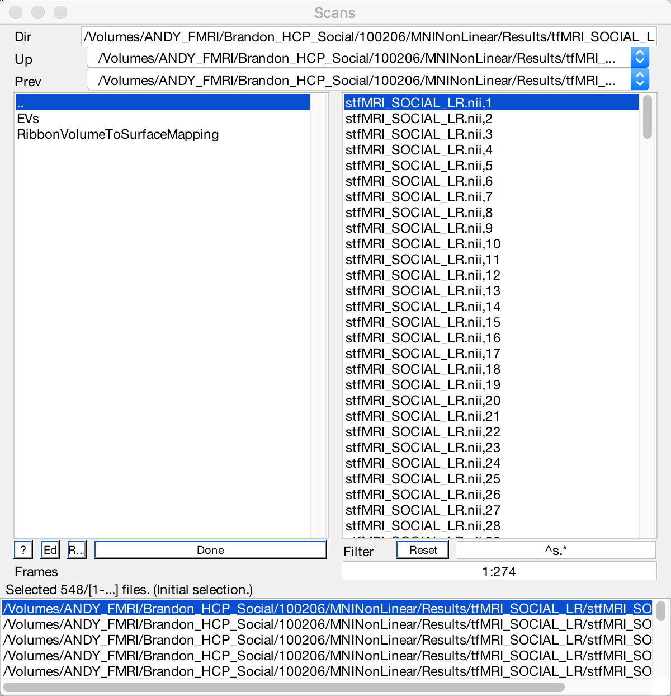
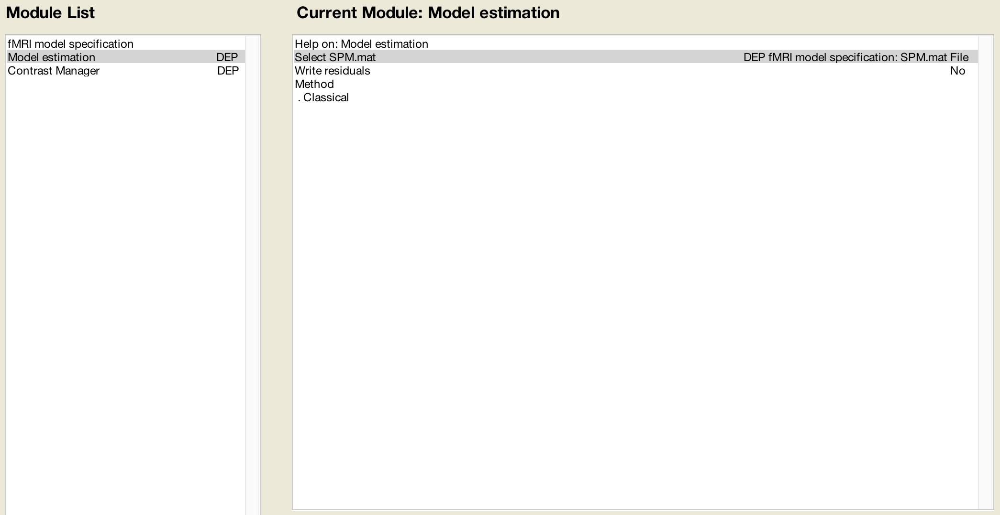
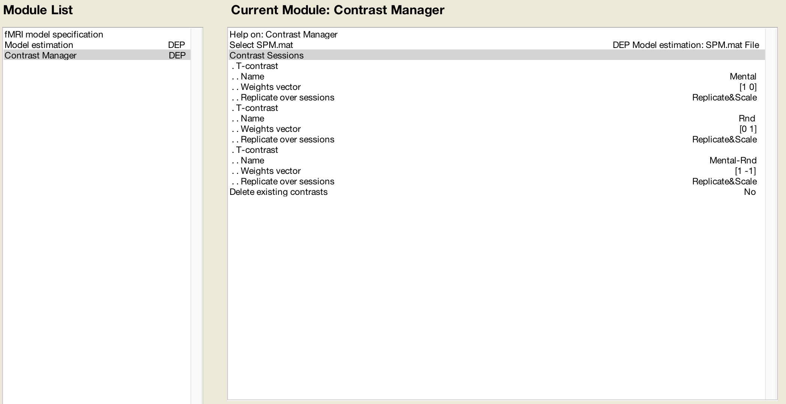
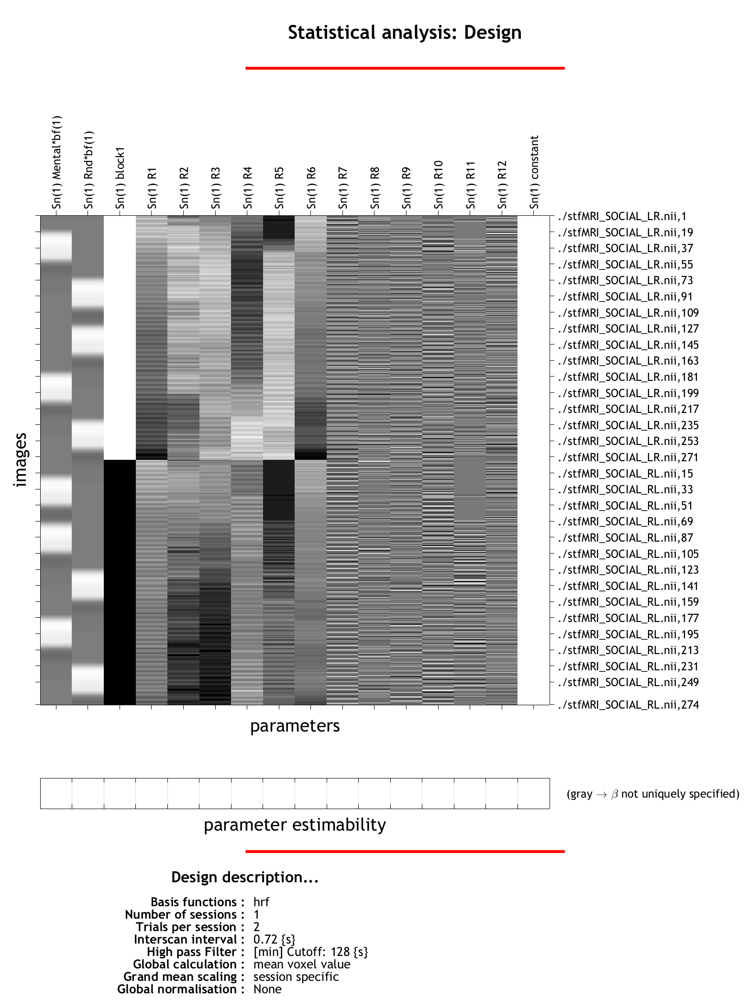
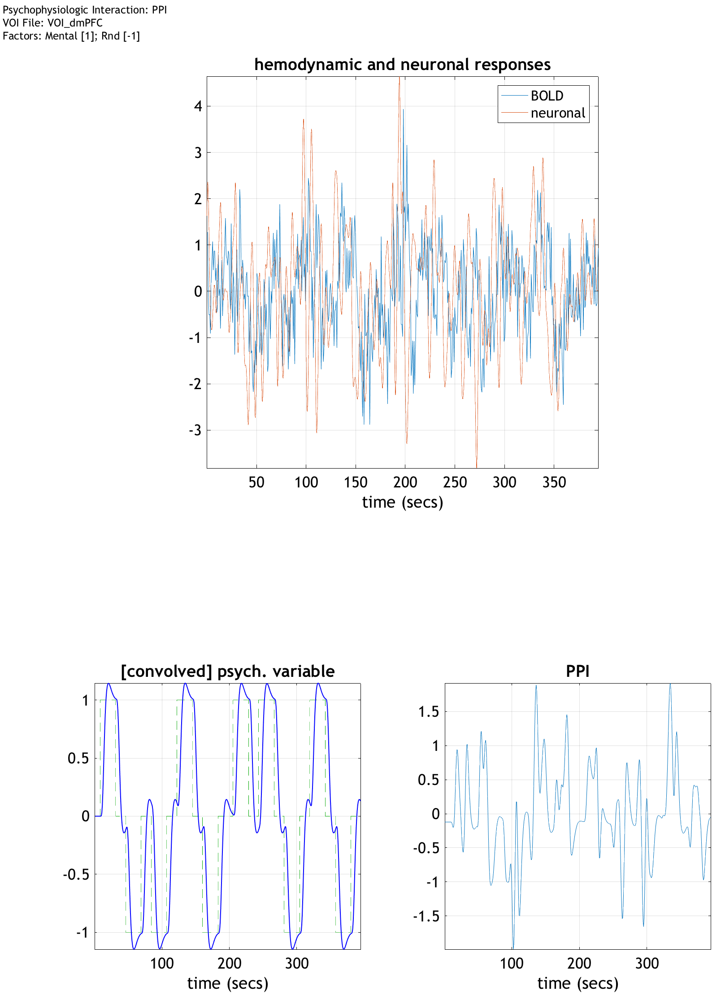
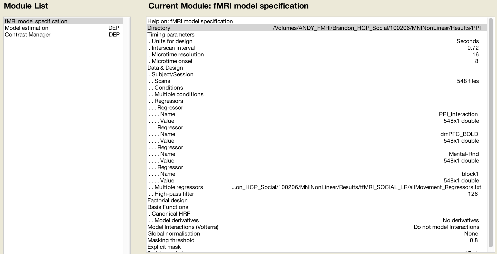

.. _SPM_PPI:

=================
Psychophysiological Interactions (PPI) in SPM
=================

----------

.. note::

  This page is currently where I am jotting down notes for how to do a group-level PPI in SPM.
  

Download
*********
  
Data is from the `Human Connectome Project database <https://db.humanconnectome.org/>`__; click on the dropdown menu next to WU-Minn HCP Data - 1200 subjects and select `subjects with 3T MR Session Data`.

Data Structure
************

Within each subject directory (with subject IDs like 100206), there is a directory called `MNINonLinear/Results`. This contains 2 directories with functional data, tfMRI_SOCIAL_LR and tfMRI_SOCIAL_RL. The data have been preprocessed, except for the smoothing step; you will need to apply that yourself.

Before you begin, create the following directories in each subject's folder with Matlab's ``mkdir`` command:

::

  1stLevel_Concat
  PPI

Preparing for the PPI Analysis
**************************

Once the data have been smoothed, the directories will contain files called "stfMRI_SOCIAL_LR.nii" and "stfMRI_SOCIAL_RL.nii". We will be combining these into a single dataset, because SPM's PPI function cannot process datasets with more than one run. To account for the fact that we are combining all of the data into one run, and that the signal may be systematically different in one run compared to another, we will be including *both* in our 1st level analysis.

Concatenating the Movement Regressors
^^^^^^^^^^^^^^^^^^^^^^^^

The movement regressors will also need to be vertically concatenated into a single file. Navigate into the tfMRI_SOCIAL_LR directory and type:

::

  cat Movement_Regressors.txt ../tfMRI_SOCIAL_RL/Movement_Regressors.txt > allMovement_Regressors.txt
  
  
Creating the Model Specification Batch
^^^^^^^^^^^^^^^^^^^^^^^^

In this study, the TR is 0.72, and each run has 274 volumes. That means that each run is 0.72 * 274 = **197.28 seconds** long. We will therefore add 197.28 to the second run's timings to generate the following onset times for a single concatenated run:

Mental:
8.21
122.056
205.476
243.287
319.336

Rnd:
46.008
84.032
160.081
281.311
357.36

Each onset time lasts for 23 seconds (i.e., this is a block design). There may be discrepancies of a few thousandth of a millisecond between subjects, but since it is a block design, this timing scheme can be used for every subject.

Now open the SPM GUI, click on ``Batch``, and from the menu click on ``SPM -> Stats -> fMRI model specification``. Add the following modules, also in the SPM -> Stats menu: ``Model estimation`` and ``Contrast Manager``.

In the fMRI model specification module, select the ``1stLevel_Concat`` folder as the Directory. Change the Units for design to ``Seconds``, and the Interscan interval to ``0.72``. Click on ``Data & Design`` and then select ``New: Subject/Session``. Double-click on the ``Scans`` button, and select the stfMRI_SOCIAL_LR.nii files *first*, and then the stfMRI_SOCIAL_RL.nii files (this order is important). In the selection window, enter ``^s.*`` in the Filter field to only view those files beginning with an 's', and in the Frames field type ``1:274`` to expand the number of volumes to 274. Do this for each of the LR and RL directories.

  

Now click on ``Conditions``, and click twice on ``New:Condition``. Rename the first condition ``Mental``, and the second condition ``Rnd``. Specify a duration of ``23`` for both, and in the ``Onsets`` field, copy and paste the above timings for each corresponding condition.

To account for the effect of block, click on ``Regressors``, and select ``New: Regressor``. Set the Name to ``block1``, and then double-click on ``Value``. In the Value field, type the following:

::

  kron([1 0]',ones(274,1))
  
Which will create a column vector with 274 ones, followed by 274 zeros. These represent the first block and the second block, respectively.

Finally, click on ``Multiple regressors``, and load the ``allMovement_Regressors.txt`` file that you created above. When you have finished, your model specification should look like this:

.. figure:: SPM_PPI_ModelSpecification.png

Now we will finish editing the other modules in our batch. Click on ``Model estimation`` in the lefthand window, highlight ``Select SPM.mat`` with your mouse, and then click on ``Dependency``. Choose the SPM.mat file from the fMRI model specification step.

Next, click on the ``Contrast Manager`` module. Again, highlight ``Select SPM.mat`` with your mouse, and then click on ``Dependency``. Choose the SPM.mat file from the model *estimation* step. Then click on ``Contrast Sessions`` and click on ``New: T-contrast`` to create three new T-contrasts. Label the first one ``Mental``, the second one ``Rnd``, and the third one ``Mental-Rnd``. For the Mental contrast, specify a vector of [1 0]; for the Rnd contrast, specify a vector of [0 1]. For the Mental-Rnd contrast, specify a vector of [1 -1]. Since there is only one run, you do not need to Replicate&Scale the contrast weights, but doing so won't affect your analysis either.

Now save the batch and script by clicking on ``File -> Save Batch and Script``. Label the output ``Sample_Concatenated_1stLevel``. Then click on the green "Play" button in the top left corner of the GUI to run the batch. It should take about 15-20 minutes. When it has finished, the design matrix should look like the following:

The PPI Interface
^^^^^^^^^^^^^^^^^^

We are now ready to begin our PPI analysis. Before you start, make sure that you have a region of interest (or ROI, also known as a mask) to use. These can be created either using Marsbar or another software package, such as AFNI's 3dUndump or FSL's fslmaths. In our example, assume you've created an ROI called dmPFC that is centered within the dorsomedial prefrontal cortex. These ROIs will be stored in the directory that contains all of the subject directories.

To begin, open the SPM GUI and click on the ``PPIs`` button. You will be prompted to select an SPM.mat file; select the one you just created that is located in the ``1stLevel_Concat`` directory. You will then be prompted to select an analysis type; choose ``psychophysiologic interaction`` and then select ``VOI_dmPFC.mat``. Include ``Mental`` and ``Rnd`` when prompted, and assign them weights of 1 and -1, respectively. Label the output PPI as ``PPI``.

You will then see a window showing the hemodynamic and estimated neuronal responses (after the hemodynamic response has been deconvolved), and the onset times of the blocks of your experiment, convolved with the HRF.

This will create a variable in your workspace called ``PPI``. You can load it from the command line by typing ``load PPI``. This enables the use of several fields of the PPI variable, including:

::

  PPI.P: The convolved onset times
  PPI.Y: The time-series extracted from the VOI
  PPI.ppi: The Interaction term created by the PPI analysis
  
Our goal is to now include these three variables in another GLM, which will allow us to estimate a beta weight at each voxel for the PPI using a VOI (in this case, the dmPFC).

Setting up the PPI Analysis
**************************

First, enable the use of the PPI fields by typing the following at the Matlab prompt:

::

  load PPI_PPI.mat

You should see the variable ``PPI`` in your workspace.

Now, open the SPM GUI and click the ``Batch`` button. As before, from the menu click on ``SPM -> Stats -> fMRI model specification``. Add the following modules, also in the SPM -> Stats menu: ``Model estimation`` and ``Contrast Manager``.

In the fMRI model specification module, set up the model as previously: Units of Time in Seconds and TR of 0.72, and the same Scans as before. Select the folder ``PPI`` as the output directory. Then click on ``Data & Design``, and click on ``New: Subject/Session``. Instead of conditions, however, this time we will enter Regressors, since they have already been convolved with the hemodynamic response function. Create 4 new Regressors, and give them the following names and values:

::

  Regressor 1: Name=PPI_Interaction / Value=PPI.ppi
  Regressor 2: Name=dmPFC_BOLD / Value=PPI.Y
  Regressor 3: Name=Mental-Rnd / Value=PPI.P
  Regressor 4: Name=block1 / Value=kron([1 0]',ones(274,1))
  
Also double-click on ``Multiple regressors`` and specify the allMovement_Regressors.txt file. When you are finished, the model specification window should look like this:

Set the Model estimation SPM file to a dependency calling upon the output from the fMRI model specification module, and specify the SPM file in the Contrast manager as the dependency output from the Model estimation module. In the Contrast Manager module, create one T-contrast, and give it the name ``dmPFC_PPI_Interaction``. Give it a weight vector of ``1``. Then save the batch and script as ``Run_dmPFC_PPI`` in the results directory which contains the 1stLevel_Concat and PPI folders. Then press the green "play" button to run the analysis.
  
