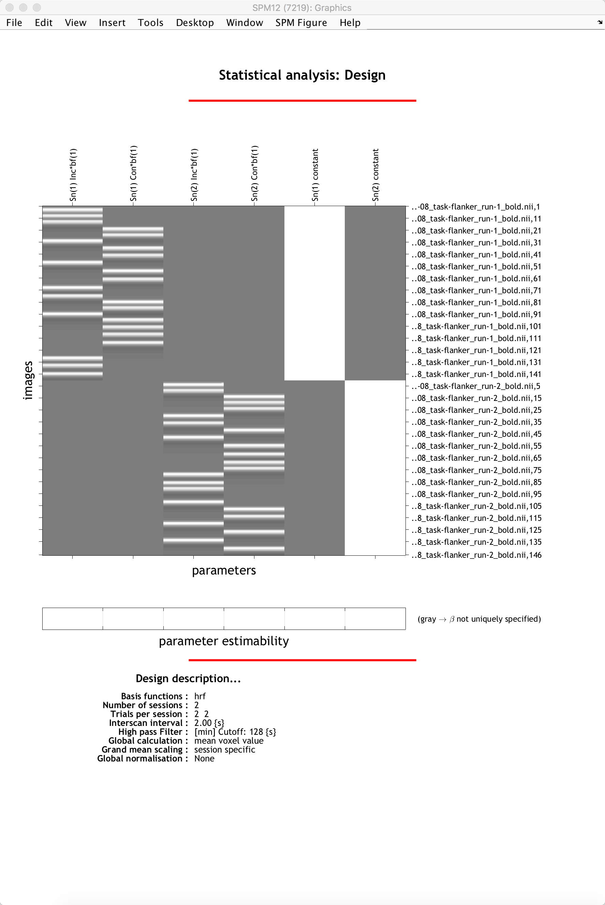

.. _SPM_06_Stats_Running_1stLevel_Analysis:

===========================================
Chapter 6: Running the First-Level Analysis
===========================================

---------

First-Level Analysis in SPM
***************************

Having created the timing files in the :ref:`previous chapter <SPM_05_Creating_Timing_Files>`, we can use them in conjunction with our imaging data to create statistical parametric maps. These maps indicate the strength of the correlation between our ideal time-series (which consists of our onset times convolved with the HRF) and the time-series that we collected during the experiment. The amount of modulation of the HRF is represented by a beta weight, and this in turn is converted into a t-statistic when we create contrasts using the SPM contrast manager.

To begin, from the SPM GUI click on ``Specify 1st-Level``. Note that the first field that needs to be filled in is the ``Directory`` field. To keep our results organized, go to the Matlab terminal, navigate to the ``sub-08`` directory, and type ``mkdir 1stLevel``. Then double-click on ``Directory`` and select the ``1stLevel`` directory you just created. All of the output of the 1st-level analysis will go into this folder.

Next, we will fill in the Timing parameters section. Under ``Units for design``, select ``Seconds``, and enter a value of ``2`` for ``Interscan Interval``. Then click on ``Data & Design``, and click twice on ``New: Subject/Session`` to create two new sessions. For the ``Scans`` of the first session, go to the ``func`` directory and use the Filter and Frames fields to select all 146 volumes of the warped functional data (i.e., those files beginning with ``swar``). Do the same for the volumes in the second session.

Go back to the field for the first session. There are two conditions in the experiment, and both conditions occur in each run. Click on ``Conditions`` and then ``New: Condition`` twice to create two new Condition fields. For the first condition, double-click on ``Name`` and type ``Inc``.

We will now need the onset times for each occurrence of the Incongruent condition. From the Matlab terminal, navigate to the ``func`` directory and type:

::

  IncRun1 = importdata('incongruent_run1.txt', ' ');
  IncRun1(:,1)
  
Which will return the onset times for the Incongruent condition of run 1. Double-click on the ``Onsets`` field, and copy and paste the onset times into the window. Click ``Done``. 

In this experiment each trial lasted for 2 seconds. We can therefore enter the number ``2`` in the ``Durations`` field, and SPM will assume that it is the same duration for every trial.

Now do the same procedure for the Congruent condition for run 1, and the Incongruent and Congruent conditions for run 2, remembering to enter a duration value of 2 for all of them. Here is the code to display the onset times for each of the remaining onset times that you will need:

::

  ConRun1 = importdata('congruent_run1.txt', ' ');
  ConRun1(:,1)
  IncRun2 = importdata('incongruent_run2.txt', ' ');
  IncRun2(:,1)
  ConRun2 = importdata('congruent_run2.txt', ' ');
  ConRun2(:,1)

You can use the names "Inc" and "Con" for both runs if you want; the names will be stored in a file called ``SPM.mat`` which we will look at later in more detail.

When you are done, click the green Go button. The model estimation should only take a few moments. When it is finished, you should see something like this:

  The General Linear Model for a single subject. The first two columns shows the ideal time-series for the Incongruent and Congruent conditions for the first session, while the next two show the ideal time-series for the conditions of run 2. The last two columns are basline regressors capturing the mean signal for each run. In this representation, time runs from top to bottom, and lighter colors represent more activity.

The Ideal Time-Series and the GLM
***************

While you're waiting for the analysis to finish, let's take a look at how the model we just created relates to the GLM. Remember that each voxel has a BOLD time-series (our outcome measure), which we represent with Y. We also have our two regressors, which we will represent with x1 and x2. These regressors constitute our design matrix, which we represent with a large X. 

So far, all of these variables are known - Y is measured from the data, and x1 and x2 are made by convolving the HRF and the timing onsets. Since matrix algebra is used to set up the design matrix and estimate the beta weights, the orientations are turned ninety degrees: Normally we think of the time axis as going from left to right, but instead it is depicted as going from top to bottom. In other words, the onset of the run begins at the top of the timecourse.

The next part of the GLM equation is the beta weights, which we represent with B1 and B2. These represent our estimate of the amount the HRF needs to be scaled for each regressor to best match the original data in Y - hence the name “beta weights”. The last term in this equation is E, which represents the residuals, or the difference between our ideal time series model and the data after estimating the beta weights. If the model is a good fit, the residuals will decrease, and one or more of the beta weights are more likely to be statistically significant.

Examining the Output
**************

When the script finishes, navigate into the folder ``sub-08/subject_results/group.Flanker/subj.sub08/sub08.results``. In addition to the preprocessed blocks you saw previously, you will also see statistical datasets: The one labeled ``stats.sub_08+tlrc`` has been analyzed using the traditional 3dDeconvolve approach; the dataset ``stats.sub_08_REML+tlrc`` has accounted for temporal autocorrelation.

.. figure:: 06_FirstLevel_Output.png

You will also see a few files beginning with an "X", such as ``X.xmat.1D``. These represent different parts of the design matrix. For example, you can view the design matrix by typing ``aiv X.jpg``:

.. figure:: 06_GLM.png

For a different view, looking at all of the regressors in separate rows, type ``1dplot -sepscl X.xmat.1D``:

.. figure:: 06_GLM_1dplot.png

  If you rotate this figure by 90 degrees, you will see that it is a different representation of the same design matrix above.
  
.. note::

  Make sure the design matrix looks reasonable. Are the lower-frequency drifts modeled as you would expect them to be? Do the onsets for the trials in each condition match up with the timing files that you created in the last chapter?

Viewing the Statistics Files
^^^^^^^^^^^^^^^^^^^^^^^^^^^^

We are now ready to look at the **contrast maps** of our data. Type ``afni`` to open up the GUI, and select ``anat_file.sub_08`` as the Underlay. (You can also use the MNI152 template if you've copied it into your current directory, or if you have placed it in the ``aglobal`` directory.) For the Overlay, select ``stats.sub_08``. You should see something like this:

.. figure:: 06_ViewingStats.png

This may look overwhelming at first; but although the AFNI viewer can seem to have too many options, once you become more familiar with them you will be able to customize how you view your results. If this is your first time viewing statistics in AFNI, the most noticeable features of the "Define Overlay" panel will appear to be the **slider bar** (allowing you to threshold the images to only see values above a certain number), and the "ULay", "OLay", and "Thr" menus, corresponding to the Underlay, Overlay, and Threshold sub-briks.

Let's begin with the slider bar. If you move it up and down, you will see voxels either disappear or re-appear. That is because we are **thresholding**, or removing, voxels that fall below the Threshold number to the left of the bar. This number will be based on the sub-brik that is selected in the "Thr" menu; in this case, the sub-brik that was selected for us when we opened the viewer was volume #2, the T-statistic map of the beta weights for the Congruent condition. As you move the slider to a value of, say, 1.9753, you will also notice that the number below the slider bar, ``p=``, changes as well, to a value of 0.493. This represents the **uncorrected p-value threshold** for the currently selected Threshold map; in other words, any colored voxels pass an individual p-value threshold of 0.493.

.. note::

  If you want to set a specific uncorrected p-value threshold, right-click on the ``p=`` text, select "set p-threshold", and type the threshold you want (e.g., 0.001).

We haven't corrected for multiple comparisons yet, so we can't say whether any one of the individual voxels is statistically significant. However, viewing the data at an uncorrected p-value threshold can give you a general idea of the spatial layout of the statistics, and indicate whether the results are trending in the direction that you would predict, or if there appears to be something wrong. For example, highly correlated regressors would have very large parameter estimates and correspondingly high variability. You should also make sure that the activation, for a relatively high uncorrected p-value threshold (e.g., p=0.01 or higher), generally falls within the gray matter. If you find large numbers of "active" voxels within the ventricles, for example, it may indicate a problem with the data quality.

Now, change the OLay sub-brik to ``incongruent-congruent#0_Coef`` and the Thr sub-brik to ``incongruent-congruent#0_Tstat``, and set the uncorrected p-value threshold to 0.05. Click around the brain, observing where the statistics are positive and where they are negative. Where do you notice significant "clusters" of activated voxels? Are they where you would expect them to be?

Later on, you will learn about a multiple correction technique called **cluster correction**. This method looks for clusters composed of voxels that pass a given uncorrected threshold, and then determines whether the cluster is significant or not. In this chapter we won't go into how to calculate how large the cluster needs to be, but for now click the "*Clusterize" button and change the number of voxels to ``45``. As a result, you will only see those clusters that are composed of 45 or more voxels that each pass an uncorrected p-value threshold of 0.05. You can click on the "Rpt" button to see a report of each cluster that passes this threshold, which lists the voxel size, the location of the peak voxel of the cluster, and options to move the crosshairs to the cluster and make it flash. All of these operations are summarized in the GIF below.

.. figure:: 06_ViewingClusters.gif

Exercises
*********

Next Steps
**********

When you have finished running the preprocessing and first-level analyses, we will then need to run this for each subject in our study. To speed up the process, we will learn about **scripting**, to which we now turn.

Video
*****
